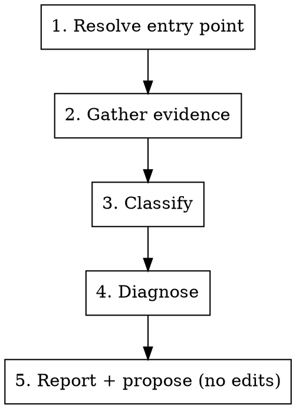

# Debugging E2E Tests

This skill investigates a failed test in the Opik E2E suite (`tests_end_to_end/e2e/`). You give it a failure from wherever you noticed it; it gathers the evidence, decides whether it's a real regression or a flake, and proposes a fix.

**Announce at start:** "I'm using the debugging-e2e-tests skill to investigate X."

## What this does — and doesn't

- It **diagnoses and proposes**, grounded in cited evidence (the trace, the error, the history). It is **read-only**: it does not edit tests, and it does not re-run the suite as part of investigating.
- To **apply** a proposed fix, hand off to the `writing-e2e-tests` skill (or just say "apply it") — that's a separate, deliberate act with its own run-until-green loop.

## Where the evidence lives

- **Local run** — traces under `tests_end_to_end/e2e/test-results/` (retained on failure), Allure results under `allure-results/`.
- **CI run** — the suite uploads three artifacts per run (7-day retention): `test-results-v2` (Playwright traces + videos), `playwright-report-v2` (the HTML report), `allure-results-v2`. Download with `gh run download <run-id> -n test-results-v2 -D <dir>`.
- **Allure TestOps** (`comet.testops.cloud`, project id `1`) — results stream live during CI. Launches are named `Opik v2 … <tier> - <run_id>` (the trailing number is the GitHub Actions run id; the env segment varies — `E2E`, `Post-Merge`, `Local`, `staging`, `production`).

## Tooling

- **`allure-testops` MCP** (already connected) — the richest source. Validated calls:
  - `list_launches(projectId: 1, search: "<run_id or name fragment>", sort: ["createdDate,DESC"])` or `search_launches(rql: …)` — find the launch.
  - `list_test_results(launchId)` — per-test `name`, `fullName` (spec path + line, e.g. `datasets/dataset-crud-smoke.spec.ts:8:7`), `status`, a TestOps-computed **`flaky`** flag, `muted`/`known`, `tags`, `jobRun.url` (the GitHub Actions run), and the result `id`. Use `search` to filter to the failing test.
  - `get_test_result_history(id)` — the pass/fail timeline for that test across recent launches. This is the flake signal.
- **`gh`** — `gh run view <run-id>` to find the failed job; `gh run download <run-id> -n test-results-v2 -D <dir>` for the trace artifact. A launch's `jobRun.url` gives you the run id.
- **`npx playwright show-trace <trace.zip>`** (from `tests_end_to_end/e2e/`) — open the trace to see the exact step that failed, the DOM snapshot, and console/network at that moment.
- **`git`** — diff the suspected change against the failing test's code path.

## The loop

### Step 1 — Resolve the entry point

Normalize whatever you were given into "a failed test + where its evidence lives":

- **A red CI check / Actions run** — take the run id. `gh run view <run-id>` for the failed job; find the matching launch via `list_launches(projectId: 1, search: "<run-id>")`; the trace is in the `test-results-v2` artifact (`gh run download`).
- **A TestOps launch** — query it directly: `list_test_results(launchId)`, filter to the failed results.
- **A test name** — `list_test_results` with `search` across a recent launch, or search launches, to find the result `id`; then pull its history.
- **A local failure** — use the local `test-results/` trace and `allure-results/` directly; TestOps may have nothing for an uncommitted local run, which is fine.

### Step 2 — Gather evidence

- The failed assertion and error message (from the trace, the report, or the TestOps result).
- The **trace**: `npx playwright show-trace` on the retained/downloaded `.zip`. Read the failing step, the DOM snapshot at that point, and console/network around it.
- Screenshot / video if present (`only-on-failure` / `retain-on-failure`).
- The test's **history** via `get_test_result_history(id)`, plus the TestOps `flaky` flag on the result. **Skip history gracefully** when TestOps isn't reachable (e.g. a purely local run) and fall back to trace + diff reasoning.

### Step 3 — Classify

Decide: **real regression**, **flake**, or **environment / selector drift**.

- **History when available:** a clean pass streak that broke right after a related change → lean regression. Intermittent pass/fail with no related change, or a TestOps `flaky: true` → lean flake.
- **Diff correlation:** does a recent change touch the code path the failed assertion exercises (the page/component, the POM method, the fixture)? If yes → regression is likely. If the failed area is untouched → flake or environment is likely.
- **Default to "flake / uncertain"** when history is intermittent and no related diff exists — don't over-call a regression without evidence.

### Step 4 — Diagnose

Root cause, grounded in cited evidence (the specific trace step, the error, the history pattern) — not speculation. Apply the suite's lenses:

- **Verify the test render before blaming the backend.** A "X didn't appear" failure is often a DOM race (a loading spinner still up, an eventually-consistent write not yet landed), not a backend regression. Check the trace's DOM snapshot at the failing step.
- **Selector drift** — the FE changed an accessible name / removed a `data-testid`, so a locator no longer resolves.
- **Eventually-consistent state** — async scoring/ingestion that needed a poll, not a fixed wait.
- **Fixture seed-shape mismatch** — the page rendered an empty/partial state because the seed didn't match what the assertion expects.

### Step 5 — Report + propose (no edits)

Produce:

- **Verdict** — classification (regression / flake / environment-or-selector) + a confidence level.
- **Evidence** — the trace step, the error, the history pattern, and the correlated change (if any), each cited.
- **Proposed fix** — specific. For a regression: the code/selector/poll change to make. For a flake: a poll instead of a fixed wait, a quarantine, or "no code fix — known flaky, retry." 

Do **not** edit anything. If the developer wants the fix applied, hand off to `writing-e2e-tests`.

## Boundaries

- Read-only: no test edits, no investigation-driven re-runs.
- Works from all four entry points; degrades gracefully without TestOps (local failures use the trace + diff alone).
- Distinct from authoring: `writing-e2e-tests` makes a new test; this explains a red one.
