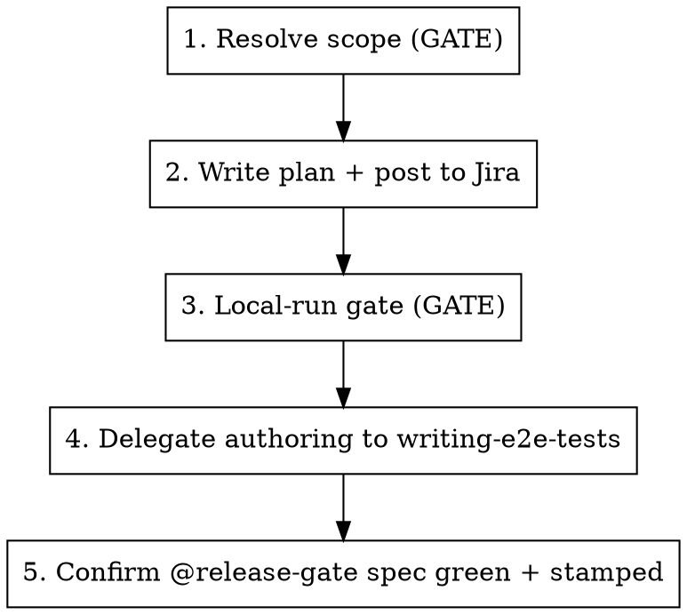

# Explore Feature

This skill produces the two dev-side artifacts of the dev-driven testing workflow: a happy-path
`test-plan.md` (the dev↔QA handoff, posted to Jira) and one staging-ready `@release-gate`
Playwright test committed with the PR. The test gates *that change's own release* and is later
triaged by QA.

It is a **thin orchestrator**: it owns three phases — resolve scope, plan→Jira, stamp+place — and
**delegates the actual test authoring** (analyze FE, discover live UI, write POM/spec, run green)
to the `writing-e2e-tests` skill via a fixed contract.

**Announce at start:** "I'm using the explore-feature skill to build a release-gate test for X."

## What this does — and doesn't

- **Does:** resolve what to gate → write & post the plan → hand `writing-e2e-tests` a staging-ready
  contract → confirm the committed `@release-gate` spec is green locally.
- **Doesn't:** deep bug-hunting or edge-case coverage (that's a separate QA activity); CI wiring
  (staging gate, the move to `shipped/`, age-expiry — not this skill); moving or deleting gate
  tests (the skill only creates/appends).
- **Cheap per-PR happy-path only.** One flow, green locally in minutes.

## The loop



## Phase 1 — Resolve scope (gate)

Normalize whatever the dev pointed at into one **ScopeSpec** before authoring anything.

**Input modes** (auto-detect from the argument; ask if ambiguous):

| Mode | Trigger | Resolve |
|---|---|---|
| Local diff | no arg / dirty tree / "my branch" / "my changes" | see **Local-diff mode** below — this is the default when no PR is named, incl. "I haven't opened a PR yet" |
| A PR | `#<n>` or a PR URL | PR diff + linked ticket via `gh pr view <n> --json …` (or the GitHub MCP); detect an existing gate spec to append to |
| Multi-PR / multi-ticket | a list | union of the diffs; the **last** PR is the merge/stamp point |

**Local-diff mode** — a dev running this on their branch before (or without) a PR. Capture the
**full** change surface, not just committed work — pre-PR work is often uncommitted:

```bash
base=$(git merge-base origin/main HEAD)
git diff --name-only "$base"...HEAD          # committed on the branch
git diff --name-only HEAD                     # unstaged working-tree changes
git diff --name-only --cached                 # staged but uncommitted
git ls-files --others --exclude-standard      # new untracked files
```

Union those for `changedFiles`. If all four are empty, there's nothing to gate — say so and stop.

Deriving the ticket (for naming/stamp/Jira) when there's no PR to read it from:
- Prefer a key in the **branch name** (`andreic/OPIK-1234-…` → `OPIK-1234`).
- If the branch name has no key, **ask the dev** for the ticket rather than guessing; if they
  genuinely have none, fall back to a slug from the branch/summary for `targetPath`
  (`_release-gate/<slug>.spec.ts`), skip the Jira post, and note it in the plan. Never invent a
  ticket key.

Produce the **ScopeSpec**:

- `tickets[]` — the lead ticket drives naming; others referenced by key.
- `changedFiles[]` — the FE/BE change surface.
- `targetPath` = `tests_end_to_end/e2e/tests/_release-gate/<lead-ticket>.spec.ts` — new, or existing → append.
- `versionStamp` — see **Version stamp** below.
- `happyPath` — the one end-to-end flow to gate. Multi-PR → the **combined assembled-feature
  flow, as one test** (earlier PRs don't each get a gate).

Three things to resolve while shaping the happy path — each caught a false or unbuildable gate in piloting:

- **Fix PRs — gate the repro, not the easy path.** For a `fix:`, the happy path must exercise the
  exact condition the bug needed. If the state can be reached two ways and only one triggered the
  bug (e.g. a trace shows the bug only when `source=sdk` via manual reference-linking, not via
  `evaluate()`), seeding the easy way makes the test pass against the *pre-fix* code too — a
  vacuous gate. Identify the repro condition from the PR's root-cause description and seed that shape.
- **N equivalent surfaces — gate the most representative one.** If the change fixes the same
  behavior in several places (e.g. experiment "Go to logs", a shared sidebar, and a Playground
  cell link), don't try to cover them all — pick the single most representative entry point for
  the gate and list the rest under the plan's "Not covered" for QA. Keeps it cheap.
- **Seeding is part of the deliverable, not a precondition.** Work out early how the happy path's
  state gets created — an existing fixture, an SDK client, or the bridge (`services/opik-sdk-driver`).
  If the shape the repro needs isn't reachable through the current surface (e.g. the bridge only
  exposes `evaluate()` but the bug needs a manual `client.trace(source=...)` +
  `ExperimentItemReferences` shape), **that seeding support is yours to add as part of authoring** —
  extend the bridge route / add a fixture / use the SDK client directly — then write the gate on
  top of it. Doing this early (here, not mid-Phase-4) just means you scope the seed work before the
  browser work. The only real stop is if the state cannot be produced through *any* public SDK /
  bridgeable path at all (rare) — then flag it, because it likely means the feature isn't
  end-to-end testable yet.

**Two gates here, before expensive authoring:**

1. **Scope gate** — state the resolved happy path + repro seed shape + target path + stamp back to
   the dev and get a yes. If seeding the repro needs new bridge/fixture support, say so here so the
   dev knows this PR's gate work also touches `services/opik-sdk-driver` or the fixtures.
   Multi-PR especially: "One combined test `<lead>.spec.ts` covering X→Y→Z, stamped `<version>`. OK?"
2. **Skip check** — if the change is pure refactor / infra / docs with no user-facing behavior,
   say so, point at the skip label, and stop. This is the escape hatch for the "every user-facing
   PR" policy. Note two cases that *are* user-facing even though they look like config: a
   capability-map / constants change that adds a user-visible option (e.g. a new model in a
   dropdown → happy path: "open the page, the option is selectable"), and a backend-dominant
   change whose only visible effect is subtle (e.g. a trace that should *not* appear in a default
   list) — find the user-observable effect and gate that, don't skip. The opposite case also
   happens: a perf / internals change with **no behavior delta by design** (e.g. swapping a slow
   probe for a fast one, same rendered result). There's no PR-specific happy path to gate — so
   either gate a *generic* regression on the affected page and label it as such in the plan, or
   skip-with-a-note if QA's regression suite already covers that page. Don't dress a generic
   regression up as a PR-specific gate. **Two things to get right here:** (a) *skip vs gate* turns
   on coverage of the **specific state/decision the change governs, not the page as a whole** — grep
   the existing suite (`tests_end_to_end/e2e/tests`) for that exact state. A page whose *populated*
   path is covered but whose *empty/onboarding* path (the branch a probe like this actually drives)
   is not is **not** "already covered" — gate the uncovered half. Skip-with-a-note only when the
   specific state is genuinely already asserted somewhere. (b) This *is* a `fix:` PR, so the plan's
   "Repro condition" mandate seems to apply — but a no-behavior-delta fix has no repro that renders
   differently pre/post. The perf-fix escape hatch **overrides** the repro mandate: write "N/A — no
   behavior delta; generic regression" there and label the gate generic. A generic gate that passes
   on both the pre- and post-fix build is correct, not a bug — say so in the plan's Open questions.

### Version stamp

The stamp is the release this PR targets — the next in-development version, read from **trunk**,
not the local tree (a branch can be stale):

```bash
git fetch origin main --quiet
git show origin/main:version.txt   # the stamp
```

- Fetch first (the local `origin/main` ref can be stale). If fetch fails (offline), fall back to
  the cached ref and **warn** the stamp may be behind trunk — never silently use a stale value.
- If the change set itself edits `version.txt` (release PRs), prefer the PR's new value.
- **Append reconciliation:** when appending to an existing gate spec, keep the earliest un-shipped
  `@release-gate:<v>` across the describe block.

## Phase 2 — Write the plan and post it to Jira

- Fill `test-plan-template.md` (read it) from the ScopeSpec.
- Write it to a scratch path (e.g. the session scratchpad) to drive Phase 4. **Never commit it.**
- **Post to Jira, auto with manual fallback:** if the Jira MCP is connected, add the plan as a
  comment on the **lead** ticket (`addCommentToJiraIssue`, `contentFormat=markdown`, **real
  newlines** — a literal `\n` renders as text in ADF). If the MCP isn't connected, print the plan
  and the exact call for the dev to run. Never block on this.
- In any Jira text, use the underscore form (`OPIK_7168`) for tickets this PR does not resolve.

## Phase 3 — Local-run gate

Before authoring can be verified, confirm the dev has a local stack **with their changes**:

1. Probe for a running stack — the **frontend** (`http://localhost:5173`, or `:5174` for
   FE-from-source) **and the backend, the way the suite reaches it**: `GET <baseUrl>/api/is-alive/ver`
   (e.g. `http://localhost:5173/api/is-alive/ver`). A standard `opik.sh` compose stack does **not**
   expose the backend on a bare `:8080` — the FE proxies `/api` to it, and that proxied path
   returning a `{"version": …}` JSON is the real "backend is up" signal. A FE that answers on `/`
   but 000s on `/api/is-alive/ver` is a half-up stack: every seeded test fails on the first API
   call for env reasons, not the feature. Require the `/api` health check to pass, not just "`/`
   answers on 5173." Note the returned version — it tells you which build is running (see step 2).
2. **Gate the dev:** confirm the running stack actually contains their changes. A stale prebuilt
   `opik.sh` stack won't show new `data-testid`s — if the feature adds testids, the dev must be on
   FE-from-source `:5174` (`dev-runner --restart`). **Verify the change is actually in the served
   build, not just that a FE answers**: for a FE-only PR merged to main, `curl
   http://localhost:5174/src/<changed-file>` and grep for a symbol the PR added (Vite serves
   source), and/or check `git merge-base --is-ancestor <merge-sha> HEAD`. "The dev server is up" is
   not "the fix is present."
3. If nothing is running / it's the wrong stack: offer to spin it (`local-dev` / `dev-runner`) or
   ask the dev to bring it up with their changes, then proceed. Never silently run against a stack
   lacking the feature — that produces false-green or false-missing-testid results.

   **Worktree gotcha (FE-from-source against a prebuilt backend).** `dev-runner.sh` is
   worktree-aware: in a worktree it offsets every port from a per-worktree hash *and* starts its
   own JAR-mode backend against a **fresh, empty** DB — so `--restart` there does **not** reuse the
   healthy `opik.sh` docker DB, and FE-from-source may not land on `:5174`. When you need
   FE-with-the-fix on top of an existing seeded docker backend, the reliable path is to run the
   Vite dev server directly with pinned ports and point its `/api` proxy at the running backend:
   - The `opik.sh` backend container usually publishes only its internal port to a random host
     port (`docker port opik-<proj>-backend-1`), not `:8080`. Vite's `/api` proxy strips `/api` and
     needs a bare backend, so bridge the container's app port to host `:8080` on the compose
     network, e.g. `docker run -d --name opik-be-8080 --network <compose_net> -p 8080:8080
     alpine/socat tcp-listen:8080,fork,reuseaddr tcp-connect:opik-<proj>-backend-1:8080`.
   - Then `cd apps/opik-frontend && npm ci && VITE_DEV_PORT=5174 VITE_BACKEND_PORT=8080 npm run start`.
   - Point the suite at it: `OPIK_BASE_URL=http://localhost:5174 OPIK_DEPLOYMENT=oss`. OSS needs no
     auth. Tear down the socat container when done.

## Phase 4 — Delegate authoring to `writing-e2e-tests`

Invoke the `writing-e2e-tests` skill to do the analyze → discover-live-UI → write → run-green
loop, handing it the **release-gate authoring contract** (read `release-gate-contract.md` and pass
it verbatim): the target path, the `@release-gate` + `@release-gate:<version>` + feature tags, the
deployment-agnostic requirement, the reuse-or-inline POM policy, and "verify green against the
dev's local stack."

## Phase 5 — Confirm

- The spec exists at `targetPath`, tagged `@release-gate` + `@release-gate:<version>` + a feature
  tag.
- It runs green locally: `cd tests_end_to_end/e2e && npm run test:release-gate`.
- The plan was posted to Jira (or printed for manual posting).
- Report the committed spec path and the Jira comment link back to the dev.

## Ownership

QA owns this skill. When a generated plan or test misses something, the fix lands in this skill's
files — this is the feedback loop. Edit in `.agents/skills/explore-feature/`, then `make claude`
to mirror for local testing.
