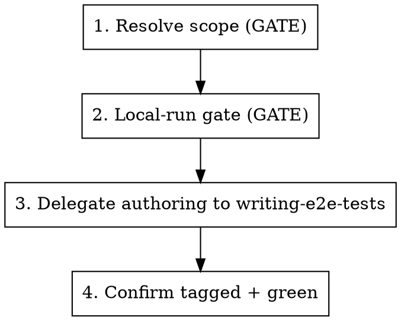

# Explore Feature

Turns "here's my change, cover it" into one committed, locally-green Playwright spec.

It is a **thin orchestrator**: it owns two phases — resolve what to cover, and confirm the result —
and **delegates the actual authoring** (analyze FE, discover live UI, write POM/spec, run green) to
the `writing-e2e-tests` skill.

**Announce at start:** "I'm using the explore-feature skill to add an e2e test for X."

## What this does — and doesn't

- **Does:** resolve the change surface → pick the one flow worth covering → hand it to
  `writing-e2e-tests` → confirm the spec is tagged, in the taxonomy, and green.
- **Doesn't:** deep bug-hunting or edge-case coverage (that's a separate QA activity); CI wiring.
- **Cheap per-PR happy-path only.** One flow, green locally in minutes.

The output is an ordinary spec: `tests/<area>/<name>.spec.ts`, a tier tag, an `@area:`, a `@cap:`
per test — exactly what every other spec in the estate looks like, and picked up by the same
suites. There is no separate lane and no version stamp.

## The loop


```dot
digraph explore_feature {
    rankdir=TB;
    "1. Resolve scope (GATE)" [shape=box];
    "2. Local-run gate (GATE)" [shape=box];
    "3. Delegate authoring to writing-e2e-tests" [shape=box];
    "4. Confirm tagged + green" [shape=box];

    "1. Resolve scope (GATE)" -> "2. Local-run gate (GATE)";
    "2. Local-run gate (GATE)" -> "3. Delegate authoring to writing-e2e-tests";
    "3. Delegate authoring to writing-e2e-tests" -> "4. Confirm tagged + green";
}
```

## Phase 1 — Resolve scope (gate)

Normalize whatever the dev pointed at into one **ScopeSpec** before authoring anything.

**Input modes** (auto-detect from the argument; ask if ambiguous):

| Mode | Trigger | Resolve |
|---|---|---|
| Local diff | no arg / dirty tree / "my branch" / "my changes" | see **Local-diff mode** below — this is the default when no PR is named, incl. "I haven't opened a PR yet" |
| A PR | `#<n>` or a PR URL | PR diff + linked ticket via `gh pr view <n> --json …` (or the GitHub MCP) |
| Multi-PR / multi-ticket | a list | union of the diffs |

**Local-diff mode** — a dev running this on their branch before (or without) a PR. Capture the
**full** change surface, not just committed work — pre-PR work is often uncommitted:

```bash
base=$(git merge-base origin/main HEAD)
git diff --name-only "$base"...HEAD          # committed on the branch
git diff --name-only HEAD                     # unstaged working-tree changes
git diff --name-only --cached                 # staged but uncommitted
git ls-files --others --exclude-standard      # new untracked files
```

Union those for `changedFiles`. If all four are empty, there's nothing to cover — say so and stop.

Produce the **ScopeSpec**:

- `tickets[]` — for naming and the PR description, if there are any. A ticket key in the branch
  name (`andreic/OPIK-1234-…` → `OPIK-1234`) is the usual source. Never invent one; the spec name
  should describe the behaviour anyway, not the ticket.
- `changedFiles[]` — the FE/BE change surface.
- `area` — the taxonomy area the change belongs to, from
  `tests_end_to_end/coverage/taxonomy.yaml`. This decides the directory: `tests/<area>/`.
- `targetPath` = `tests_end_to_end/e2e/tests/<area>/<name>.spec.ts` — new, or an existing spec in
  that directory to extend. **Prefer extending**: a new `test()` in the area's existing spec beats
  a new file when the setup is the same.
- `capabilities[]` — the `@cap:` keys this will cover, grepped from the taxonomy. They usually
  already exist as `covered: false`. If nothing fits, add the entry — a kebab-case name for the
  user-facing capability.
- `tier` — `@t1-smoke` for fast deterministic core checks, `@t2-cuj` for multi-step journeys and
  anything destructive, `@t3-nightly` for slower/broader. Tier is chosen by **how often it should
  run**, not by importance; anything spending real LLM budget is not t1.
- `happyPath` — the one end-to-end flow to cover. Multi-PR → the **combined assembled-feature
  flow, as one test**.

Three things to resolve while shaping the happy path — each caught a false or unbuildable test in
piloting:

- **Fix PRs — cover the repro, not the easy path.** For a `fix:`, the happy path must exercise the
  exact condition the bug needed. If the state can be reached two ways and only one triggered the
  bug (e.g. a trace shows the bug only when `source=sdk` via manual reference-linking, not via
  `evaluate()`), seeding the easy way makes the test pass against the *pre-fix* code too — a
  vacuous test. Identify the repro condition from the PR's root-cause description and seed that shape.
- **N equivalent surfaces — cover the most representative one.** If the change fixes the same
  behavior in several places (e.g. experiment "Go to logs", a shared sidebar, and a Playground
  cell link), don't try to cover them all — pick the single most representative entry point and
  tell the dev which ones you left. Keeps it cheap.
- **Seeding is part of the deliverable, not a precondition.** Work out early how the happy path's
  state gets created — an existing fixture, an SDK client, or the bridge (`services/opik-sdk-driver`).
  If the shape the repro needs isn't reachable through the current surface (e.g. the bridge only
  exposes `evaluate()` but the bug needs a manual `client.trace(source=...)` +
  `ExperimentItemReferences` shape), **that seeding support is yours to add as part of authoring** —
  extend the bridge route / add a fixture / use the SDK client directly — then write the test on
  top of it. Adding a fixture is normal, not scope creep. The only real stop is if the state cannot
  be produced through *any* public SDK / bridgeable path at all (rare) — then flag it, because it
  likely means the feature isn't end-to-end testable yet.

**Two gates here, before expensive authoring:**

1. **Scope gate** — state the resolved happy path + repro seed shape + target path + tier + the
   `@cap:` keys back to the dev and get a yes. If seeding the repro needs new bridge/fixture
   support, say so here so the dev knows this work also touches `services/opik-sdk-driver` or the
   fixtures. Multi-PR especially: "One test in `<area>/<name>.spec.ts` covering X→Y→Z, `@t2-cuj`. OK?"
2. **Skip check** — if the change is pure refactor / infra / docs with no user-facing behavior, say
   so and stop. Note two cases that *are* user-facing even though they look like config: a
   capability-map / constants change that adds a user-visible option (e.g. a new model in a
   dropdown → happy path: "open the page, the option is selectable"), and a backend-dominant change
   whose only visible effect is subtle (e.g. a trace that should *not* appear in a default list) —
   find the user-observable effect and cover that, don't skip. The opposite case also happens: a
   perf / internals change with **no behavior delta by design** (e.g. swapping a slow probe for a
   fast one, same rendered result). There's no PR-specific happy path — so either cover a *generic*
   regression on the affected page and say so, or skip-with-a-note if the suite already covers that
   page. Don't dress a generic regression up as PR-specific coverage. **Two things to get right
   here:** (a) *skip vs cover* turns on coverage of the **specific state/decision the change
   governs, not the page as a whole** — grep the existing suite (`tests_end_to_end/e2e/tests`) for
   that exact state. A page whose *populated* path is covered but whose *empty/onboarding* path (the
   branch a probe like this actually drives) is not is **not** "already covered" — cover the
   uncovered half. Skip-with-a-note only when the specific state is genuinely already asserted
   somewhere. (b) This *is* a `fix:` PR, so the "repro condition" mandate seems to apply — but a
   no-behavior-delta fix has no repro that renders differently pre/post. The perf-fix escape hatch
   **overrides** the repro mandate: say "N/A — no behavior delta; generic regression" and label it
   generic. A generic test that passes on both the pre- and post-fix build is correct, not a bug —
   say so when you report back.

## Phase 2 — Local-run gate

Before authoring can be verified, confirm the dev has a local stack **with their changes**:

1. Probe for a running stack — the **frontend** (`http://localhost:5173`, or `:5174` for
   FE-from-source) **and the backend, the way the suite reaches it**: `GET <baseUrl>/api/is-alive/ver`
   (e.g. `http://localhost:5173/api/is-alive/ver`). A standard `opik.sh` compose stack does **not**
   expose the backend on a bare `:8080` — the FE proxies `/api` to it, and that proxied path
   returning a `{"version": …}` JSON is the real "backend is up" signal. A FE that answers on `/`
   but 000s on `/api/is-alive/ver` is a half-up stack: every seeded test fails on the first API
   call for env reasons, not the feature. Require the `/api` health check to pass, not just "`/`
   answers on 5173." Note the returned version — it tells you which build is running (see step 2).
2. **Gate the dev:** confirm the running stack actually contains their changes. A stale prebuilt
   `opik.sh` stack won't show new `data-testid`s — if the feature adds testids, the dev must be on
   FE-from-source `:5174` (`dev-runner --restart`). **Verify the change is actually in the served
   build, not just that a FE answers**: for a FE-only PR merged to main, `curl
   http://localhost:5174/src/<changed-file>` and grep for a symbol the PR added (Vite serves
   source), and/or check `git merge-base --is-ancestor <merge-sha> HEAD`. "The dev server is up" is
   not "the fix is present."
3. If nothing is running / it's the wrong stack: offer to spin it (`local-dev` / `dev-runner`) or
   ask the dev to bring it up with their changes, then proceed. Never silently run against a stack
   lacking the feature — that produces false-green or false-missing-testid results.

   **Worktree gotcha (FE-from-source against a prebuilt backend).** `dev-runner.sh` is
   worktree-aware: in a worktree it offsets every port from a per-worktree hash *and* starts its
   own JAR-mode backend against a **fresh, empty** DB — so `--restart` there does **not** reuse the
   healthy `opik.sh` docker DB, and FE-from-source may not land on `:5174`. When you need
   FE-with-the-fix on top of an existing seeded docker backend, the reliable path is to run the
   Vite dev server directly with pinned ports and point its `/api` proxy at the running backend:
   - The `opik.sh` backend container usually publishes only its internal port to a random host
     port (`docker port opik-<proj>-backend-1`), not `:8080`. Vite's `/api` proxy strips `/api` and
     needs a bare backend, so bridge the container's app port to host `:8080` on the compose
     network, e.g. `docker run -d --name opik-be-8080 --network <compose_net> -p 8080:8080
     alpine/socat tcp-listen:8080,fork,reuseaddr tcp-connect:opik-<proj>-backend-1:8080`.
   - Then `cd apps/opik-frontend && npm ci && VITE_DEV_PORT=5174 VITE_BACKEND_PORT=8080 npm run start`.
   - Point the suite at it: `OPIK_BASE_URL=http://localhost:5174 OPIK_DEPLOYMENT=oss`. OSS needs no
     auth. Tear down the socat container when done.

## Phase 3 — Delegate authoring to `writing-e2e-tests`

Invoke the `writing-e2e-tests` skill to do the analyze → discover-live-UI → write → run-green loop.
Hand it the ScopeSpec: the target path, the tier + `@area:` + `@cap:` tags, the happy path and its
seed shape, and "verify green against the dev's local stack."

That skill owns the conventions — `test.step()` wrapping, UI-first assertions, selector preference,
SDK-only seeding, fixture-owned teardown, and the taxonomy update. Don't restate them here; read
`.agents/skills/writing-e2e-tests/conventions.md` if you need them.

## Phase 4 — Confirm

- The spec exists at `targetPath`, tagged with one tier + `@area:<area>`, with a `@cap:` per test.
- Those `@area:`/`@cap:` values resolve in `tests_end_to_end/coverage/taxonomy.yaml`, and the
  taxonomy was updated in the same change (spec added to `specs:`, covered capabilities flipped to
  `covered: true` with the tier).
- `tag_lint.py` reports `0 problem(s)` — this is the CI `tag-lint` job, so a miss here is a red
  build:
  ```bash
  python3 tests_end_to_end/coverage/tag_lint.py --taxonomy tests_end_to_end/coverage/taxonomy.yaml --estate tests_end_to_end
  ```
- It runs green locally, and so does the rest of its feature directory — a shared POM or fixture is
  used by sibling specs:
  ```bash
  cd tests_end_to_end/e2e && npx playwright test tests/<area>/ --reporter=list
  npx tsc --noEmit
  ```
- Report the committed spec path back to the dev, plus anything you deliberately left uncovered
  (the other N surfaces, edge cases) so they know the boundary.

## Ownership

QA owns this skill. When a generated test misses something, the fix lands in this skill's files —
this is the feedback loop. Edit in `.agents/skills/explore-feature/`, then `make claude` to mirror
for local testing.
