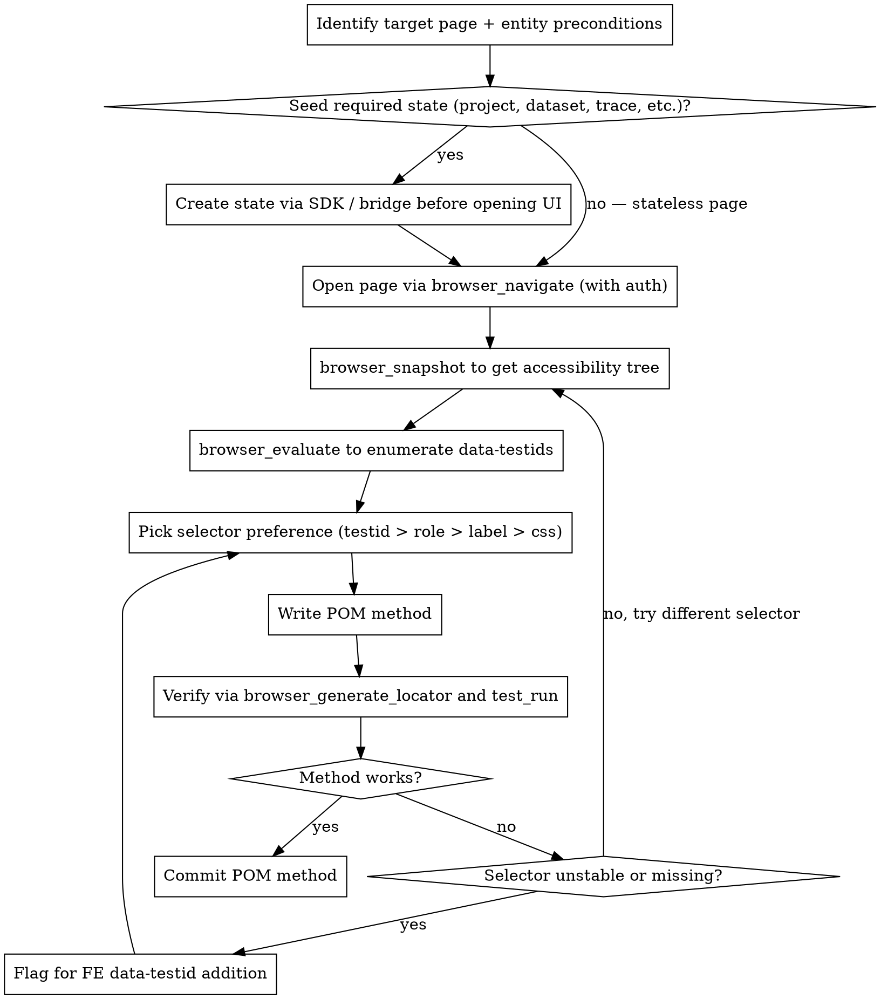

# Playwright POM Discovery (Opik 2.0 E2E CUJ workflow)

This skill is the **how** of writing CUJ tests for the Opik 2.0 E2E suite. The ticket scope tells you WHICH test to build; this skill tells you how to figure out what's on the page, what selectors are stable, and how to verify your method actually works before checking it in. It also carries the accumulated retro lessons from prior CUJ tickets — patterns the team has learned to follow (and anti-patterns to avoid).

**Announce at start:** "I'm using the playwright-pom-discovery skill to work on the [ticket / area]."

## Required reading on invocation

Before writing any code, read the supplementary file:

- **[retro-lessons.md](retro-lessons.md)** — cumulative lessons from previously-shipped CUJ tests. Covers UI-first assertions, matcher policy, `test.step()` discipline, FE testid policy, cascade verification, fixture-seed-shape considerations, and more. Read it once at the start of every CUJ ticket; it's the team contract.

## Triage: ticket-anchored OR natural-language request?

Before doing anything else, figure out which of these you're in. Branch the conversation accordingly.

### Path A — ticket-anchored work

The user gave you a Jira ticket key (e.g., "OPIK-XXXX") or pasted the kickoff prompt at `tests_end_to_end/e2e/.agentic/cuj-test-kickoff.md` with a TICKET line filled in. Standard 5-phase flow:

1. Read the Jira ticket via the Atlassian MCP.
2. Read the closest-shape merged PR (see the kickoff prompt's per-ticket cheat sheet for which one).
3. Draft a spec at `docs/superpowers/specs/<DATE>-<ticket-key-lowercased>-<slug>-design.md` (local-only, never `git add`).
4. Stop at the Phase 1 spec gate for user approval.
5. Proceed through Phase 2 (bridge/fixture), Phase 3 (UI discovery — see procedure below), Phase 4 (POMs + test), Phase 5 (PR + Jira transition).

Skip to the "Step-by-step" section for Phase 3 mechanics.

### Path B — natural-language request, no ticket

The user said something like "we need tests for the agent-config switcher flow" or "write E2E coverage for experiments" with no Jira key. Don't ask them to file a ticket first — scope the work in conversation:

**Step 1: Adaptive scoping (1-5 questions max, depending on how complete the initial request was).**

Read what they said. Ask ONLY the questions that aren't already answered. Cap at 5 total; aim for 1-3 if their initial message was concrete. Pull from this question pool, in priority order:

1. **Flow walkthrough** (almost always ask): "Walk me through the happy path you want covered, as a user clicking through the UI. Where do they start, what do they do, what should they see at the end?"
2. **Preconditions** (ask if not obvious): "What state needs to exist before the test starts? (e.g., a project with N traces, a dataset with items, a configured runner)"
3. **Red-path / failure cases** (ask if happy-path-only would leave coverage thin): "Do we want to assert anything about the failure path too — e.g., what happens with invalid input, a missing dependency, a server error?"
4. **Out of scope** (ask if the user's request was broad): "What edge cases or related flows would you defer to a follow-up rather than bundle into this test?"
5. **Tier** (ask if not obvious from context): "Is this T1 (must run on every deploy, blocks if red), T2 (CUJ-cadence, runs on schedule), or T3 (nightly)?"

If the user's request was already detailed (multi-paragraph with preconditions + happy path + edge cases), skip to step 2 with as few questions as possible — they've front-loaded the scoping. Don't make them repeat themselves.

**Step 2: Jira decision.** Once scope is clear, ask ONE question:

> "Should I file a Jira ticket for this under OPIK-6107 (CUJ epic) for tracking, or ship as a `[NA]` PR with no ticket reference? Both are normal in this repo."

Default to `[NA]` if the user says "just ship it" or doesn't seem to care. If they want Jira tracking, file the ticket via the Atlassian MCP (cloud id `70d91365-5d13-4b02-b353-de8a8e8ee962`) with the user as reporter, parent OPIK-6107, summary derived from the scoped flow.

**Step 3: One-pager spec.** Draft a one-pager spec at `docs/superpowers/specs/<DATE>-natural-<short-slug>-design.md` (or `<DATE>-opik-XXXX-<slug>-design.md` if a Jira ticket was filed). Same shape as the per-ticket specs documented in the kickoff prompt at `tests_end_to_end/e2e/.agentic/cuj-test-kickoff.md` §7.1, but shorter — for natural-language work the spec only needs to cover:

- Why this test exists (1 paragraph, derived from the user's request)
- Scope: in / out of scope (bullet lists)
- Component design: what fixture (extends what), what bridge route (if any new one), what POMs (estimated names), what test cases (2-3 typically)
- Acceptance criteria (4-6 checkboxes)

Local-only. Never `git add`. Report the file path back to the user.

**Step 4: User approves the spec.** Stop here. The user reads (~5 min), then approves or redirects.

**Step 5+: From here, the natural-language path joins the standard 5-phase flow.** Phase 2 (bridge/fixture), Phase 3 (UI discovery via the procedure below), Phase 4 (POMs + test), Phase 5 (PR).

For Phase 5's PR title, use `[NA] [QA] test: <short description>` if no Jira ticket; otherwise `[OPIK-XXXX] [QA] test: <short description>`. Branch name follows the same shape (`andreic/NA-<slug>` or `andreic/OPIK-XXXX-<slug>` — use the actual username if you're not Andrei).

## When this skill applies

- You're touching anything under `tests_end_to_end/e2e/pom/`.
- You're writing or modifying tests under `tests_end_to_end/e2e/tests/`.
- You're adding fixtures under `tests_end_to_end/e2e/fixtures/` for CUJ test consumption.
- You need to write a `data-testid` selector, a `getByRole`, or any other Playwright locator targeting the live Opik UI.
- You're adding a method to an existing POM that interacts with a new element you haven't seen before.

It does NOT apply to:

- The OLD `tests_end_to_end/typescript-tests/` suite — that's covered by the `playwright-e2e` skill.
- Pure fixture work (no UI interaction) — see the spec for the ticket.
- Matchers / type-only changes.

## The procedure



## Step-by-step

### 1. Identify target page + preconditions

Before opening the browser, answer in writing:

- **What page** does the POM model? E.g., `LogsPage` models `/<workspace>/projects/<projectId>/logs`. Get the route from the FE source under `apps/opik-frontend/src/v2/pages/` — each page has a directory matching its name.
- **What entities must exist** for the page to show real data? Examples:
  - `LogsPage` — needs a project AND at least one trace under it. An empty project shows only the empty state.
  - `DatasetItemsPage` — needs a dataset AND at least one item. Empty datasets show only the "Create item" CTA.
  - `TestSuitesPage` — needs at least one test suite to show row interactions.
  - `OnlineEvaluationPage` — works empty, but creating a rule shows the rule list.
- **What auth state** does the page need? The 2.0 suite uses API-key auth; the browser session needs the workspace cookie set. See the auth setup below.

If the page genuinely is stateless (e.g., an empty list page), skip seeding and go straight to step 3. If it's not, seed first — exploring an empty-state UI will lead you to write a POM that only ever sees the empty state.

### 2. Seed required state via SDK / bridge

**Never** click-create state through the UI just to populate the page you're exploring. Two reasons:

1. The page you're exploring may itself BE the UI-create flow you're trying to model — you'd be using the UI to test the UI.
2. UI-create is slower and flakier than SDK-create.

Instead, use the bridge or the TS SDK to seed before opening the browser. For the POM-discovery phase, a one-off seed script is fine (don't wire it into the test suite yet — that's for the test ticket itself).

**Example seed for `LogsPage` discovery:**

```ts
// scratch script, not committed
import { Opik } from 'opik';
const opik = new Opik({
  apiKey: process.env.OPIK_API_KEY,
  workspaceName: process.env.OPIK_WORKSPACE,
  apiUrl: process.env.OPIK_BASE_URL + '/api',
});

// project + a few traces with structure variety
const projectName = `discovery-logs-${Date.now()}`;
await opik.api.projects.createProject({ name: projectName });

import { track } from 'opik';
const decoratedFn = track({ name: 'discovery-trace', projectName }, async (input: string) => {
  return `output for ${input}`;
});
await decoratedFn('hello');
await decoratedFn('world');
await opik.flush();

console.log(`Discovery project: ${projectName}`);
```

Run it locally with staging or local-dev creds, note the project name, then navigate the UI to that project's logs page in the next step. Tear it down by hand at the end of the discovery session (`backendClient.deleteProject` if it's wired up, or `curl` otherwise) — discovery state should never accumulate.

**Reusable seed patterns by page family:**

| Page being built | Seed via | Why |
|---|---|---|
| `LogsPage`, `TracePanelPage` | `opik.track` decorator + at least one call | Empty projects show only the empty state |
| `DatasetsPage` | `opik.api.datasets.createDataset({...})` for ~3 datasets with different shapes | List interactions need multiple rows |
| `DatasetItemsPage` | `opik.Dataset(name).insert([...])` with 3+ items | Item-table interactions need data |
| `TestSuitesPage`, `TestSuitePage` | `opik.TestSuite(...)` with items + evaluator + run | Suite states (running/completed/failed) need a real run |
| `ExperimentsPage` | `experiment.evaluate(...)` against a dataset | Experiment rows need a completed run |
| `OnlineEvaluationPage` | (works empty for rule list); seed a rule via UI once during discovery | Rule list shows after at least one rule exists |
| `AnnotationQueuesPage`, `AnnotationQueuePage` | `opik.TracesAnnotationQueue(...)` with 3+ traces | Reviewer flow needs items to score |

Common gotchas:

- **Trace ingestion is eventually consistent.** After `opik.flush()`, the trace may take 1–3 seconds to appear in the Logs page. If you snapshot too fast, you'll see the empty state. Wait or refresh.
- **Online scoring rules apply asynchronously** — if you seed a trace and then snapshot the Online Evaluation page, scores may not have landed yet.
- **Dataset items have a slight delay** between insert and table-render — usually ms, but watch for it.

### 3. Open the page with an authed browser session

**Auth setup once per discovery session:**

The 2.0 suite uses API-key auth. The browser MCP needs an authed page. The simplest path during discovery: navigate to the login page, log in via UI once, then `browser_storage_state` to save cookies, then reuse that state for the discovery session.

**Even simpler for early POM work:** ask the user to provide their browser's storage state JSON, or to log in interactively in the MCP-controlled browser, then proceed. Don't try to script the full login flow during POM discovery — it's a distraction.

**Standard discovery navigation:**

```
mcp__Playwright__browser_navigate(url="https://staging.dev.comet.com/opik/...")
```

URL templates (substitute `{workspace}` and IDs as needed):

- Datasets list: `/{workspace}/datasets`
- Dataset items: `/{workspace}/datasets/{id}/items`
- Test Suites list: `/{workspace}/test-suites`
- Test Suite detail: `/{workspace}/test-suites/{id}`
- Test Suite items: `/{workspace}/test-suites/{id}/items`
- Logs (project): `/{workspace}/projects/{projectId}/logs`
- Experiments: `/{workspace}/experiments`
- Online evaluation: `/{workspace}/projects/{projectId}/online-evaluation`
- Annotation queues: `/{workspace}/annotation-queues`

Confirm route shape by inspecting `apps/opik-frontend/src/v2/router.tsx` or the page directory under `apps/opik-frontend/src/v2/pages/<PageName>/` if the route is wrong.

### 4. Snapshot the accessibility tree

```
mcp__Playwright__browser_snapshot()
```

This returns the **structured accessibility tree**, not pixels. Each interactive element has:

- A role (`button`, `textbox`, `link`, `combobox`, `row`, etc.)
- An accessible name (the visible text or `aria-label`)
- A stable `ref` ID you can use with `browser_click(ref="...")` to interact

Why this is the right primitive: Playwright's `getByRole(...)` selectors map 1:1 to what the snapshot shows. If you see `button "Create suite"` in the snapshot, you can confidently write `page.getByRole('button', { name: 'Create suite' })`.

**Read the snapshot before writing any selector.** Don't guess. Don't grep the FE source for what you think the button is called — the rendered DOM is the only source of truth that matters.

### 5. Enumerate `data-testid`s

The snapshot tells you what's interactive but not what's been explicitly marked stable by the FE team. For that:

```
mcp__Playwright__browser_evaluate(function="""() => {
  return Array.from(document.querySelectorAll('[data-testid]'))
    .map(e => ({
      testid: e.getAttribute('data-testid'),
      tag: e.tagName.toLowerCase(),
      text: (e.textContent || '').slice(0, 60).trim(),
      visible: e.offsetParent !== null,
    }))
    .filter(e => e.visible);
}""")
```

This returns every test id currently rendered on the page, with enough context to know what each one is. **Test ids are the preferred selector** — they're the FE team's contract for "this won't change." Use them when they exist.

### 6. Pick the right selector

In priority order:

1. **`data-testid`** — most stable. `page.getByTestId('create-suite-button')`. If a test id exists, use it.
2. **`getByRole(name)`** — stable across most refactors as long as the accessible name doesn't change. `page.getByRole('button', { name: 'Create suite' })`.
3. **`getByLabel`** for form inputs that have a label. `page.getByLabel('Dataset name')`.
4. **`getByText`** — fragile if the text is dynamic or i18n'd. Use only for truly static labels.
5. **CSS / XPath selectors** — **last resort**. Use only when no test id and no accessible name exists, and leave a comment explaining why: `// no test id; FE team to add — link to ticket`.

**The decision is binary at write time, not runtime.** Pick one selector and commit to it. The "heal at runtime" pattern (Seam 3 in the parent design) is reserved for future C-scope work; B-scope (where we are) writes deterministic selectors.

### 7. Use `browser_generate_locator` when you're unsure

If the accessibility tree shows three buttons with similar names, or the element has both a test id and a role and you're not sure which is canonical:

```
mcp__Playwright__browser_snapshot()  # to find the ref of the element
mcp__playwright-test__browser_generate_locator(ref="<the-ref>")
```

This returns the locator code **Playwright itself would generate** if you used `codegen` against this element. Trust that output — Playwright's locator selection logic is well-tuned for resilience.

If you don't have access to `mcp__playwright-test__` tools, fall back to writing the selector manually based on the snapshot + test id list, then verify in step 8.

### 8. Verify by running

After writing the POM method, the verification loop is:

```ts
// scratch test, not committed
import { test, expect } from '@playwright/test';
import { LogsPage } from '../pom/logs.page';

test('discovery: LogsPage.filterByProject works', async ({ page }) => {
  await page.goto('https://staging.dev.comet.com/opik/<workspace>/projects/<seed-project-id>/logs');
  const logs = new LogsPage(page);
  await logs.filterByProject('discovery-logs-...');
  expect(await logs.countTraces()).toBeGreaterThan(0);
});
```

Run it through:

```
mcp__playwright-test__test_run(testPath="path/to/scratch.spec.ts")
```

If it passes, the POM method works against the live page. If it fails, **read the failure trace** (Playwright's artifacts), don't just adjust selectors blindly. Common failures:

- **Timeout waiting for element** — selector is wrong. Re-snapshot and pick a different one.
- **Element resolved but assertion failed** — the POM method's logic is wrong, not the selector. Fix the method, not the selector.
- **Multiple elements matched** — selector isn't specific enough. Add a parent scope or use a more precise role.

### 9. When a stable selector doesn't exist

If after all of the above the only working selector is a CSS path like `.MuiTable-root > tbody > tr:nth-child(2)`, **stop and flag it**. Per the parent design `2026-04-23-opik-2.0-e2e-infrastructure-design.md` §10.4 "Missing data-testid protocol":

- **Default:** add a `data-testid` to the FE component in the **same PR** as your POM. The QA team has explicit permission for this. Find the component under `apps/opik-frontend/src/v2/pages/<Page>/...` or its shared-component dependency, add `data-testid="<descriptive-name>"`, then use that in the POM.
- **Fallback:** if blocked from touching the FE, use `getByRole` with explicit accessible name (survives most refactors).
- **Last resort:** structural CSS selector with a `// TODO(OPIK-####): awaits testid` comment linking to a ticket. Lint flags unticketed CSS selectors.

The `data-testid` naming convention is kebab-case, descriptive, scoped to the page/component: `dataset-items-table`, `create-suite-button`, `trace-row-{traceId}`. Avoid generic names like `submit-button` that conflict across pages.

### 10. Commit and move on

Once the POM method works against the live UI:

- The POM file change goes in the test ticket's PR.
- Any FE `data-testid` additions go in the **same** PR (cross-package change is fine; reviewers expect it for test-enablement work).
- The scratch seed script and scratch test file are **NOT** committed. Delete them before the commit.
- Tear down any state you created during discovery (`backendClient.deleteProject(...)` or `curl -X DELETE ...`).

## Anti-patterns

These are red flags that mean you skipped a step:

| Symptom | What you skipped |
|---|---|
| "Let me look at the FE source to find the right selector" | Step 4 — snapshot the rendered DOM, not the source. Components compose; what renders is what matters. |
| "I'll write the POM method and check if it works when the test runs" | Step 8 — verify in isolation before committing. The test ticket will be slower to iterate on. |
| "The page is empty, so I'll just check the empty state" | Step 2 — seed real data. An empty-state-only POM never exercises the row template, the open-detail action, etc. |
| "I'll use `page.locator('.button:nth-child(3)')` — it's fine" | Step 9 — flag missing testids and add them to the FE. Brittle selectors are the #1 source of E2E flake. |
| "The test id I see is generic, like `button-1` — I'll use that" | Step 5 + 9 — generic test ids are nearly as bad as no test id. Ask the FE team to rename it to something descriptive in the same PR. |
| "I'll add the POM but skip the seed because the test will create state" | Step 2 — even during the test, you're now writing untested POM code against a page state you've never seen. |

## Integration with the broader workflow

This skill sits inside the `superpowers:subagent-driven-development` workflow. When an implementer subagent is dispatched for a POM-introducing task (e.g., the POM portion of OPIK-6128), the dispatch prompt should invoke this skill at the start:

> Before writing `LogsPage`, use the `playwright-pom-discovery` skill to explore the live Logs page on staging. Specifically: seed a project + a few traces via the bridge, navigate to the page, snapshot the accessibility tree, enumerate test ids, then write the POM method. Report what test ids you found, what selectors you chose for each method, and which (if any) elements required `data-testid` additions to the FE.

That dispatch text + this skill = the agent has a clear procedure to follow without me writing per-ticket instructions.

## Reserved for future expansion

When the suite gains the `LogsPage`, `TracePanelPage`, etc., POMs from OPIK-6128 onwards, a follow-up update to this skill should add a **page-object-catalog.md** sibling file (similar to the existing `playwright-e2e/page-object-catalog.md`) listing each POM, its key methods, and the data preconditions for using it in tests. Don't write that file yet — it'd be speculative; populate it as POMs land.
