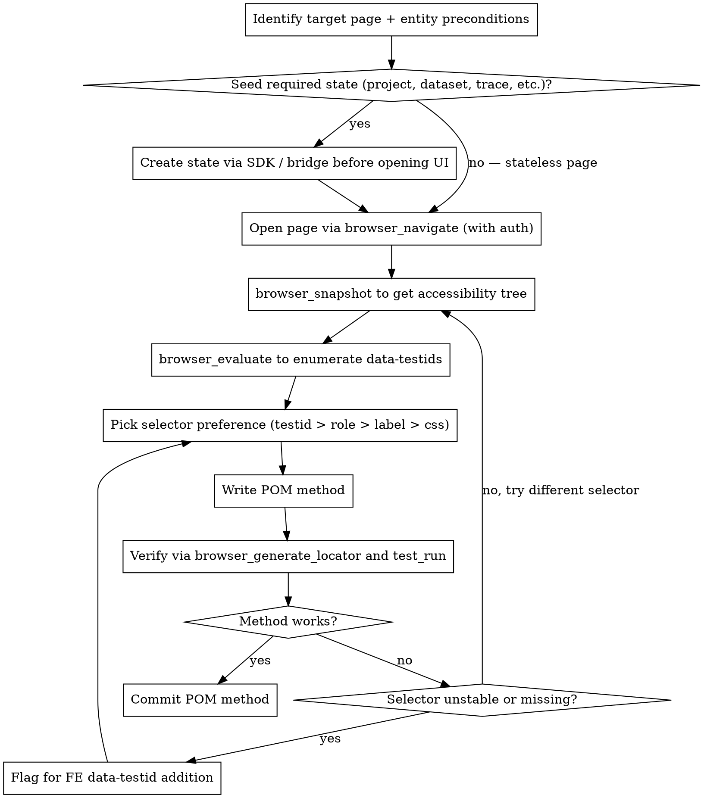

# Playwright POM Discovery

This skill is the **how** of choosing selectors for a POM in the Opik E2E suite. You already know which POM you're building; this skill tells you how to figure out what's on the page, what selectors are stable, and how to verify your method actually works before checking it in.

**Announce at start:** "I'm using the playwright-pom-discovery skill to build the X page object."

## When this skill applies

- You're touching anything under `tests_end_to_end/e2e/pom/`.
- You need to write a `data-testid` selector, a `getByRole`, or any other Playwright locator targeting the live Opik UI.
- You're adding a method to an existing POM that interacts with a new element you haven't seen before.

It does NOT apply to:

- Pure fixture work (no UI interaction).
- Matchers / type-only changes.

## The procedure



## Step-by-step

### 1. Identify target page + preconditions

Before opening the browser, answer in writing:

- **What page** does the POM model? E.g., `LogsPage` models `/<workspace>/projects/<projectId>/logs`. Get the route from the FE source under `apps/opik-frontend/src/v2/pages/` — each page has a directory matching its name.
- **What entities must exist** for the page to show real data? Examples:
  - `LogsPage` — needs a project AND at least one trace under it. An empty project shows only the empty state.
  - `DatasetItemsPage` — needs a dataset AND at least one item. Empty datasets show only the "Create item" CTA.
  - `TestSuitesPage` — needs at least one test suite to show row interactions.
  - `OnlineEvaluationPage` — works empty, but creating a rule shows the rule list.
- **What auth state** does the page need? The browser session needs the workspace authenticated. See the auth setup below.

If the page genuinely is stateless (e.g., an empty list page), skip seeding and go straight to step 3. If it's not, seed first — exploring an empty-state UI will lead you to write a POM that only ever sees the empty state.

### 2. Seed required state via SDK / bridge

**Never** click-create state through the UI just to populate the page you're exploring. Two reasons:

1. The page you're exploring may itself BE the UI-create flow you're trying to model — you'd be using the UI to test the UI.
2. UI-create is slower and flakier than SDK-create.

Instead, use the bridge or the TS SDK to seed before opening the browser. For the discovery phase, a one-off seed script is fine — you don't need to wire it into the test suite yet (the test's fixture handles that later).

**Example seed for `LogsPage` discovery:**

```ts
// scratch script, not committed
import { Opik } from 'opik';
const opik = new Opik({
  apiKey: process.env.OPIK_API_KEY,
  workspaceName: process.env.OPIK_WORKSPACE,
  apiUrl: process.env.OPIK_BASE_URL + '/api',
});

// project + a few traces with structure variety
const projectName = `discovery-logs-${Date.now()}`;
await opik.api.projects.createProject({ name: projectName });

import { track } from 'opik';
const decoratedFn = track({ name: 'discovery-trace', projectName }, async (input: string) => {
  return `output for ${input}`;
});
await decoratedFn('hello');
await decoratedFn('world');
await opik.flush();

console.log(`Discovery project: ${projectName}`);
```

Run it locally with staging or local-dev creds, note the project name, then navigate the UI to that project's logs page in the next step. Tear it down by hand at the end of the discovery session (`backendClient.deleteProject` if it's wired up, or `curl` otherwise) — discovery state should never accumulate.

**Reusable seed patterns by page family:**

| Page being built | Seed via | Why |
|---|---|---|
| `LogsPage`, `TracePanelPage` | `opik.track` decorator + at least one call | Empty projects show only the empty state |
| `DatasetsPage` | `opik.api.datasets.createDataset({...})` for ~3 datasets with different shapes | List interactions need multiple rows |
| `DatasetItemsPage` | `opik.Dataset(name).insert([...])` with 3+ items | Item-table interactions need data |
| `TestSuitesPage`, `TestSuitePage` | `opik.TestSuite(...)` with items + evaluator + run | Suite states (running/completed/failed) need a real run |
| `ExperimentsPage` | `experiment.evaluate(...)` against a dataset | Experiment rows need a completed run |
| `OnlineEvaluationPage` | (works empty for rule list); seed a rule via UI once during discovery | Rule list shows after at least one rule exists |
| `AnnotationQueuesPage`, `AnnotationQueuePage` | `opik.TracesAnnotationQueue(...)` with 3+ traces | Reviewer flow needs items to score |

Common gotchas:

- **Trace ingestion is eventually consistent.** After `opik.flush()`, the trace may take 1–3 seconds to appear in the Logs page. If you snapshot too fast, you'll see the empty state. Wait or refresh.
- **Online scoring rules apply asynchronously** — if you seed a trace and then snapshot the Online Evaluation page, scores may not have landed yet.
- **Dataset items have a slight delay** between insert and table-render — usually ms, but watch for it.

### 3. Open the page with an authed browser session

**Auth setup once per discovery session:**

The browser MCP needs an authenticated page. Against local OSS (`http://localhost:5173`, workspace `default`) there's no login wall — navigate straight to the page. Against an authenticated deployment, reuse the suite's storage state: `global-setup` mints `.auth/user.json` the first time you run a Playwright test, and the browser MCP can load it as its `storageState`. Don't script a full login flow during discovery — it's a distraction.

**Arm the dialog handler before your first navigation (below).** Several Opik pages guard against data loss with a native `beforeunload` "Leave site?" confirm — it fires the moment you navigate (or reload) with unsaved state: a staged draft on the Dataset Items page (`useNavigationBlocker`), a dirty form, an open editor. A native dialog is **not** in the accessibility snapshot, so `browser_navigate` just silently blocks on it until it times out — you won't see why. Do this before the navigation step below, not after. Guard against it two ways, both cheap:

1. **Register an auto-accept handler at the start of the session**, before your first navigation:

   ```
   mcp__Playwright__browser_handle_dialog(accept=true)
   ```

   This dismisses any `beforeunload`/`confirm` that appears so navigation never hangs. (If one has *already* blocked you, call the same tool to clear it, then carry on.)

2. **Leave the page clean.** Before navigating away, clear unsaved state through the UI the way a user would — commit or **discard** the draft, close the editor, reset the form. This is also what the POM method itself must do, so doing it in discovery validates that path. Don't rely on the auto-handler alone: a discarded draft leaves the page in a real, testable state; a force-dismissed dialog leaves stale draft state behind.

**Standard discovery navigation:**

```
mcp__Playwright__browser_navigate(url="http://localhost:5173/...")
```

Get the exact route from the FE source — `apps/opik-frontend/src/v2/router.tsx` for the route table, or the page directory under `apps/opik-frontend/src/v2/pages/<PageName>/`. Most data pages are project-scoped, e.g. `/{workspace}/projects/{projectId}/datasets/` or `/{workspace}/projects/{projectId}/logs`. Confirm against the router rather than guessing — routes change.

### 4. Snapshot the accessibility tree

```
mcp__Playwright__browser_snapshot()
```

This returns the **structured accessibility tree**, not pixels. Each interactive element has:

- A role (`button`, `textbox`, `link`, `combobox`, `row`, etc.)
- An accessible name (the visible text or `aria-label`)
- A stable `ref` ID you can use with `browser_click(ref="...")` to interact

Why this is the right primitive: Playwright's `getByRole(...)` selectors map 1:1 to what the snapshot shows. If you see `button "Create suite"` in the snapshot, you can confidently write `page.getByRole('button', { name: 'Create suite' })`.

**Read the snapshot before writing any selector.** Don't guess. Don't grep the FE source for what you think the button is called — the rendered DOM is the only source of truth that matters.

### 5. Enumerate `data-testid`s

The snapshot tells you what's interactive but not what's been explicitly marked stable by the FE team. For that:

```
mcp__Playwright__browser_evaluate(function="""() => {
  return Array.from(document.querySelectorAll('[data-testid]'))
    .map(e => ({
      testid: e.getAttribute('data-testid'),
      tag: e.tagName.toLowerCase(),
      text: (e.textContent || '').slice(0, 60).trim(),
      visible: e.offsetParent !== null,
    }))
    .filter(e => e.visible);
}""")
```

This returns every test id currently rendered on the page, with enough context to know what each one is. **Test ids are the preferred selector** — they're the FE team's contract for "this won't change." Use them when they exist.

### 6. Pick the right selector

In priority order:

1. **`data-testid`** — most stable. `page.getByTestId('create-suite-button')`. If a test id exists, use it.
2. **`getByRole(name)`** — stable across most refactors as long as the accessible name doesn't change. `page.getByRole('button', { name: 'Create suite' })`.
3. **`getByLabel`** for form inputs that have a label. `page.getByLabel('Dataset name')`.
4. **`getByText`** — fragile if the text is dynamic or i18n'd. Use only for truly static labels.
5. **CSS / XPath selectors** — **last resort**. Use only when no test id and no accessible name exists, and leave a comment explaining why: `// no test id; FE team to add — link to ticket`.

**The decision is binary at write time, not runtime.** Pick one selector and commit to it — write deterministic selectors, not runtime-healing ones.

### 7. Use `browser_generate_locator` when you're unsure

If the accessibility tree shows three buttons with similar names, or the element has both a test id and a role and you're not sure which is canonical:

```
mcp__Playwright__browser_snapshot()  # to find the ref of the element
mcp__playwright-test__browser_generate_locator(ref="<the-ref>")
```

This returns the locator code **Playwright itself would generate** if you used `codegen` against this element. Trust that output — Playwright's locator selection logic is well-tuned for resilience.

If you don't have access to `mcp__playwright-test__` tools, fall back to writing the selector manually based on the snapshot + test id list, then verify in step 8.

### 8. Verify by running

After writing the POM method, the verification loop is:

```ts
// scratch test, not committed
import { test, expect } from '@playwright/test';
import { LogsPage } from '../pom/logs.page';

test('discovery: LogsPage.filterByProject works', async ({ page }) => {
  await page.goto('http://localhost:5173/<workspace>/projects/<seed-project-id>/logs');
  const logs = new LogsPage(page);
  await logs.filterByProject('discovery-logs-...');
  expect(await logs.countTraces()).toBeGreaterThan(0);
});
```

Run it through:

```
mcp__playwright-test__test_run(testPath="path/to/scratch.spec.ts")
```

If it passes, the POM method works against the live page. If it fails, **read the failure trace** (Playwright's artifacts), don't just adjust selectors blindly. Common failures:

- **Timeout waiting for element** — selector is wrong. Re-snapshot and pick a different one.
- **Element resolved but assertion failed** — the POM method's logic is wrong, not the selector. Fix the method, not the selector.
- **Multiple elements matched** — selector isn't specific enough. Add a parent scope or use a more precise role.

### 9. When a stable selector doesn't exist

If after all of the above the only working selector is a CSS path like `.MuiTable-root > tbody > tr:nth-child(2)`, **stop and flag it**. The missing-data-testid protocol:

- **Default:** add a `data-testid` to the FE component in the **same change** as your POM. Find the component under `apps/opik-frontend/src/v2/pages/<Page>/...` or its shared-component dependency, add `data-testid="<descriptive-name>"`, then use that in the POM.
- **Fallback:** if blocked from touching the FE, use `getByRole` with explicit accessible name (survives most refactors).
- **Last resort:** structural CSS selector with a comment explaining why it's necessary and that a `data-testid` should be added.

The `data-testid` naming convention is kebab-case, descriptive, scoped to the page/component: `dataset-items-table`, `create-suite-button`, `trace-row-{traceId}`. Avoid generic names like `submit-button` that conflict across pages.

### 10. Commit and move on

Once the POM method works against the live UI:

- The POM file change goes in with the test that uses it.
- Any FE `data-testid` additions go in the **same** change (cross-package is fine; reviewers expect it for test-enablement work).
- Any scratch seed script and scratch test file are **NOT** committed. Delete them first.
- Tear down any state you created during discovery (`backendClient.deleteProject(...)` or `curl -X DELETE ...`).

## Anti-patterns

These are red flags that mean you skipped a step:

| Symptom | What you skipped |
|---|---|
| "Let me look at the FE source to find the right selector" | Step 4 — snapshot the rendered DOM, not the source. Components compose; what renders is what matters. |
| "I'll write the POM method and check if it works when the test runs" | Step 8 — verify in isolation before committing. Iterating inside a full run is slower. |
| "The page is empty, so I'll just check the empty state" | Step 2 — seed real data. An empty-state-only POM never exercises the row template, the open-detail action, etc. |
| "I'll use `page.locator('.button:nth-child(3)')` — it's fine" | Step 9 — flag missing testids and add them to the FE. Brittle selectors are the #1 source of E2E flake. |
| "The test id I see is generic, like `button-1` — I'll use that" | Step 5 + 9 — generic test ids are nearly as bad as no test id. Rename it to something descriptive in the same change. |
| "I'll add the POM but skip the seed because the test will create state" | Step 2 — even during the test, you're now writing untested POM code against a page state you've never seen. |
| "`browser_navigate` is hanging / timing out for no reason" | Step 3 — a native "Leave site?" dialog is blocking (unsaved draft/form). It's not in the snapshot. Arm `browser_handle_dialog(accept=true)` up front, and discard the draft in-app before leaving. |

## Where this fits

This is the discovery sub-step of writing an E2E test. The `writing-e2e-tests` skill invokes it once it has scoped the test and analyzed the feature: you seed the page's state, explore the live UI, and come back with the selectors each POM method will use plus any `data-testid`s the FE needs. The test and POM get written and run from there.
