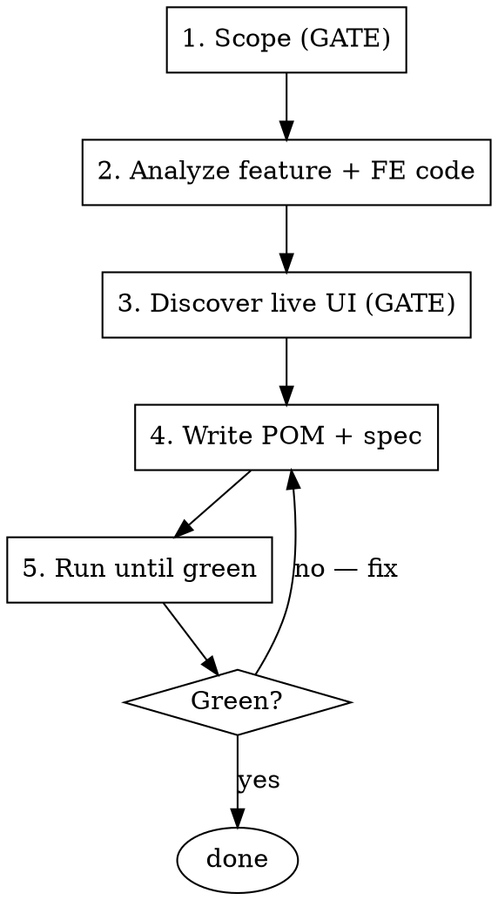

# Writing E2E Tests

This skill is how we add an end-to-end test to the Opik E2E suite. You give it a feature, page, or branch; it runs a proven loop end-to-end and leaves you with a working, locally-verified Playwright test.

**Announce at start:** "I'm using the writing-e2e-tests skill to add an E2E test for X."

## Where tests live

The suite is at `tests_end_to_end/e2e/`. Inside it:

- **Specs:** `tests/<feature>/<name>.spec.ts` — one feature directory per page family (`datasets`, `trace-explore`, `experiments`, `test-suites`, `online-evaluation`, …).
- **Page Object Models:** `pom/<name>.page.ts` — one class per page, methods for the interactions a test needs.
- **Fixtures:** `fixtures/<name>.fixture.ts` — seed entities (project, dataset, trace, experiment, testSuite) and tear them down. Composed in a chain; re-exported from `fixtures/index.ts`.
- **SDK clients:** `core/sdk/` — `sdkClient.python` (HTTP wrapper over the bridge) and `sdkClient.typescript` (direct `new Opik({...})`) for seeding. `core/backend/` holds the typed REST client for inspection + teardown.
- **Bridge:** `services/opik-sdk-driver/` — a FastAPI app (run with `uv`) wrapping the Python SDK, exposing routes the TS clients call. Playwright's `webServer` directive auto-spawns it during a test run; you don't start it by hand.

Specs and POMs import through path aliases: `import { test, expect } from '@e2e/fixtures'` and `import { LogsPage } from '@e2e/pom/logs.page'`.

## Tooling — already set up

- The **`Playwright` MCP** (live-UI exploration) and the **`playwright-test` MCP** (`browser_generate_locator`) are already configured in the repo's `.mcp.json`. No setup step.
- Tests run via the plain Playwright CLI from `tests_end_to_end/e2e/`. The `webServer` directive spawns the bridge automatically.

## Conventions

Read [conventions.md](conventions.md) before writing any POM or spec. It carries the rules that keep tests legible and stable: mandatory `test.step()` wrapping, UI-first assertions, selector preference, public-SDK-only seeding, fixture seed shapes, and the tag taxonomy. They aren't optional polish — each prevents a class of failure.

## The loop



### Step 1 — Scope (gate, lightweight)

Work out, from the request:

- **What flow / feature** the test covers, and **which page** it lives on. If the dev pointed at a branch or PR, read the diff to find what changed.
- **The target.** Default is local OSS at `http://localhost:5173` (`OPIK_DEPLOYMENT=oss`, workspace `default`) — the natural target for "test the feature I just built." Only use another target if the dev asks.
- **Tags** — pick a tier (`@t1-smoke` / `@t2-cuj` / `@t3-nightly`) and a feature tag, per [conventions.md](conventions.md).

Run the **safety check** (below) before any seeding. Then confirm the scope in one short message — feature, page, target, tags — and proceed. Don't write a formal spec document.

### Step 2 — Analyze the feature and frontend code

Before touching the browser:

- Read the page's FE source under `apps/opik-frontend/src/v2/pages/<Page>/` — the route it renders at, the components it composes, and any `data-testid` attributes already present. The route shape is what your POM's `goto()` will use.
- Identify the **entity preconditions**: what must exist for the page to render real data (an empty project shows only the empty state). Decide how to seed it — which fixture fits, or which bridge/SDK call. Seed via the SDK/bridge, never by click-creating through the UI.
- Check `fixtures/` for an existing fixture that already seeds the shape you need; reuse it before writing a new one.

### Step 3 — Discover the live UI (gate, lightweight)

**Invoke the `playwright-pom-discovery` skill** (via the Skill tool). It walks the live page with the Playwright MCP: seed state, navigate authed, snapshot the accessibility tree, enumerate `data-testid`s, pick the most stable selector for each element you'll target, and flag any element that has no stable selector (needs a FE `data-testid` added in this change).

When discovery is done, report a short summary — the selectors you'll use per element, and any missing testids you'll add — and confirm before writing code. Don't write anything under `pom/` before this step.

### Step 4 — Write the POM + spec

- Write or extend the POM in `pom/<name>.page.ts` using the selectors from discovery. Each method wraps its body in `test.step()` and returns through the callback (see [conventions.md](conventions.md)).
- Write the spec in `tests/<feature>/<name>.spec.ts`: tier + feature tag on the describe block, coarse `test.step()` phases, UI-first assertions.
- If discovery flagged a missing/brittle selector, add a descriptive `data-testid` to the FE component in the **same change**.

### Step 5 — Run until green

From `tests_end_to_end/e2e/`:

```bash
npx playwright test tests/<feature>/<name>.spec.ts --reporter=list
```

The bridge auto-spawns (you'll see its startup line in the output). If a test fails, **read the failure trace** (`npx playwright show-trace`) rather than adjusting selectors blindly — see "verify the test render before blaming the backend" in [conventions.md](conventions.md). Fix and re-run until green. Report the actual run output.

## Safety: verify local config before seeding

The Python SDK behind the bridge reads `~/.opik.config`. If it points at a cloud environment, seeding would create real data there. Before any seed against a local target:

```bash
cat ~/.opik.config
```

If `url_override` is anything other than `http://localhost:5173/api`, back it up and point it local:

```bash
cp ~/.opik.config ~/.opik.config.bak 2>/dev/null || true
cat > ~/.opik.config << 'EOF'
[opik]
url_override = http://localhost:5173/api
workspace = default
EOF
```

When the work is done, remind the dev to restore: `cp ~/.opik.config.bak ~/.opik.config`. If it already points local, skip this.

## Anti-patterns

| Symptom | What you skipped |
|---|---|
| "Let me read the FE source to find the selector" | Discovery — snapshot the rendered DOM. What renders is the only source of truth for selectors. |
| "I'll explore the empty page and figure out the rows later" | Seeding — an empty-state-only POM never exercises the row template or open-detail actions. |
| "I'll write the POM and find out if it works when the whole suite runs" | Run-until-green in isolation — iterate on the one spec, don't debug it inside a full suite run. |
| "`page.locator('tbody tr:nth-child(3)')` is fine" | Flagging the missing testid — brittle structural selectors are the top source of flake; add a `data-testid`. |
| "I'll create the dataset through the UI so the page has data" | SDK/bridge seeding — UI-create is what the test exercises, not how you set up. |
