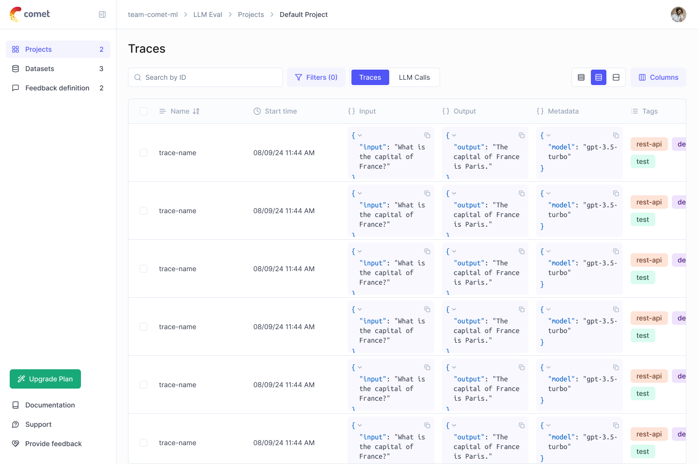

<h1 align="center" style="border-bottom: none">
    <div>
        <a href="https://www.comet.com/site/products/opik/?from=llm&utm_source=opik&utm_medium=github&utm_content=header_img&utm_campaign=opik"><picture>
            <source media="(prefers-color-scheme: dark)" srcset="/apps/opik-documentation/documentation/static/img/logo-dark-mode.svg">
            <source media="(prefers-color-scheme: light)" srcset="/apps/opik-documentation/documentation/static/img/opik-logo.svg">
            
        </picture></a>
        <br>
        Opik
    </div>
    Open source LLM evaluation framework<br>
</h1>

<p align="center">
From RAG chatbots to code assistants to complex agentic pipelines and beyond, build LLM systems that run better, faster, and cheaper with tracing, evaluations, and dashboards.
</p>

<div align="center">

[](https://pypi.org/project/opik/)
[](https://github.com/comet-ml/opik/blob/main/LICENSE)
[](https://github.com/comet-ml/opik/actions/workflows/build_apps.yml)
<a target="_blank" href="https://colab.research.google.com/github/comet-ml/opik/blob/master/apps/opik-documentation/documentation/docs/cookbook/opik_quickstart.ipynb">

  <!--  -->
</a>

</div>

<p align="center">
    <a href="https://www.comet.com/site/products/opik/?from=llm&utm_source=opik&utm_medium=github&utm_content=website_button&utm_campaign=opik"><b>Website</b></a> •
    <a href="https://chat.comet.com"><b>Slack community</b></a> •
    <a href="https://x.com/Cometml"><b>Twitter</b></a> •
    <a href="https://www.comet.com/docs/opik/?from=llm&utm_source=opik&utm_medium=github&utm_content=docs_button&utm_campaign=opik"><b>Documentation</b></a>
</p>



## 🚀 What is Opik?

Opik is an open-source platform for evaluating, testing and monitoring LLM applications. Built by [Comet](https://www.comet.com?from=llm&utm_source=opik&utm_medium=github&utm_content=what_is_opik_link&utm_campaign=opik).

<br>

You can use Opik for:
* **Development:**

  * **Tracing:** Track all LLM calls and traces during development and production ([Quickstart](https://www.comet.com/docs/opik/quickstart/?from=llm&utm_source=opik&utm_medium=github&utm_content=quickstart_link&utm_campaign=opik), [Integrations](https://www.comet.com/docs/opik/tracing/integrations/overview/?from=llm&utm_source=opik&utm_medium=github&utm_content=integrations_link&utm_campaign=opik)

  * **Annotations:** Annotate your LLM calls by logging feedback scores using the [Python SDK](https://www.comet.com/docs/opik/tracing/annotate_traces/#annotating-traces-and-spans-using-the-sdk?from=llm&utm_source=opik&utm_medium=github&utm_content=sdk_link&utm_campaign=opik) or the [UI](https://www.comet.com/docs/opik/tracing/annotate_traces/#annotating-traces-through-the-ui?from=llm&utm_source=opik&utm_medium=github&utm_content=ui_link&utm_campaign=opik).

  * **Playground:**: Try out different prompts and models in the [prompt playground](https://www.comet.com/docs/opik/evaluation/playground/?from=llm&utm_source=opik&utm_medium=github&utm_content=playground_link&utm_campaign=opik)

* **Evaluation**: Automate the evaluation process of your LLM application:

    * **Datasets and Experiments**: Store test cases and run experiments ([Datasets](https://www.comet.com/docs/opik/evaluation/manage_datasets/?from=llm&utm_source=opik&utm_medium=github&utm_content=datasets_link&utm_campaign=opik), [Evaluate your LLM Application](https://www.comet.com/docs/opik/evaluation/evaluate_your_llm/?from=llm&utm_source=opik&utm_medium=github&utm_content=eval_link&utm_campaign=opik))

    * **LLM as a judge metrics**: Use Opik's LLM as a judge metric for complex issues like [hallucination detection](https://www.comet.com/docs/opik/evaluation/metrics/hallucination/?from=llm&utm_source=opik&utm_medium=github&utm_content=hallucination_link&utm_campaign=opik), [moderation](https://www.comet.com/docs/opik/evaluation/metrics/moderation/?from=llm&utm_source=opik&utm_medium=github&utm_content=moderation_link&utm_campaign=opik) and RAG evaluation ([Answer Relevance](https://www.comet.com/docs/opik/evaluation/metrics/answer_relevance/?from=llm&utm_source=opik&utm_medium=github&utm_content=alex_link&utm_campaign=opik), [Context Precision](https://www.comet.com/docs/opik/evaluation/metrics/context_precision/?from=llm&utm_source=opik&utm_medium=github&utm_content=context_link&utm_campaign=opik)

    * **CI/CD integration**: Run evaluations as part of your CI/CD pipeline using our [PyTest integration](https://www.comet.com/docs/opik/testing/pytest_integration/?from=llm&utm_source=opik&utm_medium=github&utm_content=pytest_link&utm_campaign=opik)

* **Production Monitoring**:
    
    * **Log all your production traces**: Opik has been designed to support high volumes of traces, making it easy to monitor your production applications. Even small deployments can ingest more than 40 million traces per day!
    
    * **Monitoring dashboards**: Review your feedback scores, trace count and tokens over time in the [Opik Dashboard](https://www.comet.com/docs/opik/self-host/opik_dashboard/?from=llm&utm_source=opik&utm_medium=github&utm_content=dashboard_link&utm_campaign=opik).

    * **Online evaluation metrics**: Easily score all your production traces using LLM as a Judge metrics and identify any issues with your production LLM application thanks to [Opik's online evaluation metrics](https://www.comet.com/docs/opik/production/rules/?from=llm&utm_source=opik&utm_medium=github&utm_content=dashboard_link&utm_campaign=opik)

> [!TIP]  
> If you are looking for features that Opik doesn't have today, please raise a new [Feature request](https://github.com/comet-ml/opik/issues/new/choose) 🚀

<br>

## 🛠️ Installation
Opik is available as a fully open source local installation or using Comet.com as a hosted solution.
The easiest way to get started with Opik is by creating a free Comet account at [comet.com](https://www.comet.com/signup?from=llm&utm_source=opik&utm_medium=github&utm_content=install&utm_campaign=opik).

If you'd like to self-host Opik, you can do so by cloning the repository and starting the platform using Docker Compose:

```bash
# Clone the Opik repository
git clone https://github.com/comet-ml/opik.git

# Navigate to the opik/deployment/docker-compose directory
cd opik/deployment/docker-compose

# Start the Opik platform
docker compose up --detach

# You can now visit http://localhost:5173 on your browser!
```

For more information about the different deployment options, please see our deployment guides:

| Installation methods | Docs link |
| ------------------- | --------- |
| Local instance | [](https://www.comet.com/docs/opik/self-host/local_deployment?from=llm&utm_source=opik&utm_medium=github&utm_content=self_host_link&utm_campaign=opik)
| Kubernetes | [](https://www.comet.com/docs/opik/self-host/kubernetes/#kubernetes-installation?from=llm&utm_source=opik&utm_medium=github&utm_content=kubernetes_link&utm_campaign=opik)


## 🏁 Get Started

To get started, you will need to first install the Python SDK:

```bash
pip install opik
```

Once the SDK is installed, you can configure it by running the `opik configure` command:

```bash
opik configure
```

This will allow you to configure Opik locally by setting the correct local server address or if you're using the Cloud platform by setting the API Key

> [!TIP]  
> You can also call the `opik.configure(use_local=True)` method from your Python code to configure the SDK to run on the local installation.

You are now ready to start logging traces using the [Python SDK](https://www.comet.com/docs/opik/python-sdk-reference/?from=llm&utm_source=opik&utm_medium=github&utm_content=sdk_link2&utm_campaign=opik).

### 📝 Logging Traces

The easiest way to get started is to use one of our integrations. Opik supports:

| Integration | Description                                                                  | Documentation                                                                                                                                                      | Try in Colab                                                                                                                                                                                                                      |
|-------------|------------------------------------------------------------------------------|--------------------------------------------------------------------------------------------------------------------------------------------------------------------|-----------------------------------------------------------------------------------------------------------------------------------------------------------------------------------------------------------------------------------|
| OpenAI      | Log traces for all OpenAI LLM calls                                          | [Documentation](https://www.comet.com/docs/opik/tracing/integrations/openai/?utm_source=opik&utm_medium=github&utm_content=openai_link&utm_campaign=opik)          | [](https://colab.research.google.com/github/comet-ml/opik/blob/master/apps/opik-documentation/documentation/docs/cookbook/openai.ipynb)      |
| LiteLLM     | Call any LLM model using the OpenAI format                                   | [Documentation](/tracing/integrations/litellm.md)                                                                                                                  | [](https://colab.research.google.com/github/comet-ml/opik/blob/master/apps/opik-documentation/documentation/docs/cookbook/litellm.ipynb)     |
| LangChain   | Log traces for all LangChain LLM calls                                       | [Documentation](https://www.comet.com/docs/opik/tracing/integrations/langchain/?utm_source=opik&utm_medium=github&utm_content=langchain_link&utm_campaign=opik)    | [](https://colab.research.google.com/github/comet-ml/opik/blob/master/apps/opik-documentation/documentation/docs/cookbook/langchain.ipynb)   |
| Haystack    | Log traces for all Haystack calls                                            | [Documentation](https://www.comet.com/docs/opik/tracing/integrations/haystack/?utm_source=opik&utm_medium=github&utm_content=haystack_link&utm_campaign=opik)      | [](https://colab.research.google.com/github/comet-ml/opik/blob/master/apps/opik-documentation/documentation/docs/cookbook/haystack.ipynb)    |
| Anthropic   | Log traces for all Anthropic LLM calls                                       | [Documentation](https://www.comet.com/docs/opik/tracing/integrations/anthropic?utm_source=opik&utm_medium=github&utm_content=anthropic_link&utm_campaign=opik)     | [](https://colab.research.google.com/github/comet-ml/opik/blob/master/apps/opik-documentation/documentation/docs/cookbook/anthropic.ipynb)   |
| Bedrock     | Log traces for all Bedrock LLM calls                                         | [Documentation](https://www.comet.com/docs/opik/tracing/integrations/bedrock?utm_source=opik&utm_medium=github&utm_content=bedrock_link&utm_campaign=opik)         | [](https://colab.research.google.com/github/comet-ml/opik/blob/master/apps/opik-documentation/documentation/docs/cookbook/bedrock.ipynb)     |
| CrewAI      | Log traces for all CrewAI calls                                              | [Documentation](https://www.comet.com/docs/opik/tracing/integrations/crewai?utm_source=opik&utm_medium=github&utm_content=crewai_link&utm_campaign=opik)           | [](https://colab.research.google.com/github/comet-ml/opik/blob/master/apps/opik-documentation/documentation/docs/cookbook/crewai.ipynb)      |
| DeepSeek    | Log traces for all DeepSeek LLM calls                                        | [Documentation](https://www.comet.com/docs/opik/tracing/integrations/deepseek?utm_source=opik&utm_medium=github&utm_content=deepseek_link&utm_campaign=opik)       | |
| DSPy        | Log traces for all DSPy runs                                                 | [Documentation](https://www.comet.com/docs/opik/tracing/integrations/dspy?utm_source=opik&utm_medium=github&utm_content=dspy_link&utm_campaign=opik)               | [](https://colab.research.google.com/github/comet-ml/opik/blob/master/apps/opik-documentation/documentation/docs/cookbook/dspy.ipynb)        |
| Gemini      | Log traces for all Gemini LLM calls                                          | [Documentation](https://www.comet.com/docs/opik/tracing/integrations/gemini?utm_source=opik&utm_medium=github&utm_content=gemini_link&utm_campaign=opik)           | [](https://colab.research.google.com/github/comet-ml/opik/blob/master/apps/opik-documentation/documentation/docs/cookbook/gemini.ipynb)      |
| Groq        | Log traces for all Groq LLM calls                                            | [Documentation](https://www.comet.com/docs/opik/tracing/integrations/groq?utm_source=opik&utm_medium=github&utm_content=groq_link&utm_campaign=opik)               | [](https://colab.research.google.com/github/comet-ml/opik/blob/master/apps/opik-documentation/documentation/docs/cookbook/groq.ipynb)        |
| Guardrails  | Log traces for all Guardrails validations                                    | [Documentation](https://www.comet.com/docs/opik/tracing/integrations/guardrails/?utm_source=opik&utm_medium=github&utm_content=guardrails_link&utm_campaign=opik)    | [](https://colab.research.google.com/github/comet-ml/opik/blob/master/apps/opik-documentation/documentation/docs/cookbook/guardrails-ai.ipynb)   |
| LangGraph   | Log traces for all LangGraph executions                                      | [Documentation](https://www.comet.com/docs/opik/tracing/integrations/langgraph/?utm_source=opik&utm_medium=github&utm_content=langchain_link&utm_campaign=opik)    | [](https://colab.research.google.com/github/comet-ml/opik/blob/master/apps/opik-documentation/documentation/docs/cookbook/langgraph.ipynb)   |
| LlamaIndex  | Log traces for all LlamaIndex LLM calls                                      | [Documentation](https://www.comet.com/docs/opik/tracing/integrations/llama_index?utm_source=opik&utm_medium=github&utm_content=llama_index_link&utm_campaign=opik) | [](https://colab.research.google.com/github/comet-ml/opik/blob/master/apps/opik-documentation/documentation/docs/cookbook/llama-index.ipynb) |
| Ollama      | Log traces for all Ollama LLM calls                                          | [Documentation](https://www.comet.com/docs/opik/tracing/integrations/ollama?utm_source=opik&utm_medium=github&utm_content=ollama_link&utm_campaign=opik)           | [](https://colab.research.google.com/github/comet-ml/opik/blob/master/apps/opik-documentation/documentation/docs/cookbook/ollama.ipynb)      |
| Predibase   | Fine-tune and serve open-source Large Language Models                        | [Documentation](https://www.comet.com/docs/opik/tracing/integrations/predibase?utm_source=opik&utm_medium=github&utm_content=predibase_link&utm_campaign=opik)     | [](https://colab.research.google.com/github/comet-ml/opik/blob/master/apps/opik-documentation/documentation/docs/cookbook/predibase.ipynb)   |
| Ragas       | Evaluation framework for your Retrieval Augmented Generation (RAG) pipelines | [Documentation](https://www.comet.com/docs/opik/tracing/integrations/ragas?utm_source=opik&utm_medium=github&utm_content=ragas_link&utm_campaign=opik)             | [](https://colab.research.google.com/github/comet-ml/opik/blob/master/apps/opik-documentation/documentation/docs/cookbook/ragas.ipynb)       |
| watsonx     | Log traces for all watsonx LLM calls                                         | [Documentation](https://www.comet.com/docs/opik/tracing/integrations/watsonx?utm_source=opik&utm_medium=github&utm_content=watsonx_link&utm_campaign=opik)         | [](https://colab.research.google.com/github/comet-ml/opik/blob/master/apps/opik-documentation/documentation/docs/cookbook/watsonx.ipynb)     |

> [!TIP]  
> If the framework you are using is not listed above, feel free to [open an issue](https://github.com/comet-ml/opik/issues) or submit a PR with the integration.

If you are not using any of the frameworks above, you can also use the `track` function decorator to [log traces](https://www.comet.com/docs/opik/tracing/log_traces/?from=llm&utm_source=opik&utm_medium=github&utm_content=traces_link&utm_campaign=opik):

```python
import opik

opik.configure(use_local=True) # Run locally

@opik.track
def my_llm_function(user_question: str) -> str:
    # Your LLM code here

    return "Hello"
```

> [!TIP]  
> The track decorator can be used in conjunction with any of our integrations and can also be used to track nested function calls.

### 🧑‍⚖️ LLM as a Judge metrics

The Python Opik SDK includes a number of LLM as a judge metrics to help you evaluate your LLM application. Learn more about it in the [metrics documentation](https://www.comet.com/docs/opik/evaluation/metrics/overview/?from=llm&utm_source=opik&utm_medium=github&utm_content=metrics_2_link&utm_campaign=opik).

To use them, simply import the relevant metric and use the `score` function:

```python
from opik.evaluation.metrics import Hallucination

metric = Hallucination()
score = metric.score(
    input="What is the capital of France?",
    output="Paris",
    context=["France is a country in Europe."]
)
print(score)
```

Opik also includes a number of pre-built heuristic metrics as well as the ability to create your own. Learn more about it in the [metrics documentation](https://www.comet.com/docs/opik/evaluation/metrics/overview?from=llm&utm_source=opik&utm_medium=github&utm_content=metrics_3_link&utm_campaign=opik).

### 🔍 Evaluating your LLM Application

Opik allows you to evaluate your LLM application during development through [Datasets](https://www.comet.com/docs/opik/evaluation/manage_datasets/?from=llm&utm_source=opik&utm_medium=github&utm_content=datasets_2_link&utm_campaign=opik) and [Experiments](https://www.comet.com/docs/opik/evaluation/evaluate_your_llm/?from=llm&utm_source=opik&utm_medium=github&utm_content=experiments_link&utm_campaign=opik).

You can also run evaluations as part of your CI/CD pipeline using our [PyTest integration](https://www.comet.com/docs/opik/testing/pytest_integration/?from=llm&utm_source=opik&utm_medium=github&utm_content=pytest_2_link&utm_campaign=opik).

## ⭐ Star Us on GitHub

If you find Opik useful, please consider giving us a star! Your support helps us grow our community and continue improving the product.


## 🤝 Contributing

There are many ways to contribute to Opik:

* Submit [bug reports](https://github.com/comet-ml/opik/issues) and [feature requests](https://github.com/comet-ml/opik/issues)
* Review the documentation and submit [Pull Requests](https://github.com/comet-ml/opik/pulls) to improve it
* Speaking or writing about Opik and [letting us know](https://chat.comet.com)
* Upvoting [popular feature requests](https://github.com/comet-ml/opik/issues?q=is%3Aissue+is%3Aopen+label%3A%22enhancement%22) to show your support

To learn more about how to contribute to Opik, please see our [contributing guidelines](CONTRIBUTING.md).
