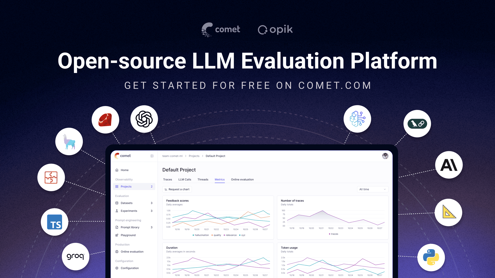

<h4 align="center">
  <p>
    <a href="README.md">English</a> | 
    <a href="readme_CN.md">简体中文</a> | 
    <a href="readme_JP.md">日本語</a> | 
    <a href="readme_PT_BR.md">Português (Brasil)</a> | 
    <a href="readme_KO.md">한국어</a>
  </p>
</h4>

<p align="center">
 <a href="https://www.comet.com/site/products/opik/?from=llm&utm_source=opik&utm_medium=github&utm_content=header_img&utm_campaign=opik">
 <picture>
      <source media="(prefers-color-scheme: dark)" srcset="https://raw.githubusercontent.com/comet-ml/opik/refs/heads/main/apps/opik-documentation/documentation/static/img/logo-dark-mode.svg">
      <source media="(prefers-color-scheme: light)" srcset="https://raw.githubusercontent.com/comet-ml/opik/refs/heads/main/apps/opik-documentation/documentation/static/img/opik-logo.svg">
      </a>
  </picture>
  <br/>
</p>


<div align="center">

[](https://pypi.org/project/opik/)
[](https://github.com/comet-ml/opik/blob/main/LICENSE)
[](https://github.com/comet-ml/opik/actions/workflows/build_apps.yml)
[](https://algora.io/comet-ml/bounties?status=open)

<!-- [](https://colab.research.google.com/github/comet-ml/opik/blob/main/apps/opik-documentation/documentation/docs/cookbook/opik_quickstart.ipynb) -->

</div>

<h2 align="center">
    <p>The Open-Source Platform for GenAI Observability, Evaluation, and Optimization</p>
</h2>
<p align="center">
Opik provides tracing, evals, and automatic improvements to help you build and maintain reliable GenAI applications. Use it to log each step of your application, run comprehensive evaluations, and auto-optimize your prompts and tools.
</p>
<p align="center">
    <a href="https://www.comet.com/site/products/opik/?from=llm&utm_source=opik&utm_medium=github&utm_content=website_button&utm_campaign=opik"><b>Website</b></a> •
    <a href="https://chat.comet.com"><b>Slack Community</b></a> •
    <a href="https://x.com/Cometml"><b>Twitter</b></a> •
    <a href="https://www.comet.com/docs/opik/changelog"><b>Changelog</b></a> •
    <a href="https://www.comet.com/docs/opik/?from=llm&utm_source=opik&utm_medium=github&utm_content=docs_button&utm_campaign=opik"><b>Documentation</b></a> •
    <a href="https://www.comet.com/docs/opik/agent_optimization/overview"><b>Agent Optimizer</b></a>
</p>

[](https://www.comet.com/signup?from=llm&utm_source=opik&utm_medium=github&utm_content=readme_banner&utm_campaign=opik)

## What is Opik?

Opik (built by [Comet](https://www.comet.com?from=llm&utm_source=opik&utm_medium=github&utm_content=what_is_opik_link&utm_campaign=opik)) is an open-source platform designed to streamline the entire lifecycle of generative AI applications. It empowers developers to evaluate, test, monitor, and optimize their LLM applications and agents.

### 🧰 Capabilties

- **Observability:**  Log every step of complex agents, tool calls, and multi-turn conversations to quickly root-cause issues ([Quickstart](https://www.comet.com/docs/opik/quickstart/?from=llm&utm_source=opik&utm_medium=github&utm_content=quickstart_link&utm_campaign=opik)). Track [cost](https://www.comet.com/docs/opik/tracing/cost_tracking/?from=llm&utm_source=opik&utm_medium=github&utm_content=cost_tracking_link&utm_campaign=opik), latency, [user feedback](https://www.comet.com/docs/opik/tracing/annotate_traces/?from=llm&utm_source=opik&utm_medium=github&utm_content=user_feedback_tracking_link&utm_campaign=opik), and more to quickly identify failures and bottlenecks.

- **Evaluation:** Test your GenAI app comprehensively to validate quality and catch regressions. Create [datasets](https://www.comet.com/docs/opik/evaluation/manage_datasets/?from=llm&utm_source=opik&utm_medium=github&utm_content=datasets_link&utm_campaign=opik) made up of curated test cases and run [experiments](https://www.comet.com/docs/opik/evaluation/overview) to asses your app’s performance.  Automatically score your app using LLM-as-a-judge, heuristic, and custom [metrics](https://www.comet.com/docs/opik/evaluation/metrics/overview) or create [annotation queues](https://www.comet.com/docs/opik/evaluation/annotation_queues/?from=llm&utm_source=opik&utm_medium=github&utm_content=annotation_queues_link&utm_campaign=opik) for human review.

- **Agent Optimization:** Automatically improve your prompts, tools, and LLM parameters  using state-of-the-art optimization algorithms. The [Opik Agent Optimizer](https://www.comet.com/docs/opik/agent_optimization/overview/?from=llm&utm_source=opik&utm_medium=github&utm_content=agent_optimizer_link&utm_campaign=opik) uses a dataset of test cases and your chosen metrics to iterate on your application for you. It tests your app, makes changes based on the results, and repeats, delivering the best performing version once it completes ([Quickstart](https://www.comet.com/docs/opik/agent_optimization/quickstart/?from=llm&utm_source=opik&utm_medium=github&utm_content=agent_optimizer_quicktart_link&utm_campaign=opik)).

- **Prompt Engineering:** Prototype and test prompts in the [playground](https://www.comet.com/docs/opik/prompt_engineering/playground) with help from Opik's automatic prompt generator and improver. Save and [manage prompts](https://www.comet.com/docs/opik/prompt_engineering/prompt_library/?from=llm&utm_source=opik&utm_medium=github&utm_content=prompt_library_link&utm_campaign=opik) with composable templates and versioning as you iterate and compare results.

- **Production Monitoring:** View project-level metrics like cost, latency, user feedback, and more in [custom dashboards](https://www.comet.com/docs/opik/production/dashboards/?from=llm&utm_source=opik&utm_medium=github&utm_content=dashboards_link&utm_campaign=opik) and set up [online evaluation rules](https://www.comet.com/docs/opik/production/rules/?from=llm&utm_source=opik&utm_medium=github&utm_content=online_evaluation_link&utm_campaign=opik) to automatically score production traces. Configure [alerts](https://www.comet.com/docs/opik/production/alerts/?from=llm&utm_source=opik&utm_medium=github&utm_content=alerts_link&utm_campaign=opik) and [guardrails](https://www.comet.com/docs/opik/production/guardrails/?from=llm&utm_source=opik&utm_medium=github&utm_content=guardrails_link&utm_campaign=opik) to catch and prevent issues early.
  
### 🏆 How Opik Stands Out

- **Advanced optimization capabilities**: Opik provides cutting-edge prompt and tool optimization to systematically improve your application
- **Strong multimodal support**: Platform-wide support for multimodal use cases, with full UI support for text, images, and video
- **Flexible and framework-agnostic**: Opik works with custom implementations and integrates with OpenAI, Anthropic, Bedrock, LangChain, LangGraph, Vercel AI SDK, and more ([see all integrations](https://www.comet.com/docs/opik/integrations/overview/?from=llm&utm_source=opik&utm_medium=github&utm_content=integrations_link&utm_campaign=opik))
- **Fully open source**: Complete end-to-end functionality in the open-source version
<br>

> [!TIP]
> If you are looking for features that Opik doesn't have today, please raise a new [Feature request](https://github.com/comet-ml/opik/issues/new/choose) 🚀

<br>

## 🛠️ Opik Server Installation

Get your Opik server running in minutes. Choose the option that best suits your needs:

### Option 1: Comet.com Cloud (Easiest & Recommended)

Access Opik instantly without any setup. Ideal for quick starts and hassle-free maintenance.

👉 [Create your free Comet account](https://www.comet.com/signup?from=llm&utm_source=opik&utm_medium=github&utm_content=install_create_link&utm_campaign=opik)

### Option 2: Self-Host Opik for Full Control

Deploy Opik in your own environment. Choose between Docker for local setups or Kubernetes for scalability.

#### Self-Hosting with Docker Compose (for Local Development & Testing)

This is the simplest way to get a local Opik instance running. Note the new `./opik.sh` installation script:

On Linux or Mac Environment:

```bash
# Clone the Opik repository
git clone https://github.com/comet-ml/opik.git

# Navigate to the repository
cd opik

# Start the Opik platform
./opik.sh
```

On Windows Environment:

```powershell
# Clone the Opik repository
git clone https://github.com/comet-ml/opik.git

# Navigate to the repository
cd opik

# Start the Opik platform
powershell -ExecutionPolicy ByPass -c ".\\opik.ps1"
```

**Service Profiles for Development**

The Opik installation scripts now support service profiles for different development scenarios:

```bash
# Start full Opik suite (default behavior)
./opik.sh

# Start only infrastructure services (databases, caches etc.)
./opik.sh --infra

# Start infrastructure + backend services
./opik.sh --backend

# Enable guardrails with any profile
./opik.sh --guardrails # Guardrails with full Opik suite
./opik.sh --backend --guardrails # Guardrails with infrastructure + backend
```

Use the `--help` or `--info` options to troubleshoot issues. Dockerfiles now ensure containers run as non-root users for enhanced security. Once all is up and running, you can now visit [localhost:5173](http://localhost:5173) on your browser! For detailed instructions, see the [Local Deployment Guide](https://www.comet.com/docs/opik/self-host/local_deployment?from=llm&utm_source=opik&utm_medium=github&utm_content=self_host_link&utm_campaign=opik).

#### Self-Hosting with Kubernetes & Helm (for Scalable Deployments)

For production or larger-scale self-hosted deployments, Opik can be installed on a Kubernetes cluster using our Helm chart. Click the badge for the full [Kubernetes Installation Guide using Helm](https://www.comet.com/docs/opik/self-host/kubernetes/#kubernetes-installation?from=llm&utm_source=opik&utm_medium=github&utm_content=kubernetes_link&utm_campaign=opik).

[](https://www.comet.com/docs/opik/self-host/kubernetes/#kubernetes-installation?from=llm&utm_source=opik&utm_medium=github&utm_content=kubernetes_link&utm_campaign=opik)

> [!IMPORTANT]
> **Version 1.7.0 Changes**: Please check the [changelog](https://github.com/comet-ml/opik/blob/main/CHANGELOG.md) for important updates and breaking changes.

## 💻 Opik Client SDK

Opik provides a suite of client libraries and a REST API to interact with the Opik server. This includes SDKs for Python, TypeScript, and Ruby (via OpenTelemetry), allowing for seamless integration into your workflows. For detailed API and SDK references, see the [Opik Client Reference Documentation](apps/opik-documentation/documentation/fern/docs/reference/overview.mdx).

### Python SDK Quick Start

To get started with the Python SDK:

Install the package:

```bash
# install using pip
pip install opik

# or install with uv
uv pip install opik
```

Configure the python SDK by running the `opik configure` command, which will prompt you for your Opik server address (for self-hosted instances) or your API key and workspace (for Comet.com):

```bash
opik configure
```

> [!TIP]
> You can also call `opik.configure(use_local=True)` from your Python code to configure the SDK to run on a local self-hosted installation, or provide API key and workspace details directly for Comet.com. Refer to the [Python SDK documentation](apps/opik-documentation/documentation/fern/docs/reference/python-sdk/) for more configuration options.

You are now ready to start logging traces using the [Python SDK](https://www.comet.com/docs/opik/python-sdk-reference/?from=llm&utm_source=opik&utm_medium=github&utm_content=sdk_link2&utm_campaign=opik).

### Integrations


| Integration           | Description                                             | Documentation                                                                                                                                                                  |
| --------------------- | ------------------------------------------------------- | ------------------------------------------------------------------------------------------------------------------------------------------------------------------------------ |
| ADK                   | Log traces for Google Agent Development Kit (ADK)       | [Documentation](https://www.comet.com/docs/opik/integrations/adk?utm_source=opik&utm_medium=github&utm_content=google_adk_link&utm_campaign=opik)                              |
| AG2                   | Log traces for AG2 LLM calls                            | [Documentation](https://www.comet.com/docs/opik/integrations/ag2?utm_source=opik&utm_medium=github&utm_content=ag2_link&utm_campaign=opik)                                     |
| AIsuite               | Log traces for aisuite LLM calls                        | [Documentation](https://www.comet.com/docs/opik/integrations/aisuite?utm_source=opik&utm_medium=github&utm_content=aisuite_link&utm_campaign=opik)                             |
| Agno                  | Log traces for Agno agent orchestration framework calls | [Documentation](https://www.comet.com/docs/opik/integrations/agno?utm_source=opik&utm_medium=github&utm_content=agno_link&utm_campaign=opik)                                   |
| Anthropic             | Log traces for Anthropic LLM calls                      | [Documentation](https://www.comet.com/docs/opik/integrations/anthropic?utm_source=opik&utm_medium=github&utm_content=anthropic_link&utm_campaign=opik)                         |
| Autogen               | Log traces for Autogen agentic workflows                | [Documentation](https://www.comet.com/docs/opik/integrations/autogen?utm_source=opik&utm_medium=github&utm_content=autogen_link&utm_campaign=opik)                             |
| Bedrock               | Log traces for Amazon Bedrock LLM calls                 | [Documentation](https://www.comet.com/docs/opik/integrations/bedrock?utm_source=opik&utm_medium=github&utm_content=bedrock_link&utm_campaign=opik)                             |
| BeeAI (Python)        | Log traces for BeeAI Python agent framework calls       | [Documentation](https://www.comet.com/docs/opik/integrations/beeai?utm_source=opik&utm_medium=github&utm_content=beeai_link&utm_campaign=opik)                                 |
| BeeAI (TypeScript)    | Log traces for BeeAI TypeScript agent framework calls   | [Documentation](https://www.comet.com/docs/opik/integrations/beeai-typescript?utm_source=opik&utm_medium=github&utm_content=beeai_typescript_link&utm_campaign=opik)           |
| BytePlus              | Log traces for BytePlus LLM calls                       | [Documentation](https://www.comet.com/docs/opik/integrations/byteplus?utm_source=opik&utm_medium=github&utm_content=byteplus_link&utm_campaign=opik)                           |
| Cloudflare Workers AI | Log traces for Cloudflare Workers AI calls              | [Documentation](https://www.comet.com/docs/opik/integrations/cloudflare-workers-ai?utm_source=opik&utm_medium=github&utm_content=cloudflare_workers_ai_link&utm_campaign=opik) |
| Cohere                | Log traces for Cohere LLM calls                         | [Documentation](https://www.comet.com/docs/opik/integrations/cohere?utm_source=opik&utm_medium=github&utm_content=cohere_link&utm_campaign=opik)                               |
| CrewAI                | Log traces for CrewAI calls                             | [Documentation](https://www.comet.com/docs/opik/integrations/crewai?utm_source=opik&utm_medium=github&utm_content=crewai_link&utm_campaign=opik)                               |
| Cursor                | Log traces for Cursor conversations                     | [Documentation](https://www.comet.com/docs/opik/integrations/cursor?utm_source=opik&utm_medium=github&utm_content=cursor_link&utm_campaign=opik)                               |
| DeepSeek              | Log traces for DeepSeek LLM calls                       | [Documentation](https://www.comet.com/docs/opik/integrations/deepseek?utm_source=opik&utm_medium=github&utm_content=deepseek_link&utm_campaign=opik)                           |
| Dify                  | Log traces for Dify agent runs                          | [Documentation](https://www.comet.com/docs/opik/integrations/dify?utm_source=opik&utm_medium=github&utm_content=dify_link&utm_campaign=opik)                                   |
| DSPY                  | Log traces for DSPy runs                                | [Documentation](https://www.comet.com/docs/opik/integrations/dspy?utm_source=opik&utm_medium=github&utm_content=dspy_link&utm_campaign=opik)                                   |
| Fireworks AI          | Log traces for Fireworks AI LLM calls                   | [Documentation](https://www.comet.com/docs/opik/integrations/fireworks-ai?utm_source=opik&utm_medium=github&utm_content=fireworks_ai_link&utm_campaign=opik)                   |
| Flowise AI            | Log traces for Flowise AI visual LLM builder            | [Documentation](https://www.comet.com/docs/opik/integrations/flowise?utm_source=opik&utm_medium=github&utm_content=flowise_link&utm_campaign=opik)                             |
| Gemini (Python)       | Log traces for Google Gemini LLM calls                  | [Documentation](https://www.comet.com/docs/opik/integrations/gemini?utm_source=opik&utm_medium=github&utm_content=gemini_link&utm_campaign=opik)                               |
| Gemini (TypeScript)   | Log traces for Google Gemini TypeScript SDK calls       | [Documentation](https://www.comet.com/docs/opik/integrations/gemini-typescript?utm_source=opik&utm_medium=github&utm_content=gemini_typescript_link&utm_campaign=opik)         |
| Groq                  | Log traces for Groq LLM calls                           | [Documentation](https://www.comet.com/docs/opik/integrations/groq?utm_source=opik&utm_medium=github&utm_content=groq_link&utm_campaign=opik)                                   |
| Guardrails            | Log traces for Guardrails AI validations                | [Documentation](https://www.comet.com/docs/opik/integrations/guardrails-ai?utm_source=opik&utm_medium=github&utm_content=guardrails_link&utm_campaign=opik)                    |
| Haystack              | Log traces for Haystack calls                           | [Documentation](https://www.comet.com/docs/opik/integrations/haystack?utm_source=opik&utm_medium=github&utm_content=haystack_link&utm_campaign=opik)                           |
| Harbor                | Log traces for Harbor benchmark evaluation trials       | [Documentation](https://www.comet.com/docs/opik/integrations/harbor?utm_source=opik&utm_medium=github&utm_content=harbor_link&utm_campaign=opik)                               |
| Instructor            | Log traces for LLM calls made with Instructor           | [Documentation](https://www.comet.com/docs/opik/integrations/instructor?utm_source=opik&utm_medium=github&utm_content=instructor_link&utm_campaign=opik)                       |
| LangChain (Python)    | Log traces for LangChain LLM calls                      | [Documentation](https://www.comet.com/docs/opik/integrations/langchain?utm_source=opik&utm_medium=github&utm_content=langchain_link&utm_campaign=opik)                         |
| LangChain (JS/TS)     | Log traces for LangChain JavaScript/TypeScript calls    | [Documentation](https://www.comet.com/docs/opik/integrations/langchainjs?utm_source=opik&utm_medium=github&utm_content=langchainjs_link&utm_campaign=opik)                     |
| LangGraph             | Log traces for LangGraph executions                     | [Documentation](https://www.comet.com/docs/opik/integrations/langgraph?utm_source=opik&utm_medium=github&utm_content=langgraph_link&utm_campaign=opik)                         |
| Langflow              | Log traces for Langflow visual AI builder               | [Documentation](https://www.comet.com/docs/opik/integrations/langflow?utm_source=opik&utm_medium=github&utm_content=langflow_link&utm_campaign=opik)                           |
| LiteLLM               | Log traces for LiteLLM model calls                      | [Documentation](https://www.comet.com/docs/opik/integrations/litellm?utm_source=opik&utm_medium=github&utm_content=litellm_link&utm_campaign=opik)                             |
| LiveKit Agents        | Log traces for LiveKit Agents AI agent framework calls  | [Documentation](https://www.comet.com/docs/opik/integrations/livekit?utm_source=opik&utm_medium=github&utm_content=livekit_link&utm_campaign=opik)                             |
| LlamaIndex            | Log traces for LlamaIndex LLM calls                     | [Documentation](https://www.comet.com/docs/opik/integrations/llama_index?utm_source=opik&utm_medium=github&utm_content=llama_index_link&utm_campaign=opik)                     |
| Mastra                | Log traces for Mastra AI workflow framework calls       | [Documentation](https://www.comet.com/docs/opik/integrations/mastra?utm_source=opik&utm_medium=github&utm_content=mastra_link&utm_campaign=opik)                               |
| Microsoft Agent Framework (Python) | Log traces for Microsoft Agent Framework calls | [Documentation](https://www.comet.com/docs/opik/integrations/microsoft-agent-framework?utm_source=opik&utm_medium=github&utm_content=agent_framework_link&utm_campaign=opik)              |
| Microsoft Agent Framework (.NET) | Log traces for Microsoft Agent Framework .NET calls | [Documentation](https://www.comet.com/docs/opik/integrations/microsoft-agent-framework-dotnet?utm_source=opik&utm_medium=github&utm_content=agent_framework_dotnet_link&utm_campaign=opik) |
| Mistral AI            | Log traces for Mistral AI LLM calls                     | [Documentation](https://www.comet.com/docs/opik/integrations/mistral?utm_source=opik&utm_medium=github&utm_content=mistral_link&utm_campaign=opik)                             |
| n8n                   | Log traces for n8n workflow executions                  | [Documentation](https://www.comet.com/docs/opik/integrations/n8n?utm_source=opik&utm_medium=github&utm_content=n8n_link&utm_campaign=opik)                                     |
| Novita AI             | Log traces for Novita AI LLM calls                      | [Documentation](https://www.comet.com/docs/opik/integrations/novita-ai?utm_source=opik&utm_medium=github&utm_content=novita_ai_link&utm_campaign=opik)                         |
| Ollama                | Log traces for Ollama LLM calls                         | [Documentation](https://www.comet.com/docs/opik/integrations/ollama?utm_source=opik&utm_medium=github&utm_content=ollama_link&utm_campaign=opik)                               |
| OpenAI (Python)       | Log traces for OpenAI LLM calls                         | [Documentation](https://www.comet.com/docs/opik/integrations/openai?utm_source=opik&utm_medium=github&utm_content=openai_link&utm_campaign=opik)                               |
| OpenAI (JS/TS)        | Log traces for OpenAI JavaScript/TypeScript calls       | [Documentation](https://www.comet.com/docs/opik/integrations/openai-typescript?utm_source=opik&utm_medium=github&utm_content=openai_typescript_link&utm_campaign=opik)         |
| OpenAI Agents         | Log traces for OpenAI Agents SDK calls                  | [Documentation](https://www.comet.com/docs/opik/integrations/openai_agents?utm_source=opik&utm_medium=github&utm_content=openai_agents_link&utm_campaign=opik)                 |
| OpenRouter            | Log traces for OpenRouter LLM calls                     | [Documentation](https://www.comet.com/docs/opik/integrations/openrouter?utm_source=opik&utm_medium=github&utm_content=openrouter_link&utm_campaign=opik)                       |
| OpenTelemetry         | Log traces for OpenTelemetry supported calls            | [Documentation](https://www.comet.com/docs/opik/tracing/opentelemetry/overview?utm_source=opik&utm_medium=github&utm_content=opentelemetry_link&utm_campaign=opik)             |
| OpenWebUI             | Log traces for OpenWebUI conversations                  | [Documentation](https://www.comet.com/docs/opik/integrations/openwebui?utm_source=opik&utm_medium=github&utm_content=openwebui_link&utm_campaign=opik)                         |
| Pipecat               | Log traces for Pipecat real-time voice agent calls      | [Documentation](https://www.comet.com/docs/opik/integrations/pipecat?utm_source=opik&utm_medium=github&utm_content=pipecat_link&utm_campaign=opik)                             |
| Predibase             | Log traces for Predibase LLM calls                      | [Documentation](https://www.comet.com/docs/opik/integrations/predibase?utm_source=opik&utm_medium=github&utm_content=predibase_link&utm_campaign=opik)                         |
| Pydantic AI           | Log traces for PydanticAI agent calls                   | [Documentation](https://www.comet.com/docs/opik/integrations/pydantic-ai?utm_source=opik&utm_medium=github&utm_content=pydantic_ai_link&utm_campaign=opik)                     |
| Ragas                 | Log traces for Ragas evaluations                        | [Documentation](https://www.comet.com/docs/opik/integrations/ragas?utm_source=opik&utm_medium=github&utm_content=ragas_link&utm_campaign=opik)                                 |
| Semantic Kernel       | Log traces for Microsoft Semantic Kernel calls          | [Documentation](https://www.comet.com/docs/opik/integrations/semantic-kernel?utm_source=opik&utm_medium=github&utm_content=semantic_kernel_link&utm_campaign=opik)             |
| Smolagents            | Log traces for Smolagents agents                        | [Documentation](https://www.comet.com/docs/opik/integrations/smolagents?utm_source=opik&utm_medium=github&utm_content=smolagents_link&utm_campaign=opik)                       |
| Spring AI             | Log traces for Spring AI framework calls                | [Documentation](https://www.comet.com/docs/opik/integrations/spring-ai?utm_source=opik&utm_medium=github&utm_content=spring_ai_link&utm_campaign=opik)                         |
| Strands Agents        | Log traces for Strands agents calls                     | [Documentation](https://www.comet.com/docs/opik/integrations/strands-agents?utm_source=opik&utm_medium=github&utm_content=strands_agents_link&utm_campaign=opik)               |
| Together AI           | Log traces for Together AI LLM calls                    | [Documentation](https://www.comet.com/docs/opik/integrations/together-ai?utm_source=opik&utm_medium=github&utm_content=together_ai_link&utm_campaign=opik)                     |
| Vercel AI SDK         | Log traces for Vercel AI SDK calls                      | [Documentation](https://www.comet.com/docs/opik/integrations/vercel-ai-sdk?utm_source=opik&utm_medium=github&utm_content=vercel_ai_sdk_link&utm_campaign=opik)                 |
| VoltAgent             | Log traces for VoltAgent agent framework calls          | [Documentation](https://www.comet.com/docs/opik/integrations/voltagent?utm_source=opik&utm_medium=github&utm_content=voltagent_link&utm_campaign=opik)                         |
| WatsonX               | Log traces for IBM watsonx LLM calls                    | [Documentation](https://www.comet.com/docs/opik/integrations/watsonx?utm_source=opik&utm_medium=github&utm_content=watsonx_link&utm_campaign=opik)                             |
| xAI Grok              | Log traces for xAI Grok LLM calls                       | [Documentation](https://www.comet.com/docs/opik/integrations/xai-grok?utm_source=opik&utm_medium=github&utm_content=xai_grok_link&utm_campaign=opik)                           |

> [!TIP]
> If the framework you are using is not listed above, feel free to [open an issue](https://github.com/comet-ml/opik/issues) or submit a PR with the integration.


## ⭐ Star Us on GitHub

If you find Opik useful, please consider giving us a star! Your support helps us grow our community and continue improving the product.

[](https://github.com/comet-ml/opik)

## 🤝 Contributing

There are many ways to contribute to Opik:

- Submit [bug reports](https://github.com/comet-ml/opik/issues) and [feature requests](https://github.com/comet-ml/opik/issues)
- Review the documentation and submit [Pull Requests](https://github.com/comet-ml/opik/pulls) to improve it
- Speaking or writing about Opik and [letting us know](https://chat.comet.com)
- Upvoting [popular feature requests](https://github.com/comet-ml/opik/issues?q=is%3Aissue+is%3Aopen+label%3A%22enhancement%22) to show your support

To learn more about how to contribute to Opik, please see our [contributing guidelines](CONTRIBUTING.md).
