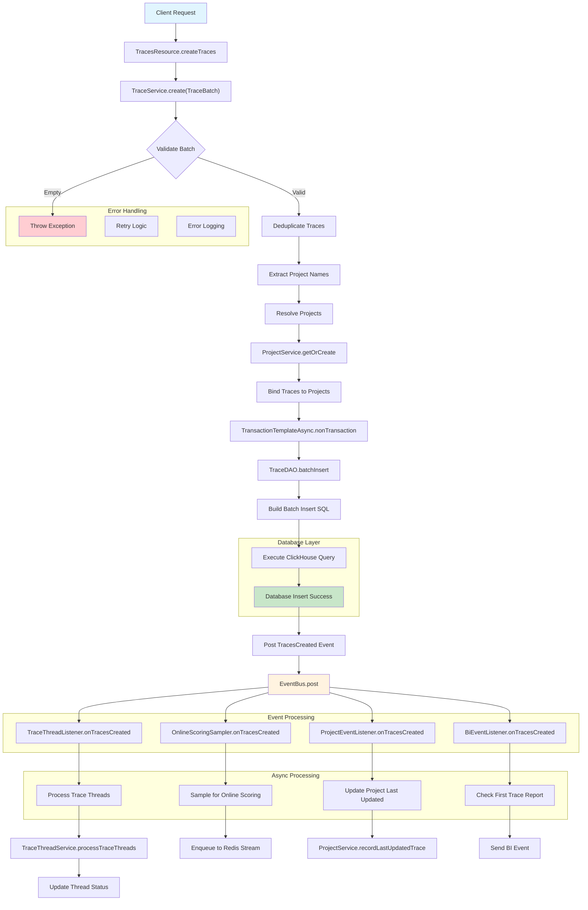
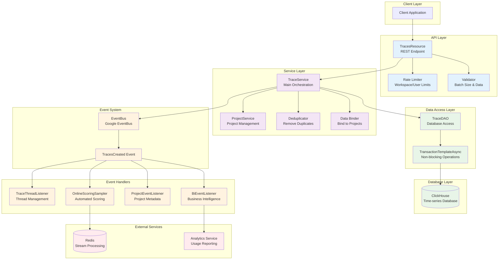
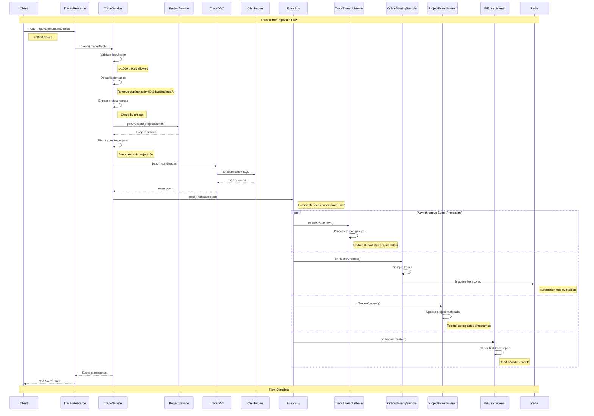

# Trace Batch Ingestion Flow

This diagram illustrates the complete flow of trace batch ingestion in the Opik Java backend service, from client request to event processing.

## Architecture Overview

The trace batch ingestion system follows a reactive, event-driven architecture using Project Reactor and ClickHouse for high-performance data processing.

## Component Details

The following component diagram illustrates the architectural layers and their relationships in the trace batch ingestion system:

### **Architectural Layers:**

#### **1. Request Handling Layer**
- **TracesResource.createTraces()**: REST endpoint for batch trace creation
- **Validation**: Batch size (1-1000 traces), trace data validation
- **Rate Limiting**: Applied at resource level with workspace and user limits

#### **2. Service Layer**
- **TraceService.create(TraceBatch)**: Main orchestration service
- **Deduplication**: Removes duplicate traces based on ID and lastUpdatedAt
- **Project Resolution**: Groups traces by project and ensures projects exist
- **Data Binding**: Associates traces with their respective project IDs

#### **3. Database Operations**
- **TransactionTemplateAsync.nonTransaction()**: Non-blocking database operations
- **TraceDAO.batchInsert()**: Optimized batch insert for ClickHouse
- **ClickHouse**: Time-series database optimized for high-volume data

#### **4. Event-Driven Architecture**
- **TracesCreated Event**: Posted after successful database insertion
- **EventBus**: Google EventBus for event distribution
- **Multiple Listeners**: Process different aspects of trace creation

#### **5. Event Handlers**

##### **TraceThreadListener**
- Manages conversation threads and thread status
- Groups traces by project and thread ID
- Updates thread metadata and status

##### **OnlineScoringSampler**
- Samples traces for automated scoring
- Enqueues samples to Redis Stream for processing
- Supports automation rule evaluation

##### **ProjectEventListener**
- Updates project metadata
- Records last updated trace timestamps
- Maintains project statistics

##### **BiEventListener**
- Handles business intelligence reporting
- Tracks first trace creation events
- Reports usage analytics

## Key Features

### **Performance Optimizations**
- **Batch Processing**: Single SQL statement for multiple traces
- **Non-blocking I/O**: Reactive programming with Project Reactor
- **Deduplication**: Prevents duplicate data insertion
- **Connection Pooling**: Efficient database connection management

### **Error Handling**
- **Retry Logic**: Automatic retry for transient failures
- **Error Logging**: Comprehensive error tracking
- **Graceful Degradation**: Continues processing on partial failures

### **Observability**
- **OpenTelemetry Spans**: Distributed tracing throughout the flow
- **Structured Logging**: Consistent log format with context
- **Metrics**: Performance and error rate monitoring

## Data Flow

The following sequence diagram illustrates the step-by-step flow of trace batch ingestion:

### **Flow Steps Explained:**

1. **Client Request**: Client sends batch request with 1-1000 traces
2. **Validation**: Service validates batch size and trace data
3. **Deduplication**: Removes duplicate traces based on ID and lastUpdatedAt
4. **Project Resolution**: Groups traces by project and ensures projects exist
5. **Data Binding**: Associates traces with their respective project IDs
6. **Database Insert**: Executes optimized batch insert in ClickHouse
7. **Event Publishing**: Posts TracesCreated event to event bus
8. **Async Processing**: Multiple listeners process events concurrently:
   - **Thread Management**: Updates conversation threads and status
   - **Online Scoring**: Samples traces for automated evaluation
   - **Project Updates**: Maintains project metadata and statistics
   - **Analytics**: Tracks usage and business intelligence data

## Technology Stack

- **Framework**: Dropwizard with JAX-RS
- **Reactive**: Project Reactor (Mono/Flux)
- **Database**: ClickHouse for time-series data
- **Event Bus**: Google EventBus
- **Caching**: Redis for stream processing
- **Observability**: OpenTelemetry
- **Validation**: Jakarta Validation

## Related Files

- `TracesResource.java`: REST endpoint implementation
- `TraceService.java`: Main service orchestration
- `TraceDAO.java`: Database access layer
- `TraceThreadListener.java`: Thread management
- `OnlineScoringSampler.java`: Scoring automation
- `ProjectEventListener.java`: Project metadata updates
- `BiEventListener.java`: Business intelligence
