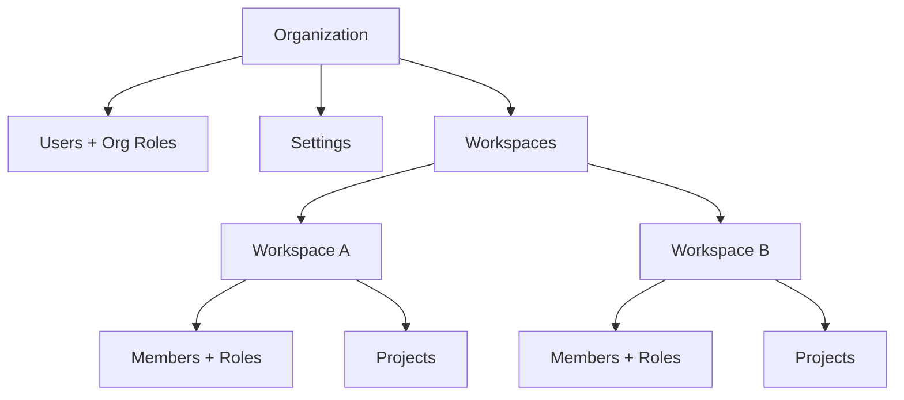

Opik Cloud and Enterprise include administration features for teams and organizations, including:

- **Role-based access control**: Assign granular permissions at the organization and workspace level
- **Single sign-on (SSO)**: Authenticate users via SAML or OIDC with your identity provider
- **Workspace isolation**: Separate projects and data across teams with independent access controls
- **Service accounts**: Create API keys for CI/CD pipelines and automated workflows
- **User management**: Invite team members, assign roles, and manage access from a central dashboard
- **JWT authentication**: Integrate Opik into existing systems with token-based auth

<Note>
Available on [Opik Cloud](https://www.comet.com/site/products/opik/) and Enterprise. [Contact us](https://www.comet.com/site/about-us/contact-us/) for Enterprise pricing.
</Note>

## Get started

<CardGroup cols={2}>
  <Card title="Admin Dashboard" href="/administration/admin-dashboard/overview">
    Invite users, create workspaces, and manage organization settings from the admin UI.
  </Card>
  <Card title="Roles and Permissions" href="/administration/roles_and_permissions">
    Learn how organization roles and workspace roles control what users can access.
  </Card>
  <Card title="Authentication" href="/administration/authentication/overview">
    Set up SAML or OIDC single sign-on, or configure JWT for programmatic access.
  </Card>
  <Card title="Workspace Settings" href="/administration/workspace-settings/overview">
    Configure AI providers, feedback definitions, and other workspace-level preferences.
  </Card>
</CardGroup>

## Key concepts

Opik uses a hierarchical structure to organize users and data:

| Term | Description |
| --- | --- |
| **Organization** | Your company or team. Contains all users, workspaces, and billing settings. |
| **Workspace** | A container for projects. Users can belong to multiple workspaces with different roles in each. |
| **Project** | A container for traces. Experiments and datasets live at the workspace level. |
| **Organization Role** | Controls organization-wide permissions (e.g., Admin can manage billing and users). |
| **Workspace Role** | Controls what a user can do within a specific workspace (e.g., Editor can create projects). |

Here's how these concepts relate:

<Tip>
We recommend creating one workspace per team. This keeps projects organized and allows you to assign different roles to team members based on their responsibilities.
</Tip>
