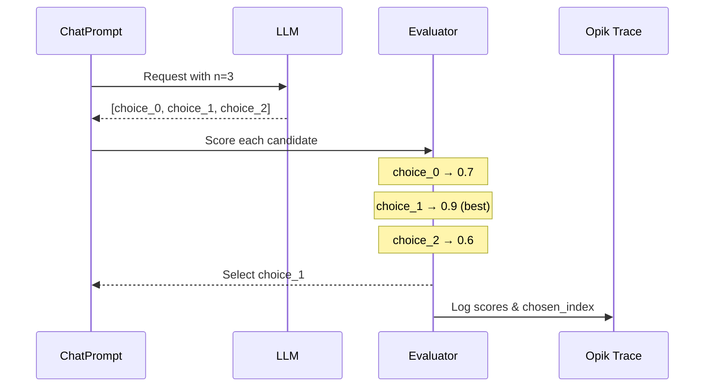

When optimizing prompts, single-sample evaluation can be noisy - a good prompt might fail on a particular trial due to LLM stochasticity. The `n` parameter lets you generate **multiple candidate outputs per evaluation** and select the best one, introducing variety and reducing evaluation variance.

## How It Works

When you set `n > 1` in your prompt's `model_parameters`, the optimizer requests N completions per evaluation, scores each candidate, selects the best one, and logs all scores to the trace. The full explanation of how the `n` parameter works is maintained in [Sampling controls](/agent_optimization/advanced/n_samples#multiple-completions-per-example-n-parameter).



## Configuration

Set the `n` parameter in your `ChatPrompt.model_parameters`:

```python
from opik_optimizer import ChatPrompt

# Generate 3 candidates per evaluation, select best
prompt = ChatPrompt(
    model="gpt-4o-mini",
    messages=[
        {"role": "system", "content": "You are a helpful assistant."},
        {"role": "user", "content": "Answer: {question}"},
    ],
    model_parameters={
        "n": 3,  # Generate 3 completions per call
        "temperature": 0.7,  # Higher temp = more variety between candidates
    },
)
```

<Info>
  Higher `temperature` values increase diversity between the N candidates. Consider using `temperature: 0.7-1.0` with `n > 1` to maximize variety.
</Info>

<Info>
  The low-level `call_model` and `call_model_async` helpers return a single
  response unless you pass `return_all=True`. Optimizers handle `n` internally,
  so you only need `return_all` when calling those helpers directly.
</Info>

## Use Cases

<AccordionGroup>
  <Accordion title="Reducing Evaluation Variance">
    Single-sample evaluation is noisy. With `n=3`, the optimizer scores each candidate and uses the best result, which makes optimization more robust to stochastic failures.

    ```python
    # Before: Single sample - noisy evaluation
    prompt = ChatPrompt(model="gpt-4o-mini", messages=[...])
    # Score might be 0.6 or 0.9 depending on luck

    # After: Best-of-3 - more stable evaluation
    prompt = ChatPrompt(
        model="gpt-4o-mini",
        messages=[...],
        model_parameters={"n": 3, "temperature": 0.8},
    )
    # Score reflects best achievable output
    ```
  </Accordion>

  <Accordion title="Pass@k Style Optimization">
    Inspired by code generation benchmarks (pass@k), this approach measures whether a prompt *can* produce correct output, not just whether it *usually* does.

    ```python
    # Optimize for "can this prompt ever get it right?"
    prompt = ChatPrompt(
        model="gpt-4o-mini",
        messages=[...],
        model_parameters={"n": 5},  # pass@5 style
    )
    ```

    This is useful when:
    - Correctness matters more than consistency
    - You'll use majority voting or best-of-k at inference time
    - Tasks have high variance (creative writing, complex reasoning)
  </Accordion>

  <Accordion title="Handling Stochastic Tasks">
    Some tasks naturally have multiple valid answers. Using `n > 1` helps the optimizer find prompts that can generate *any* valid answer.

    ```python
    # Creative task: multiple valid outputs
    prompt = ChatPrompt(
        model="gpt-4o-mini",
        messages=[
            {"role": "user", "content": "Write a haiku about {topic}"},
        ],
        model_parameters={"n": 3, "temperature": 1.0},
    )
    ```
  </Accordion>
</AccordionGroup>

## Selection Policy

Currently, the optimizer supports these selection policies:

- `best_by_metric` (default): score each candidate with the metric and pick the best.
- `first`: pick the first candidate (fast, deterministic, but ignores scoring).
- `concat`: join all candidates into one output string.
- `random`: pick a random candidate (seeded if provided).
- `max_logprob`: pick the candidate with the highest average token logprob (provider support required; logprobs must be enabled in model kwargs).

Use the `selection_policy` key in `model_parameters` to override. The optimizer
routes these policies through a shared candidate-selection utility so behavior
is consistent across optimizers:

```python
prompt = ChatPrompt(
    model="gpt-4o-mini",
    messages=[...],
    model_parameters={
        "n": 3,
        "selection_policy": "first",
    },
)
```

For `max_logprob`, enable logprobs in your model kwargs (provider support varies):

```python
prompt = ChatPrompt(
    model="gpt-4o-mini",
    messages=[...],
    model_parameters={
        "n": 3,
        "selection_policy": "max_logprob",
        "logprobs": True,
        "top_logprobs": 1,
    },
)
```

When `selection_policy=best_by_metric`, the optimizer:

1. Each candidate is scored independently using your metric function
2. The candidate with the highest score is selected as the final output
3. All scores and the chosen index are logged to the trace metadata

```python
# What happens internally:
candidates = ["output_1", "output_2", "output_3"]
scores = [metric(item, c) for c in candidates]  # [0.7, 0.9, 0.6]
best_idx = argmax(scores)  # 1
final_output = candidates[best_idx]  # "output_2"
```

The trace metadata includes:
- `n_requested`: Number of completions requested
- `candidates_scored`: Number of candidates evaluated
- `candidate_scores`: List of all scores (best_by_metric only)
- `candidate_logprobs`: List of logprob scores (max_logprob only)
- `chosen_index`: Index of the selected candidate

## Cost Considerations

<Warning>
  Using `n > 1` increases API costs proportionally. With `n=3`, you pay roughly 3x the completion tokens per evaluation call.
</Warning>

| n value | Relative cost | Variance reduction |
|---------|---------------|-------------------|
| 1 | 1x | Baseline |
| 3 | ~3x | Significant |
| 5 | ~5x | High |
| 10 | ~10x | Very high |

**Recommendations:**
- Start with `n=3` for most use cases
- Use `n=5-10` only for high-variance tasks
- Consider the total optimization budget when choosing N

## Limitations

<AccordionGroup>
  <Accordion title="Tool-calling forces n=1">
    When `allow_tool_use=True` and tools are defined, the optimizer forces `n=1`. This is because tool-calling requires maintaining a coherent message thread, which isn't compatible with multiple independent completions.

    ```python
    # Tool-calling prompt - n will be forced to 1
    prompt = ChatPrompt(
        model="gpt-4o-mini",
        messages=[...],
        tools=[...],
        model_parameters={"n": 3},  # Ignored when tools are used
    )
    ```
  </Accordion>

  <Accordion title="Some optimizers ignore n">
    Prompt synthesis steps that expect a single structured response (such as few-shot and parameter optimizers) ignore `n` to avoid returning multiple conflicting templates.
  </Accordion>

  <Accordion title="Not all providers support n">
    Some LLM providers don't support the `n` parameter. Check your provider's documentation. LiteLLM will drop unsupported parameters automatically.
  </Accordion>
</AccordionGroup>

## Full Example

```python
from opik_optimizer import ChatPrompt, MetaPromptOptimizer
from opik.evaluation.metrics import LevenshteinRatio

# Create prompt with n=3 for variety
prompt = ChatPrompt(
    model="gpt-4o-mini",
    messages=[
        {"role": "system", "content": "Extract the key entities from the text."},
        {"role": "user", "content": "{text}"},
    ],
    model_parameters={
        "n": 3,  # Generate 3 candidates
        "temperature": 0.7,  # Moderate variety
    },
)

# Define metric
def extraction_accuracy(dataset_item, llm_output):
    expected = dataset_item["expected_entities"]
    return LevenshteinRatio().score(expected, llm_output)

# Optimize - each trial evaluates 3 candidates, picks best
optimizer = MetaPromptOptimizer(model="gpt-4o")
result = optimizer.optimize_prompt(
    prompt=prompt,
    dataset=my_dataset,
    metric=extraction_accuracy,
)

print(f"Best prompt score: {result.score}")
```

## Related

- [Optimize prompts](/agent_optimization/optimization/optimize_prompts) - Core optimization guide
- [Define metrics](/agent_optimization/optimization/define_metrics) - Create custom metrics
- [Custom metrics](/agent_optimization/advanced/custom_metrics) - Advanced metric patterns
- [API Reference](/agent_optimization/advanced/api_reference) - Full parameter documentation
