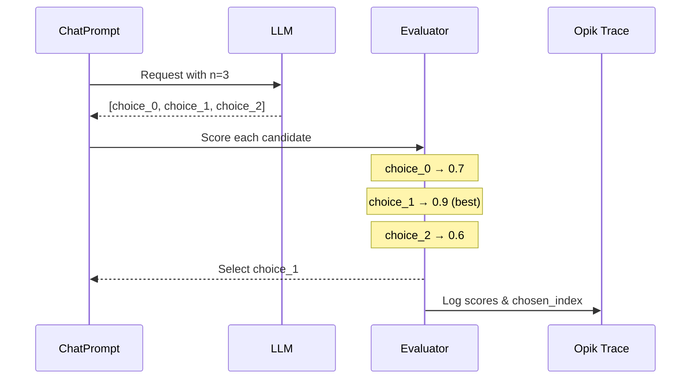

When optimizing prompts, there are two independent sampling layers you can control:

- **Dataset subsampling**: choose which dataset rows are evaluated (`n_samples`, `n_samples_minibatch`, `n_samples_strategy`).
- **Model sampling**: request multiple completions per row (`n` in `model_parameters`).

Use both to balance cost, stability, and exploration.

## Dataset subsampling (n_samples)

`n_samples` limits how many dataset rows are evaluated per trial. It applies to the **evaluation dataset** (the
`validation_dataset` if provided, otherwise `dataset`).

```python
result = optimizer.optimize_prompt(
    prompt=prompt,
    dataset=dataset,
    metric=metric,
    n_samples=50,
)
```

Notes:
- `n_samples` accepts an integer or the strings `"all"` / `"full"` (same as `None`).
- If `n_samples` is larger than the evaluation dataset size, the optimizer falls back to the full dataset and logs a warning.

## Deterministic subsampling (n_samples_strategy)

`n_samples_strategy` controls *how* dataset rows are selected when `n_samples` is set. The default strategy is
`"random_sorted"`, which:

1. Sorts dataset item IDs.
2. Shuffles them deterministically using the optimizer seed and evaluation phase.
3. Takes the first `n_samples` IDs.

If your dataset items do not include IDs, the optimizer falls back to the dataset order.

```python
result = optimizer.optimize_prompt(
    prompt=prompt,
    dataset=dataset,
    metric=metric,
    n_samples=50,
    n_samples_strategy="random_sorted",
)
```

<Info>
  Only `"random_sorted"` is supported today. Passing another strategy will raise a `ValueError`.
</Info>

## Minibatch sampling (n_samples_minibatch)

Some optimizers run *inner-loop* evaluations (for example, HRPO and GEPA). Use `n_samples_minibatch` to cap
those inner evaluations without reducing the outer evaluation size.

```python
result = optimizer.optimize_prompt(
    prompt=prompt,
    dataset=dataset,
    metric=metric,
    n_samples=200,
    n_samples_minibatch=25,
)
```

If `n_samples_minibatch` is not set, it defaults to `n_samples`.

## Explicit item selection (dataset_item_ids)

For fully deterministic evaluations, you can pass an explicit list of dataset item IDs to `evaluate_prompt`.
This bypasses the sampling strategy and is **mutually exclusive** with `n_samples`.

```python
score = optimizer.evaluate_prompt(
    prompt=prompt,
    dataset=dataset,
    metric=metric,
    dataset_item_ids=["item-1", "item-2", "item-3"],
)
```

<Info>
  When debug logging is enabled, evaluation logs include the sampling mode and resolved dataset size.
</Info>

## Multiple completions per example (n parameter)

Single-sample evaluation can be noisy. The `n` parameter lets you generate **multiple candidate outputs per
example** and select the best one, introducing variety and reducing evaluation variance.

### How It Works

When you set `n > 1` in your prompt's `model_parameters`, the optimizer:

1. Requests N completions from the LLM in a single API call (pass@N)
2. Scores each candidate output using your metric
3. Selects the best candidate (`best_by_metric` policy)
4. Logs all scores and selection info to the Opik trace

In optimizers that already generate multiple prompt variants per round, `n` is
applied per evaluation, so total candidate evaluations scale by `prompts_per_round * n`.

For tasks that execute generated code (like ARC-AGI or tool-driven agents), this means
each prompt produces multiple candidate programs that are executed and scored, and the
best candidate is used for optimization feedback.



### Configuration

Set the `n` parameter in your `ChatPrompt.model_parameters`:

```python
from opik_optimizer import ChatPrompt

# Generate 3 candidates per evaluation, select best
prompt = ChatPrompt(
    model="gpt-4o-mini",
    messages=[
        {"role": "system", "content": "You are a helpful assistant."},
        {"role": "user", "content": "Answer: {question}"},
    ],
    model_parameters={
        "n": 3,  # Generate 3 completions per call
        "temperature": 0.7,  # Higher temp = more variety between candidates
    },
)
```

<Info>
  Higher `temperature` values increase diversity between the N candidates. Consider using `temperature: 0.7-1.0` with `n > 1` to maximize variety.
</Info>

<Info>
  The low-level `call_model` and `call_model_async` helpers return a single
  response unless you pass `return_all=True`. Optimizers handle `n` internally,
  so you only need `return_all` when calling those helpers directly.
</Info>

### Use Cases

<AccordionGroup>
  <Accordion title="Reducing Evaluation Variance">
    Single-sample evaluation is noisy. With `n=3`, the optimizer scores each candidate and uses the best result, which makes optimization more robust to stochastic failures.

    ```python
    # Before: Single sample - noisy evaluation
    prompt = ChatPrompt(model="gpt-4o-mini", messages=[...])
    # Score might be 0.6 or 0.9 depending on luck

    # After: Best-of-3 - more stable evaluation
    prompt = ChatPrompt(
        model="gpt-4o-mini",
        messages=[...],
        model_parameters={"n": 3, "temperature": 0.8},
    )
    # Score reflects best achievable output
    ```
  </Accordion>

  <Accordion title="Pass@k Style Optimization">
    Inspired by code generation benchmarks (pass@k), this approach measures whether a prompt *can* produce correct output, not just whether it *usually* does.

    ```python
    # Optimize for "can this prompt ever get it right?"
    prompt = ChatPrompt(
        model="gpt-4o-mini",
        messages=[...],
        model_parameters={"n": 5},  # pass@5 style
    )
    ```

    This is useful when:
    - Correctness matters more than consistency
    - You'll use majority voting or best-of-k at inference time
    - Tasks have high variance (creative writing, complex reasoning)
  </Accordion>

  <Accordion title="Handling Stochastic Tasks">
    Some tasks naturally have multiple valid answers. Using `n > 1` helps the optimizer find prompts that can generate *any* valid answer.

    ```python
    # Creative task: multiple valid outputs
    prompt = ChatPrompt(
        model="gpt-4o-mini",
        messages=[
            {"role": "user", "content": "Write a haiku about {topic}"},
        ],
        model_parameters={"n": 3, "temperature": 1.0},
    )
    ```
  </Accordion>
</AccordionGroup>

## Selection Policy

Currently, the optimizer supports these selection policies:

- `best_by_metric` (default): score each candidate with the metric and pick the best.
- `first`: pick the first candidate (fast, deterministic, but ignores scoring).
- `concat`: join all candidates into one output string.
- `random`: pick a random candidate (seeded if provided).
- `max_logprob`: pick the candidate with the highest average token logprob (provider support required; logprobs must be enabled in model kwargs).

Use the `selection_policy` key in `model_parameters` to override. The optimizer
routes these policies through a shared candidate-selection utility so behavior
is consistent across optimizers:

```python
prompt = ChatPrompt(
    model="gpt-4o-mini",
    messages=[...],
    model_parameters={
        "n": 3,
        "selection_policy": "first",
    },
)
```

For `max_logprob`, enable logprobs in your model kwargs (provider support varies):

```python
prompt = ChatPrompt(
    model="gpt-4o-mini",
    messages=[...],
    model_parameters={
        "n": 3,
        "selection_policy": "max_logprob",
        "logprobs": True,
        "top_logprobs": 1,
    },
)
```

When `selection_policy=best_by_metric`, the optimizer:

1. Each candidate is scored independently using your metric function
2. The candidate with the highest score is selected as the final output
3. All scores and the chosen index are logged to the trace metadata

```python
# What happens internally:
candidates = ["output_1", "output_2", "output_3"]
scores = [metric(item, c) for c in candidates]  # [0.7, 0.9, 0.6]
best_idx = argmax(scores)  # 1
final_output = candidates[best_idx]  # "output_2"
```

The trace metadata includes:
- `n_requested`: Number of completions requested
- `candidates_scored`: Number of candidates evaluated
- `candidate_scores`: List of all scores (best_by_metric only)
- `candidate_logprobs`: List of logprob scores (max_logprob only)
- `chosen_index`: Index of the selected candidate

## Cost Considerations

<Warning>
  Using `n > 1` increases API costs proportionally. With `n=3`, you pay roughly 3x the completion tokens per evaluation call.
</Warning>

| n value | Relative cost | Variance reduction |
|---------|---------------|-------------------|
| 1 | 1x | Baseline |
| 3 | ~3x | Significant |
