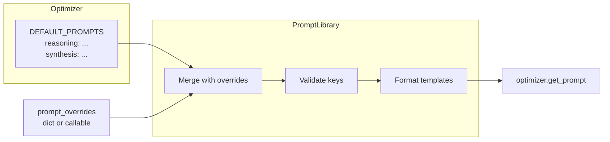

The Opik Optimizer uses a **PromptLibrary** system that lets you customize the internal prompts used by each optimizer. This is useful when you need to:

- Add domain-specific constraints (legal, medical, coding standards)
- Inject safety or compliance requirements
- Adjust output formatting or style
- Experiment with different reasoning approaches

## Quick Start

Every optimizer accepts a `prompt_overrides` parameter:

```python
from opik_optimizer import MetaPromptOptimizer

# Simple dict override
optimizer = MetaPromptOptimizer(
    model="gpt-4o",
    prompt_overrides={"reasoning_system": "Be concise. Focus on clarity."}
)
```

## How It Works

Each optimizer defines its own `DEFAULT_PROMPTS` dictionary with keys specific to that algorithm. The PromptLibrary:

1. Stores the default prompts
2. Applies your overrides (dict or callable)
3. Validates that override keys exist (catches typos early)
4. Provides `get_prompt()` for runtime access



## Override Methods

<AccordionGroup>
  <Accordion title="Dict Override (Simple Replacement)">
    Best when you know exactly which prompt to replace with a static string:

    ```python
    from opik_optimizer import EvolutionaryOptimizer

    optimizer = EvolutionaryOptimizer(
        model="gpt-4o",
        prompt_overrides={
            "synonyms_system_prompt": "Return exactly ONE synonym. No explanation.",
            "infer_style_system_prompt": "Analyze the writing style briefly.",
        }
    )
    ```
  </Accordion>

  <Accordion title="Callable Override (Dynamic Modification)">
    Best when you need to modify existing prompts, apply conditional logic, or update multiple prompts:

    ```python
    from opik_optimizer import MetaPromptOptimizer
    from opik_optimizer.utils.prompt_library import PromptLibrary

    def customize_prompts(prompts: PromptLibrary) -> None:
        # List available keys
        print("Available keys:", prompts.keys())

        # Prepend a constraint to the reasoning prompt
        original = prompts.get("reasoning_system")
        prompts.set("reasoning_system", "Always respond in English.\n\n" + original)

        # Append format instructions to another prompt
        if "candidate_generation" in prompts.keys():
            prompts.set(
                "candidate_generation",
                prompts.get("candidate_generation") + "\n\nUse markdown formatting."
            )

    optimizer = MetaPromptOptimizer(
        model="gpt-4o",
        prompt_overrides=customize_prompts
    )
    ```
  </Accordion>
</AccordionGroup>

## Discovering Available Keys

Each optimizer has different prompt keys. Use `list_prompts()` to discover them:

```python
from opik_optimizer import MetaPromptOptimizer

optimizer = MetaPromptOptimizer(model="gpt-4o")
print("Available prompt keys:")
for key in optimizer.list_prompts():
    print(f"  - {key}")
```

### Common Keys by Optimizer

| Optimizer | Key Examples |
|-----------|--------------|
| **MetaPromptOptimizer** | `reasoning_system`, `candidate_generation`, `synthesis`, `pattern_extraction_system` |
| **EvolutionaryOptimizer** | `infer_style_system_prompt`, `synonyms_system_prompt`, `semantic_mutation_system_prompt_template` |
| **FewShotBayesianOptimizer** | `example_placeholder`, `system_prompt_template` |
| **HierarchicalReflectiveOptimizer** | `batch_analysis_prompt`, `synthesis_prompt`, `improve_prompt_template` |

## Reading Prompts at Runtime

After creating an optimizer, you can inspect the current prompts:

```python
optimizer = MetaPromptOptimizer(
    model="gpt-4o",
    prompt_overrides={"reasoning_system": "Custom prompt here..."}
)

# Get the current (possibly overridden) prompt
current = optimizer.get_prompt("reasoning_system")
print(current)

# Get the original default (before any overrides)
default = optimizer.prompts.get_default("reasoning_system")
print(default)
```

## Template Variables

Some prompts contain placeholders that get filled at runtime using Python's `{variable}` format. When overriding prompts with placeholders, **keep the same placeholders**:

```python
# Original: "Generate {num_prompts} variations of the prompt."
# Your override should keep {num_prompts}:
prompt_overrides = {
    "candidate_generation": "Be creative. Generate {num_prompts} diverse variations."
}
```

## Use Cases

<AccordionGroup>
  <Accordion title="Adding Domain Constraints">
    ```python
    def add_legal_constraints(prompts: PromptLibrary) -> None:
        for key in prompts.keys():
            original = prompts.get(key)
            prompts.set(key,
                "LEGAL CONTEXT: Do not reference specific case law.\n\n" + original
            )

    optimizer = MetaPromptOptimizer(
        model="gpt-4o",
        prompt_overrides=add_legal_constraints
    )
    ```
  </Accordion>

  <Accordion title="Enforcing Output Format">
    ```python
    optimizer = EvolutionaryOptimizer(
        model="gpt-4o",
        prompt_overrides={
            "infer_style_system_prompt": """
    Analyze writing style. Return a JSON object with:
    {
      "tone": "formal|casual|technical",
      "complexity": "simple|moderate|complex",
      "key_patterns": ["list", "of", "patterns"]
    }
    """
        }
    )
    ```
  </Accordion>

  <Accordion title="Adding Safety Guardrails">
    ```python
    def add_safety_layer(prompts: PromptLibrary) -> None:
        safety_prefix = """
    SAFETY REQUIREMENTS:
    - Never generate harmful or offensive content
    - Avoid personal identifiable information
    - Flag uncertain responses

    """
        for key in prompts.keys():
            if "system" in key.lower():
                prompts.set(key, safety_prefix + prompts.get(key))

    optimizer = MetaPromptOptimizer(
        model="gpt-4o",
        prompt_overrides=add_safety_layer
    )
    ```
  </Accordion>
</AccordionGroup>

## Error Handling

The PromptLibrary validates keys to catch typos early:

```python
# This will raise KeyError - "reasoing_system" is misspelled
optimizer = MetaPromptOptimizer(
    model="gpt-4o",
    prompt_overrides={"reasoing_system": "Oops, typo!"}  # KeyError!
)

# Error message shows available keys:
# KeyError: "Unknown prompt keys: ['reasoing_system'].
#            Available: ['candidate_generation', 'reasoning_system', ...]"
```

## Best Practices

<Info>
  **Tips for effective prompt customization:**

  1. **List keys first** – Always use `list_prompts()` to see available keys before overriding
  2. **Keep placeholders** – If a prompt has `{variables}`, keep them in your override
  3. **Test incrementally** – Override one prompt at a time to isolate effects
  4. **Use callable for complex logic** – Dict is simpler, but callable is more powerful
  5. **Don't break JSON** – Some prompts expect JSON output; maintain that structure
</Info>

## Full Example

```python
from opik_optimizer import MetaPromptOptimizer
from opik_optimizer.utils.prompt_library import PromptLibrary

def my_customizations(prompts: PromptLibrary) -> None:
    """Customize prompts for a code generation task."""

    # 1. Add coding focus to reasoning
    prompts.set(
        "reasoning_system",
        "You are an expert code prompt engineer.\n\n" + prompts.get("reasoning_system")
    )

    # 2. Enforce Python-specific patterns
    prompts.set(
        "candidate_generation",
        prompts.get("candidate_generation") + """

ADDITIONAL REQUIREMENTS:
- Prompts should encourage well-documented code
- Prefer type hints and docstrings
- Emphasize error handling and edge cases
"""
    )

# Create optimizer with customizations
optimizer = MetaPromptOptimizer(
    model="gpt-4o",
    prompt_overrides=my_customizations
)

# Verify customizations applied
print("Customized reasoning prompt:")
print(optimizer.get_prompt("reasoning_system")[:200] + "...")
```

## Related

- [API Reference](/agent_optimization/opik_optimizer/reference) – Full parameter documentation
- [Custom metrics](/agent_optimization/advanced/custom_metrics) – Build specialized evaluation metrics
- [Extending optimizers](/agent_optimization/algorithms/extending_optimizers) – Create custom optimizer subclasses
