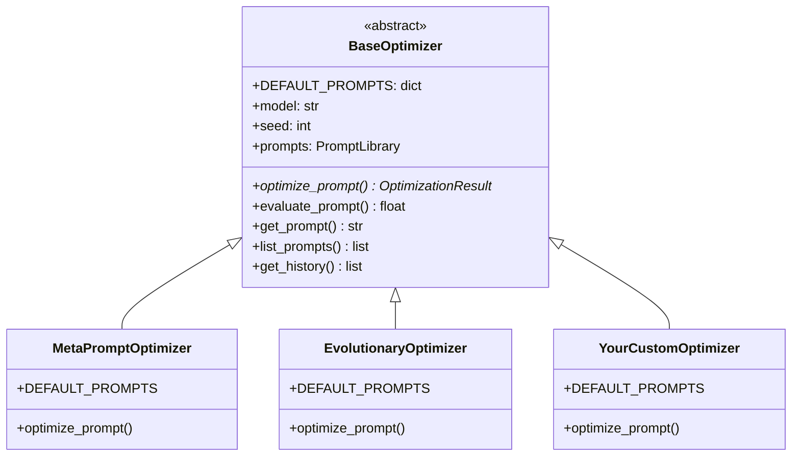

Opik Agent Optimizer is designed to be a flexible framework for prompt and agent optimization. While
it provides a suite of powerful built-in algorithms, you might have unique optimization strategies or
specialized needs. This guide shows how to build your own optimizer by extending the `BaseOptimizer`
class that all built-in optimizers use.

## Architecture Overview

All optimizers in the SDK extend `BaseOptimizer`, giving you access to the same infrastructure:



## Core Concepts for a Custom Optimizer

To design a new optimization algorithm within Opik's ecosystem, your optimizer needs to interact with several key components:

1. **Prompt (`ChatPrompt`)**: Your optimizer takes a `ChatPrompt` object as input. The chat prompt
   is a list of messages, where each message has a role, content, and optional additional
   fields. This includes variables that need to be replaced with actual values.

2. **Evaluation Mechanism (Metric & Dataset)**: Your optimizer needs a way to score candidate
   prompts. This is achieved by creating a `metric` (function that takes `dataset_item` and
   `llm_output` as arguments and returns a float) and an evaluation `dataset`.

3. **Optimization Loop**: This is the heart of your custom optimizer. It involves:
   - **Candidate Generation**: Logic for creating new prompt variations. This could be rule-based, LLM-driven, or based on any other heuristic.
   - **Candidate Evaluation**: Using the `metric` and `dataset` to get a score for each candidate.
   - **Selection/Progression**: Logic to decide which candidates to keep, refine further, or how to adjust the generation strategy based on scores.
   - **Termination Condition**: Criteria for when to stop the optimization (e.g., number of rounds, score threshold, no improvement).

4. **Returning Results (`OptimizationResult`)**: Upon completion, your optimizer returns an
   `OptimizationResult` object that standardizes how results are reported, including the best prompt
   found, its score, history of the optimization process, and cost/usage metrics.

## Creating a Custom Optimizer

### Step 1: Define Your Optimizer Class

Extend `BaseOptimizer` and define your `DEFAULT_PROMPTS` - the internal prompts your algorithm uses:

```python
from opik_optimizer.base_optimizer import BaseOptimizer, OptimizationRound
from opik_optimizer.optimization_result import OptimizationResult
from opik_optimizer.api_objects.chat_prompt import ChatPrompt
from opik import Dataset
from typing import Any, Callable

class MyCustomOptimizer(BaseOptimizer):
    """
    A custom optimizer that implements [your algorithm description].
    """

    # Define internal prompts used by your algorithm.
    # Users can customize these via the prompt_overrides parameter.
    DEFAULT_PROMPTS = {
        "analysis_prompt": """Analyze the following prompt and identify improvement opportunities:

Current prompt:
{current_prompt}

Failure cases from evaluation:
{failures}

Identify specific issues and suggest concrete improvements.""",

        "generation_prompt": """Generate an improved version of this prompt:

Original prompt:
{current_prompt}

Focus areas for improvement:
{improvement_focus}

Return only the improved prompt text.""",
    }

    def __init__(
        self,
        model: str,
        max_iterations: int = 5,
        candidates_per_round: int = 3,
        improvement_threshold: float = 0.01,
        verbose: int = 1,
        seed: int = 42,
        **kwargs: Any,
    ) -> None:
        """
        Initialize the custom optimizer.

        Args:
            model: LiteLLM model name for the optimizer's internal LLM calls
            max_iterations: Maximum optimization rounds
            candidates_per_round: Number of candidate prompts to generate per round
            improvement_threshold: Minimum score improvement to continue
            verbose: Logging verbosity (0=off, 1=on)
            seed: Random seed for reproducibility
            **kwargs: Additional BaseOptimizer parameters (model_parameters, etc.)
        """
        super().__init__(model=model, verbose=verbose, seed=seed, **kwargs)
        self.max_iterations = max_iterations
        self.candidates_per_round = candidates_per_round
        self.improvement_threshold = improvement_threshold

    def get_optimizer_metadata(self) -> dict[str, Any]:
        """
        Expose optimizer-specific parameters for logging and tracking.
        This metadata appears in Opik experiment configurations.
        """
        return {
            "max_iterations": self.max_iterations,
            "candidates_per_round": self.candidates_per_round,
            "improvement_threshold": self.improvement_threshold,
        }
```

### Step 2: Implement the optimize_prompt() Method

This is the core method implementing your optimization logic:

```python
def optimize_prompt(
    self,
    prompt: ChatPrompt,
    dataset: Dataset,
    metric: Callable,
    agent: Any = None,
    experiment_config: dict | None = None,
    n_samples: int | None = None,
    auto_continue: bool = False,
    project_name: str = "Optimization",
    optimization_id: str | None = None,
    validation_dataset: Dataset | None = None,
    max_trials: int = 10,
    **kwargs: Any,
) -> OptimizationResult:
    """
    Optimize a prompt using the custom algorithm.

    Args:
        prompt: The ChatPrompt to optimize
        dataset: Training dataset for feedback and context
        metric: Scoring function(dataset_item, llm_output) -> float
        agent: Optional custom agent for evaluation
        experiment_config: Optional experiment metadata
        n_samples: Limit dataset samples per evaluation (None = all)
        project_name: Opik project name for tracing
        validation_dataset: Optional separate dataset for candidate ranking
        max_trials: Maximum evaluation trials
        **kwargs: Algorithm-specific parameters

    Returns:
        OptimizationResult with best prompt, scores, and history
    """
    # 1. Initialize: Reset counters and set project context
    self._reset_counters()
    self.project_name = project_name

    # 2. Evaluate baseline prompt to establish starting point
    baseline_score = self.evaluate_prompt(
        prompt=prompt,
        dataset=dataset,
        metric=metric,
        n_samples=n_samples,
        verbose=self.verbose,
    )

    # 3. Check if baseline is already good enough (skip optimization)
    if self._should_skip_optimization(baseline_score):
        return self._build_early_result(
            optimizer_name=self.__class__.__name__,
            prompt=prompt,
            score=baseline_score,
            metric_name=metric.__name__,
            initial_prompt=prompt,
            details={"reason": "baseline_score_sufficient"},
        )

    # 4. Main optimization loop
    best_prompt = prompt
    best_score = baseline_score
    previous_best_score = baseline_score

    for iteration in range(self.max_iterations):
        # 4a. Generate candidate prompts based on current_best_prompt
        candidates = self._generate_candidates(
            current_prompt=best_prompt,
            dataset=dataset,
            metric=metric,
        )

        # 4b. Evaluate each candidate
        round_best_prompt = best_prompt
        round_best_score = best_score

        for candidate in candidates:
            # Use validation_dataset if provided, otherwise use training dataset
            eval_dataset = validation_dataset or dataset
            score = self.evaluate_prompt(
                prompt=candidate,
                dataset=eval_dataset,
                metric=metric,
                n_samples=n_samples,
                verbose=0,  # Reduce noise during candidate evaluation
            )

            # 4c. Select the best candidate from this round
            if score > round_best_score:
                round_best_score = score
                round_best_prompt = candidate

        # Update global best if this round improved
        if round_best_score > best_score:
            best_score = round_best_score
            best_prompt = round_best_prompt

        # 4d. Record optimization history
        self._add_to_history(OptimizationRound(
            round_number=iteration,
            current_prompt=best_prompt,
            current_score=best_score,
            generated_prompts=candidates,
            best_prompt=best_prompt,
            best_score=best_score,
            improvement=best_score - baseline_score,
        ))

        # 4e. Check termination conditions
        improvement = best_score - previous_best_score
        if improvement < self.improvement_threshold:
            if self.verbose:
                print(f"Converged at iteration {iteration}")
            break

        previous_best_score = best_score

    # 5. Prepare and return OptimizationResult
    return OptimizationResult(
        optimizer=self.__class__.__name__,
        prompt=best_prompt,
        score=best_score,
        metric_name=metric.__name__,
        initial_prompt=prompt,
        initial_score=baseline_score,
        details={
            "iterations_completed": iteration + 1,
            "total_candidates_evaluated": (iteration + 1) * self.candidates_per_round,
        },
        history=self.get_history(),
        llm_calls=self.llm_call_counter,
        llm_calls_tools=self.llm_calls_tools_counter,
        llm_cost_total=self.llm_cost_total,
        llm_token_usage_total=self.llm_token_usage_total,
    )
```

### Step 3: Implement Candidate Generation

Your custom logic to create new prompt variations. Use `get_prompt()` to access internal prompts (which respects user's `prompt_overrides`):

```python
from opik_optimizer._llm_calls import call_model

def _generate_candidates(
    self,
    current_prompt: ChatPrompt,
    dataset: Dataset,
    metric: Callable,
) -> list[ChatPrompt]:
    """
    Generate candidate prompts using LLM-based improvement.

    Args:
        current_prompt: The prompt to improve
        dataset: Dataset for context (can analyze failures)
        metric: Metric for understanding what "good" means

    Returns:
        List of candidate ChatPrompt objects
    """
    candidates = []

    for i in range(self.candidates_per_round):
        # Get the generation prompt template (respects prompt_overrides)
        generation_request = self.get_prompt(
            "generation_prompt",
            current_prompt=current_prompt.get_messages(),
            improvement_focus=f"variation {i+1}: explore different approaches",
        )

        # Call LLM to generate an improved prompt
        response = call_model(
            messages=[{"role": "user", "content": generation_request}],
            model=self.model,
            seed=self.seed + i,  # Vary seed for diversity
            model_parameters=self.model_parameters,
            project_name=self.project_name,
        )

        # Parse the response and create a new ChatPrompt
        new_prompt = self._parse_prompt_from_response(response, current_prompt)
        if new_prompt is not None:
            candidates.append(new_prompt)

    return candidates

def _parse_prompt_from_response(
    self,
    response: str,
    template_prompt: ChatPrompt,
) -> ChatPrompt | None:
    """
    Parse LLM response into a new ChatPrompt.
    """
    try:
        new_prompt = template_prompt.model_copy(deep=True)
        # Update the system message with the improved prompt
        for msg in new_prompt.messages:
            if msg.get("role") == "system":
                msg["content"] = response.strip()
                break
        return new_prompt
    except Exception:
        return None
```

## What BaseOptimizer Provides

<Info>
  The `BaseOptimizer` class provides robust mechanisms for prompt evaluation that all existing optimizers leverage. Your
  custom optimizer reuses these internal evaluation utilities to ensure consistency with the Opik ecosystem.
</Info>

| Component | Description |
|-----------|-------------|
| `evaluate_prompt()` | Evaluates a prompt against dataset using metric. Handles threading, sampling, and result aggregation. |
| `get_prompt(key, **fmt)` | Gets internal prompt template with optional formatting. Respects `prompt_overrides`. |
| `list_prompts()` | Lists all available prompt keys for this optimizer. |
| `_reset_counters()` | Resets LLM call/cost counters. Call at start of `optimize_prompt()`. |
| `_add_to_history()` | Tracks optimization rounds for result reporting. |
| `_should_skip_optimization()` | Checks if baseline score exceeds `perfect_score` threshold. |
| `_build_early_result()` | Creates `OptimizationResult` when skipping optimization. |
| `llm_call_counter` | Tracks number of LLM calls made. |
| `llm_cost_total` | Tracks total API cost (when available from provider). |
| `llm_token_usage_total` | Tracks token usage across all calls. |

## Using Structured Outputs

For complex generation, use Pydantic models for structured LLM responses:

```python
from opik_optimizer._llm_calls import call_model
from pydantic import BaseModel

class PromptAnalysis(BaseModel):
    issues: list[str]
    suggestions: list[str]
    priority: str

# Returns a parsed Pydantic object, not raw text
analysis = call_model(
    messages=[{"role": "user", "content": "Analyze this prompt: ..."}],
    model=self.model,
    response_model=PromptAnalysis,
    project_name=self.project_name,
)

print(analysis.issues)      # ['Issue 1', 'Issue 2']
print(analysis.suggestions) # ['Suggestion 1', ...]
```

## How to Contribute

Opik is continuously evolving, and community contributions are valuable!

- **Feature Requests & Ideas**: If you have ideas for new optimization algorithms, features, or
  improvements to existing ones, please share them through our community channels or by raising an
  issue on our [GitHub repository](https://github.com/comet-ml/opik).
- **Bug Reports**: If you encounter issues or unexpected behavior, detailed bug reports are greatly
  appreciated.
- **Use Cases & Feedback**: Sharing your use cases and how Opik Agent Optimizer is (or isn't)
  meeting your needs helps us prioritize development.
- **Code Contributions**: Pull requests for new optimizers are welcome! See the
  [contribution guide](/contributing/guides/agent-optimizer-sdk) for detailed instructions.

## Key Takeaways

- Extend `BaseOptimizer` to create custom optimization algorithms with full access to Opik's infrastructure
- Define `DEFAULT_PROMPTS` for your algorithm's internal prompts - users can customize these via `prompt_overrides`
- Implement `optimize_prompt()` with your optimization logic, using the inherited `evaluate_prompt()` to score candidates
- Return standardized `OptimizationResult` objects for consistent reporting and dashboard integration
- Use `_llm_calls.call_model()` for LLM interactions with automatic cost/usage tracking

We encourage you to explore the existing [optimizer algorithms](/agent_optimization/algorithms/overview) to see different approaches to these challenges.

## Related

- [Custom optimizer prompts](/agent_optimization/advanced/prompt_customization) - Customize internal prompts
- [Custom metrics](/agent_optimization/advanced/custom_metrics) - Build evaluation metrics
- [API Reference](/agent_optimization/advanced/api_reference) - Full parameter documentation
