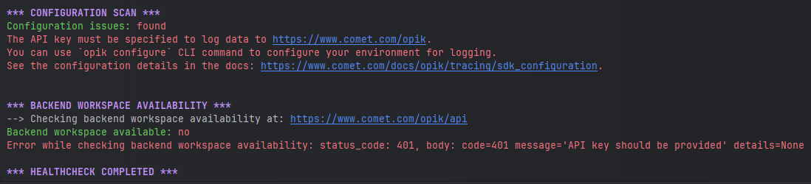

These FAQs are a collection of the most common questions that we've received from our users. If you
have any questions or need additional assistance, please open an
[issue on GitHub](https://github.com/comet-ml/opik/issues).

## General

### What is Opik's relationship with Comet?

Opik is developed by Comet and is available in multiple deployment options:

- As an open-source standalone product that can be used locally or self-hosted on your own
  infrastructure
- As an integrated part of the Comet MLOps Platform (both in Comet-hosted and self-hosted
  deployments)

This means you can use Opik independently of the Comet platform, or as part of your existing Comet
MLOps setup.

### What SDKs does Opik provide?

Opik currently provides official SDKs for:

- Python: Our most feature-complete SDK, supporting all Opik features
- TypeScript: Rich tracing capabilities

These SDKs are actively maintained and regularly updated. For other languages, you can use our REST
API directly - see our [API documentation](/docs/opik/reference/rest-api/overview/) for details.

### What format should I use for start_time?

The `start_time` field supports **ISO 8601 datetime format** with UTC timezone. For best
compatibility across all Opik SDKs and the backend, use:

```
2024-01-01T10:20:30.123456Z
```

**Format specification:**

- Pattern: `YYYY-MM-DDTHH:MM:SS.ffffffZ`
- Timezone: UTC (always with `Z` suffix)
- Precision: Microseconds (6 decimal places)

**Examples:**

- `2024-01-01T10:20:30Z` (seconds only)
- `2024-01-01T10:20:30.123Z` (milliseconds)
- `2024-01-01T10:20:30.123456Z` (microseconds - recommended)

This format is supported by:

- Python SDK
- TypeScript SDK
- Java Backend
- Frontend UI
- ClickHouse Database

**Why UTC with Z suffix?**

- Avoids timezone conversion issues
- Universally supported across programming languages
- Explicitly indicates UTC timezone
- RFC 3339 compliant

### Can I use Opik to monitor my LLM application in production?

Yes, Opik has been designed from the ground up to be used to monitor production applications. If you
are self-hosting the
Opik platform, we recommend using the [Kubernetes deployment](/self-host/overview) option to ensure
that Opik can scale as needed.

### What is the difference between Opik Cloud and the Open-Source Opik platform ?

The Opik Cloud platform is the hosted version of Opik that is available to both
free users and paying customers. It includes all the features you love about
the open-source version of Opik, plus user management, billing and support without
the hassle of setting up and maintaining your own Opik platform.

The Open-Source version of the Opik product includes tracing and online evaluation
features so you can monitor your LLMs in production. It also includes advanced
evaluation features including evaluation metrics and an advanced experiment
comparison UI. Less technical users can also use Opik to review production traces
or run experiments from the Opik Playground.

## Opik Cloud

### Where can I find my Opik API key ?

The Opik API key is needed to log data to either the Opik Cloud platform. You can
find your API key in either your Account settings or in the user menu available
from the top right of the page

<Frame>
  
</Frame>

<Tip>
  If you are using the Open-Source Opik platform, you will not have Opik API keys. You can configure Opik by running
  `opik configure` in your terminal which will prompt you for your Opik deployment and create all the required
  configurations.
</Tip>

### How do I find my workspace and project name?

Your **workspace name** and **project name** are displayed in the Opik UI:

**Workspace Name:**

- Look at the top of the page in the breadcrumb navigation
- It appears as the first item after "opik" in the breadcrumb path
- Example: `opik > your-workspace-name > Projects > your-project-name`

**Project Name:**

- When you're inside a project, it appears as the main header in the content area
- It's also the last item in the breadcrumb navigation
- Example: `opik > your-workspace-name > Projects > your-project-name`

You can also see your workspace information in the left sidebar under "Projects" which shows the
count of projects in your workspace.

### Are there are rate limits on Opik Cloud?

Yes, in order to ensure all users have a good experience we have implemented rate limits. When you
encounter a rate limit, endpoints will return the status code `429`.

There's a global rate limit of `2,000` request/minute per user across all REST API endpoints, with
an extra burst of `100` requests.

Afterward, there's a data ingestion limit of `10,000` events/minute per user. An event is any trace,
span, feedback score, dataset item, experiment item, etc. which is ingested, stored and persisted by
Opik.

Additionally, there's another data ingestion limit of `5,000` events/minute per workspace and per
user.

Finally, there's a rate limit of `250` requests/minute per user for the `Get span by id` endpoint:
`GET /api/v1/private/spans/:id`.

<Note>
The Python SDK has implemented some logic to slow down the logging to avoid data loss when
encountering rate limits. You will see the message: `OPIK: Ingestion rate limited, retrying in 55 seconds, remaining queue size: 1, ...`.

If you are using other logging methods, you will need to implement your own "backoff and retry"
strategy

</Note>

For questions about rate limits, reach out to us on [Slack](https://chat.comet.com).

## Integrations

### What integrations does Opik support?

Opik supports a comprehensive range of popular LLM frameworks, providers, and tools. You can find
detailed integration guides in our [Integrations Overview](/integrations/overview).

**Model Providers:**
Anthropic, AWS Bedrock, BytePlus, Cloudflare Workers AI, Cohere, DeepSeek, Fireworks AI, Google
Gemini, Groq, Mistral AI, Novita AI, Ollama, OpenAI (Python & JS/TS), Predibase, Together AI, IBM
WatsonX, xAI Grok

**Frameworks:**
AG2, Agno, Autogen, CrewAI, DSPy, Haystack, Instructor, LangChain (Python & JS/TS), LangGraph,
LlamaIndex, Mastra, Pydantic AI, Semantic Kernel, Smolagents, Spring AI, Strands Agents, VoltAgent,
OpenAI Agents, Google Agent Development Kit, LiveKit Agents, BeeAI

**Evaluation & Testing:**
Ragas

**Gateways & Proxies:**
LiteLLM, OpenRouter, AISuite

**No-Code Tools:**
Dify, Flowise

**OpenTelemetry:**
OpenTelemetry (Python & Ruby SDKs)

**Other Tools:**
Guardrails AI

### What if Opik doesn't support my preferred framework or tool?

If you don't see your preferred framework or tool listed in our integrations, we encourage you to:

1. Open an [issue on GitHub](https://github.com/comet-ml/opik/issues) to request the integration
2. In the meantime, you can manually log your LLM interactions using our SDK's core logging
   functions - see our [tracing documentation](/docs/opik/tracing/log_traces) for examples

We actively maintain and expand our integration support based on community feedback.

## Troubleshooting

### Why am I getting 403 errors?

If you're encountering 403 (Forbidden) errors, this typically indicates an authentication or
authorization issue. If you haven't configured your credentials yet, the easiest way to get started
is to run:

```bash
opik configure
```

This interactive command will guide you through setting up the required configuration.

Otherwise, please double-check your existing configuration:

For Opik Cloud by Comet:

- `api_key` (required): Verify your API key is correct and active
- `workspace` (required): Confirm you have access to the specified workspace
- `project_name` (optional): If specified, ensure the project name is valid
- `url_override`: Should be set to `https://www.comet.com/opik/api` (this is the default)

For Self-hosted Opik:

- `url_override` (required): Verify your base URL points to your Opik instance (e.g.,
  `http://your-instance:5173/api`)

You can find your current configuration in the Opik configuration file (`~/.opik.config`) or by
checking your environment variables (`OPIK_API_KEY`, `OPIK_WORKSPACE`, `OPIK_URL_OVERRIDE`,
`OPIK_PROJECT_NAME`). For more details on configuration, see our
[SDK Configuration guide](/docs/opik/tracing/sdk_configuration).

## How can I diagnose issues with Opik?

If you are experiencing any problems using Opik, such as receiving 400 or 500 errors from the
backend, or being unable to connect at all, we recommend running the following command in your
terminal:

```bash
opik healthcheck
```

This command will analyze your configuration and backend connectivity, providing useful insights
into potential issues.

<Frame>
  
</Frame>

Reviewing these sections can help pinpoint the source of the problem and suggest possible
resolutions.

### ⌨️ Using Comet Debugger Mode (UI/Browser)

**Comet Debugger Mode** is a hidden diagnostic feature in the **Opik web application** that displays real-time technical information to help you troubleshoot issues. This mode is particularly useful when investigating connectivity problems, reporting bugs, or verifying your deployment version.

**To toggle Comet Debugger Mode:**

Press `Command + Shift + .` on macOS or `Ctrl + Shift + .` on Windows/Linux

<Frame>
  
</Frame>

**What it displays:**

- **Network Status**: Real-time connectivity indicator with RTT (Round Trip Time) showing latency to the Opik backend server in seconds
- **Opik Version**: The current version of Opik you're running (click to copy to clipboard)

This information is helpful when:

- Reporting issues to the Opik team (include the version number and RTT)
- Verifying your Opik version matches expected deployment
- Diagnosing connectivity problems between UI and backend (check RTT for latency issues)
- Troubleshooting UI-related issues or unexpected behavior
- Confirming successful updates or deployments
- Monitoring network performance and latency to the backend server

**How it works:**

The keyboard shortcut toggles the debug information overlay on and off. When enabled, a small
status bar appears in the UI showing the network connectivity status and version information.
The mode persists across browser sessions (stored in local storage), so you only need to enable
it once until you toggle it off again.

<Note>
  The debugger mode setting persists across sessions and is stored in your browser's local storage.
  Press the keyboard shortcut again to hide the debug information.
</Note>

### OLLIE bot suggestion test

For link checker validation, open [this page](/reference/rest-api/overview.mdx).
