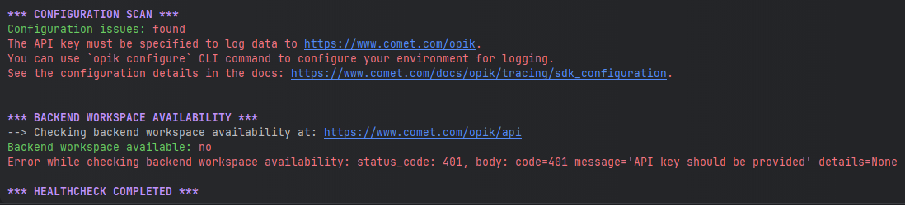

This guide helps you integrate the Opik platform with your existing LLM application. The goal of this guide is to help you log your first LLM calls and chains to the Opik platform.

<Frame>
  
</Frame>

## Set up

Getting started is as simple as creating an [account on Comet](https://www.comet.com/signup?from=llm) or [self-hosting the platform](/self-host/overview).

Once your account is created, you can start logging traces by installing the Opik Python SDK:

<Tabs>
  <Tab value="Python" title="Python">

```bash
pip install opik
```

</Tab>

<Tab value="JS / TS" title="JS / TS">

```bash
npm install opik
```

</Tab>
</Tabs>

and configuring the SDK with:

<Tabs>
<Tab value="Python" title="Python">

If you are using the Python SDK, we recommend running the `opik configure` command
from the command line which will prompt you for all the necessary information:

```bash
opik configure
```

You can learn more about configuring the Python SDK [here](/tracing/sdk_configuration).

</Tab>
<Tab value="JS / TS" title="JS / TS">

If you are using the Javascript SDK you will need to set the required
parameters when initializing the client:

```js
import { Opik } from "opik";

// Create a new Opik client with your configuration
const client = new Opik({
  apiKey: "<your-api-key>",
  apiUrl: "https://www.comet.com/opik/api", // Replace with http://localhost:5173/api if you are self-hosting
  projectName: "default",
  workspaceName: "<your-workspace-name>", // Typically the same as your username
});
```

</Tab>

</Tabs>

## How can I diagnose issues with Opik?

If you are experiencing any problems using Opik, such as receiving 400 or 500 errors from the backend, or being unable to connect at all, we recommend running the following command in your terminal:

```bash
opik healthcheck
```

This command will analyze your configuration and backend connectivity, providing useful insights into potential issues.

<Frame>
  
</Frame>

Reviewing these sections can help pinpoint the source of the problem and suggest possible resolutions.

## Adding Opik observability to your codebase

### Logging LLM calls

The first step in integrating Opik with your codebase is to track your LLM calls. If you are using OpenAI, OpenRouter, or any LLM provider that is supported by LiteLLM, then you
can use one of our [integrations](/tracing/integrations/overview):

<Tabs>
    <Tab value="OpenAI (Python)" title="OpenAI (Python)">

```python
from opik.integrations.openai import track_openai
from openai import OpenAI

# Wrap your OpenAI client
openai_client = OpenAI()
openai_client = track_openai(openai_client)
```

All OpenAI calls made using the `openai_client` will now be logged to Opik.

</Tab>
<Tab value="OpenRouter (Python)" title="OpenRouter (Python)">

```python {pytest_codeblocks_skip=true}
from opik.integrations.openai import track_openai
from openai import OpenAI

# Initialize OpenRouter client
client = OpenAI(
    base_url="https://openrouter.ai/api/v1",
    api_key="YOUR_OPENROUTER_API_KEY"
)
client = track_openai(client)

# Optional headers for OpenRouter leaderboard
headers = {
    "HTTP-Referer": "YOUR_SITE_URL",  # Optional
    "X-Title": "YOUR_SITE_NAME"  # Optional
}

response = client.chat.completions.create(
    model="openai/gpt-4",  # You can use any model available on OpenRouter
    extra_headers=headers,
    messages=[{"role": "user", "content": "Hello!"}]
)
```

All OpenRouter calls made using the `client` will now be logged to Opik.

</Tab>
<Tab value="LiteLLM (Python)" title="LiteLLM (Python)">

```python {pytest_codeblocks_skip=true}
from litellm.integrations.opik.opik import OpikLogger
import litellm

# Wrap your LiteLLM client
opik_logger = OpikLogger()
litellm.callbacks = [opik_logger]
```

All LiteLLM calls made using the `litellm` client will now be logged to Opik.

</Tab>

<Tab value="Decorator (Python)" title="Decorator (Python)">

If you are using an LLM provider that Opik does not have an integration for, you can still log the LLM calls by using the `@track` decorator:

```python {pytest_codeblocks_skip=true}
from opik import track
import anthropic

@track
def call_llm(client, messages):
    return client.messages.create(messages=messages)

client = anthropic.Anthropic()

call_llm(client, [{"role": "user", "content": "Why is tracking and evaluation of LLMs important?"}])
```

The `@track` decorator will automatically log the input and output of the decorated function allowing you to track the user
messages and the LLM responses in Opik. If you want to log more than just the input and output, you can use the `update_current_span` function
as described in the [Traces / Logging Additional Data section](/tracing/log_traces#logging-additional-data).

</Tab>

<Tab value="JS / TS" title="JS / TS">

You can use the Opik client to log your LLM calls to Opik:

```js
import { Opik } from "opik";

// Create a new Opik client with your configuration
const client = new Opik({
  apiKey: "<your-api-key>",
  host: "https://www.comet.com/opik/api",
  projectName: "<your-project-name>",
  workspaceName: "<your-workspace-name>",
});

// Log a trace with an LLM span
const trace = client.trace({
  name: `Trace`,
  input: {
    prompt: `Hello!`,
  },
  output: {
    response: `Hello, world!`,
  },
});

const span = trace.span({
  name: `Span`,
  type: "llm",
  input: {
    prompt: `Hello, world!`,
  },
  output: {
    response: `Hello, world!`,
  },
});

// Flush the client to send all traces and spans
await client.flush();
```

</Tab>
</Tabs>

### Logging chains

It is common for LLM applications to use chains rather than just calling the LLM once. This is achieved by either using a framework
like [LangChain](/tracing/integrations/langchain), [LangGraph](/tracing/integrations/langgraph) or [LLamaIndex](/tracing/integrations/llama_index),
or by writing custom python code.

Opik makes it easy for your to log your chains no matter how you implement them:

<Tabs>
    <Tab value="Custom Python Code" title="Custom Python Code">

If you are not using any frameworks to build your chains, you can use the `@track` decorator to log your chains. When a
function is decorated with `@track`, the input and output of the function will be logged to Opik. This works well even for very
nested chains:

```python
from opik import track
from opik.integrations.openai import track_openai
from openai import OpenAI

# Wrap your OpenAI client
openai_client = OpenAI()
openai_client = track_openai(openai_client)

# Create your chain
@track
def llm_chain(input_text):
    context = retrieve_context(input_text)
    response = generate_response(input_text, context)

    return response

@track
def retrieve_context(input_text):
    # For the purpose of this example, we are just returning a hardcoded list of strings
    context =[
        "What specific information are you looking for?",
        "How can I assist you with your interests today?",
        "Are there any topics you'd like to explore or learn more about?",
    ]
    return context

@track
def generate_response(input_text, context):
    full_prompt = (
        f" If the user asks a question that is not specific, use the context to provide a relevant response.\n"
        f"Context: {', '.join(context)}\n"
        f"User: {input_text}\n"
        f"AI:"
    )

    response = openai_client.chat.completions.create(
        model="gpt-3.5-turbo",
        messages=[{"role": "user", "content": full_prompt}]
    )
    return response.choices[0].message.content

llm_chain("Hello, how are you?")
```

While this code sample assumes that you are using OpenAI, the same principle applies if you are using any other LLM provider.

<Info>
  Your chains will now be logged to Opik and can be viewed in the Opik UI. To learn more about how you can customize the
  logged data, see the [Log Traces](/tracing/log_traces) guide.
</Info>

</Tab>
<Tab value="LangChain" title="LangChain">

If you are using LangChain to build your chains, you can use the `OpikTracer` to log your chains. The `OpikTracer` is a LangChain callback that will
log every step of the chain to Opik:

```python {pytest_codeblocks_skip=true}
from langchain_openai import OpenAI
from langchain.prompts import PromptTemplate
from opik.integrations.langchain import OpikTracer

# Initialize the tracer
opik_tracer = OpikTracer()

# Create the LLM Chain using LangChain
llm = OpenAI(temperature=0)

prompt_template = PromptTemplate(
    input_variables=["input"],
    template="Translate the following text to French: {input}"
)

# Use pipe operator to create LLM chain
llm_chain = prompt_template | llm

# Generate the translations
llm_chain.invoke({"input": "Hello, how are you?"}, callbacks=[opik_tracer])
```

<Info>
  Your chains will now be logged to Opik and can be viewed in the Opik UI. To learn more about how you can customize the
  logged data, see the [Log Traces](/tracing/log_traces) guide.
</Info>

</Tab>

<Tab value="LLamaIndex" title="LLamaIndex">

If you are using LLamaIndex you can set `opik` as a global callback to log all LLM calls:

```python {pytest_codeblocks_skip=true}
from llama_index.core import global_handler, set_global_handler

set_global_handler("opik")
opik_callback_handler = global_handler
```

You LlamaIndex calls from that point forward will be logged to Opik. You can learn more about the LlamaIndex integration in the [LLamaIndex integration docs](/tracing/integrations/llama_index).

<Info>
  Your chains will now be logged to Opik and can be viewed in the Opik UI. To learn more about how you can customize the
  logged data, see the [Log Traces](/tracing/log_traces) guide.
</Info>

</Tab>

<Tab value="AI Vercel SDK (JS / TS)" title="AI Vercel SDK (JS / TS)">

We are currently working on a AI Vercel SDK integration, stay tuned!

Feel free to [open an issue](https://github.com/comet-ml/opik/issues) if you have any specific requests or suggestions

</Tab>

</Tabs>

## Next steps

Now that you have logged your first LLM calls and chains to Opik, why not check out:

1. [Opik's evaluation metrics](/evaluation/metrics/overview): Opik provides a suite of evaluation metrics (Hallucination, Answer Relevance, Context Recall, etc.) that you can use to score your LLM responses.
2. [Opik Experiments](/evaluation/concepts): Opik allows you to automated the evaluation process of your LLM application so that you no longer need to manually review every LLM response.
