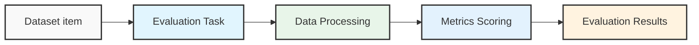

The TypeScript SDK provides a streamlined approach to evaluating your LLM applications with the `evaluate` function that handles various evaluation scenarios.

## Structure

The TypeScript SDK evaluation documentation covers:

- **[Quick Start](/reference/typescript-sdk/evaluation/quick-start)**: Get up and running with basic evaluations
- **[Datasets](/reference/typescript-sdk/evaluation/datasets)**: Working with evaluation datasets
- **[Evaluate Function](/reference/typescript-sdk/evaluation/evaluate)**: Using the evaluate function
- **[Evaluation Metrics](/reference/typescript-sdk/evaluation/metrics)**: Available metrics and creating custom metrics
- **[Experiments](/reference/typescript-sdk/evaluation/experiments)**: Creating and managing evaluation experiments