# ClickHouse Analytics Database Schema Diagram

This diagram shows all tables and their relationships in the ClickHouse analytics database for Opik.

```mermaid
erDiagram
    %% Core Tracing Tables
    traces {
        FixedString-36 id PK
        String workspace_id FK
        FixedString-36 project_id FK
        String name
        DateTime64-9-UTC start_time
        DateTime64-9-UTC end_time
        String input
        String output
        String metadata
        Array-String tags
        String thread_id "nullable"
        Enum visibility_mode
        DateTime64-9-UTC created_at
        DateTime64-6-UTC last_updated_at
        String created_by
        String last_updated_by
    }

    spans {
        FixedString-36 id PK
        String workspace_id FK
        FixedString-36 project_id FK
        FixedString-36 trace_id FK
        String parent_span_id "nullable"
        String name
        Enum8 type "general|tool|llm|guardrails"
        DateTime64-9-UTC start_time
        DateTime64-9-UTC end_time
        String input
        String output
        String metadata
        Array-String tags
        Map-String-Int32 usage
        String model "nullable"
        String error_info "nullable"
        DateTime64-9-UTC created_at
        DateTime64-6-UTC last_updated_at
        String created_by
        String last_updated_by
    }

    %% Feedback Systems
    feedback_scores {
        FixedString-36 entity_id FK
        Enum entity_type "trace|span|thread"
        FixedString-36 project_id FK
        String workspace_id FK
        String name
        String category_name
        Decimal32-4 value
        String reason
        Enum8 source "sdk|ui|online_scoring"
        DateTime64-9-UTC created_at
        DateTime64-9-UTC last_updated_at
        String created_by
        String last_updated_by
    }

    authored_feedback_scores {
        FixedString-36 entity_id FK
        Enum8 entity_type "trace|span|thread"
        FixedString-36 project_id FK
        String workspace_id FK
        String author
        String name
        String category_name
        Decimal-18-9 value
        String reason
        Enum8 source "sdk|ui|online_scoring"
        DateTime64-9-UTC created_at
        DateTime64-9-UTC last_updated_at
        String created_by
        String last_updated_by
    }

    %% Dataset and Experiment System
    dataset_items {
        String workspace_id FK
        FixedString-36 dataset_id FK
        FixedString-36 id PK
        Enum source "sdk|manual|span|trace"
        String trace_id "nullable"
        String span_id "nullable"
        String input
        String input_data "nullable"
        String expected_output
        String metadata
        DateTime64-9-UTC created_at
        DateTime64-9-UTC last_updated_at
        String created_by
        String last_updated_by
    }

    experiments {
        String workspace_id FK
        FixedString-36 dataset_id FK
        FixedString-36 id PK
        String name
        String metadata "nullable"
        FixedString-36 prompt_version "nullable"
        FixedString-36 prompt_id "nullable"
        Array-FixedString-36 prompt_versions "nullable"
        FixedString-36 optimization_id "nullable"
        DateTime64-9-UTC created_at
        DateTime64-9-UTC last_updated_at
        String created_by
        String last_updated_by
    }

    experiment_items {
        FixedString-36 id PK
        FixedString-36 experiment_id FK
        FixedString-36 dataset_item_id FK
        FixedString-36 trace_id FK
        String workspace_id FK
        DateTime64-9-UTC created_at
        DateTime64-9-UTC last_updated_at
        String created_by
        String last_updated_by
    }

    optimizations {
        String workspace_id FK
        FixedString-36 dataset_id FK
        FixedString-36 id PK
        String name
        String objective_name
        Enum status "running|completed|cancelled"
        String metadata
        Boolean dataset_deleted "default false"
        DateTime64-9-UTC created_at
        DateTime64-6-UTC last_updated_at
        String created_by
        String last_updated_by
    }

    %% Comments and Attachments
    comments {
        FixedString-36 id PK
        FixedString-36 entity_id FK
        Enum entity_type "trace|span|thread"
        FixedString-36 project_id FK
        String workspace_id FK
        String text
        DateTime64-9-UTC created_at
        DateTime64-9-UTC last_updated_at
        String created_by
        String last_updated_by
    }

    attachments {
        String workspace_id FK
        FixedString-36 container_id FK
        FixedString-36 entity_id FK
        Enum entity_type "trace|span"
        String file_name
        String mime_type
        Int64 file_size
        DateTime64-9-UTC created_at
        DateTime64-9-UTC last_updated_at
        DateTime64-9-UTC deleted_at
        String created_by
        String last_updated_by
    }

    %% Threading System
    trace_threads {
        FixedString-36 id PK
        String thread_id
        FixedString-36 project_id FK
        String workspace_id FK
        Enum status "active|inactive"
        Array-String tags "nullable"
        UInt32 sampling "nullable"
        DateTime64-9-UTC scored_at "nullable"
        DateTime64-9-UTC created_at
        DateTime64-6-UTC last_updated_at
        String created_by
        String last_updated_by
    }

    %% Annotation System
    annotation_queues {
        FixedString-36 id PK
        String workspace_id FK
        FixedString-36 project_id FK
        String name
        String description
        String instructions
        Enum8 scope "trace|thread"
        Boolean comments_enabled
        Array-FixedString-36 feedback_definitions
        DateTime64-9-UTC created_at
        String created_by
        DateTime64-9-UTC last_updated_at
        String last_updated_by
    }

    %% Guardrails
    guardrails {
        FixedString-36 id PK
        FixedString-36 entity_id FK
        Enum entity_type "trace|span"
        FixedString-36 secondary_entity_id FK
        FixedString-36 project_id FK
        String workspace_id FK
        String name
        Enum result "passed|failed"
        String config
        String details
        DateTime64-9-UTC created_at
        DateTime64-9-UTC last_updated_at
        String created_by
        String last_updated_by
    }

    %% System Tables
    automation_rule_evaluator_logs {
        DateTime64-9-UTC timestamp PK
        String workspace_id FK
        FixedString-36 rule_id PK
        Enum8 level "TRACE|DEBUG|INFO|WARN|ERROR"
        String message
        Map-String-String markers
    }

    workspace_configurations {
        String workspace_id PK
        UInt32 timeout_mark_thread_as_inactive
        DateTime64-9-UTC created_at
        String created_by
        DateTime64-6-UTC last_updated_at
        String last_updated_by
    }

    %% Relationships
    %% Core Tracing Relationships
    traces ||--o{ spans : "trace_id"
    traces ||--o{ feedback_scores : "entity_id (trace)"
    spans ||--o{ feedback_scores : "entity_id (span)"
    traces ||--o{ authored_feedback_scores : "entity_id (trace)"
    spans ||--o{ authored_feedback_scores : "entity_id (span)"
    trace_threads ||--o{ authored_feedback_scores : "entity_id (thread)"

    %% Dataset and Experiment Relationships
    dataset_items ||--o{ experiments : "dataset_id"
    experiments ||--o{ experiment_items : "experiment_id"
    dataset_items ||--o{ experiment_items : "dataset_item_id"
    traces ||--o{ experiment_items : "trace_id"
    dataset_items ||--o{ optimizations : "dataset_id"
    optimizations ||--o{ experiments : "optimization_id"

    %% Comments and Attachments
    traces ||--o{ comments : "entity_id (trace)"
    spans ||--o{ comments : "entity_id (span)"
    trace_threads ||--o{ comments : "entity_id (thread)"
    traces ||--o{ attachments : "entity_id (trace)"
    spans ||--o{ attachments : "entity_id (span)"

    %% Guardrails
    traces ||--o{ guardrails : "entity_id (trace)"
    spans ||--o{ guardrails : "entity_id (span)"

    %% Threading
    trace_threads ||--o{ feedback_scores : "entity_id (thread)"

    %% Workspace Organization
    workspace_configurations ||--o{ traces : "workspace_id"
    workspace_configurations ||--o{ spans : "workspace_id"
    workspace_configurations ||--o{ dataset_items : "workspace_id"
    workspace_configurations ||--o{ experiments : "workspace_id"
    workspace_configurations ||--o{ trace_threads : "workspace_id"
    workspace_configurations ||--o{ annotation_queues : "workspace_id"
    workspace_configurations ||--o{ automation_rule_evaluator_logs : "workspace_id"
```

## Table Categories

### 🔵 **Core Tracing**
- **traces**: Main trace records containing execution flows
- **spans**: Individual operations within traces (parent-child hierarchy)

### 🟢 **Feedback & Scoring**
- **feedback_scores**: General feedback scores for traces/spans/threads
- **authored_feedback_scores**: Authored feedback with precision scoring

### 🟡 **Dataset & Experimentation**
- **dataset_items**: Training/test data items
- **experiments**: Experimental runs on datasets
- **experiment_items**: Links experiments to specific dataset items and traces
- **optimizations**: Optimization experiments with status tracking

### 🟠 **Content Management**
- **comments**: User comments on traces/spans/threads
- **attachments**: File attachments for traces/spans

### 🟣 **Threading & Annotation**
- **trace_threads**: Thread management for conversational flows
- **annotation_queues**: Human annotation workflow management

### 🔴 **Quality & Governance**
- **guardrails**: Validation results for content quality/safety

### ⚫ **System & Configuration**
- **automation_rule_evaluator_logs**: System logs with TTL (6 months)
- **workspace_configurations**: Workspace-level settings

## Key Relationships

### Hierarchical Relationships
- **Workspace** → **Projects** → **Traces** → **Spans** (hierarchical containment)
- **Datasets** → **Experiments** → **Experiment Items** (experimental workflow)

### Cross-Cutting Relationships  
- **Entity-based**: Traces, Spans, and Threads can have feedback, comments, and attachments
- **Threading**: Traces can be part of conversational threads
- **Experimentation**: Traces can be results of experiments on dataset items

### Data Flow
1. **Traces and Spans** are created from application execution
2. **Dataset Items** provide input data for experiments  
3. **Experiments** run against datasets, producing **Traces**
4. **Feedback Scores** evaluate the quality of traces/spans
5. **Comments and Attachments** provide additional context
6. **Guardrails** validate content safety and quality

## Engine Types Used
- **ReplacingMergeTree**: Most tables (supports updates via last_updated_at)
- **ReplicatedReplacingMergeTree**: Newer tables with cluster support
- **MergeTree**: Log tables (automation_rule_evaluator_logs with TTL)

## Notes
- No foreign key constraints (ClickHouse doesn't support them)
- Relationships are logical based on field names and types
- All IDs are FixedString(36) representing UUIDs
- Workspace serves as the top-level partitioning key
- Most tables include audit fields (created_by, last_updated_by, timestamps)
