# Opik Helm Deployment on Azure

This guide helps you deploy Opik to Azure Kubernetes Service (AKS) using Helm with custom-built images.

## Prerequisites

Before running the deployment script, make sure you have:

1. **Azure CLI** installed and configured
   ```bash
   # Install Azure CLI (macOS)
   brew install azure-cli
   
   # Login to Azure
   az login
   ```

2. **Docker** installed and running
   ```bash
   docker --version
   ```

3. **kubectl** installed
   ```bash
   # Install kubectl (macOS)
   brew install kubectl
   ```

4. **Helm** installed
   ```bash
   # Install Helm (macOS)
   brew install helm
   ```

## Quick Start

1. **Navigate to the deployment directory:**
   ```bash
   cd /Users/luisarteiro/Documents/opik/deployment
   ```

2. **Run the deployment script:**
   ```bash
   ./deploy-opik-helm-azure.sh
   ```

## What the Script Does

The deployment script automatically:

### 1. **Infrastructure Setup**
- ✅ Creates Azure Resource Group (`opik-rg`)
- ✅ Creates Azure Container Registry (ACR) - `opikacr`
- ✅ Creates Azure Kubernetes Service (AKS) cluster - `opik-aks`
- ✅ Configures AKS to use ACR for image pulling

### 2. **Image Building & Publishing**
- 🐳 Builds `opik-backend` from source
- 🐳 Builds `opik-python-backend` from source  
- 🐳 Builds `opik-frontend` from source
- 🐳 Builds `opik-sandbox-executor-python` from source
- 🐳 Optionally builds `opik-guardrails-backend` (if enabled)
- 📤 Pushes all images to your Azure Container Registry

### 3. **Helm Deployment**
- 📋 Creates custom `helm-values-azure.yaml` with your ACR images
- ⚙️ Configures all services according to your `.env.azure` settings
- 🚀 Deploys Opik using the local Helm chart
- ⏳ Waits for all pods to be ready
- 🌐 Sets up ingress for external access

## Configuration

The script uses settings from `docker-compose/.env.azure`:

```bash
ACR_NAME="opikacr"                    # Azure Container Registry name
OPIK_VERSION="latest"                 # Version tag for the build Docker images
TOGGLE_GUARDRAILS_ENABLED="false"     # Enable/disable guardrails
CREATE_DEMO_DATA="true"               # Generate demo data on startup
# ... and other settings
```

## Accessing Opik

After deployment, you can access Opik in several ways:

### Option 1: Port Forward (Recommended for testing)
```bash
kubectl port-forward -n opik svc/opik-frontend 5173:5173
```
Then visit: http://localhost:5173

### Option 2: External Access (Production)
The script configures an ingress, but you'll need to:
1. Install an ingress controller on your AKS cluster
2. Configure DNS or use the external IP

## Monitoring Your Deployment

### Check Pod Status
```bash
kubectl get pods -n opik
```

### View Logs
```bash
# Backend logs
kubectl logs -n opik deployment/opik-backend

# Frontend logs  
kubectl logs -n opik deployment/opik-frontend

# Python backend logs
kubectl logs -n opik deployment/opik-python-backend
```

### Check Services
```bash
kubectl get services -n opik
```

## Scaling Your Deployment

You can scale individual components:

```bash
# Scale backend to 3 replicas
kubectl scale deployment opik-backend -n opik --replicas=3

# Scale frontend to 2 replicas
kubectl scale deployment opik-frontend -n opik --replicas=2
```

## Updating Your Deployment

To update with new code changes:

1. **Build and push new images:**
   ```bash
   # The script handles this automatically
   ./deploy-opik-helm-azure.sh
   ```

2. **Or manually update specific components:**
   ```bash
   # Build new image
   docker build -t opikacr.azurecr.io/opik-backend:v2.0.0 ./apps/opik-backend
   docker push opikacr.azurecr.io/opik-backend:v2.0.0
   
   # Update deployment
   kubectl set image deployment/opik-backend opik-backend=opikacr.azurecr.io/opik-backend:v2.0.0 -n opik
   ```

## Troubleshooting

### Common Issues

1. **Images not pulling:**
   ```bash
   # Check if ACR is attached to AKS
   az aks check-acr --name opik-aks --resource-group opik-rg --acr opikacr.azurecr.io
   ```

2. **Pods stuck in Pending:**
   ```bash
   # Check node resources
   kubectl describe node
   kubectl top nodes
   ```

3. **Services not accessible:**
   ```bash
   # Check service endpoints
   kubectl get endpoints -n opik
   ```

### Useful Commands

```bash
# Get cluster info
kubectl cluster-info

# Check Helm releases
helm list -n opik

# Get detailed pod information
kubectl describe pod <pod-name> -n opik

# Check resource usage
kubectl top pods -n opik
```

## Cost Optimization

The default setup creates:
- **AKS cluster**: 3 x Standard_D2s_v3 nodes (~$150/month)
- **ACR**: Basic tier (~$5/month)
- **Storage**: For persistent volumes (~$10/month)

To reduce costs:
- Use fewer/smaller nodes for development
- Use Azure Dev/Test pricing if eligible
- Delete resources when not in use

## Support

If you encounter issues:

1. Check the script output for error messages
2. Verify all prerequisites are installed
3. Check Azure portal for resource status
4. Review Kubernetes events: `kubectl get events -n opik`

## Architecture

```mermaid
graph TB
    %% User Interface Layer
    User[👤 User] --> Frontend
    
    %% Application Layer
    Frontend[🌐 opik-frontend<br/>React/Nginx<br/>Port: 5173] --> Backend
    Frontend --> PythonBackend
    
    Backend[⚙️ opik-backend<br/>Java/Dropwizard<br/>Port: 8080] --> MySQL
    Backend --> ClickHouse
    Backend --> Redis
    Backend --> PythonBackend
    
    PythonBackend[🐍 opik-python-backend<br/>FastAPI<br/>Port: 8000] --> SandboxExecutor
    
    %% Infrastructure Services Layer
    SandboxExecutor[🔒 opik-sandbox-executor-python<br/>Code Execution]
    
    %% Storage Layer
    MySQL[(🗄️ MySQL<br/>State Database<br/>Port: 3306)]
    ClickHouse[(📊 ClickHouse<br/>Analytics Database<br/>Port: 8123)]
    Redis[(⚡ Redis<br/>Cache & Sessions<br/>Port: 6379)]
    
    %% Supporting Services
    MinIO[📦 MinIO<br/>Object Storage<br/>Port: 9000]
    ZooKeeper[🔧 ZooKeeper<br/>Coordination<br/>Port: 2181]
    
    Backend --> MinIO
    ClickHouse --> ZooKeeper
    
    %% Optional Components
    Guardrails[🛡️ opik-guardrails-backend<br/>AI Safety<br/>Optional]
    Backend -.-> Guardrails
    
    %% Styling
    classDef frontend fill:#e1f5fe,stroke:#0277bd,stroke-width:2px
    classDef backend fill:#f3e5f5,stroke:#7b1fa2,stroke-width:2px
    classDef database fill:#e8f5e8,stroke:#2e7d32,stroke-width:2px
    classDef storage fill:#fff3e0,stroke:#ef6c00,stroke-width:2px
    classDef optional fill:#fafafa,stroke:#757575,stroke-width:1px,stroke-dasharray: 5 5
    
    class Frontend frontend
    class Backend,PythonBackend backend
    class MySQL,ClickHouse,Redis database
    class MinIO,ZooKeeper storage
    class Guardrails optional
```



This deployment gives you a production-ready Opik installation running on Azure with all the benefits of Kubernetes orchestration!
