# Opik Helm Deployment on Azure

Deploy Opik to Azure Kubernetes Service (AKS) using Helm with custom-built images.

## Prerequisites

> [!IMPORTANT]
> You must use the **DevScope** account. Run `az login` and select the DevScope account before executing the deployment script.

Install required tools:

```bash
# Azure CLI
brew install azure-cli
az login  # Select DevScope account

# Docker, kubectl, Helm
brew install docker kubectl helm
```

## Quick Start

> [!TIP]
> Only edit the `.env.azure` file for configuration. The `helm-values-azure-template.yaml` is a template that should not be manually modified.

1. **Navigate to deployment directory:**
   ```bash
   cd /Users/luisarteiro/Documents/opik/deployment
   ```

2. **Configure your deployment:**
   ```bash
   # Edit .env.azure with your Azure configuration
   vim .env.azure
   ```

3. **Deploy:**
   ```bash
   ./deploy-opik-helm-azure.sh
   ```

## Configuration

> [!WARNING]
> Never manually edit version numbers in `helm-values-azure-template.yaml`. **Always change `OPIK_VERSION` in `.env.azure` instead.**

### Single Source of Truth (`.env.azure`)

All configuration is managed in this file:

```bash
# Azure Infrastructure
RESOURCE_GROUP="opik-rg"
LOCATION="northeurope"
AKS_CLUSTER_NAME="opik-aks"
ACR_NAME="opikacr"
NAMESPACE="opik"

# Application Settings
OPIK_VERSION="latest"                # Change this for updates
TOGGLE_GUARDRAILS_ENABLED="false"
```

The template file automatically uses these variables - no manual editing required.

## What the Script Does

The deployment script automatically handles:

### Infrastructure Setup
- Creates Azure Resource Group, Container Registry (ACR), and AKS cluster
- Configures AKS to pull images from ACR

### Image Building & Publishing
- Builds all Opik services from source:
  - `opik-backend` (Java/Dropwizard)
  - `opik-python-backend` (FastAPI)
  - `opik-frontend` (React)
  - `opik-sandbox-executor-python`
  - `opik-guardrails-backend` (optional)
- Pushes images to your Azure Container Registry

### Helm Deployment
- Deploys using local Helm chart with environment substitution
- Waits for all pods to be ready
- Sets up ingress for external access

## Accessing Opik

### Port Forward (Recommended for testing)
```bash
kubectl port-forward -n opik svc/opik-frontend 5173:5173
```
Visit: http://localhost:5173

### External Access (Production)
> [!NOTE]
> Requires ingress controller installation and DNS configuration on the AKS cluster.

## Monitoring

```bash
# Check pod status
kubectl get pods -n opik

# View logs
kubectl logs -n opik deployment/opik-backend
kubectl logs -n opik deployment/opik-frontend
kubectl logs -n opik deployment/opik-python-backend

# Check services
kubectl get services -n opik
```

## Updating Deployment

> [!IMPORTANT]
> To update with new code changes, only modify the version in `.env.azure` and re-run the script.

1. **Update version:**
   ```bash
   # Edit .env.azure
   OPIK_VERSION="v2.0.0"
   ```

2. **Redeploy:**
   ```bash
   ./deploy-opik-helm-azure.sh
   ```

The script rebuilds images with the new version tag and updates the deployment.

## Troubleshooting

### Common Issues

**Images not pulling:**
```bash
az aks check-acr --name opik-aks --resource-group opik-rg --acr opikacr.azurecr.io
```

**Pods stuck in Pending:**
```bash
kubectl describe node
kubectl top nodes
```

**Services not accessible:**
```bash
kubectl get endpoints -n opik
kubectl get events -n opik
```

### Useful Commands

```bash
# Cluster info
kubectl cluster-info
helm list -n opik

# Resource usage
kubectl top pods -n opik

# Scale components
kubectl scale deployment opik-backend -n opik --replicas=3
```

## Cost Optimization

> [!NOTE]
> Default setup costs approximately $165/month:
> - AKS cluster (3 x Standard_D2s_v3): ~$150/month
> - ACR Basic tier: ~$5/month
> - Storage: ~$10/month

For development, consider using fewer/smaller nodes and delete resources when not in use.

## Architecture

```mermaid
graph TB
    User[👤 User] --> Frontend[🌐 Frontend<br/>React/Nginx<br/>:5173]
    Frontend --> Backend[⚙️ Backend<br/>Java/Dropwizard<br/>:8080]
    Frontend --> PythonBackend[🐍 Python Backend<br/>FastAPI<br/>:8000]
    
    Backend --> MySQL[(🗄️ MySQL<br/>:3306)]
    Backend --> ClickHouse[(📊 ClickHouse<br/>:8123)]
    Backend --> Redis[(⚡ Redis<br/>:6379)]
    Backend --> MinIO[📦 MinIO<br/>:9000]
    
    PythonBackend --> SandboxExecutor[🔒 Sandbox Executor]
    ClickHouse --> ZooKeeper[🔧 ZooKeeper<br/>:2181]
    
    Backend -.-> Guardrails[🛡️ Guardrails<br/>Optional]
    
    classDef frontend fill:#e1f5fe,stroke:#0277bd
    classDef backend fill:#f3e5f5,stroke:#7b1fa2
    classDef database fill:#e8f5e8,stroke:#2e7d32
    classDef optional stroke-dasharray: 5 5
    
    class Frontend frontend
    class Backend,PythonBackend backend
    class MySQL,ClickHouse,Redis database
    class Guardrails optional
```


