# Opik Azure Kubernetes Deployment

> **🎯 Complete guide to deploy Opik on Azure Kubernetes Service (AKS) with external access**

Here you can deploy Opik to Azure with production-ready networking using Azure Application Gateway Ingress Controller (AGIC) for external access without port forwarding.

## 📋 Prerequisites

> [!IMPORTANT]
> **Required**: Use the **DevScope** Azure account. Run `az login` and select the DevScope account before deployment.

### Install Required Tools

```bash
# Azure CLI
brew install azure-cli
az login  # ⚠️ Select DevScope account

# Container and Kubernetes tools
brew install docker kubectl helm

# Text processing (for configuration templating)
brew install gettext
```

### Verify Installation

```bash
# Check tool versions
az --version
docker --version
kubectl version --client
helm version

# Ensure Docker is running
docker info
```

## 🚀 Quick Start

### 1. Navigate to Deployment Directory

```bash
cd /Users/luisarteiro/Documents/opik/deployment
```

### 2. Configure the Deployment

> [!TIP]
> **Only edit `.env.azure`** - never modify the template files directly.

To configure the Azure resources that you're going to deploy, edit the `.env.azure` file.

```bash
# Edit configuration file
vim .env.azure
```

### 3. Deploy

```bash
./deploy-azure.sh
```

> [!NOTE]
> **First deployment takes 15-20 minutes** - the script builds images, creates infrastructure, and deploys services.

## 🏗️ What the Deployment Does

The script automatically handles everything:

### 🔧 Infrastructure Creation
- **Resource Group**: Container for all Azure resources
- **Virtual Network**: Isolated network with subnets for AKS and Application Gateway
- **Application Gateway**: Load balancer with public IP for external access
- **AKS Cluster**: Kubernetes cluster with Azure CNI networking
- **Container Registry**: Private registry for your Docker images

### 📦 Image Building & Publishing
- Builds all Opik services from source:
  - `opik-backend` (Java/Dropwizard API)
  - `opik-python-backend` (Python evaluator service)
  - `opik-frontend` (React web application)
  - `opik-sandbox-executor-python` (Code execution sandbox)
- Pushes images to Azure Container Registry

### ⚙️ Application Deployment
- Deploys using Helm with proper ingress configuration
- Sets up databases: MySQL, ClickHouse, Redis
- Configures external access through Application Gateway
- Enables health monitoring and auto-scaling

## 🌐 Accessing the Application

After successful deployment, the output will show something like this:

```
✓ 🌐 Application available at: https://52.155.251.75 (HTTPS - Recommended)
ℹ Also available at: http://52.155.251.75 (HTTP)
⚠ HTTPS uses self-signed certificate - accept browser security warning
ℹ It may take a few minutes for Application Gateway to configure backend pools
ℹ If you get 502 errors, wait a few minutes and try again
✓ 🎉 Deployment completed successfully!
```

### Primary Access (Recommended)

**Direct Browser Access:**
```
http://PUBLIC_IP_ADDRESS
```

### Fallback Access (Troubleshooting)

**Port Forwarding:**
```bash
kubectl port-forward -n opik svc/opik-frontend 5173:5173
```
Then visit: `http://localhost:5173`

## 🔄 Updating the Deployment

> [!IMPORTANT]
> **To update**: Only change `OPIK_VERSION` in `.env.azure` and re-run the script.

### Update to New Version

```bash
# 1. Edit .env.azure
vim .env.azure
# Change: OPIK_VERSION="v2.0.0"

# 2. Redeploy
./deploy-azure.sh
```

The script automatically:
- Rebuilds images with new version tags
- Updates the Kubernetes deployment
- Preserves data and configuration

## 📊 Monitoring the Deployment

### Check Application Status

```bash
# Pod health
kubectl get pods -n opik

# Service status
kubectl get svc -n opik

# Ingress configuration
kubectl get ingress -n opik
```

### View Application Logs

```bash
# Backend logs
kubectl logs -n opik deployment/opik-backend -f

# Frontend logs
kubectl logs -n opik deployment/opik-frontend -f

# Python backend logs
kubectl logs -n opik deployment/opik-python-backend -f
```

### Check External Access

```bash
# Get public IP
az network public-ip show --name opik-appgw-ip --resource-group opik-rg --query "ipAddress" -o tsv

# Test endpoints
curl http://PUBLIC_IP_ADDRESS/health-check        # Backend health
curl http://PUBLIC_IP_ADDRESS/v1/private/toggles/ # API endpoint
```

## 🌐 Public Access Through Ingress

> [!IMPORTANT]
> **All services are publicly accessible** through the Application Gateway at the public IP address. **Azure Entra ID authentication is required** - users will be redirected to Microsoft login.

### 🔓 Publicly Available Endpoints (with Authentication)

Once deployed, the following endpoints are accessible from the internet after Azure Entra ID authentication:

| Endpoint Path | Service | Description |
|---------------|---------|-------------|
| `/` | **Frontend** | Complete Opik web interface |
| `/v1/private/*` | **Java Backend** | Main API endpoints (projects, datasets, traces, etc.) |
| `/v1/private/evaluators/*` | **Python Backend** | Code evaluation and execution endpoints |
| `/health-check` | **Java Backend** | Health monitoring endpoint |

## 🏗️ Architecture Overview

```mermaid
graph TB
    Internet[🌐 Internet] --> AppGW[🛡️ Azure Application Gateway<br/>Public IP]

    AppGW --> |"/ (Root Path)"| Frontend[🌐 Frontend Service<br/>React App<br/>Port: 5173]
    AppGW --> |"/v1/private/evaluators/*"| PythonBackend[🐍 Python Backend<br/>Evaluator Service<br/>Port: 8000]
    AppGW --> |"/v1/* (Fallback)"| Backend[⚙️ Java Backend<br/>Main API<br/>Port: 8080]

    subgraph DeploymentFlow[🚀 Deployment Process]
        Script[📋 deploy-azure.sh]
        Script --> |1. Build & Push| ACR[📦 Azure Container Registry<br/>Docker Images]
        Script --> |2. Create Infrastructure| AzureInfra[☁️ Azure Resources<br/>AKS, VNet, App Gateway]
        Script --> |3. Deploy with Helm| HelmChart[⚙️ Helm Chart<br/>helm-values-azure-template.yaml]
        HelmChart --> |Deploy to| AKS
    end

    subgraph AKS[☸️ Azure Kubernetes Service]
        subgraph OpikNamespace[📁 opik namespace]
            Frontend
            Backend
            PythonBackend
            SandboxExecutor[🔒 Sandbox Executor]

            subgraph DataServices[🗄️ Data Layer]
                MySQL[(🗄️ MySQL<br/>User Data & Config)]
                ClickHouse[(📊 ClickHouse<br/>Analytics & Metrics)]
                Redis[(⚡ Redis<br/>Cache & Sessions)]
                MinIO[📦 MinIO<br/>Object Storage]
                ZooKeeper[🔧 ZooKeeper<br/>ClickHouse Coordination]
            end
        end

        subgraph AGIC[🔌 App Gateway Ingress Controller]
            IngressController[AGIC Pod<br/>Routes traffic from App Gateway]
        end
    end

    Backend --> MySQL
    Backend --> ClickHouse
    Backend --> Redis
    Backend --> MinIO
    ClickHouse --> ZooKeeper
    PythonBackend --> SandboxExecutor
    AppGW -.-> |Managed by| AGIC

    subgraph Network[🔗 Virtual Network - 10.0.0.0/16]
        subgraph AKSSubnet[AKS Subnet - 10.0.1.0/24]
            AKS
        end
        subgraph AppGWSubnet[App Gateway Subnet - 10.0.2.0/24]
            AppGW
        end
    end

    subgraph ConfigManagement[⚙️ Configuration]
        EnvConfig[📄 .env.azure<br/>User Configuration]
        HelmTemplate[📋 helm-values-azure-template.yaml<br/>Kubernetes Configuration]
        EnvConfig --> |Processed by envsubst| HelmTemplate
    end

    classDef frontend fill:#e1f5fe,stroke:#0277bd
    classDef backend fill:#f3e5f5,stroke:#7b1fa2
    classDef database fill:#e8f5e8,stroke:#2e7d32
    classDef network fill:#fff3e0,stroke:#f57c00
    classDef deployment fill:#f1f8e9,stroke:#558b2f
    classDef config fill:#fce4ec,stroke:#c2185b

    class Frontend frontend
    class Backend,PythonBackend,SandboxExecutor backend
    class MySQL,ClickHouse,Redis,MinIO,ZooKeeper database
    class Network,AKSSubnet,AppGWSubnet network
    class DeploymentFlow,Script,ACR,AzureInfra,HelmChart,AGIC,IngressController deployment
    class ConfigManagement,EnvConfig,HelmTemplate config
```



## 🛣️ Application Gateway Routing Configuration

The routing configuration is **tightly coupled with the application source code** and follows this priority order:

> [!IMPORTANT]
> **Route Priority**: More specific paths are matched first, then fallback to less specific paths.

### 🎯 Route Mapping (Source Code Dependent)

| Route Pattern | Target Service | Source Code Location | Purpose |
|---------------|----------------|---------------------|---------|
| `/` | **Frontend** | `apps/opik-frontend/` | React application serving the UI |
| `/v1/private/evaluators/*` | **Python Backend** | `apps/opik-python-backend/src/opik_backend/evaluator.py` | Code evaluation endpoints |
| `/v1/*` | **Java Backend** | `apps/opik-backend/src/main/java/com/comet/opik/api/resources/v1/` | All other API endpoints |
| `/health-check` | **Java Backend** | Built-in Dropwizard health check | Health monitoring |

### How Routes Are Determined

The routing configuration was discovered by analyzing the source code:

1. **Frontend Routes** (`apps/opik-frontend/src/api/api.ts`):
   ```typescript
   export const PROJECTS_REST_ENDPOINT = "/v1/private/projects/";
   export const DATASETS_REST_ENDPOINT = "/v1/private/datasets/";
   export const TRACES_REST_ENDPOINT = "/v1/private/traces/";
   // ... all frontend API calls expect /v1/private/* endpoints
   ```

2. **Java Backend Routes** (`apps/opik-backend/src/main/java/com/comet/opik/api/resources/v1/`):
   ```java
   @Path("/v1/private/projects")   // ProjectsResource.java
   @Path("/v1/private/datasets")   // DatasetsResource.java  
   @Path("/v1/private/traces")     // TracesResource.java
   // ... main API serves /v1/private/* endpoints
   ```

3. **Python Backend Routes** (`apps/opik-python-backend/src/opik_backend/evaluator.py`):
   ```python
   evaluator = Blueprint('evaluator', __name__, url_prefix='/v1/private/evaluators')
   # ... specialized service for code evaluation
   ```

### ⚠️ Critical Routing Dependencies

> [!WARNING]
> **If you modify API endpoints in the source code, you MUST update the ingress routing in `helm-values-azure-template.yaml`**

- **Frontend expects**: All API calls to start with `/v1/private/`
- **Java Backend serves**: Most `/v1/private/*` endpoints (projects, datasets, traces, etc.)
- **Python Backend serves**: Only `/v1/private/evaluators/*` endpoints
- **Routing conflict resolution**: More specific Python Backend route takes precedence over general Java Backend route

This routing setup ensures that:
1. Users access the React frontend at the root path `/`
2. Frontend API calls reach the correct backend services
3. Specialized evaluator functionality is properly isolated
4. Health checks work for monitoring

### Network Configuration

| Component | Subnet | IP Range | Purpose |
|-----------|--------|----------|---------|
| **AKS Nodes** | aks-subnet | 10.0.1.0/24 | Kubernetes cluster |
| **App Gateway** | appgw-subnet | 10.0.2.0/24 | Load balancer |
| **Virtual Network** | opik-vnet | 10.0.0.0/16 | Network isolation |
