# Opik Azure Kubernetes Deployment

> **🎯 Complete guide to deploy Opik on Azure Kubernetes Service (AKS) with external access**

This guide will provide an overview
of how this Opik repository is being deployed
to Azure Kubernetes Service (AKS) with external access through Azure Application Gateway.

We recommend you read all the sections
because some assumptions were made based on the source code (especially for the [Application Gateway Routing Configuration](#application-gateway-routing-configuration) section).


## 📋 Prerequisites

> [!IMPORTANT] 
> To run any script, 
> you need to use the **DevScope** Azure account. Run `az login` and select the DevScope account before deployment.

### Install Required Tools

```bash
# Azure CLI
brew install azure-cli
az login  # ⚠️ Select DevScope account

# Container and Kubernetes tools
brew install docker kubectl helm

# Text processing (for configuration templating)
brew install gettext
```

### Verify Installation

```bash
# Check tool versions
az --version
docker --version
kubectl version --client
helm version

# Ensure Docker is running
docker info
```

## 🚀 Quick Start

### 1. Navigate to Deployment Directory

```bash
cd /opik/deployment
```

### 2. Configure the Deployment

> [!TIP] 
> **Only edit `.env.azure`** - never modify the template files directly.

To configure the Azure resources that you're going to deploy, edit the `.env.azure` file.

```bash
# Edit configuration file
nano .env.azure
```

### 3. Deploy

```bash
./deploy-azure.sh
```

> [!NOTE] 
> **First deployment takes 15-30 minutes** - the script builds images, creates infrastructure, and deploys services.

## 🔄 Upgrading Opik Versions

### Upgrade Process

```bash
# 1. Merge upstream changes
git remote add upstream https://github.com/comet-ml/opik.git
git fetch upstream && git merge upstream/main

# 2. Update version
nano .env.azure  # Change OPIK_VERSION="NEW.VERSION.HERE"

# 3. Deploy upgrade (preserves all data)
./deploy-azure.sh
```


### Rollback if needed

All data persists through upgrades. Rollback available if issues occur.

```bash
# Option 1: Helm rollback
helm rollback opik -n opik

# Option 2: Version rollback
nano .env.azure  # Set previous version
./deploy-azure.sh
```

### Monitor Upgrade

```bash
# Watch pods update
kubectl get pods -n opik -w

# Check if successful
kubectl rollout status deployment/opik-backend -n opik
```


## 🏗️ What the Deployment Does

The script automatically handles everything:

### Infrastructure Creation

- **Resource Group**: Container for all Azure resources
- **Virtual Network**: Isolated network with subnets for AKS and Application Gateway
- **Application Gateway**: Load balancer with public IP for external access
- **AKS Cluster**: Kubernetes cluster with Azure CNI networking
- **Container Registry**: Private registry for the Docker images

### Image Building & Publishing

- Builds all Opik services from source:
  - `opik-backend`
  - `opik-python-backend`
  - `opik-frontend`
  - `opik-sandbox-executor-python`
- Pushes images to Azure Container Registry.

### Application Deployment

- Deploys using Helm with proper ingress configuration
- Sets up databases: `MySQL`, `ClickHouse`, `Redis`
- Configures external access through Application Gateway
- Enables health monitoring and auto-scaling


## 🌐 Accessing the Application

After successful deployment, the output will show something like this:

```
==== Application Gateway Ready ====
✓ 🌐 Application available at: https://opik.unilabspt.com (HTTPS - Recommended)
ℹ Also available at: http://opik.unilabspt.com (HTTP)
⚠ Configure DNS: opik.unilabspt.com → 52.155.251.75
⚠ HTTPS uses self-signed certificate - accept browser security warning
ℹ It may take a few minutes for Application Gateway to configure backend pools
ℹ If you get 502 errors, wait a few minutes and try again

┌─ 💾 Data Persistence Information ─
✓ ✅ Data is stored on persistent disks in the main resource group
ℹ Your data will survive cluster deletion and recreation!
ℹ Disk Resource Information:
   Resource Group      : opik-rg
ℹ 
ℹ Created Opik Data Disks:
   MySQL               : opik-mysql-data-1756776933
   ClickHouse          : opik-clickhouse-data-1756776966
   MinIO               : opik-minio-data-1756776969
   Redis               : opik-redis-data-1756776972
✓ ✅ Data will persist across cluster deletions!
ℹ Safe to delete cluster - data disks remain in main resource group
⚠ To delete data permanently, manually delete the opik-*-data-* disks
✓ 🎉 Deployment completed successfully!
```

You can then access the application through the link that is provided.
It has a static IP address `52.155.251.75`
that can be accessed through HTTP (port `80`) or HTTPS (port `443`),
though we've mapped the domain `opik.unilabspt.com` to this IP.

> Alternatively, you can port-forward the service to access it locally:
> ```bash
> kubectl port-forward -n opik svc/opik-frontend 5173:5173
> ```
> Then visit: `http://localhost:5173`

## 🔒 SSL Certificate Management

### Automatic SSL Certificate Provisioning

The deployment script **automatically sets up HTTPS with trusted SSL certificates** when a domain name is configured in `.env.azure`:

```bash
# Configure domain and SSL in .env.azure
DOMAIN_NAME="opik.yourdomain.com"          # The domain name
EMAIL_FOR_LETSENCRYPT="you@yourdomain.com" # Required for Let's Encrypt
ENABLE_AUTO_SSL="true"                     # Enable automatic SSL
```

Here's what happens when we run `deploy-azure.sh`:

1. **cert-manager installation**: Installs cert-manager for certificate automation
2. **Let's Encrypt ClusterIssuer**: Creates production-ready certificate issuer
3. **Domain-based OAuth2**: Configures authentication with domain callback URL
4. **HTTPS ingress**: Sets up Application Gateway with SSL termination
5. **Certificate renewal**: Automatic 90-day renewal (no manual intervention)

### SSL Certificate Status

After deployment, we can check the certificate status:

```bash
# Check certificate readiness
kubectl get certificates -n opik

# Expected output:
# NAME              READY   SECRET            AGE
# opik-tls-secret   True    opik-tls-secret   5m

# View certificate details
kubectl describe certificate opik-tls-secret -n opik
```

### Domain Setup Requirements

**Before deployment**, ensure the domain points to the Application Gateway IP:

```bash
# 1. Deploy first to get the public IP
./deploy-azure.sh

# 2. Get the Application Gateway IP
az network public-ip show --name opik-appgw-ip --resource-group opik-rg --query "ipAddress" -o tsv

# 3. Create DNS A record: opik.yourdomain.com → [IP_ADDRESS]
```

### Manual SSL Configuration (setup-ssl.sh)

The `setup-ssl.sh` script is primarily used for **changing domains** or **manual SSL management** after initial deployment:

```bash
# Change domain and re-configure SSL
./setup-ssl.sh new-domain.yourdomain.com
```

This `setup-ssl.sh` script does the following:

1. Updates OAuth2 redirect URLs to use the new domain
2. Creates new SSL certificate for the new domain
3. Updates ingress configuration
4. Reconfigures Application Gateway routing


### SSL Troubleshooting

If SSL certificates fail to issue:

```bash
# Check certificate status
kubectl describe certificate opik-tls-secret -n opik

# Check ACME challenges
kubectl get challenges -n opik

# Check ClusterIssuer status
kubectl describe clusterissuer letsencrypt-prod

# View cert-manager logs
kubectl logs -n cert-manager deployment/cert-manager -f
```

## 🔄 Updating the Deployment

> [!IMPORTANT]
> To update, only change `OPIK_VERSION` in `.env.azure` and re-run the script.


```bash
# 1. Edit .env.azure
nano .env.azure
# Change to a new version, like OPIK_VERSION="v2.0.0"

# 2. Redeploy
./deploy-azure.sh
```

The script automatically:

- Rebuilds images with new version tags
- Updates the Kubernetes deployment
- Preserves data and configuration

## 📊 Monitoring the Deployment

### Check Application Status

```bash
# Pod health
kubectl get pods -n opik

# Service status
kubectl get svc -n opik

# Ingress configuration
kubectl get ingress -n opik
```

### View Application Logs

```bash
# Backend logs
kubectl logs -n opik deployment/opik-backend -f

# Frontend logs
kubectl logs -n opik deployment/opik-frontend -f

# Python backend logs
kubectl logs -n opik deployment/opik-python-backend -f
```

### Check External Access

```bash
# Get public IP
az network public-ip show --name opik-appgw-ip --resource-group opik-rg --query "ipAddress" -o tsv

# Test endpoints
curl http://PUBLIC_IP_ADDRESS/health-check        # Backend health
curl http://PUBLIC_IP_ADDRESS/v1/private/toggles/ # API endpoint
```

## 🌐 Public Access Through Ingress

> [!IMPORTANT] 
> **All services are publicly accessible** through the Application Gateway at the public IP address. **Azure Entra ID authentication is required** - users will be redirected to Microsoft login.

### 🔓 Publicly Available Endpoints (with Authentication)

Once deployed, the following endpoints are accessible from the internet after Azure Entra ID authentication:

| Endpoint Path              | Service            | Description                                           |
| -------------------------- | ------------------ | ----------------------------------------------------- |
| `/`                        | **Frontend**       | Complete Opik web interface                           |
| `/v1/private/*`            | **Java Backend**   | Main API endpoints (projects, datasets, traces, etc.) |
| `/v1/private/evaluators/*` | **Python Backend** | Code evaluation and execution endpoints               |
| `/health-check`            | **Java Backend**   | Health monitoring endpoint                            |

## 🏗️ Architecture Overview

```mermaid
graph TB
    Internet[🌐 Internet] --> AppGW[🛡️ Azure Application Gateway<br/>Public IP]

    AppGW --> |"/ (Root Path)"| Frontend[🌐 Frontend Service<br/>React App<br/>Port: 5173]
    AppGW --> |"/v1/private/evaluators/*"| PythonBackend[🐍 Python Backend<br/>Evaluator Service<br/>Port: 8000]
    AppGW --> |"/v1/* (Fallback)"| Backend[⚙️ Java Backend<br/>Main API<br/>Port: 8080]

    subgraph DeploymentFlow[🚀 Deployment Process]
        Script[📋 deploy-azure.sh]
        Script --> |1. Build & Push| ACR[📦 Azure Container Registry<br/>Docker Images]
        Script --> |2. Create Infrastructure| AzureInfra[☁️ Azure Resources<br/>AKS, VNet, App Gateway]
        Script --> |3. Deploy with Helm| HelmChart[⚙️ Helm Chart<br/>helm-values-azure-template.yaml]
        HelmChart --> |Deploy to| AKS
    end

    subgraph AKS[☸️ Azure Kubernetes Service]
        subgraph OpikNamespace[📁 opik namespace]
            Frontend
            Backend
            PythonBackend
            SandboxExecutor[🔒 Sandbox Executor]

            subgraph DataServices[🗄️ Data Layer]
                MySQL[(🗄️ MySQL<br/>User Data & Config)]
                ClickHouse[(📊 ClickHouse<br/>Analytics & Metrics)]
                Redis[(⚡ Redis<br/>Cache & Sessions)]
                MinIO[📦 MinIO<br/>Object Storage]
                ZooKeeper[🔧 ZooKeeper<br/>ClickHouse Coordination]
            end
        end

        subgraph AGIC[🔌 App Gateway Ingress Controller]
            IngressController[AGIC Pod<br/>Routes traffic from App Gateway]
        end
    end

    Backend --> MySQL
    Backend --> ClickHouse
    Backend --> Redis
    Backend --> MinIO
    ClickHouse --> ZooKeeper
    PythonBackend --> SandboxExecutor
    AppGW -.-> |Managed by| AGIC

    subgraph Network[🔗 Virtual Network - 10.0.0.0/16]
        subgraph AKSSubnet[AKS Subnet - 10.0.1.0/24]
            AKS
        end
        subgraph AppGWSubnet[App Gateway Subnet - 10.0.2.0/24]
            AppGW
        end
    end

    subgraph ConfigManagement[⚙️ Configuration]
        EnvConfig[📄 .env.azure<br/>User Configuration]
        HelmTemplate[📋 helm-values-azure-template.yaml<br/>Kubernetes Configuration]
        EnvConfig --> |Processed by envsubst| HelmTemplate
    end

    classDef frontend fill:#e1f5fe,stroke:#0277bd
    classDef backend fill:#f3e5f5,stroke:#7b1fa2
    classDef database fill:#e8f5e8,stroke:#2e7d32
    classDef network fill:#fff3e0,stroke:#f57c00
    classDef deployment fill:#f1f8e9,stroke:#558b2f
    classDef config fill:#fce4ec,stroke:#c2185b

    class Frontend frontend
    class Backend,PythonBackend,SandboxExecutor backend
    class MySQL,ClickHouse,Redis,MinIO,ZooKeeper database
    class Network,AKSSubnet,AppGWSubnet network
    class DeploymentFlow,Script,ACR,AzureInfra,HelmChart,AGIC,IngressController deployment
    class ConfigManagement,EnvConfig,HelmTemplate config
```



## 🛣️ Application Gateway Routing Configuration

The routing configuration is **tightly coupled with the application source code** and follows this priority order:

> [!IMPORTANT]
> **Route Priority**: More specific paths are matched first, then fallback to less specific paths.

### 🎯 Route Mapping (Source Code Dependent)

| Route Pattern              | Target Service     | Source Code Location                                               | Purpose                          |
| -------------------------- | ------------------ | ------------------------------------------------------------------ | -------------------------------- |
| `/`                        | **Frontend**       | `apps/opik-frontend/`                                              | React application serving the UI |
| `/v1/private/evaluators/*` | **Python Backend** | `apps/opik-python-backend/src/opik_backend/evaluator.py`           | Code evaluation endpoints        |
| `/v1/*`                    | **Java Backend**   | `apps/opik-backend/src/main/java/com/comet/opik/api/resources/v1/` | All other API endpoints          |
| `/health-check`            | **Java Backend**   | Built-in Dropwizard health check                                   | Health monitoring                |

### How Routes Are Determined

The routing configuration was discovered by analyzing the source code:

1. **Frontend Routes** (`apps/opik-frontend/src/api/api.ts`):

   ```typescript
   export const PROJECTS_REST_ENDPOINT = "/v1/private/projects/";
   export const DATASETS_REST_ENDPOINT = "/v1/private/datasets/";
   export const TRACES_REST_ENDPOINT = "/v1/private/traces/";
   // ... all frontend API calls expect /v1/private/* endpoints
   ```

2. **Java Backend Routes** (`apps/opik-backend/src/main/java/com/comet/opik/api/resources/v1/`):

   ```java
   @Path("/v1/private/projects")   // ProjectsResource.java
   @Path("/v1/private/datasets")   // DatasetsResource.java
   @Path("/v1/private/traces")     // TracesResource.java
   // ... main API serves /v1/private/* endpoints
   ```

3. **Python Backend Routes** (`apps/opik-python-backend/src/opik_backend/evaluator.py`):
   ```python
   evaluator = Blueprint('evaluator', __name__, url_prefix='/v1/private/evaluators')
   # ... specialized service for code evaluation
   ```

### ⚠️ Critical Routing Dependencies

> [!WARNING]
> **If you modify API endpoints in the source code, you MUST update the ingress routing in `helm-values-azure-template.yaml`**

- **Frontend expects**: All API calls to start with `/v1/private/`
- **Java Backend serves**: Most `/v1/private/*` endpoints (projects, datasets, traces, etc.)
- **Python Backend serves**: Only `/v1/private/evaluators/*` endpoints
- **Routing conflict resolution**: More specific Python Backend route takes precedence over general Java Backend route

This routing setup ensures that:

1. Users access the React frontend at the root path `/`
2. Frontend API calls reach the correct backend services
3. Specialized evaluator functionality is properly isolated
4. Health checks work for monitoring

### Network Configuration

| Component           | Subnet       | IP Range    | Purpose            |
| ------------------- | ------------ | ----------- | ------------------ |
| **AKS Nodes**       | aks-subnet   | 10.0.1.0/24 | Kubernetes cluster |
| **App Gateway**     | appgw-subnet | 10.0.2.0/24 | Load balancer      |
| **Virtual Network** | opik-vnet    | 10.0.0.0/16 | Network isolation  |

## 🛡️ Data Persistence & Automatic Recovery

### Automatic Data Protection

The deployment script automatically creates persistent disks in the **main resource group** (`opik-rg`), ensuring the data survives cluster deletion and recreation.

### How Data Persistence Works

During deployment, the script:

1. **Discovers existing data disks** with `opik-*` naming pattern
2. **Reuses existing disks** automatically (preserves the data)
3. **Creates new disks** only if none exist (fresh deployment)
4. **Stores disks in main resource group** (survives cluster deletion)

### Safe Cluster Operations

#### 🗑️ Safe Cluster Deletion

You can safely delete the entire AKS cluster without losing data:

```bash
# ✅ Safe - deletes cluster but preserves data disks in main resource group
az aks delete --resource-group opik-rg --name opik-aks

# ✅ Also safe - the auto-generated resource group does NOT contain the data
# MC_opik-rg_opik-aks_northeurope can be deleted without data loss
```

**Why it's safe:**

- Data disks are stored in the **main resource group** (`opik-rg`)
- AKS cluster deletion only removes cluster resources, not data disks
- Auto-generated resource groups (`MC_*`) don't contain persistent data

#### 🔄 Automatic Data Recovery

After cluster deletion/recreation, simply redeploy:

```bash
cd deployment
./deploy-azure.sh
```