# Opik Azure Kubernetes Deployment

> **🎯 Complete guide to deploy Opik on Azure Kubernetes Service (AKS) with external access**

Deploy Opik to Azure with production-ready networking using Azure Application Gateway Ingress Controller (AGIC) for external access without port forwarding.

## 📋 Prerequisites

> [!IMPORTANT]
> **Required**: Use the **DevScope** Azure account. Run `az login` and select the DevScope account before deployment.

### Install Required Tools

```bash
# Azure CLI
brew install azure-cli
az login  # ⚠️ Select DevScope account

# Container and Kubernetes tools
brew install docker kubectl helm

# Text processing (for configuration templating)
brew install gettext
```

### Verify Installation

```bash
# Check tool versions
az --version
docker --version
kubectl version --client
helm version

# Ensure Docker is running
docker info
```

## 🚀 Quick Start

### 1. Navigate to Deployment Directory

```bash
cd /Users/luisarteiro/Documents/opik/deployment
```

### 2. Configure the Deployment

> [!TIP]
> **Only edit `.env.azure`** - never modify the template files directly.

```bash
# Edit configuration file
vim .env.azure
```

**Key settings to verify:**

```bash
# Azure Infrastructure
RESOURCE_GROUP="opik-rg"                    # Resource group name
LOCATION="northeurope"                      # Azure region
AKS_CLUSTER_NAME="opik-aks"                # Kubernetes cluster name
ACR_NAME="opikacr"                         # Container registry name

# Application Version
OPIK_VERSION="latest"                       # 🔄 Change this for updates

# Networking (Auto-configured)
VNET_NAME="opik-vnet"                      # Virtual network name
APP_GATEWAY_NAME="opik-appgw"              # Application gateway name
PUBLIC_IP_NAME="opik-appgw-ip"             # Public IP name

# Optional: Custom Domain
DOMAIN_NAME=""                              # Leave empty for IP access
```

### 3. Deploy

```bash
./deploy-opik-helm-azure.sh
```

> [!NOTE]
> **First deployment takes 15-20 minutes** - the script builds images, creates infrastructure, and deploys services.

## 🏗️ What the Deployment Does

The script automatically handles everything:

### 🔧 Infrastructure Creation
- **Resource Group**: Container for all Azure resources
- **Virtual Network**: Isolated network with subnets for AKS and Application Gateway
- **Application Gateway**: Load balancer with public IP for external access
- **AKS Cluster**: Kubernetes cluster with Azure CNI networking
- **Container Registry**: Private registry for your Docker images

### 📦 Image Building & Publishing
- Builds all Opik services from source:
  - `opik-backend` (Java/Dropwizard API)
  - `opik-python-backend` (Python evaluator service)
  - `opik-frontend` (React web application)
  - `opik-sandbox-executor-python` (Code execution sandbox)
- Pushes images to Azure Container Registry

### ⚙️ Application Deployment
- Deploys using Helm with proper ingress configuration
- Sets up databases: MySQL, ClickHouse, Redis
- Configures external access through Application Gateway
- Enables health monitoring and auto-scaling

## 🌐 Accessing the Application

After successful deployment, the output will show:

```
✅ Deployment completed successfully!

🌐 Access Opik at: http://20.166.21.214
📊 Frontend: http://20.166.21.214/
🔌 API: http://20.166.21.214/v1/private/*
⚙️ Evaluators: http://20.166.21.214/v1/private/evaluators/*
```

### Primary Access (Recommended)

**Direct Browser Access:**
```
http://PUBLIC_IP_ADDRESS
```

### Fallback Access (Troubleshooting)

**Port Forwarding:**
```bash
kubectl port-forward -n opik svc/opik-frontend 5173:5173
```
Then visit: `http://localhost:5173`

## 🔄 Updating the Deployment

> [!IMPORTANT]
> **To update**: Only change `OPIK_VERSION` in `.env.azure` and re-run the script.

### Update to New Version

```bash
# 1. Edit .env.azure
vim .env.azure
# Change: OPIK_VERSION="v2.0.0"

# 2. Redeploy
./deploy-opik-helm-azure.sh
```

The script automatically:
- Rebuilds images with new version tags
- Updates the Kubernetes deployment
- Preserves data and configuration

## 📊 Monitoring the Deployment

### Check Application Status

```bash
# Pod health
kubectl get pods -n opik

# Service status
kubectl get svc -n opik

# Ingress configuration
kubectl get ingress -n opik
```

### View Application Logs

```bash
# Backend logs
kubectl logs -n opik deployment/opik-backend -f

# Frontend logs
kubectl logs -n opik deployment/opik-frontend -f

# Python backend logs
kubectl logs -n opik deployment/opik-python-backend -f
```

### Check External Access

```bash
# Get public IP
az network public-ip show --name opik-appgw-ip --resource-group opik-rg --query "ipAddress" -o tsv

# Test endpoints
curl http://PUBLIC_IP_ADDRESS/health-check        # Backend health
curl http://PUBLIC_IP_ADDRESS/v1/private/toggles/ # API endpoint
```

## 🛠️ Troubleshooting

### Common Issues

#### **🔴 Images Not Pulling**
```bash
# Check ACR integration
az aks check-acr --name opik-aks --resource-group opik-rg --acr opikacr.azurecr.io

# Verify ACR login
az acr login --name opikacr
```

#### **🔴 Pods Stuck in Pending**
```bash
# Check node resources
kubectl describe nodes
kubectl top nodes

# Check events
kubectl get events -n opik --sort-by='.lastTimestamp'
```

#### **🔴 502 Bad Gateway**
```bash
# Wait 2-3 minutes for Application Gateway to configure
# Check backend health
az network application-gateway show-backend-health -g opik-rg -n opik-appgw

# Check ingress status
kubectl describe ingress -n opik
```

#### **🔴 Cannot Access Externally**
```bash
# Verify public IP
az network public-ip show --name opik-appgw-ip --resource-group opik-rg

# Check Application Gateway status
az network application-gateway show -g opik-rg -n opik-appgw --query "operationalState"

# Verify AGIC pods
kubectl get pods -n kube-system -l app=ingress-appgw
```

### Useful Commands

```bash
# Scale services
kubectl scale deployment opik-backend -n opik --replicas=3

# Restart deployment
kubectl rollout restart deployment/opik-backend -n opik

# Check resource usage
kubectl top pods -n opik

# Get cluster info
kubectl cluster-info
helm list -n opik
```

## 🏗️ Architecture Overview

```mermaid
graph TB
    Internet[🌐 Internet] --> AppGW[🛡️ Azure Application Gateway<br/>Public IP: 20.166.21.214]
    
    AppGW --> |"/ (Root Path)"| Frontend[🌐 Frontend Service<br/>React App<br/>Port: 5173]
    AppGW --> |"/v1/private/evaluators/*"| PythonBackend[🐍 Python Backend<br/>Evaluator Service<br/>Port: 8000]
    AppGW --> |"/v1/* (Fallback)"| Backend[⚙️ Java Backend<br/>Main API<br/>Port: 8080]
    
    subgraph AKS[☸️ Azure Kubernetes Service]
        Frontend
        Backend
        PythonBackend
        
        Backend --> MySQL[(🗄️ MySQL<br/>Database)]
        Backend --> ClickHouse[(📊 ClickHouse<br/>Analytics DB)]
        Backend --> Redis[(⚡ Redis<br/>Cache)]
        Backend --> MinIO[📦 MinIO<br/>Object Storage]
        
        ClickHouse --> ZooKeeper[🔧 ZooKeeper]
        PythonBackend --> SandboxExecutor[🔒 Sandbox Executor]
    end
    
    subgraph Network[🔗 Virtual Network - 10.0.0.0/16]
        subgraph AKSSubnet[AKS Subnet - 10.0.1.0/24]
            AKS
        end
        subgraph AppGWSubnet[App Gateway Subnet - 10.0.2.0/24]
            AppGW
        end
    end
    
    classDef frontend fill:#e1f5fe,stroke:#0277bd
    classDef backend fill:#f3e5f5,stroke:#7b1fa2
    classDef database fill:#e8f5e8,stroke:#2e7d32
    classDef network fill:#fff3e0,stroke:#f57c00
    
    class Frontend frontend
    class Backend,PythonBackend backend
    class MySQL,ClickHouse,Redis,MinIO database
    class Network,AKSSubnet,AppGWSubnet network
```



## 🛣️ Application Gateway Routing Configuration

The routing configuration is **tightly coupled with the application source code** and follows this priority order:

> [!IMPORTANT]
> **Route Priority**: More specific paths are matched first, then fallback to less specific paths.

### 🎯 Route Mapping (Source Code Dependent)

| Route Pattern | Target Service | Source Code Location | Purpose |
|---------------|----------------|---------------------|---------|
| `/` | **Frontend** | `apps/opik-frontend/` | React application serving the UI |
| `/v1/private/evaluators/*` | **Python Backend** | `apps/opik-python-backend/src/opik_backend/evaluator.py` | Code evaluation endpoints |
| `/v1/*` | **Java Backend** | `apps/opik-backend/src/main/java/com/comet/opik/api/resources/v1/` | All other API endpoints |
| `/health-check` | **Java Backend** | Built-in Dropwizard health check | Health monitoring |

### � How Routes Are Determined

The routing configuration was discovered by analyzing the source code:

1. **Frontend Routes** (`apps/opik-frontend/src/api/api.ts`):
   ```typescript
   export const PROJECTS_REST_ENDPOINT = "/v1/private/projects/";
   export const DATASETS_REST_ENDPOINT = "/v1/private/datasets/";
   export const TRACES_REST_ENDPOINT = "/v1/private/traces/";
   // ... all frontend API calls expect /v1/private/* endpoints
   ```

2. **Java Backend Routes** (`apps/opik-backend/src/main/java/com/comet/opik/api/resources/v1/`):
   ```java
   @Path("/v1/private/projects")   // ProjectsResource.java
   @Path("/v1/private/datasets")   // DatasetsResource.java  
   @Path("/v1/private/traces")     // TracesResource.java
   // ... main API serves /v1/private/* endpoints
   ```

3. **Python Backend Routes** (`apps/opik-python-backend/src/opik_backend/evaluator.py`):
   ```python
   evaluator = Blueprint('evaluator', __name__, url_prefix='/v1/private/evaluators')
   # ... specialized service for code evaluation
   ```

### ⚠️ Critical Routing Dependencies

> [!WARNING]
> **If you modify API endpoints in the source code, you MUST update the ingress routing in `helm-values-azure-template.yaml`**

- **Frontend expects**: All API calls to start with `/v1/private/`
- **Java Backend serves**: Most `/v1/private/*` endpoints (projects, datasets, traces, etc.)
- **Python Backend serves**: Only `/v1/private/evaluators/*` endpoints
- **Routing conflict resolution**: More specific Python Backend route takes precedence over general Java Backend route

This routing setup ensures that:
1. Users access the React frontend at the root path `/`
2. Frontend API calls reach the correct backend services
3. Specialized evaluator functionality is properly isolated
4. Health checks work for monitoring

### Network Configuration

| Component | Subnet | IP Range | Purpose |
|-----------|--------|----------|---------|
| **AKS Nodes** | aks-subnet | 10.0.1.0/24 | Kubernetes cluster |
| **App Gateway** | appgw-subnet | 10.0.2.0/24 | Load balancer |
| **Virtual Network** | opik-vnet | 10.0.0.0/16 | Network isolation |

## 🌐 Public Access Through Ingress

> [!IMPORTANT]
> **All services are publicly accessible** through the Application Gateway at the public IP address. **Azure Entra ID authentication is required** - users will be redirected to Microsoft login.

### 🔓 Publicly Available Endpoints (with Authentication)

Once deployed, the following endpoints are accessible from the internet after Azure Entra ID authentication:

| Endpoint | Service | Description | Example |
|----------|---------|-------------|---------|
| `http://PUBLIC_IP/` | **Frontend** | Complete Opik web interface | `http://4.245.192.15/` |
| `http://PUBLIC_IP/v1/private/*` | **Java Backend** | Main API endpoints (projects, datasets, traces, etc.) | `http://4.245.192.15/v1/private/projects/` |
| `http://PUBLIC_IP/v1/private/evaluators/*` | **Python Backend** | Code evaluation and execution endpoints | `http://4.245.192.15/v1/private/evaluators/code/run` |
| `http://PUBLIC_IP/health-check` | **Java Backend** | Health monitoring endpoint | `http://4.245.192.15/health-check` |

### 🔍 Accessing the API

**Web Interface:**
```bash
# Open in browser
open http://PUBLIC_IP_ADDRESS
```

**API Examples:**
```bash
# Get API health
curl http://PUBLIC_IP_ADDRESS/health-check

# List projects (if any exist)
curl http://PUBLIC_IP_ADDRESS/v1/private/projects/

# Get feature toggles
curl http://PUBLIC_IP_ADDRESS/v1/private/toggles/

# Code evaluation endpoint
curl -X POST http://PUBLIC_IP_ADDRESS/v1/private/evaluators/code/run \
  -H "Content-Type: application/json" \
  -d '{"code": "print(\"Hello World\")", "language": "python"}'
```


## 🧹 Cleanup

### Remove Application Only
```bash
helm uninstall opik -n opik
kubectl delete namespace opik
```

### Remove All Resources
```bash
# ⚠️ This deletes everything including data
az group delete --name opik-rg --yes --no-wait
```

---

