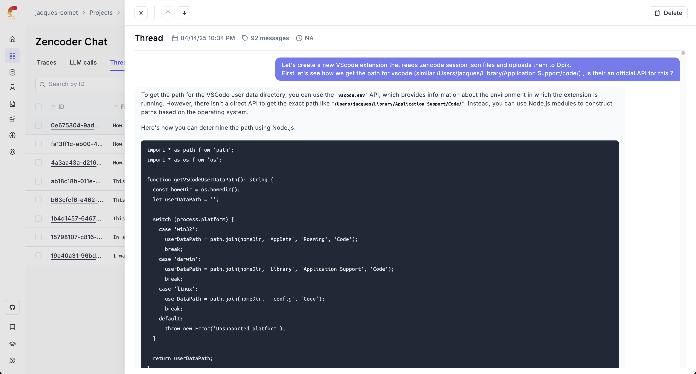

# Opik

The `Opik` extension for VSCode will allow you to save your Cursor chat sessions in Opik.  You can share these chat sessions with your team or even on Twitter / X if you are so inclined ! Your vibe coding session no longer need to be private !

Learn more about:
- [Opik](https://github.com/comet-ml/opik) is an Open-Source LLM evaluation platform that allows you to keep track of all your LLM chat conversations in one place.
- [Cursor](https://www.cursor.com/) is "the" AI Code Editor.

When you use this extension, it will automatically upload new Cursor chats to Opik and make them available in the `cursor` project. Existing chats are not uploaded automatically. To import them, run **Opik: Import Historical Cursor Traces** from the command palette. You can view conversations in the `thread` tab and token usage in the metrics tab.

## Installation

### Installing in Cursor

To install this extension in Cursor, navigate to the extensions tab in the top left (above the file and folder list) and search for `Opik`. Click on the extension and simply click on Install.

Once it is installed, you will be prompted in the bottom right of the screen to enter your Opik API key. You can create a free Opik account at [https://www.comet.com/signup](https://www.comet.com/signup?from=llm). Refer to the Congiguration section below for additional information.

### Configuration

To configure the extension, open up VSCode settings (Ctrl + ,), find the setting called "Opik: Opik API Key", and enter your Opik API key. You can create a free Opik account at [https://www.comet.com/signup](https://www.comet.com/signup?from=llm).

## Usage

Once installed, new Cursor chats are saved automatically. Historical chats are imported only when you explicitly run **Opik: Import Historical Cursor Traces** from the command palette.

Delivered request identities are retained for 180 days to prevent duplicate uploads while keeping extension state bounded. Completed edit-cost records are compacted into one aggregate during that period.

> 💻: This extension is currently under development 🚧. Please report any bugs on [Github](https://github.com/comet-ml/opik) if you run into any issues.

## Local Development

This extension is Open-Source and available on [Github](https://github.com/comet-ml/opik).

In order to debug the application, you will need to:
1. Run `npm run compile` - This is to compile the Typescript extension to javascript
2. Navigate to `./out/extension.js` and press `F5`.
