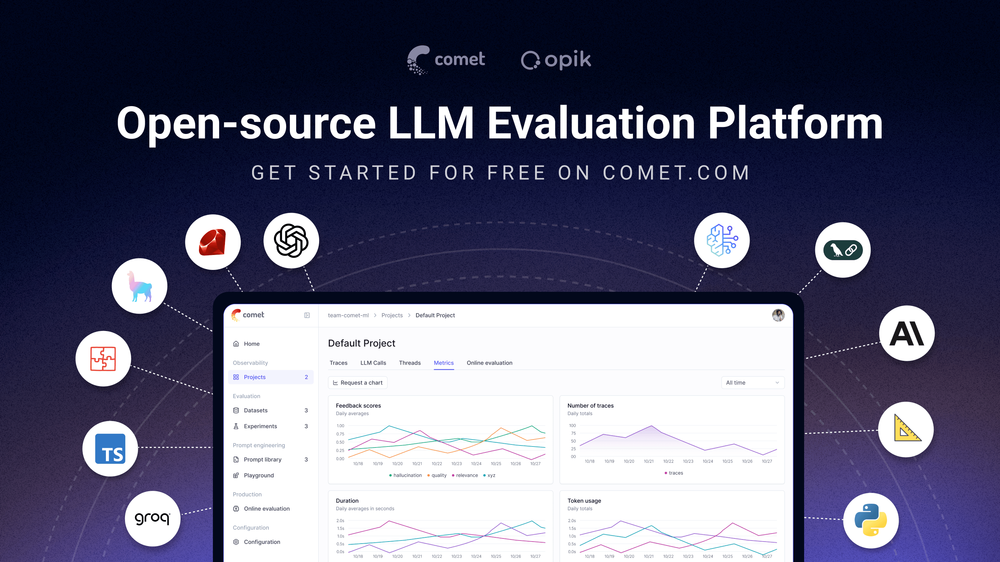

> Nota: Este archivo fue traducido automáticamente. ¡Las mejoras de traducción son bienvenidas!

<div align="center"><b><a href="README.md">English</a> | <a href="readme_CN.md">简体中文</a> | <a href="readme_JP.md">日本語</a> | <a href="readme_PT_BR.md">Português (Brasil)</a> | <a href="readme_KO.md">한국어</a><br><a href="readme_ES.md">Español</a> | <a href="readme_FR.md">Français</a> | <a href="readme_DE.md">Deutsch</a> | <a href="readme_RU.md">Русский</a> | <a href="readme_AR.md">العربية</a> | <a href="readme_HI.md">हिन्दी</a> | <a href="readme_TR.md">Türkçe</a></b></div>

<h1 align="center" style="border-bottom: none">
    <div>
        <a href="https://www.comet.com/site/products/opik/?from=llm&utm_source=opik&utm_medium=github&utm_content=header_img&utm_campaign=opik"><picture>
            <source media="(prefers-color-scheme: dark)" srcset="https://raw.githubusercontent.com/comet-ml/opik/refs/heads/main/apps/opik-documentation/documentation/static/img/logo-dark-mode.svg">
            <source media="(prefers-color-scheme: light)" srcset="https://raw.githubusercontent.com/comet-ml/opik/refs/heads/main/apps/opik-documentation/documentation/static/img/opik-logo.svg">
            
        </picture></a>
        <br>
        Opik
    </div>
</h1>
<h2 align="center" style="border-bottom: none">Observabilidad, evaluación y optimización de la IA de código abierto</h2>
<p align="center">
Opik le ayuda a crear, probar y optimizar aplicaciones de IA generativa que funcionen mejor, desde el prototipo hasta la producción.  Desde chatbots RAG hasta asistentes de código y sistemas de agentes complejos, Opik proporciona seguimiento, evaluación y optimización automática de indicaciones y herramientas integrales para eliminar las conjeturas en el desarrollo de la IA.
</p>

<div align="center">

[](https://pypi.org/project/opik/)
[](https://github.com/comet-ml/opik/blob/main/LICENSE)
[](https://github.com/comet-ml/opik/actions/workflows/build_apps.yml)

<!-- [](https://colab.research.google.com/github/comet-ml/opik/blob/main/apps/opik-documentation/documentation/docs/cookbook/opik_quickstart.ipynb) -->

</div>

<p align="center">
    <a href="https://www.comet.com/site/products/opik/?from=llm&utm_source=opik&utm_medium=github&utm_content=website_button&utm_campaign=opik"><b>Sitio web</b></a> •
    <a href="https://chat.comet.com"><b>Comunidad Slack</b></a> •
    <a href="https://x.com/Cometml"><b>Twitter</b></a> •
    <a href="https://www.comet.com/docs/opik/changelog"><b>Registro de cambios</b></a> •
    <a href="https://www.comet.com/docs/opik/?from=llm&utm_source=opik&utm_medium=github&utm_content=docs_button&utm_campaign=opik"><b>Documentación</b></a>
</p>

<div align="center" style="margin-top: 1em; margin-bottom: 1em;">
<a href="#-what-is-opik">🚀 ¿Qué es Opik?</a> • <a href="#%EF%B8%8F-opik-server-installation">🛠️ Instalación del servidor Opik</a> • <a href="#-opik-client-sdk">💻 SDK del cliente Opik</a> • <a href="#-logging-traces-with-integrations">📝 Registro de seguimientos</a><br>
<a href="#-llm-as-a-judge-metrics">🧑‍⚖️ LLM como juez</a> • <a href="#-evaluating-your-llm-application">🔍 Evaluando su solicitud</a> • <a href="#-star-us-on-github">⭐ Destacarnos</a> • <a href="#-contributing">🤝 Contribuyendo</a>
</div>

<br>

[](https://www.comet.com/signup?from=llm&utm_source=opik&utm_medium=github&utm_content=readme_banner&utm_campaign=opik)

<a id="-what-is-opik"></a>
## 🚀 ¿Qué es Opik?

Opik (creado por [Comet](https://www.comet.com?from=llm&utm_source=opik&utm_medium=github&utm_content=what_is_opik_link&utm_campaign=opik)) es una plataforma de código abierto diseñada para optimizar todo el ciclo de vida de las aplicaciones LLM. Permite a los desarrolladores evaluar, probar, monitorear y optimizar sus modelos y sistemas agentes. Las ofertas clave incluyen:
- **Observabilidad integral**: seguimiento profundo de las llamadas de LLM, registro de conversaciones y actividad de los agentes.
- **Evaluación avanzada**: evaluación rápida y sólida, LLM como juez y gestión de experimentos.
- **Listo para producción**: paneles de control escalables y reglas de evaluación en línea para producción.
- **Opik Agent Optimizer**: SDK dedicado y conjunto de optimizadores para mejorar las indicaciones y los agentes.
- **Opik Guardrails**: funciones que le ayudarán a implementar prácticas de IA seguras y responsables.

<br>

Las capacidades clave incluyen:

- **Desarrollo y seguimiento:**
  - Realice un seguimiento de todas las llamadas y seguimientos de LLM con un contexto detallado durante el desarrollo y la producción ([Quickstart](https://www.comet.com/docs/opik/quickstart/?from=llm&utm_source=opik&utm_medium=github&utm_content=quickstart_link&utm_campaign=opik)).
  - Amplias integraciones con terceros para una fácil observabilidad: integre perfectamente con una lista cada vez mayor de marcos, admitiendo muchos de los más grandes y populares de forma nativa (incluidas incorporaciones recientes como **Google ADK**, **Autogen** y **Flowise AI**). ([Integraciones](https://www.comet.com/docs/opik/integrations/overview/?from=llm&utm_source=opik&utm_medium=github&utm_content=integrations_link&utm_campaign=opik))
  - Anote trazas y tramos con puntuaciones de retroalimentación a través del [Python SDK](https://www.comet.com/docs/opik/tracing/annotate_traces/#annotating-traces-and-spans-using-the-sdk?from=llm&utm_source=opik&utm_medium=github&utm_content=sdk_link&utm_campaign=opik) o el [UI](https://www.comet.com/docs/opik/tracing/annotate_traces/#annotating-traces-through-the-ui?from=llm&utm_source=opik&utm_medium=github&utm_content=ui_link&utm_campaign=opik).
  - Experimente con indicaciones y modelos en [Prompt Playground](https://www.comet.com/docs/opik/prompt_engineering/playground).

- **Evaluación y pruebas**:
  - Automatice la evaluación de su solicitud de LLM con [Conjuntos de datos](https://www.comet.com/docs/opik/evaluation/manage_datasets/?from=llm&utm_source=opik&utm_medium=github&utm_content=datasets_link&utm_campaign=opik) y [Experimentos](https://www.comet.com/docs/opik/evaluate/evaluate_your_llm/?from=llm&utm_source=opik&utm_medium=github&utm_content=eval_link&utm_campaign=opik).
  - Aproveche las poderosas métricas de LLM como juez para tareas complejas como [detección de alucinaciones](https://www.comet.com/docs/opik/evaluation/metrics/hallucination/?from=llm&utm_source=opik&utm_medium=github&utm_content=hallucination_link&utm_campaign=opik), [moderación](https://www.comet.com/docs/opik/evaluation/metrics/moderation/?from=llm&utm_source=opik&utm_medium=github&utm_content=moderation_link&utm_campaign=opik) y evaluación RAG ([Respuesta Relevancia](https://www.comet.com/docs/opik/evaluation/metrics/answer_relevance/?from=llm&utm_source=opik&utm_medium=github&utm_content=alex_link&utm_campaign=opik), [Contexto Precisión](https://www.comet.com/docs/opik/evaluation/metrics/context_precision/?from=llm&utm_source=opik&utm_medium=github&utm_content=context_link&utm_campaign=opik)).
  - Integre evaluaciones en su canal de CI/CD con nuestra [integración de PyTest](https://www.comet.com/docs/opik/testing/pytest_integration/?from=llm&utm_source=opik&utm_medium=github&utm_content=pytest_link&utm_campaign=opik).

- **Monitoreo y optimización de la producción**:
  - Registrar grandes volúmenes de trazas de producción: Opik está diseñado para escalar (más de 40 millones de trazas/día).
  - Supervise las puntuaciones de los comentarios, los recuentos de seguimiento y el uso de tokens a lo largo del tiempo en el [Panel de Opik](https://www.comet.com/docs/opik/production/production_monitoring/?from=llm&utm_source=opik&utm_medium=github&utm_content=dashboard_link&utm_campaign=opik).
- Utilice [Reglas de evaluación en línea](https://www.comet.com/docs/opik/production/rules/?from=llm&utm_source=opik&utm_medium=github&utm_content=dashboard_link&utm_campaign=opik) con métricas de LLM-as-a-Judge para identificar problemas de producción.
  - Aproveche **Opik Agent Optimizer** y **Opik Guardrails** para mejorar y proteger continuamente sus aplicaciones LLM en producción.

> [!CONSEJO]
> Si está buscando funciones que Opik no tiene hoy, presente una nueva [solicitud de función](https://github.com/comet-ml/opik/issues/new/choose) 🚀

<br>

<a id="%EF%B8%8F-opik-server-installation"></a>
## 🛠️ Instalación del servidor Opik

Haga funcionar su servidor Opik en minutos. Elige la opción que mejor se adapta a tus necesidades:

### Opción 1: Comet.com Cloud (más fácil y recomendada)

Acceda a Opik al instante sin ninguna configuración. Ideal para inicios rápidos y mantenimiento sin complicaciones.

👉 [Cree su cuenta Comet gratuita](https://www.comet.com/signup?from=llm&utm_source=opik&utm_medium=github&utm_content=install_create_link&utm_campaign=opik)

### Opción 2: Opik autohospedado para control total

Implemente Opik en su propio entorno. Elija entre Docker para configuraciones locales o Kubernetes para escalabilidad.

#### Autohospedaje con Docker Compose (para pruebas y desarrollo local)

Esta es la forma más sencilla de ejecutar una instancia local de Opik. Tenga en cuenta el nuevo script de instalación `./opik.sh`:

En entorno Linux o Mac:

```bash
# Clonar el repositorio de Opik
git clone https://github.com/comet-ml/opik.git

# Navegar al repositorio
cd opik

# Inicie la plataforma Opik
./opik.sh
```

En el entorno Windows:

```powershell
# Clonar el repositorio de Opik
git clone https://github.com/comet-ml/opik.git

# Navegar al repositorio
cd opik

# Inicie la plataforma Opik
powershell -ExecutionPolicy ByPass -c ".\\opik.ps1"
```

**Perfiles de servicio para desarrollo**

Los scripts de instalación de Opik ahora admiten perfiles de servicio para diferentes escenarios de desarrollo:


```bash
# Iniciar la suite Opik completa (comportamiento predeterminado)
./opik.sh

# Iniciar solo servicios de infraestructura (bases de datos, cachés, etc.)
./opik.sh --infra

# Iniciar infraestructura + servicios backend
./opik.sh --backend

# Habilitar barandillas con cualquier perfil
./opik.sh --guardrails # Guardrails con la suite Opik completa
./opik.sh --backend --guardrails # Guardrails con infraestructura + backend
```

Utilice las opciones `--help` o `--info` para solucionar problemas. Dockerfiles ahora garantiza que los contenedores se ejecuten como usuarios no root para mejorar la seguridad. Una vez que todo esté en funcionamiento, podrá visitar [localhost:5173](http://localhost:5173) en su navegador. Para obtener instrucciones detalladas, consulte la [Guía de implementación local](https://www.comet.com/docs/opik/self-host/local_deployment?from=llm&utm_source=opik&utm_medium=github&utm_content=self_host_link&utm_campaign=opik).

#### Autohospedaje con Kubernetes y Helm (para implementaciones escalables)

Para implementaciones autohospedadas de producción o de mayor escala, Opik se puede instalar en un clúster de Kubernetes utilizando nuestro diagrama Helm. Haga clic en la insignia para obtener la [Guía de instalación de Kubernetes usando Helm](https://www.comet.com/docs/opik/self-host/kubernetes/#kubernetes-installation?from=llm&utm_source=opik&utm_medium=github&utm_content=kubernetes_link&utm_campaign=opik).

[](https://www.comet.com/docs/opik/self-host/kubernetes/#kubernetes-installation?from=llm&utm_source=opik&utm_medium=github&utm_content=kubernetes_link&utm_campaign=opik)

> [!IMPORTANTE]
> **Cambios de la versión 1.7.0**: consulte el [registro de cambios](https://github.com/comet-ml/opik/blob/main/CHANGELOG.md) para obtener actualizaciones importantes y cambios importantes.

<a id="-opik-client-sdk"></a>
## 💻 SDK del cliente Opik
Opik proporciona un conjunto de bibliotecas cliente y una API REST para interactuar con el servidor Opik. Esto incluye SDK para Python, TypeScript y Ruby (a través de OpenTelemetry), lo que permite una integración perfecta en sus flujos de trabajo. Para obtener referencias detalladas de API y SDK, consulte la [Documentación de referencia del cliente de Opik](https://www.comet.com/docs/opik/reference/overview?from=llm&utm_source=opik&utm_medium=github&utm_content=reference_link&utm_campaign=opik).

### Inicio rápido del SDK de Python

Para comenzar con el SDK de Python:

Instale el paquete:

```bash
# instalar usando pip
pip install opik

# o instalar con uv
uv pip install opik
```

Configure el SDK de Python ejecutando el comando `opik configure`, que le solicitará la dirección de su servidor Opik (para instancias autohospedadas) o su clave API y espacio de trabajo (para Comet.com):


```bash
opik configure
```

> [!CONSEJO]
> También puede llamar a `opik.configure(use_local=True)` desde su código Python para configurar el SDK para que se ejecute en una instalación local autohospedada, o proporcionar la clave API y los detalles del espacio de trabajo directamente para Comet.com. Consulte la [documentación del SDK de Python](https://www.comet.com/docs/opik/python-sdk-reference/?from=llm&utm_source=opik&utm_medium=github&utm_content=python_sdk_docs_link&utm_campaign=opik) para obtener más opciones de configuración.

Ahora está listo para comenzar a registrar seguimientos utilizando el [SDK de Python](https://www.comet.com/docs/opik/python-sdk-reference/?from=llm&utm_source=opik&utm_medium=github&utm_content=sdk_link2&utm_campaign=opik).

<a id="-logging-traces-with-integrations"></a>
### 📝 Registro de seguimientos con integraciones

La forma más sencilla de registrar seguimientos es utilizar una de nuestras integraciones directas. Opik admite una amplia gama de marcos, incluidas incorporaciones recientes como **Google ADK**, **Autogen**, **AG2** y **Flowise AI**:

| Integración | Descripción | Documentación |
| --------------------- | ------------------------------------------------------- | ------------------------------------------------------------------------------------------------------------------------------------------------------------------------------ |
| ADK | Seguimientos de registros para el kit de desarrollo de agentes de Google (ADK) | [Documentación](https://www.comet.com/docs/opik/integrations/adk?utm_source=opik&utm_medium=github&utm_content=google_adk_link&utm_campaign=opik) |
| AG2 | Seguimientos de registros para llamadas AG2 LLM | [Documentación](https://www.comet.com/docs/opik/integrations/ag2?utm_source=opik&utm_medium=github&utm_content=ag2_link&utm_campaign=opik) |
| Suite de IA | Seguimientos de registros para llamadas de aisuite LLM | [Documentación](https://www.comet.com/docs/opik/integrations/aisuite?utm_source=opik&utm_medium=github&utm_content=aisuite_link&utm_campaign=opik) |
| Agno | Seguimientos de registros para llamadas al marco de orquestación del agente Agno | [Documentación](https://www.comet.com/docs/opik/integrations/agno?utm_source=opik&utm_medium=github&utm_content=agno_link&utm_campaign=opik) |
| Antrópico | Seguimientos de registros para llamadas de Anthropic LLM | [Documentación](https://www.comet.com/docs/opik/integrations/anthropic?utm_source=opik&utm_medium=github&utm_content=anthropic_link&utm_campaign=opik) |
| Autogen | Seguimientos de registros para flujos de trabajo agentes de Autogen | [Documentación](https://www.comet.com/docs/opik/integrations/autogen?utm_source=opik&utm_medium=github&utm_content=autogen_link&utm_campaign=opik) |
| lecho de roca | Seguimientos de registros para llamadas de Amazon Bedrock LLM | [Documentación](https://www.comet.com/docs/opik/integrations/bedrock?utm_source=opik&utm_medium=github&utm_content=bedrock_link&utm_campaign=opik) |
| AbejaAI (Python) | Seguimientos de registros para llamadas al marco del agente BeeAI Python | [Documentación](https://www.comet.com/docs/opik/integrations/beeai?utm_source=opik&utm_medium=github&utm_content=beeai_link&utm_campaign=opik) |
| AbejaAI (Mecanografiado) | Seguimientos de registros para llamadas al marco del agente BeeAI TypeScript | [Documentación](https://www.comet.com/docs/opik/integrations/beeai-typescript?utm_source=opik&utm_medium=github&utm_content=beeai_typescript_link&utm_campaign=opik) |
| BytePlus | Seguimientos de registros para llamadas de BytePlus LLM | [Documentación](https://www.comet.com/docs/opik/integrations/byteplus?utm_source=opik&utm_medium=github&utm_content=byteplus_link&utm_campaign=opik) |
| IA de los trabajadores de Cloudflare | Seguimientos de registros para llamadas de IA de trabajadores de Cloudflare | [Documentación](https://www.comet.com/docs/opik/integrations/cloudflare-workers-ai?utm_source=opik&utm_medium=github&utm_content=cloudflare_workers_ai_link&utm_campaign=opik) |
| Coherir | Seguimientos de registros para llamadas de Cohere LLM | [Documentación](https://www.comet.com/docs/opik/integrations/cohere?utm_source=opik&utm_medium=github&utm_content=cohere_link&utm_campaign=opik) |
| TripulaciónAI | Registro de seguimientos para llamadas de CrewAI | [Documentación](https://www.comet.com/docs/opik/integrations/crewai?utm_source=opik&utm_medium=github&utm_content=crewai_link&utm_campaign=opik) |
| Cursores | Seguimientos de registros para conversaciones del cursor | [Documentación](https://www.comet.com/docs/opik/integrations/cursor?utm_source=opik&utm_medium=github&utm_content=cursor_link&utm_campaign=opik) |
| Búsqueda profunda | Seguimientos de registros para llamadas de DeepSeek LLM | [Documentación](https://www.comet.com/docs/opik/integrations/deepseek?utm_source=opik&utm_medium=github&utm_content=deepseek_link&utm_campaign=opik) |
| Dificar | Seguimientos de registros para ejecuciones del agente Dify | [Documentación](https://www.comet.com/docs/opik/integrations/dify?utm_source=opik&utm_medium=github&utm_content=dify_link&utm_campaign=opik) |
| DSPY | Seguimientos de registros para ejecuciones de DSPy | [Documentación](https://www.comet.com/docs/opik/integrations/dspy?utm_source=opik&utm_medium=github&utm_content=dspy_link&utm_campaign=opik) |
| Fuegos artificiales AI | Seguimientos de registros para llamadas LLM de Fireworks AI | [Documentación](https://www.comet.com/docs/opik/integrations/fireworks-ai?utm_source=opik&utm_medium=github&utm_content=fireworks_ai_link&utm_campaign=opik) |
| Fluir IA | Seguimientos de registros para el constructor visual LLM de Flowise AI | [Documentación](https://www.comet.com/docs/opik/integrations/flowise?utm_source=opik&utm_medium=github&utm_content=flowise_link&utm_campaign=opik) |
| Géminis (Python) | Registro de seguimientos para llamadas de Google Gemini LLM | [Documentación](https://www.comet.com/docs/opik/integrations/gemini?utm_source=opik&utm_medium=github&utm_content=gemini_link&utm_campaign=opik) |
| Géminis (Mecanografiado) | Seguimientos de registros para llamadas del SDK de TypeScript de Google Gemini | [Documentación](https://www.comet.com/docs/opik/integrations/gemini-typescript?utm_source=opik&utm_medium=github&utm_content=gemini_typescript_link&utm_campaign=opik) |
| Groq | Seguimientos de registros para llamadas de Groq LLM | [Documentación](https://www.comet.com/docs/opik/integrations/groq?utm_source=opik&utm_medium=github&utm_content=groq_link&utm_campaign=opik) |
| Barandillas | Seguimientos de registros para validaciones de Guardrails AI | [Documentación](https://www.comet.com/docs/opik/integrations/guardrails-ai?utm_source=opik&utm_medium=github&utm_content=guardrails_link&utm_campaign=opik) |
| Pajar | Seguimientos de registros para llamadas de Haystack | [Documentación](https://www.comet.com/docs/opik/integrations/haystack?utm_source=opik&utm_medium=github&utm_content=haystack_link&utm_campaign=opik) |
| Puerto | Seguimientos de registros para las pruebas de evaluación comparativa del puerto | [Documentación](https://www.comet.com/docs/opik/integrations/harbor?utm_source=opik&utm_medium=github&utm_content=harbor_link&utm_campaign=opik) |
| Instructor | Seguimientos de registros para llamadas LLM realizadas con Instructor | [Documentación](https://www.comet.com/docs/opik/integrations/instructor?utm_source=opik&utm_medium=github&utm_content=instructor_link&utm_campaign=opik) |
| LangChain (Python) | Seguimientos de registros para llamadas de LangChain LLM | [Documentación](https://www.comet.com/docs/opik/integrations/langchain?utm_source=opik&utm_medium=github&utm_content=langchain_link&utm_campaign=opik) |
| LangChain (JS/TS) | Seguimientos de registros para llamadas LangChain JavaScript/TypeScript | [Documentación](https://www.comet.com/docs/opik/integrations/langchainjs?utm_source=opik&utm_medium=github&utm_content=langchainjs_link&utm_campaign=opik) |
| LangGraph | Seguimientos de registros para ejecuciones de LangGraph | [Documentación](https://www.comet.com/docs/opik/integrations/langgraph?utm_source=opik&utm_medium=github&utm_content=langgraph_link&utm_campaign=opik) |
| flujo de lengua | Seguimientos de registros para el constructor visual de IA de Langflow | [Documentación](https://www.comet.com/docs/opik/integrations/langflow?utm_source=opik&utm_medium=github&utm_content=langflow_link&utm_campaign=opik) |
| LiteLLM | Seguimientos de registros para llamadas al modelo LiteLLM | [Documentación](https://www.comet.com/docs/opik/integrations/litellm?utm_source=opik&utm_medium=github&utm_content=litellm_link&utm_campaign=opik) |
| Agentes LiveKit | Seguimientos de registros para llamadas al marco del agente LiveKit Agents AI | [Documentación](https://www.comet.com/docs/opik/integrations/livekit?utm_source=opik&utm_medium=github&utm_content=livekit_link&utm_campaign=opik) |
| LlamaIndice | Seguimientos de registros para llamadas de LlamaIndex LLM | [Documentación](https://www.comet.com/docs/opik/integrations/llama_index?utm_source=opik&utm_medium=github&utm_content=llama_index_link&utm_campaign=opik) |
| Mastra | Seguimientos de registros para llamadas al marco de trabajo de flujo de trabajo de Mastra AI | [Documentación](https://www.comet.com/docs/opik/integrations/mastra?utm_source=opik&utm_medium=github&utm_content=mastra_link&utm_campaign=opik) |
| Marco del agente de Microsoft (Python) | Seguimientos de registros para llamadas de Microsoft Agent Framework | [Documentación](https://www.comet.com/docs/opik/integrations/microsoft-agent-framework?utm_source=opik&utm_medium=github&utm_content=agent_framework_link&utm_campaign=opik) |
| Marco del agente de Microsoft (.NET) | Seguimientos de registros para llamadas de Microsoft Agent Framework .NET | [Documentación](https://www.comet.com/docs/opik/integrations/microsoft-agent-framework-dotnet?utm_source=opik&utm_medium=github&utm_content=agent_framework_dotnet_link&utm_campaign=opik) |
| Mistral IA | Seguimientos de registros para llamadas de Mistral AI LLM | [Documentación](https://www.comet.com/docs/opik/integrations/mistral?utm_source=opik&utm_medium=github&utm_content=mistral_link&utm_campaign=opik) |
| n8n | Seguimientos de registros para ejecuciones de flujos de trabajo n8n | [Documentación](https://www.comet.com/docs/opik/integrations/n8n?utm_source=opik&utm_medium=github&utm_content=n8n_link&utm_campaign=opik) |
| Novita AI | Seguimientos de registros para llamadas de Novita AI LLM | [Documentación](https://www.comet.com/docs/opik/integrations/novita-ai?utm_source=opik&utm_medium=github&utm_content=novita_ai_link&utm_campaign=opik) |
| Ollamá | Seguimientos de registros para llamadas de Ollama LLM | [Documentación](https://www.comet.com/docs/opik/integrations/ollama?utm_source=opik&utm_medium=github&utm_content=ollama_link&utm_campaign=opik) |
| OpenAI (Python) | Seguimientos de registros para llamadas de OpenAI LLM | [Documentación](https://www.comet.com/docs/opik/integrations/openai?utm_source=opik&utm_medium=github&utm_content=openai_link&utm_campaign=opik) |
| OpenAI (JS/TS) | Seguimientos de registros para llamadas OpenAI JavaScript/TypeScript | [Documentación](https://www.comet.com/docs/opik/integrations/openai-typescript?utm_source=opik&utm_medium=github&utm_content=openai_typescript_link&utm_campaign=opik) |
| Agentes de OpenAI | Seguimientos de registros para llamadas del SDK de agentes OpenAI | [Documentación](https://www.comet.com/docs/opik/integrations/openai_agents?utm_source=opik&utm_medium=github&utm_content=openai_agents_link&utm_campaign=opik) |
| OpenClaw              | Log traces for OpenClaw agent runs                  | [Documentation](https://www.comet.com/docs/opik/integrations/openclaw?utm_source=opik&utm_medium=github&utm_content=openclaw_link&utm_campaign=opik) |
| Enrutador abierto | Seguimientos de registros para llamadas de OpenRouter LLM | [Documentación](https://www.comet.com/docs/opik/integrations/openrouter?utm_source=opik&utm_medium=github&utm_content=openrouter_link&utm_campaign=opik) |
| OpenTelemetría | Seguimientos de registros para llamadas admitidas por OpenTelemetry | [Documentación](https://www.comet.com/docs/opik/tracing/opentelemetry/overview?utm_source=opik&utm_medium=github&utm_content=opentelemetry_link&utm_campaign=opik) |
| Interfaz de usuario web abierta | Seguimientos de registros para conversaciones OpenWebUI | [Documentación](https://www.comet.com/docs/opik/integrations/openwebui?utm_source=opik&utm_medium=github&utm_content=openwebui_link&utm_campaign=opik) |
| Pipecat | Registro de seguimientos para llamadas de agentes de voz en tiempo real de Pipecat | [Documentación](https://www.comet.com/docs/opik/integrations/pipecat?utm_source=opik&utm_medium=github&utm_content=pipecat_link&utm_campaign=opik) |
| Predibase | Seguimientos de registros para llamadas de Predibase LLM | [Documentación](https://www.comet.com/docs/opik/integrations/predibase?utm_source=opik&utm_medium=github&utm_content=predibase_link&utm_campaign=opik) |
| IA pidántica | Seguimientos de registros para llamadas de agentes de PydanticAI | [Documentación](https://www.comet.com/docs/opik/integrations/pydantic-ai?utm_source=opik&utm_medium=github&utm_content=pydantic_ai_link&utm_campaign=opik) |
| Ragas | Seguimientos de registros para evaluaciones de Ragas | [Documentación](https://www.comet.com/docs/opik/integrations/ragas?utm_source=opik&utm_medium=github&utm_content=ragas_link&utm_campaign=opik) |
| Núcleo semántico | Seguimientos de registros para llamadas al kernel semántico de Microsoft | [Documentación](https://www.comet.com/docs/opik/integrations/semantic-kernel?utm_source=opik&utm_medium=github&utm_content=semantic_kernel_link&utm_campaign=opik) |
| Smolagentes | Seguimientos de registros para agentes de Smolagents | [Documentación](https://www.comet.com/docs/opik/integrations/smolagents?utm_source=opik&utm_medium=github&utm_content=smolagents_link&utm_campaign=opik) |
| IA de primavera | Seguimientos de registros para llamadas al marco Spring AI | [Documentación](https://www.comet.com/docs/opik/integrations/spring-ai?utm_source=opik&utm_medium=github&utm_content=spring_ai_link&utm_campaign=opik) |
| Agentes de hebras | Registro de seguimiento de llamadas de agentes de Strands | [Documentación](https://www.comet.com/docs/opik/integrations/strands-agents?utm_source=opik&utm_medium=github&utm_content=strands_agents_link&utm_campaign=opik) |
| Juntos IA | Seguimientos de registros para llamadas de Together AI LLM | [Documentación](https://www.comet.com/docs/opik/integrations/together-ai?utm_source=opik&utm_medium=github&utm_content=together_ai_link&utm_campaign=opik) |
| SDK de IA de Vercel | Seguimientos de registros para llamadas de Vercel AI SDK | [Documentación](https://www.comet.com/docs/opik/integrations/vercel-ai-sdk?utm_source=opik&utm_medium=github&utm_content=vercel_ai_sdk_link&utm_campaign=opik) |
| Agente Volt | Seguimientos de registros para llamadas al marco del agente VoltAgent | [Documentación](https://www.comet.com/docs/opik/integrations/voltagent?utm_source=opik&utm_medium=github&utm_content=voltagent_link&utm_campaign=opik) |
| WatsonX | Seguimientos de registros para llamadas de IBM watsonx LLM | [Documentación](https://www.comet.com/docs/opik/integrations/watsonx?utm_source=opik&utm_medium=github&utm_content=watsonx_link&utm_campaign=opik) |
| xAI Grok | Seguimientos de registros para llamadas de xAI Grok LLM | [Documentación](https://www.comet.com/docs/opik/integrations/xai-grok?utm_source=opik&utm_medium=github&utm_content=xai_grok_link&utm_campaign=opik) |

> [!CONSEJO]
> Si el marco que está utilizando no figura en la lista anterior, no dude en [abrir un problema](https://github.com/comet-ml/opik/issues) o enviar un PR con la integración.

Si no está utilizando ninguno de los marcos anteriores, también puede utilizar el decorador de la función `track` para [registrar seguimientos](https://www.comet.com/docs/opik/tracing/log_traces/?from=llm&utm_source=opik&utm_medium=github&utm_content=traces_link&utm_campaign=opik):

```python
import opik

opik.configure(use_local=True) # Ejecutar localmente

@opik.track
def my_llm_function(user_question: str) -> str:
    # Tu código LLM aquí

    devolver "Hola"
```

> [!CONSEJO]
> El decorador de pistas se puede utilizar junto con cualquiera de nuestras integraciones y también se puede utilizar para realizar un seguimiento de llamadas a funciones anidadas.

<a id="-llm-as-a-judge-metrics"></a>
### 🧑‍⚖️ Métricas de LLM como juez

El SDK de Python Opik incluye una serie de LLM como métricas de evaluación para ayudarle a evaluar su solicitud de LLM. Obtenga más información al respecto en la [documentación de métricas](https://www.comet.com/docs/opik/evaluation/metrics/overview/?from=llm&utm_source=opik&utm_medium=github&utm_content=metrics_2_link&utm_campaign=opik).

Para usarlos, simplemente importe la métrica relevante y use la función `score`:

```python
from opik.evaluation.metrics import Hallucination

metric = Hallucination()
score = metric.score(
    input="¿Cuál es la capital de Francia?",
    output="París",
    context=["Francia es un país de Europa."]
)
imprimir (partitura)
```

Opik también incluye una serie de métricas heurísticas prediseñadas, así como la capacidad de crear las suyas propias. Obtenga más información al respecto en la [documentación de métricas](https://www.comet.com/docs/opik/evaluation/metrics/overview?from=llm&utm_source=opik&utm_medium=github&utm_content=metrics_3_link&utm_campaign=opik).

<a id="-evaluating-your-llm-application"></a>
### 🔍 Evaluación de sus solicitudes de LLM

Opik le permite evaluar su solicitud de LLM durante el desarrollo a través de [Conjuntos de datos](https://www.comet.com/docs/opik/evaluation/manage_datasets/?from=llm&utm_source=opik&utm_medium=github&utm_content=datasets_2_link&utm_campaign=opik) y [Experimentos](https://www.comet.com/docs/opik/evaluate/evaluate_your_llm/?from=llm&utm_source=opik&utm_medium=github&utm_content=experiments_link&utm_campaign=opik). El panel de Opik ofrece gráficos mejorados para experimentos y un mejor manejo de trazas grandes. También puede ejecutar evaluaciones como parte de su canal de CI/CD utilizando nuestra [integración de PyTest](https://www.comet.com/docs/opik/testing/pytest_integration/?from=llm&utm_source=opik&utm_medium=github&utm_content=pytest_2_link&utm_campaign=opik).

<a id="-star-us-on-github"></a>
## ⭐ Destacarnos en GitHub

Si encuentra útil Opik, ¡considere darnos una estrella! Su apoyo nos ayuda a hacer crecer nuestra comunidad y continuar mejorando el producto.

[](https://github.com/comet-ml/opik)

<a id="-contributing"></a>
## 🤝 Contribuyendo

Hay muchas maneras de contribuir a Opik:

- Envíe [informes de errores](https://github.com/comet-ml/opik/issues) y [solicitudes de funciones](https://github.com/comet-ml/opik/issues)
- Revisar la documentación y enviar [Solicitudes de extracción](https://github.com/comet-ml/opik/pulls) para mejorarla
- Hablar o escribir sobre Opik y [hacernoslo saber](https://chat.comet.com)
- Votar a favor [solicitudes de funciones populares](https://github.com/comet-ml/opik/issues?q=is%3Aissue+is%3Aopen+label%3A%22enhancement%22) para mostrar su apoyo

Para obtener más información sobre cómo contribuir a Opik, consulte nuestras [directrices de contribución](CONTRIBUTING.md).