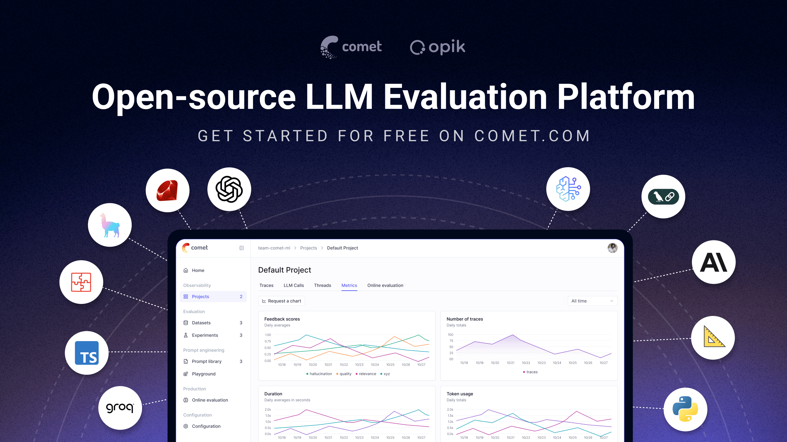

<div align="center"><b><a href="README.md">English</a> | <a href="readme_CN.md">简体中文</a> | <a href="readme_ES.md">Español</a> | <a href="readme_FR.md">Français</a> | <a href="readme_DE.md">Deutsch</a> | <a href="readme_JA.md">日本語</a></b></div>


<h1 align="center" style="border-bottom: none">
    <div>
        <a href="https://www.comet.com/site/products/opik/?from=llm&utm_source=opik&utm_medium=github&utm_content=header_img&utm_campaign=opik"><picture>
            <source media="(prefers-color-scheme: dark)" srcset="https://raw.githubusercontent.com/comet-ml/opik/refs/heads/main/apps/opik-documentation/documentation/static/img/logo-dark-mode.svg">
            <source media="(prefers-color-scheme: light)" srcset="https://raw.githubusercontent.com/comet-ml/opik/refs/heads/main/apps/opik-documentation/documentation/static/img/opik-logo.svg">
            
        </picture></a>
        <br>
        Opik: オープンソースの LLM オブザーバビリティ・評価・AI エージェントトレーシング
    </div>
</h1>
<p align="center">
<b>Opik は、AI エージェントのトレーシング、LLM 評価、プロンプト管理、本番環境のモニタリングのためのオープンソースの LLM オブザーバビリティ・評価プラットフォームです。</b><a href="https://www.comet.com?from=llm&utm_source=opik&utm_medium=github&utm_content=what_is_opik_link&utm_campaign=opik">Comet</a> が開発しています。Apache-2.0 ライセンスで、プラットフォーム全体を無料でセルフホストでき、GitHub のスター数は 20,000 以上です。
</p>

<div align="center">

[](https://pypi.org/project/opik/)
[](https://github.com/comet-ml/opik/blob/main/LICENSE)
[](https://github.com/comet-ml/opik/actions/workflows/build_apps.yml)
<!-- [](https://colab.research.google.com/github/comet-ml/opik/blob/main/apps/opik-documentation/documentation/docs/cookbook/opik_quickstart.ipynb) -->

</div>

<p align="center">
    <a href="https://www.comet.com/site/products/opik/?from=llm&utm_source=opik&utm_medium=github&utm_content=website_button&utm_campaign=opik"><b>ウェブサイト</b></a> •
    <a href="https://chat.comet.com"><b>Slack コミュニティ</b></a> •
    <a href="https://x.com/Cometml"><b>Twitter</b></a> •
    <a href="https://www.comet.com/docs/opik/changelog"><b>変更履歴</b></a> •
    <a href="https://www.comet.com/docs/opik/?from=llm&utm_source=opik&utm_medium=github&utm_content=docs_button&utm_campaign=opik"><b>ドキュメント</b></a>
</p>

<p align="center"><sub>最終更新: 2026-07-17</sub></p>

<div align="center" style="margin-top: 1em; margin-bottom: 1em;">
<a href="#-what-is-opik">🚀 Opik とは?</a> • <a href="#-quick-start">⚡ クイックスタート</a> • <a href="#-how-opik-compares">📊 Opik の比較</a> • <a href="#-frequently-asked-questions">❓ FAQ</a> • <a href="#%EF%B8%8F-opik-server-installation">🛠️ Opik サーバーのインストール</a> • <a href="#-opik-client-sdk">💻 Opik クライアント SDK</a> • <a href="#-logging-traces-with-integrations">📝 トレースの記録</a><br>
<a href="#-llm-as-a-judge-metrics">🧑‍⚖️ LLM as a Judge</a> • <a href="#-evaluating-your-llm-application">🔍 アプリケーションの評価</a> • <a href="#-star-us-on-github">⭐ スターをお願いします</a> • <a href="#-contributing">🤝 コントリビュート</a>
</div>

<br>

[](https://www.comet.com/signup?from=llm&utm_source=opik&utm_medium=github&utm_content=readme_banner&utm_campaign=opik)

<a id="-what-is-opik"></a>
## 🚀 Opik とは?

Opik は、LLM アプリケーションや AI エージェントを開発するチーム向けに、開発時の最初のトレースから本番環境のモニタリングまで、LLM アプリケーションのライフサイクル全体をカバーします。主な提供機能は次のとおりです。

- **AI エージェントのトレーシングとオブザーバビリティ**: LLM 呼び出しの詳細なトレーシング、会話の記録、エージェントの動作の記録に加え、マルチステップのエージェントやツール呼び出しに対応した完全なトレースツリーを提供します。
- **LLM 評価**: ハルシネーション検出、モデレーション、RAG 評価のためのデータセット、実験、LLM-as-a-judge メトリクス。
- **プロンプトとエージェントの最適化**: プロンプトとエージェントを改善する Opik Agent Optimizer SDK。
- **本番環境対応のモニタリング**: スケーラブルなダッシュボードとオンライン評価ルール。
- **Opik Guardrails**: 安全で責任ある AI の実践を支援する機能。
- **CI/CD 評価**: コミットごとに LLM パイプラインをテストする PyTest インテグレーション。

<br>

主な機能は次のとおりです。

- **開発とトレーシング:**
  - 開発時から本番環境まで、すべての LLM 呼び出しとトレースを詳細なコンテキストとともに追跡できます ([クイックスタート](https://www.comet.com/docs/opik/quickstart/?from=llm&utm_source=opik&utm_medium=github&utm_content=quickstart_link&utm_campaign=opik))。
  - オブザーバビリティを簡単に実現する豊富なサードパーティインテグレーション: 増え続けるフレームワークとシームレスに連携し、主要かつ人気の高い多くのフレームワーク (**Google ADK**、**Autogen**、**Flowise AI** といった最近追加されたものを含む) をネイティブにサポートします。([インテグレーション](https://www.comet.com/docs/opik/integrations/overview/?from=llm&utm_source=opik&utm_medium=github&utm_content=integrations_link&utm_campaign=opik))
  - [Python SDK](https://www.comet.com/docs/opik/tracing/advanced/annotate_traces/#annotating-traces-and-spans-using-the-sdk?from=llm&utm_source=opik&utm_medium=github&utm_content=sdk_link&utm_campaign=opik) または [UI](https://www.comet.com/docs/opik/tracing/advanced/annotate_traces/#annotating-traces-through-the-ui?from=llm&utm_source=opik&utm_medium=github&utm_content=ui_link&utm_campaign=opik) から、トレースとスパンにフィードバックスコアを付与できます。
  - [プロンプトプレイグラウンド](https://www.comet.com/docs/opik/development/prompt-playground)でプロンプトとモデルを試せます。

- **評価とテスト**:
  - [データセット](https://www.comet.com/docs/opik/evaluation/advanced/manage_datasets/?from=llm&utm_source=opik&utm_medium=github&utm_content=datasets_link&utm_campaign=opik)と[実験](https://www.comet.com/docs/opik/evaluation/advanced/evaluate_your_llm/?from=llm&utm_source=opik&utm_medium=github&utm_content=eval_link&utm_campaign=opik)により、LLM アプリケーションの評価を自動化できます。
  - [ハルシネーション検出](https://www.comet.com/docs/opik/evaluation/metrics/hallucination/?from=llm&utm_source=opik&utm_medium=github&utm_content=hallucination_link&utm_campaign=opik)、[モデレーション](https://www.comet.com/docs/opik/evaluation/metrics/moderation/?from=llm&utm_source=opik&utm_medium=github&utm_content=moderation_link&utm_campaign=opik)、RAG 評価 ([Answer Relevance](https://www.comet.com/docs/opik/evaluation/metrics/answer_relevance/?from=llm&utm_source=opik&utm_medium=github&utm_content=alex_link&utm_campaign=opik)、[Context Precision](https://www.comet.com/docs/opik/evaluation/metrics/context_precision/?from=llm&utm_source=opik&utm_medium=github&utm_content=context_link&utm_campaign=opik)) といった複雑なタスクに、強力な LLM-as-a-judge メトリクスを活用できます。
  - [PyTest インテグレーション](https://www.comet.com/docs/opik/evaluation/overview/?from=llm&utm_source=opik&utm_medium=github&utm_content=pytest_link&utm_campaign=opik)により、評価を CI/CD パイプラインに組み込めます。

- **本番環境のモニタリングと最適化**:
  - 大量の本番トレースを記録: Opik はスケールを前提に設計されています (1 日あたり 4,000 万件以上のトレース)。
  - [Opik ダッシュボード](https://www.comet.com/docs/opik/tracing/dashboards/production_monitoring/?from=llm&utm_source=opik&utm_medium=github&utm_content=dashboard_link&utm_campaign=opik)で、フィードバックスコア、トレース数、トークン使用量の推移をモニタリングできます。
  - [オンライン評価ルール](https://www.comet.com/docs/opik/production/online-evaluation/rules/?from=llm&utm_source=opik&utm_medium=github&utm_content=dashboard_link&utm_campaign=opik)と LLM-as-a-Judge メトリクスを活用して、本番環境の問題を特定できます。
  - **Opik Agent Optimizer** と **Opik Guardrails** を活用して、本番環境の LLM アプリケーションを継続的に改善し、安全に保てます。

**対象ユーザー:** LLM を活用したエージェントを開発する ML エンジニア、プロトタイプから本番環境へ移行する AI チーム、そして自社環境で運用できるオープンソースかつセルフホスト可能なオブザーバビリティを必要とするエンジニアリングチーム。

> **ここでオープンソースであることが重要な理由:** Opik は Apache-2.0 ライセンスで、クライアント SDK だけでなくバックエンドを含むプラットフォーム全体を無料でセルフホストできます。このリポジトリには、サーバーバックエンド、ウェブアプリケーション、トレーシング、データセット、実験、評価、プロンプト管理、オンライン評価、エージェント最適化の各コンポーネントが、すべて Apache-2.0 のもとで含まれています。データを自社環境の外に出すことなく、またエンタープライズ営業とのやり取りを必要とせずに、自社インフラ内で LLM オブザーバビリティを運用できます。

> [!TIP]
> 現在の Opik にない機能をお探しの場合は、[機能リクエスト](https://github.com/comet-ml/opik/issues/new/choose)を作成してください 🚀

<br>

<a id="-quick-start"></a>
## ⚡ クイックスタート

Python SDK をインストールして設定します。

```bash
pip install opik
opik configure
```

任意の関数を `@track` デコレーターでラップすると、トレースの記録が始まります。

```python
from opik import track

@track
def my_function(input: str) -> str:
    return input
```

これで `my_function` の呼び出しは、ネストされた呼び出しも含めてすべて Opik に記録されます。そのため、単一の LLM 呼び出しだけでなく、エージェントやパイプライン全体のトレースにも対応できます。TypeScript SDK やその他のセットアップ方法については、[クイックスタートガイド](https://www.comet.com/docs/opik/quickstart?from=llm&utm_source=opik&utm_medium=github&utm_content=quickstart_hero_link&utm_campaign=opik)をご覧ください。

<br>

<a id="-how-opik-compares"></a>
## 📊 Opik の比較

Opik は **LLM オブザーバビリティ / AI エージェント評価**のカテゴリーで、**LangSmith、Arize (Phoenix と Arize AX)、Weights & Biases (Weave)、Langfuse、Braintrust** と競合しています。

| 機能 | Opik | LangSmith | Phoenix | Arize AX | Weights & Biases (Weave) | Langfuse | Braintrust |
|---|---|---|---|---|---|---|---|
| オープンソース | はい、Apache-2.0 (プラットフォーム全体) | いいえ | ソース公開 (Elastic License 2.0、OSI 非承認) | いいえ | SDK / ツールキットはオープンソース。セルフマネージドのプラットフォームには商用ライセンスが必要 | コアプラットフォームは MIT ライセンス。エンタープライズ向けモジュールは商用 | いいえ |
| セルフホストでのデプロイ | はい | エンタープライズのみ | はい | エンタープライズのみ | Weave 本体はエンタープライズのみ | はい、コア部分 | エンタープライズのみ |
| 無料プランの提供 (クラウドまたはセルフホスト) | はい、両方 | はい、クラウド | はい、セルフホスト | はい、クラウド | はい、クラウド | はい、両方 | はい、クラウド |
| エージェント / マルチステップのトレーシング | はい | はい | はい | はい | はい | はい | はい |
| LLM-as-a-judge による評価 | はい | はい | はい | はい | はい | はい | はい |
| プロンプト管理 | はい | はい | 一部 | 一部 | 一部 | はい | はい |
| フレームワーク非依存 | はい | 一部、LangChain 中心の設計 | はい | はい | はい | はい | はい |

**チームが Opik を選ぶ理由:** オブザーバビリティ、評価、最適化を備えた Opik のプラットフォーム全体が Apache-2.0 ライセンスで、無料でセルフホストできます。セルフホストでのデプロイにエンタープライズプランが必要なクローズドなプラットフォームとは異なり、Opik は商用ライセンスなしでデプロイでき、フレームワーク非依存であるため特定のエージェントエコシステムに縛られることもありません。セルフホストとライセンスの違いについては、上の表をご覧ください。

<br>

<a id="-frequently-asked-questions"></a>
## ❓ よくある質問

#### Opik はオープンソースですか?
Opik は Apache 2.0 ライセンスで提供されています。サーバー、ウェブアプリケーション、そしてオブザーバビリティと評価のコア機能は、商用ライセンスなしでセルフホストできます。

#### Opik をセルフホストできますか?
はい。ドキュメントに記載されたセルフホストの方法で、ローカル環境または自社インフラに Opik をデプロイできます。

#### Opik は AI エージェントのトレーシングに対応していますか?
はい。Opik は、LLM 呼び出し、ツールの実行、検索ステップ、その他のエージェントの動作を含むマルチステップのトレースを取得します。

#### Opik は LLM の評価に対応していますか?
はい。Opik は、データセット、実験、コードベースのメトリクス、LLM-as-a-judge による評価、オンライン評価をサポートしています。

#### Opik は特定のエージェントフレームワークに依存していますか?
いいえ。Opik はフレームワーク非依存で、独自の SDK、OpenTelemetry、各フレームワーク向けのインテグレーションをサポートしています。

<br>

<a id="%EF%B8%8F-opik-server-installation"></a>
## 🛠️ Opik サーバーのインストール

Opik サーバーは数分で起動できます。用途に最も適した方法を選んでください。

### 選択肢 1: Comet.com クラウド (最も簡単・推奨)

セットアップ不要で、すぐに Opik を利用できます。手早く始めたい場合や、メンテナンスの手間をかけたくない場合に最適です。

👉 [無料の Comet アカウントを作成する](https://www.comet.com/signup?from=llm&utm_source=opik&utm_medium=github&utm_content=install_create_link&utm_campaign=opik)

### 選択肢 2: 完全に制御するためのセルフホスト

自社環境に Opik をデプロイします。ローカル環境向けの Docker と、スケーラビリティを重視する場合の Kubernetes から選べます。

#### Docker Compose によるセルフホスト (ローカル開発・テスト向け)

ローカルで Opik インスタンスを動かす最も簡単な方法です。新しい `./opik.sh` インストールスクリプトをご利用ください。

Linux または Mac 環境の場合:

```bash
# Opik リポジトリをクローン
git clone https://github.com/comet-ml/opik.git

# リポジトリに移動
cd opik

# Opik プラットフォームを起動
./opik.sh
```

Windows 環境の場合:

```powershell
# Opik リポジトリをクローン
git clone https://github.com/comet-ml/opik.git

# リポジトリに移動
cd opik

# Opik プラットフォームを起動
powershell -ExecutionPolicy ByPass -c ".\\opik.ps1"
```

**インストールスクリプトのオプション**

`opik.sh` と `opik.ps1` のスクリプトは、次のオプションに対応しています。

```bash
# Opik スイート全体を起動 (デフォルトの動作)
./opik.sh

# インフラサービスのみを起動 (データベース、キャッシュなど)
./opik.sh --infra

# インフラ + バックエンドサービスを起動
./opik.sh --backend

# 任意のプロファイルで guardrails を有効化
./opik.sh --guardrails # Opik スイート全体と guardrails
./opik.sh --backend --guardrails # インフラ + バックエンドと guardrails

# 起動前にソースからコンテナをビルド
./opik.sh --build

# すべてのコンテナが正常か確認
./opik.sh --verify

# すべてのコンテナを停止
./opik.sh --stop

# すべてのコンテナを停止し、Opik のデータボリュームをすべて削除
# 警告: Opik のデータはすべて失われます
./opik.sh --clean

# 利用可能なオプションをすべて表示
./opik.sh --help
```

問題のトラブルシューティングには `--help` または `--info` オプションを使用してください。Dockerfile は、セキュリティ強化のためコンテナを非 root ユーザーで実行するようになりました。すべてが起動したら、ブラウザーで [localhost:5173](http://localhost:5173) にアクセスできます。詳しい手順は[ローカルデプロイガイド](https://www.comet.com/docs/opik/self-host/local_deployment?from=llm&utm_source=opik&utm_medium=github&utm_content=self_host_link&utm_campaign=opik)をご覧ください。

#### Kubernetes と Helm によるセルフホスト (スケーラブルなデプロイ向け)

本番環境や大規模なセルフホストのデプロイでは、Helm チャートを使って Kubernetes クラスターに Opik をインストールできます。バッジをクリックすると、[Helm を使った Kubernetes インストールガイド](https://www.comet.com/docs/opik/self-host/kubernetes/#kubernetes-installation?from=llm&utm_source=opik&utm_medium=github&utm_content=kubernetes_link&utm_campaign=opik)の全文をご覧いただけます。

[](https://www.comet.com/docs/opik/self-host/kubernetes/#kubernetes-installation?from=llm&utm_source=opik&utm_medium=github&utm_content=kubernetes_link&utm_campaign=opik)

<a id="-opik-client-sdk"></a>
## 💻 Opik クライアント SDK

Opik は、Opik サーバーとやり取りするための一連のクライアントライブラリと REST API を提供しています。これには Python と TypeScript の SDK に加え、ファーストパーティの [OpenTelemetry](https://www.comet.com/docs/opik/tracing/opentelemetry/overview?from=llm&utm_source=opik&utm_medium=github&utm_content=otel_link&utm_campaign=opik) サポートが含まれます。[Java](https://www.comet.com/docs/opik/integrations/spring-ai?from=llm&utm_source=opik&utm_medium=github&utm_content=java_link&utm_campaign=opik)、[Ruby](https://www.comet.com/docs/opik/integrations/opentelemetry-ruby-sdk?from=llm&utm_source=opik&utm_medium=github&utm_content=ruby_link&utm_campaign=opik)、.NET など、OpenTelemetry SDK が存在する言語であれば、どれでも Opik にトレースを送信できます。API と SDK の詳細なリファレンスは、[Opik クライアントリファレンスドキュメント](https://www.comet.com/docs/opik/reference/overview?from=llm&utm_source=opik&utm_medium=github&utm_content=reference_link&utm_campaign=opik)をご覧ください。

### Python SDK クイックスタート

Python SDK を使い始めるには、次の手順に従います。

パッケージをインストールします。

```bash
# pip を使ってインストール
pip install opik

# または uv を使ってインストール
uv pip install opik
```

`opik configure` コマンドを実行して Python SDK を設定します。実行すると、Opik サーバーのアドレス (セルフホストの場合)、または API キーとワークスペース (Comet.com の場合) の入力を求められます。

```bash
opik configure
```

> [!TIP]
> Python コードから `opik.configure(use_local=True)` を呼び出して、ローカルのセルフホスト環境向けに SDK を設定したり、Comet.com 用に API キーとワークスペースの情報を直接指定したりすることもできます。その他の設定オプションについては、[Python SDK ドキュメント](https://www.comet.com/docs/opik/python-sdk-reference/?from=llm&utm_source=opik&utm_medium=github&utm_content=python_sdk_docs_link&utm_campaign=opik)をご覧ください。

これで [Python SDK](https://www.comet.com/docs/opik/python-sdk-reference/?from=llm&utm_source=opik&utm_medium=github&utm_content=sdk_link2&utm_campaign=opik) を使ってトレースの記録を始める準備が整いました。

<a id="-logging-traces-with-integrations"></a>
### 📝 インテグレーションによるトレースの記録

トレースを記録する最も簡単な方法は、直接対応しているインテグレーションのいずれかを使うことです。Opik は、**Google ADK**、**Autogen**、**AG2**、**Flowise AI** といった最近追加されたものを含む、幅広いフレームワークをサポートしています。

| インテグレーション | 説明 | ドキュメント |
| --- | --- | --- |
| ADK | Google Agent Development Kit (ADK) のトレースを記録 | [ドキュメント](https://www.comet.com/docs/opik/integrations/adk?utm_source=opik&utm_medium=github&utm_content=google_adk_link&utm_campaign=opik) |
| AG2 | AG2 の LLM 呼び出しのトレースを記録 | [ドキュメント](https://www.comet.com/docs/opik/integrations/ag2?utm_source=opik&utm_medium=github&utm_content=ag2_link&utm_campaign=opik) |
| Agent Spec | Agent Spec の呼び出しのトレースを記録 | [ドキュメント](https://www.comet.com/docs/opik/integrations/agentspec?utm_source=opik&utm_medium=github&utm_content=agentspec_link&utm_campaign=opik) |
| AIsuite | aisuite の LLM 呼び出しのトレースを記録 | [ドキュメント](https://www.comet.com/docs/opik/integrations/aisuite?utm_source=opik&utm_medium=github&utm_content=aisuite_link&utm_campaign=opik) |
| Agno | Agno エージェントオーケストレーションフレームワークの呼び出しのトレースを記録 | [ドキュメント](https://www.comet.com/docs/opik/integrations/agno?utm_source=opik&utm_medium=github&utm_content=agno_link&utm_campaign=opik) |
| Anthropic | Anthropic の LLM 呼び出しのトレースを記録 | [ドキュメント](https://www.comet.com/docs/opik/integrations/anthropic?utm_source=opik&utm_medium=github&utm_content=anthropic_link&utm_campaign=opik) |
| Autogen | Autogen のエージェントワークフローのトレースを記録 | [ドキュメント](https://www.comet.com/docs/opik/integrations/autogen?utm_source=opik&utm_medium=github&utm_content=autogen_link&utm_campaign=opik) |
| Bedrock | Amazon Bedrock の LLM 呼び出しのトレースを記録 | [ドキュメント](https://www.comet.com/docs/opik/integrations/bedrock?utm_source=opik&utm_medium=github&utm_content=bedrock_link&utm_campaign=opik) |
| BeeAI (Python) | BeeAI Python エージェントフレームワークの呼び出しのトレースを記録 | [ドキュメント](https://www.comet.com/docs/opik/integrations/beeai?utm_source=opik&utm_medium=github&utm_content=beeai_link&utm_campaign=opik) |
| BeeAI (TypeScript) | BeeAI TypeScript エージェントフレームワークの呼び出しのトレースを記録 | [ドキュメント](https://www.comet.com/docs/opik/integrations/beeai-typescript?utm_source=opik&utm_medium=github&utm_content=beeai_typescript_link&utm_campaign=opik) |
| BytePlus | BytePlus の LLM 呼び出しのトレースを記録 | [ドキュメント](https://www.comet.com/docs/opik/integrations/byteplus?utm_source=opik&utm_medium=github&utm_content=byteplus_link&utm_campaign=opik) |
| Claude Code | Opik プラグイン経由で Claude Code のセッションのトレースを記録 | [GitHub](https://github.com/comet-ml/opik-claude-code-plugin) |
| Cloudflare Workers AI | Cloudflare Workers AI の呼び出しのトレースを記録 | [ドキュメント](https://www.comet.com/docs/opik/integrations/cloudflare-workers-ai?utm_source=opik&utm_medium=github&utm_content=cloudflare_workers_ai_link&utm_campaign=opik) |
| Cohere | Cohere の LLM 呼び出しのトレースを記録 | [ドキュメント](https://www.comet.com/docs/opik/integrations/cohere?utm_source=opik&utm_medium=github&utm_content=cohere_link&utm_campaign=opik) |
| CrewAI | CrewAI の呼び出しのトレースを記録 | [ドキュメント](https://www.comet.com/docs/opik/integrations/crewai?utm_source=opik&utm_medium=github&utm_content=crewai_link&utm_campaign=opik) |
| Cursor | Cursor の会話のトレースを記録 | [ドキュメント](https://www.comet.com/docs/opik/integrations/cursor?utm_source=opik&utm_medium=github&utm_content=cursor_link&utm_campaign=opik) |
| DeepSeek | DeepSeek の LLM 呼び出しのトレースを記録 | [ドキュメント](https://www.comet.com/docs/opik/integrations/deepseek?utm_source=opik&utm_medium=github&utm_content=deepseek_link&utm_campaign=opik) |
| Dify | Dify のエージェント実行のトレースを記録 | [ドキュメント](https://www.comet.com/docs/opik/integrations/dify?utm_source=opik&utm_medium=github&utm_content=dify_link&utm_campaign=opik) |
| DSPY | DSPy の実行のトレースを記録 | [ドキュメント](https://www.comet.com/docs/opik/integrations/dspy?utm_source=opik&utm_medium=github&utm_content=dspy_link&utm_campaign=opik) |
| Fireworks AI | Fireworks AI の LLM 呼び出しのトレースを記録 | [ドキュメント](https://www.comet.com/docs/opik/integrations/fireworks-ai?utm_source=opik&utm_medium=github&utm_content=fireworks_ai_link&utm_campaign=opik) |
| Flowise AI | Flowise AI のビジュアル LLM ビルダーのトレースを記録 | [ドキュメント](https://www.comet.com/docs/opik/integrations/flowise?utm_source=opik&utm_medium=github&utm_content=flowise_link&utm_campaign=opik) |
| Gemini (Python) | Google Gemini の LLM 呼び出しのトレースを記録 | [ドキュメント](https://www.comet.com/docs/opik/integrations/gemini?utm_source=opik&utm_medium=github&utm_content=gemini_link&utm_campaign=opik) |
| Gemini (TypeScript) | Google Gemini TypeScript SDK の呼び出しのトレースを記録 | [ドキュメント](https://www.comet.com/docs/opik/integrations/gemini-typescript?utm_source=opik&utm_medium=github&utm_content=gemini_typescript_link&utm_campaign=opik) |
| Groq | Groq の LLM 呼び出しのトレースを記録 | [ドキュメント](https://www.comet.com/docs/opik/integrations/groq?utm_source=opik&utm_medium=github&utm_content=groq_link&utm_campaign=opik) |
| Guardrails | Guardrails AI の検証のトレースを記録 | [ドキュメント](https://www.comet.com/docs/opik/integrations/guardrails-ai?utm_source=opik&utm_medium=github&utm_content=guardrails_link&utm_campaign=opik) |
| Haystack | Haystack の呼び出しのトレースを記録 | [ドキュメント](https://www.comet.com/docs/opik/integrations/haystack?utm_source=opik&utm_medium=github&utm_content=haystack_link&utm_campaign=opik) |
| Harbor | Harbor のベンチマーク評価トライアルのトレースを記録 | [ドキュメント](https://www.comet.com/docs/opik/integrations/harbor?utm_source=opik&utm_medium=github&utm_content=harbor_link&utm_campaign=opik) |
| Instructor | Instructor を使った LLM 呼び出しのトレースを記録 | [ドキュメント](https://www.comet.com/docs/opik/integrations/instructor?utm_source=opik&utm_medium=github&utm_content=instructor_link&utm_campaign=opik) |
| LangChain (Python) | LangChain の LLM 呼び出しのトレースを記録 | [ドキュメント](https://www.comet.com/docs/opik/integrations/langchain?utm_source=opik&utm_medium=github&utm_content=langchain_link&utm_campaign=opik) |
| LangChain (JS/TS) | LangChain JavaScript/TypeScript の呼び出しのトレースを記録 | [ドキュメント](https://www.comet.com/docs/opik/integrations/langchainjs?utm_source=opik&utm_medium=github&utm_content=langchainjs_link&utm_campaign=opik) |
| LangGraph | LangGraph の実行のトレースを記録 | [ドキュメント](https://www.comet.com/docs/opik/integrations/langgraph?utm_source=opik&utm_medium=github&utm_content=langgraph_link&utm_campaign=opik) |
| Langflow | Langflow のビジュアル AI ビルダーのトレースを記録 | [ドキュメント](https://www.comet.com/docs/opik/integrations/langflow?utm_source=opik&utm_medium=github&utm_content=langflow_link&utm_campaign=opik) |
| LiteLLM | LiteLLM のモデル呼び出しのトレースを記録 | [ドキュメント](https://www.comet.com/docs/opik/integrations/litellm?utm_source=opik&utm_medium=github&utm_content=litellm_link&utm_campaign=opik) |
| LiveKit Agents | LiveKit Agents の AI エージェントフレームワークの呼び出しのトレースを記録 | [ドキュメント](https://www.comet.com/docs/opik/integrations/livekit?utm_source=opik&utm_medium=github&utm_content=livekit_link&utm_campaign=opik) |
| LlamaIndex | LlamaIndex の LLM 呼び出しのトレースを記録 | [ドキュメント](https://www.comet.com/docs/opik/integrations/llama_index?utm_source=opik&utm_medium=github&utm_content=llama_index_link&utm_campaign=opik) |
| Mastra | Mastra AI ワークフローフレームワークの呼び出しのトレースを記録 | [ドキュメント](https://www.comet.com/docs/opik/integrations/mastra?utm_source=opik&utm_medium=github&utm_content=mastra_link&utm_campaign=opik) |
| MCP サーバー (opik-mcp) | Model Context Protocol 経由で Claude Code、Cursor、VS Code から Opik を操作 | [ドキュメント](https://www.comet.com/docs/opik/integrations/mcp-server?utm_source=opik&utm_medium=github&utm_content=mcp_server_link&utm_campaign=opik) |
| Microsoft Agent Framework (Python) | Microsoft Agent Framework の呼び出しのトレースを記録 | [ドキュメント](https://www.comet.com/docs/opik/integrations/microsoft-agent-framework?utm_source=opik&utm_medium=github&utm_content=agent_framework_link&utm_campaign=opik) |
| Microsoft Agent Framework (.NET) | Microsoft Agent Framework .NET の呼び出しのトレースを記録 | [ドキュメント](https://www.comet.com/docs/opik/integrations/microsoft-agent-framework-dotnet?utm_source=opik&utm_medium=github&utm_content=agent_framework_dotnet_link&utm_campaign=opik) |
| Mistral AI | Mistral AI の LLM 呼び出しのトレースを記録 | [ドキュメント](https://www.comet.com/docs/opik/integrations/mistral?utm_source=opik&utm_medium=github&utm_content=mistral_link&utm_campaign=opik) |
| n8n | n8n のワークフロー実行のトレースを記録 | [ドキュメント](https://www.comet.com/docs/opik/integrations/n8n?utm_source=opik&utm_medium=github&utm_content=n8n_link&utm_campaign=opik) |
| Novita AI | Novita AI の LLM 呼び出しのトレースを記録 | [ドキュメント](https://www.comet.com/docs/opik/integrations/novita-ai?utm_source=opik&utm_medium=github&utm_content=novita_ai_link&utm_campaign=opik) |
| Ollama | Ollama の LLM 呼び出しのトレースを記録 | [ドキュメント](https://www.comet.com/docs/opik/integrations/ollama?utm_source=opik&utm_medium=github&utm_content=ollama_link&utm_campaign=opik) |
| OpenAI (Python) | OpenAI の LLM 呼び出しのトレースを記録 | [ドキュメント](https://www.comet.com/docs/opik/integrations/openai?utm_source=opik&utm_medium=github&utm_content=openai_link&utm_campaign=opik) |
| OpenAI (JS/TS) | OpenAI JavaScript/TypeScript の呼び出しのトレースを記録 | [ドキュメント](https://www.comet.com/docs/opik/integrations/openai-typescript?utm_source=opik&utm_medium=github&utm_content=openai_typescript_link&utm_campaign=opik) |
| OpenAI Agents | OpenAI Agents SDK の呼び出しのトレースを記録 | [ドキュメント](https://www.comet.com/docs/opik/integrations/openai_agents?utm_source=opik&utm_medium=github&utm_content=openai_agents_link&utm_campaign=opik) |
| OpenClaw | OpenClaw のエージェント実行のトレースを記録 | [ドキュメント](https://www.comet.com/docs/opik/integrations/openclaw?utm_source=opik&utm_medium=github&utm_content=openclaw_link&utm_campaign=opik) |
| OpenRouter | OpenRouter の LLM 呼び出しのトレースを記録 | [ドキュメント](https://www.comet.com/docs/opik/integrations/openrouter?utm_source=opik&utm_medium=github&utm_content=openrouter_link&utm_campaign=opik) |
| OpenTelemetry | OpenTelemetry がサポートする呼び出しのトレースを記録 | [ドキュメント](https://www.comet.com/docs/opik/tracing/opentelemetry/overview?utm_source=opik&utm_medium=github&utm_content=opentelemetry_link&utm_campaign=opik) |
| OpenWebUI | OpenWebUI の会話のトレースを記録 | [ドキュメント](https://www.comet.com/docs/opik/integrations/openwebui?utm_source=opik&utm_medium=github&utm_content=openwebui_link&utm_campaign=opik) |
| Pipecat | Pipecat のリアルタイム音声エージェント呼び出しのトレースを記録 | [ドキュメント](https://www.comet.com/docs/opik/integrations/pipecat?utm_source=opik&utm_medium=github&utm_content=pipecat_link&utm_campaign=opik) |
| Predibase | Predibase の LLM 呼び出しのトレースを記録 | [ドキュメント](https://www.comet.com/docs/opik/integrations/predibase?utm_source=opik&utm_medium=github&utm_content=predibase_link&utm_campaign=opik) |
| Pydantic AI | PydanticAI のエージェント呼び出しのトレースを記録 | [ドキュメント](https://www.comet.com/docs/opik/integrations/pydantic-ai?utm_source=opik&utm_medium=github&utm_content=pydantic_ai_link&utm_campaign=opik) |
| Ragas | Ragas の評価のトレースを記録 | [ドキュメント](https://www.comet.com/docs/opik/integrations/ragas?utm_source=opik&utm_medium=github&utm_content=ragas_link&utm_campaign=opik) |
| Semantic Kernel | Microsoft Semantic Kernel の呼び出しのトレースを記録 | [ドキュメント](https://www.comet.com/docs/opik/integrations/semantic-kernel?utm_source=opik&utm_medium=github&utm_content=semantic_kernel_link&utm_campaign=opik) |
| Smolagents | Smolagents のエージェントのトレースを記録 | [ドキュメント](https://www.comet.com/docs/opik/integrations/smolagents?utm_source=opik&utm_medium=github&utm_content=smolagents_link&utm_campaign=opik) |
| Spring AI | Spring AI フレームワークの呼び出しのトレースを記録 | [ドキュメント](https://www.comet.com/docs/opik/integrations/spring-ai?utm_source=opik&utm_medium=github&utm_content=spring_ai_link&utm_campaign=opik) |
| Strands Agents | Strands agents の呼び出しのトレースを記録 | [ドキュメント](https://www.comet.com/docs/opik/integrations/strands-agents?utm_source=opik&utm_medium=github&utm_content=strands_agents_link&utm_campaign=opik) |
| Together AI | Together AI の LLM 呼び出しのトレースを記録 | [ドキュメント](https://www.comet.com/docs/opik/integrations/together-ai?utm_source=opik&utm_medium=github&utm_content=together_ai_link&utm_campaign=opik) |
| Vercel AI SDK | Vercel AI SDK の呼び出しのトレースを記録 | [ドキュメント](https://www.comet.com/docs/opik/integrations/vercel-ai-sdk?utm_source=opik&utm_medium=github&utm_content=vercel_ai_sdk_link&utm_campaign=opik) |
| VoltAgent | VoltAgent のエージェントフレームワークの呼び出しのトレースを記録 | [ドキュメント](https://www.comet.com/docs/opik/integrations/voltagent?utm_source=opik&utm_medium=github&utm_content=voltagent_link&utm_campaign=opik) |
| WatsonX | IBM watsonx の LLM 呼び出しのトレースを記録 | [ドキュメント](https://www.comet.com/docs/opik/integrations/watsonx?utm_source=opik&utm_medium=github&utm_content=watsonx_link&utm_campaign=opik) |
| xAI Grok | xAI Grok の LLM 呼び出しのトレースを記録 | [ドキュメント](https://www.comet.com/docs/opik/integrations/xai-grok?utm_source=opik&utm_medium=github&utm_content=xai_grok_link&utm_campaign=opik) |

> [!TIP]
> お使いのフレームワークが上の一覧にない場合は、お気軽に [issue を作成](https://github.com/comet-ml/opik/issues)するか、インテグレーションの PR を送ってください。

上記のいずれのフレームワークも使っていない場合は、`track` 関数デコレーターを使って[トレースを記録](https://www.comet.com/docs/opik/tracing/advanced/log_traces/?from=llm&utm_source=opik&utm_medium=github&utm_content=traces_link&utm_campaign=opik)することもできます。

```python
import opik

opik.configure(use_local=True) # ローカルで実行

@opik.track
def my_llm_function(user_question: str) -> str:
    # ここに LLM のコードを記述

    return "Hello"
```

> [!TIP]
> track デコレーターは、いずれのインテグレーションと組み合わせても使用でき、ネストされた関数呼び出しの追跡にも利用できます。

<a id="-llm-as-a-judge-metrics"></a>
### 🧑‍⚖️ LLM as a Judge メトリクス

Python の Opik SDK には、LLM アプリケーションの評価に役立つ LLM as a judge メトリクスが多数含まれています。詳しくは[メトリクスのドキュメント](https://www.comet.com/docs/opik/evaluation/metrics/overview/?from=llm&utm_source=opik&utm_medium=github&utm_content=metrics_2_link&utm_campaign=opik)をご覧ください。

使い方は簡単で、対象のメトリクスをインポートして `score` 関数を呼び出すだけです。

```python
from opik.evaluation.metrics import Hallucination

metric = Hallucination()
score = metric.score(
    input="What is the capital of France?",
    output="Paris",
    context=["France is a country in Europe."]
)
print(score)
```

Opik には、あらかじめ用意されたヒューリスティックメトリクスも多数含まれており、独自のメトリクスを作成することもできます。詳しくは[メトリクスのドキュメント](https://www.comet.com/docs/opik/evaluation/metrics/overview?from=llm&utm_source=opik&utm_medium=github&utm_content=metrics_3_link&utm_campaign=opik)をご覧ください。

<a id="-evaluating-your-llm-application"></a>
### 🔍 LLM アプリケーションの評価

Opik では、[データセット](https://www.comet.com/docs/opik/evaluation/advanced/manage_datasets/?from=llm&utm_source=opik&utm_medium=github&utm_content=datasets_2_link&utm_campaign=opik)と[実験](https://www.comet.com/docs/opik/evaluation/advanced/evaluate_your_llm/?from=llm&utm_source=opik&utm_medium=github&utm_content=experiments_link&utm_campaign=opik)を通じて、開発中に LLM アプリケーションを評価できます。Opik ダッシュボードは、実験向けの強化されたチャートと、大きなトレースのより快適な取り扱いを提供します。また、[PyTest インテグレーション](https://www.comet.com/docs/opik/evaluation/overview/?from=llm&utm_source=opik&utm_medium=github&utm_content=pytest_2_link&utm_campaign=opik)を使って、CI/CD パイプラインの一部として評価を実行することもできます。

<a id="-star-us-on-github"></a>
## ⭐ GitHub でスターをお願いします

Opik が役に立つと感じたら、ぜひスターを付けてください! 皆さんの支援が、コミュニティの成長とプロダクトの継続的な改善につながります。

[](https://github.com/comet-ml/opik)

<a id="-contributing"></a>
## 🤝 コントリビュート

Opik には、さまざまな形で貢献できます。

- [バグ報告](https://github.com/comet-ml/opik/issues)や[機能リクエスト](https://github.com/comet-ml/opik/issues)を送る
- ドキュメントをレビューし、改善のための [Pull Request](https://github.com/comet-ml/opik/pulls) を送る
- Opik について発表・執筆し、[お知らせいただく](https://chat.comet.com)
- [人気の機能リクエスト](https://github.com/comet-ml/opik/issues?q=is%3Aissue+is%3Aopen+label%3A%22enhancement%22)に投票して支持を示す

Opik への貢献方法について詳しくは、[コントリビューションガイドライン](CONTRIBUTING.md)をご覧ください。
