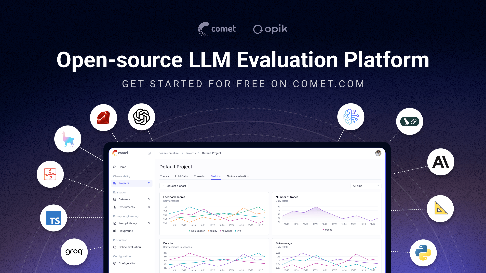

> 注意：このファイルは機械翻訳されています。翻訳の改善への貢献を歓迎します！
<div align="center"><b><a href="README.md">English</a> | <a href="readme_CN.md">简体中文</a> | <a href="readme_JP.md">日本語</a> | <a href="readme_KO.md">한국어</a></b></div>

<h1 align="center" style="border-bottom: none">
    <div>
        <a href="https://www.comet.com/site/products/opik/?from=llm&utm_source=opik&utm_medium=github&utm_content=header_img&utm_campaign=opik"><picture>
            <source media="(prefers-color-scheme: dark)" srcset="https://raw.githubusercontent.com/comet-ml/opik/refs/heads/main/apps/opik-documentation/documentation/static/img/logo-dark-mode.svg">
            <source media="(prefers-color-scheme: light)" srcset="https://raw.githubusercontent.com/comet-ml/opik/refs/heads/main/apps/opik-documentation/documentation/static/img/opik-logo.svg">
            
        </picture></a>
        <br>
        Opik
    </div>
</h1>
<h2 align="center" style="border-bottom: none">オープンソースLLM評価プラットフォーム</h2>
<p align="center">
Opikは、LLMシステムをより良く、より高速に、より低コストで実行するための構築、評価、最適化を支援します。RAGチャットボットからコードアシスタント、複雑なエージェンシーパイプラインまで、Opikは包括的なトレーシング、評価、ダッシュボード、そして <b>Opik Agent Optimizer</b> や <b>Opik Guardrails</b> といった強力な機能を提供し、本番環境のLLM搭載アプリケーションの改善とセキュリティを支えます。
</p>

<div align="center">

[](https://pypi.org/project/opik/)
[](https://github.com/comet-ml/opik/blob/main/LICENSE)
[](https://github.com/comet-ml/opik/actions/workflows/build_apps.yml)
[](https://algora.io/comet-ml/bounties?status=open)
<!-- [](https://colab.research.google.com/github/comet-ml/opik/blob/main/apps/opik-documentation/documentation/docs/cookbook/opik_quickstart.ipynb) -->

</div>

<p align="center">
    <a href="https://www.comet.com/site/products/opik/?from=llm&utm_source=opik&utm_medium=github&utm_content=website_button&utm_campaign=opik"><b>Webサイト</b></a> •
    <a href="https://chat.comet.com"><b>Slack コミュニティ</b></a> •
    <a href="https://x.com/Cometml"><b>Twitter</b></a> •
    <a href="https://www.comet.com/docs/opik/changelog"><b>変更履歴</b></a> •
    <a href="https://www.comet.com/docs/opik/?from=llm&utm_source=opik&utm_medium=github&utm_content=docs_button&utm_campaign=opik"><b>ドキュメント</b></a>
</p>

<div align="center" style="margin-top: 1em; margin-bottom: 1em;">
<a href="#🚀-opikとは">🚀 Opikとは？</a> • <a href="#🛠️-opikサーバーのインストール">🛠️ Opikサーバーのインストール</a> • <a href="#💻-opikクライアントsdk">💻 OpikクライアントSDK</a> • <a href="#📝-トレースのログ記録と統合">📝 トレースのログ記録と統合</a><br>
<a href="#🧑‍⚖️-llmをジャッジとして">🧑‍⚖️ LLMをジャッジとして</a> • <a href="#🔍-アプリケーションの評価">🔍 アプリケーションの評価</a> • <a href="#⭐-githubでスターを">⭐ GitHubでスターを</a> • <a href="#🤝-貢献">🤝 貢献</a>
</div>

<br>

[](https://www.comet.com/signup?from=llm&utm_source=opik&utm_medium=github&utm_content=readme_banner&utm_campaign=opik)

## 🚀 Opikとは？

Opik（[Comet](https://www.comet.com?from=llm&utm_source=opik&utm_medium=github&utm_content=what_is_opik_link&utm_campaign=opik)による開発）は、LLMアプリケーションのライフサイクル全体を効率化するためのオープンソースプラットフォームです。開発者がモデルやエージェンシーシステムを評価、テスト、監視、最適化できるようにします。主な提供機能は次のとおりです：
* **包括的なオブザーバビリティ**：LLM呼び出しの詳細なトレーシング、会話ログ、エージェントアクティビティの記録。
* **高度な評価**：プロンプト評価、LLM-as-a-judge、実験管理の強力な機能。
* **本番環境対応**：スケーラブルな監視ダッシュボードとオンライン評価ルール。
* **Opik Agent Optimizer**：プロンプトやエージェントを強化する専用SDKとオプティマイザー。
* **Opik Guardrails**：安全で責任あるAI実践を支援する機能。

<br>

主な機能：
* **開発 & トレーシング：**
    * 開発中および本番環境での詳細コンテキスト付きLLM呼び出しとトレースの追跡（[クイックスタート](https://www.comet.com/docs/opik/quickstart/?from=llm&utm_source=opik&utm_medium=github&utm_content=quickstart_link&utm_campaign=opik)）。
    * 幅広いサードパーティ統合によるオブザーバビリティ：Google ADK、Autogen、Flowise AIなどの最新フレームワークをネイティブサポート（[統合一覧](https://www.comet.com/docs/opik/tracing/integrations/overview/?from=llm&utm_source=opik&utm_medium=github&utm_content=integrations_link&utm_campaign=opik)）。
    * [Python SDK](https://www.comet.com/docs/opik/tracing/annotate_traces/#annotating-traces-and-spans-using-the-sdk?from=llm&utm_source=opik&utm_medium=github&utm_content=sdk_link&utm_campaign=opik)や[UI](https://www.comet.com/docs/opik/tracing/annotate_traces/#annotating-traces-through-the-ui?from=llm&utm_source=opik&utm_medium=github&utm_content=ui_link&utm_campaign=opik)を使ったトレースやスパンへのフィードバックスコアの注釈。
    * [Prompt Playground](https://www.comet.com/docs/opik/prompt_engineering/playground)でプロンプトやモデルを試行。

* **評価 & テスト：**
    * [データセット](https://www.comet.com/docs/opik/evaluation/manage_datasets/?from=llm&utm_source=opik&utm_medium=github&utm_content=datasets_link&utm_campaign=opik)と[実験](https://www.comet.com/docs/opik/evaluation/evaluate_your_llm/?from=llm&utm_source=opik&utm_medium=github&utm_content=eval_link&utm_campaign=opik)を使ったLLMアプリ評価の自動化。
    * [ハルシネーション検出](https://www.comet.com/docs/opik/evaluation/metrics/hallucination/?from=llm&utm_source=opik&utm_medium=github&utm_content=hallucination_link&utm_campaign=opik)、[モデレーション](https://www.comet.com/docs/opik/evaluation/metrics/moderation/?from=llm&utm_source=opik&utm_medium=github&utm_content=moderation_link&utm_campaign=opik)、RAG評価（[回答の関連性](https://www.comet.com/docs/opik/evaluation/metrics/answer_relevance/?from=llm&utm_source=opik&utm_medium=github&utm_content=alex_link&utm_campaign=opik)、[コンテキスト精度](https://www.comet.com/docs/opik/evaluation/metrics/context_precision/?from=llm&utm_source=opik&utm_medium=github&utm_content=context_link&utm_campaign=opik)）などのLLM-as-a-judgeメトリクス。
    * [PyTest統合](https://www.comet.com/docs/opik/testing/pytest_integration/?from=llm&utm_source=opik&utm_medium=github&utm_content=pytest_link&utm_campaign=opik)を使ったCI/CDパイプラインへの評価組み込み。

* **本番監視 & 最適化：**
    * 高ボリュームの本番トレース記録：Opikはスケールを重視（1日あたり4,000万以上のトレース）。
    * Opikダッシュボードでフィードバックスコア、トレース数、トークン使用量を時間推移で監視（[ダッシュボード](https://www.comet.com/docs/opik/production/production_monitoring/?from=llm&utm_source=opik&utm_medium=github&utm_content=dashboard_link&utm_campaign=opik)）。
    * [オンライン評価ルール](https://www.comet.com/docs/opik/production/rules/?from=llm&utm_source=opik&utm_medium=github&utm_content=dashboard_link&utm_campaign=opik)を使った本番問題の検出。
    * **Opik Agent Optimizer** と **Opik Guardrails** で本番環境のLLMアプリを継続的に改善・保護。

> [!TIP]
> 現在Opikにない機能が必要な場合は、ぜひ新しい[機能リクエスト](https://github.com/comet-ml/opik/issues/new/choose)を提出してください 🚀

<br>

## 🛠️ Opikサーバーのインストール

数分でOpikサーバーを起動できます。ニーズに合ったオプションを選んでください：

### オプション1：Comet.comクラウド（最も簡単 & 推奨）
セットアップ不要で即時にOpikにアクセスできます。クイックスタートやメンテナンス不要の方に最適。

👉 [無料のCometアカウントを作成](https://www.comet.com/signup?from=llm&utm_source=opik&utm_medium=github&utm_content=install_create_link&utm_campaign=opik)

### オプション2：セルフホストによる完全管理
独自環境にOpikをデプロイ。ローカルはDocker、スケーラブル環境はKubernetesを選択。

#### Docker Composeでのセルフホスト（ローカル開発 & テスト向け）
最も簡単にローカルOpikインスタンスを起動する方法です。新しい `.opik.sh` インストールスクリプトに注目：

On Linux or Mac Enviroment:  
```bash
# Opikリポジトリをクローン
git clone https://github.com/comet-ml/opik.git

# リポジトリへ移動
cd opik

# Opikプラットフォームを起動
./opik.sh
```

On Windows Enviroment:  
```powershell
# Opikリポジトリをクローン
git clone https://github.com/comet-ml/opik.git

# リポジトリへ移動
cd opik

# Opikプラットフォームを起動
powershell -ExecutionPolicy ByPass -c ".\\opik.ps1"
```

`--help` または `--info` オプションでトラブルシューティングが可能。Dockerfileは非rootユーザー実行を保証し、セキュリティを強化。起動後、ブラウザで [localhost:5173](http://localhost:5173) を開くだけです。詳細は [ローカルデプロイガイド](https://www.comet.com/docs/opik/self-host/local_deployment?from=llm&utm_source=opik&utm_medium=github&utm_content=self_host_link&utm_campaign=opik) をご覧ください。

#### Kubernetes & Helmでのセルフホスト（大規模デプロイ向け）
本番や大規模セルフホスト環境では、Helmチャートを使ってKubernetesクラスタにインストールできます。詳しくはバッジをクリックして [Kubernetesインストールガイド (Helm)](https://www.comet.com/docs/opik/self-host/kubernetes/#kubernetes-installation?from=llm&utm_source=opik&utm_medium=github&utm_content=kubernetes_link&utm_campaign=opik) をご参照ください。

[](https://www.comet.com/docs/opik/self-host/kubernetes/#kubernetes-installation?from=llm&utm_source=opik&utm_medium=github&utm_content=kubernetes_link&utm_campaign=opik)

## 💻 OpikクライアントSDK

Opikは、Opikサーバーとやり取りするためのクライアントライブラリ群とREST APIを提供します。Python、TypeScript、Ruby（OpenTelemetry経由）のSDKがあり、ワークフローへのシームレスな統合が可能です。詳細は [Opikクライアントリファレンス](apps/opik-documentation/documentation/fern/docs/reference/overview.mdx) をご覧ください。

### Python SDKクイックスタート
Python SDKを始めるには：

パッケージをインストール：  
```bash
# pipでインストール
pip install opik

# または uv を使ってインストール
uv pip install opik
```

`opik configure` コマンドを実行して、Opikサーバーアドレス（セルフホストの場合）またはAPIキーとワークスペース（Comet.comの場合）を入力します：  
```bash
opik configure
```

> [!TIP]
> Pythonコード内で `opik.configure(use_local=True)` を呼び出してローカルセルフホスト構成にしたり、APIキーとワークスペースを直接指定することも可能です。詳細は [Python SDKドキュメント](apps/opik-documentation/documentation/fern/docs/reference/python-sdk/) を参照してください。

これで [Python SDK](https://www.comet.com/docs/opik/python-sdk-reference/?from=llm&utm_source=opik&utm_medium=github&utm_content=sdk_link2&utm_campaign=opik) を使ったトレースのログ記録が可能になります。

### 📝 トレースのログ記録と統合

最も簡単なトレース記録方法は、直接統合を使うことです。Opikは以下を含む多様なフレームワークをサポートしています：  

| 統合               | 説明                                             | ドキュメント                                                                                                                                                                       | Colabで試す                                                                                                                                                                                                                          |
|--------------------|--------------------------------------------------|------------------------------------------------------------------------------------------------------------------------------------------------------------------------------------|----------------------------------------------------------------------------------------------------------------------------------------------------------------------------------------------------------------------------------|
| **AG2**            | AG2 LLM 呼び出しのトレースを記録                | [ドキュメント](https://www.comet.com/docs/opik/tracing/integrations/ag2?utm_source=opik&utm_medium=github&utm_content=anthropic_link&utm_campaign=opik)                               | （準備中）                                                                                                                                                                                                                        |
| **aisuite**        | aisuite LLM 呼び出しのトレースを記録            | [ドキュメント](https://www.comet.com/docs/opik/tracing/integrations/aisuite?utm_source=opik&utm_medium=github&utm_content=anthropic_link&utm_campaign=opik)                           | [](https://colab.research.google.com/github/comet-ml/opik/blob/master/apps/opik-documentation/documentation/docs/cookbook/aisuite.ipynb)       |
| **Anthropic**      | Anthropic LLM 呼び出しのトレースを記録          | [ドキュメント](https://www.comet.com/docs/opik/tracing/integrations/anthropic?utm_source=opik&utm_medium=github&utm_content=anthropic_link&utm_campaign=opik)                        | [](https://colab.research.google.com/github/comet-ml/opik/blob/master/apps/opik-documentation/documentation/docs/cookbook/anthropic.ipynb)     |
| **Autogen**        | Autogen エージェンシーワークフローのトレースを記録 | [ドキュメント](https://www.comet.com/docs/opik/tracing/integrations/autogen?utm_source=opik&utm_medium=github&utm_content=autogen_link&utm_campaign=opik)                          | （準備中）                                                                                                                                                                                                                        |
| **Bedrock**        | Amazon Bedrock LLM 呼び出しのトレースを記録       | [ドキュメント](https://www.comet.com/docs/opik/tracing/integrations/bedrock?utm_source=opik&utm_medium=github&utm_content=bedrock_link&utm_campaign=opik)                             | [](https://colab.research.google.com/github/comet-ml/opik/blob/master/apps/opik-documentation/documentation/docs/cookbook/bedrock.ipynb)       |
| **CrewAI**         | CrewAI 呼び出しのトレースを記録                  | [ドキュメント](https://www.comet.com/docs/opik/tracing/integrations/crewai?utm_source=opik&utm_medium=github&utm_content=crewai_link&utm_campaign=opik)                             | [](https://colab.research.google.com/github/comet-ml/opik/blob/master/apps/opik-documentation/documentation/docs/cookbook/crewai.ipynb)         |
| **DeepSeek**       | DeepSeek LLM 呼び出しのトレースを記録             | [ドキュメント](https://www.comet.com/docs/opik/tracing/integrations/deepseek?utm_source=opik&utm_medium=github&utm_content=deepseek_link&utm_campaign=opik)                           | （準備中）                                                                                                                                                                                                                        |
| **Dify**           | Dify エージェンシー実行のトレースを記録         | [ドキュメント](https://www.comet.com/docs/opik/tracing/integrations/dify?utm_source=opik&utm_medium=github&utm_content=dspy_link&utm_campaign=opik)                                  | （準備中）                                                                                                                                                                                                                        |
| **DSPy**           | DSPy 実行のトレースを記録                        | [ドキュメント](https://www.comet.com/docs/opik/tracing/integrations/dspy?utm_source=opik&utm_medium=github&utm_content=dspy_link&utm_campaign=opik)                                  | [](https://colab.research.google.com/github/comet-ml/opik/blob/master/apps/opik-documentation/documentation/docs/cookbook/dspy.ipynb)           |
| **Flowise AI**     | Flowise AI ビジュアルLLMアプリのトレースを記録  | [ドキュメント](https://www.comet.com/docs/opik/tracing/integrations/flowise?utm_source=opik&utm_medium=github&utm_content=flowise_link&utm_campaign=opik)                           | （ネイティブUI統合、ドキュメント参照）                                                                                                                                                                                          |
| **Gemini**         | Google Gemini LLM 呼び出しのトレースを記録      | [ドキュメント](https://www.comet.com/docs/opik/tracing/integrations/gemini?utm_source=opik&utm_medium=github&utm_content=gemini_link&utm_campaign=opik)                             | [](https://colab.research.google.com/github/comet-ml/opik/blob/master/apps/opik-documentation/documentation/docs/cookbook/gemini.ipynb)      |
| **Google ADK**     | Google Agent Development Kit (ADK) のトレースを記録 | [ドキュメント](https://www.comet.com/docs/opik/tracing/integrations/google_adk?utm_source=opik&utm_medium=github&utm_content=google_adk_link&utm_campaign=opik)                    | （準備中）                                                                                                                                                                                                                        |
| **Groq**           | Groq LLM 呼び出しのトレースを記録                | [ドキュメント](https://www.comet.com/docs/opik/tracing/integrations/groq?utm_source=opik&utm_medium=github&utm_content=groq_link&utm_campaign=opik)                               | [](https://colab.research.google.com/github/comet-ml/opik/blob/master/apps/opik-documentation/documentation/docs/cookbook/groq.ipynb)         |
| **Guardrails**     | Guardrails AI 検証のトレースを記録               | [ドキュメント](https://www.comet.com/docs/opik/tracing/integrations/guardrails/?utm_source=opik&utm_medium=github&utm_content=guardrails_link&utm_campaign=opik)                    | [](https://colab.research.google.com/github/comet-ml/opik/blob/master/apps/opik-documentation/documentation/docs/cookbook/guardrails-ai.ipynb) |
| **Haystack**       | Haystack 呼び出しのトレースを記録                | [ドキュメント](https://www.comet.com/docs/opik/tracing/integrations/haystack/?utm_source=opik&utm_medium=github&utm_content=haystack_link&utm_campaign=opik)                     | [](https://colab.research.google.com/github/comet-ml/opik/blob/master/apps/opik-documentation/documentation/docs/cookbook/haystack.ipynb)      |
| **Instructor**     | Instructor 経由のLLM呼び出しトレースを記録      | [ドキュメント](https://www.comet.com/docs/opik/tracing/integrations/instructor/?utm_source=opik&utm_medium=github&utm_content=instructor_link&utm_campaign=opik)                  | [](https://colab.research.google.com/github/comet-ml/opik/blob/master/apps/opik-documentation/documentation/docs/cookbook/instructor.ipynb) |
| **LangChain**      | LangChain LLM 呼び出しのトレースを記録          | [ドキュメント](https://www.comet.com/docs/opik/tracing/integrations/langchain/?utm_source=opik&utm_medium=github&utm_content=langchain_link&utm_campaign=opik)                   | [](https://colab.research.google.com/github/comet-ml/opik/blob/master/apps/opik-documentation/documentation/docs/cookbook/langchain.ipynb)   |
| **LangChain JS**   | LangChain JS LLM 呼び出しのトレースを記録       | [ドキュメント](https://www.comet.com/docs/opik/tracing/integrations/langchainjs/?utm_source=opik&utm_medium=github&utm_content=langchain_link&utm_campaign=opik)                | （準備中）                                                                                                                                                                                                                        |
| **LangGraph**      | LangGraph 実行のトレースを記録                   | [ドキュメント](https://www.comet.com/docs/opik/tracing/integrations/langgraph/?utm_source=opik&utm_medium=github&utm_content=langchain_link&utm_campaign=opik)                   | [](https://colab.research.google.com/github/comet-ml/opik/blob/master/apps/opik-documentation/documentation/docs/cookbook/langgraph.ipynb)  |
| **LiteLLM**        | LiteLLM モデル呼び出しのトレースを記録          | [ドキュメント](https://www.comet.com/docs/opik/tracing/integrations/litellm/?utm_source=opik&utm_medium=github&utm_content=openai_link&utm_campaign=opik)                     | [](https://colab.research.google.com/github/comet-ml/opik/blob/master/apps/opik-documentation/documentation/docs/cookbook/litellm.ipynb)    |
| **LlamaIndex**     | LlamaIndex LLM 呼び出しのトレースを記録        | [ドキュメント](https://www.comet.com/docs/opik/tracing/integrations/llama_index?utm_source=opik&utm_medium=github&utm_content=llama_index_link&utm_campaign=opik)               | [](https://colab.research.google.com/github/comet-ml/opik/blob/master/apps/opik-documentation/documentation/docs/cookbook/llama-index.ipynb)   |
| **Ollama**         | Ollama LLM 呼び出しのトレースを記録             | [ドキュメント](https://www.comet.com/docs/opik/tracing/integrations/ollama?utm_source=opik&utm_medium=github&utm_content=ollama_link&utm_campaign=opik)                       | [](https://colab.research.google.com/github/comet-ml/opik/blob/master/apps/opik-documentation/documentation/docs/cookbook/ollama.ipynb)    |
| **OpenAI**         | OpenAI LLM 呼び出しのトレースを記録            | [ドキュメント](https://www.comet.com/docs/opik/tracing/integrations/openai/?utm_source=opik&utm_medium=github&utm_content=openai_link&utm_campaign=opik)                        | [](https://colab.research.google.com/github/comet-ml/opik/blob/master/apps/opik-documentation/documentation/docs/cookbook/openai.ipynb)      |
| **OpenAI Agents**  | OpenAI Agents SDK 呼び出しのトレースを記録     | [ドキュメント](https://www.comet.com/docs/opik/tracing/integrations/openai_agents/?utm_source=opik&utm_medium=github&utm_content=openai_link&utm_campaign=opik)               | （準備中）                                                                                                                                                                                                                        |
| **OpenRouter**     | OpenRouter LLM 呼び出しのトレースを記録        | [ドキュメント](https://www.comet.com/docs/opik/tracing/openrouter/overview//?utm_source=opik&utm_medium=github&utm_content=openai_link&utm_campaign=opik)                        | （準備中）                                                                                                                                                                                                                        |
| **OpenTelemetry**  | OpenTelemetry 対応呼び出しのトレースを記録     | [ドキュメント](https://www.comet.com/docs/opik/tracing/opentelemetry/overview//?utm_source=opik&utm_medium=github&utm_content=openai_link&utm_campaign=opik)                   | （準備中）                                                                                                                                                                                                                        |
| **Predibase**      | Predibase LLM 呼び出しのトレースを記録         | [ドキュメント](https://www.comet.com/docs/opik/tracing/integrations/predibase?utm_source=opik&utm_medium=github&utm_content=predibase_link&utm_campaign=opik)                   | [](https://colab.research.google.com/github/comet-ml/opik/blob/master/apps/opik-documentation/documentation/docs/cookbook/predibase.ipynb) |
| **Pydantic AI**    | PydanticAI エージェント呼び出しのトレースを記録 | [ドキュメント](https://www.comet.com/docs/opik/tracing/integrations/pydantic-ai?utm_source=opik&utm_medium=github&utm_content=predibase_link&utm_campaign=opik)                | [](https://colab.research.google.com/github/comet-ml/opik/blob/master/apps/opik-documentation/documentation/docs/cookbook/pydantic-ai.ipynb) |
| **Ragas**          | Ragas 評価のトレースを記録                     | [ドキュメント](https://www.comet.com/docs/opik/tracing/integrations/ragas?utm_source=opik&utm_medium=github&utm_content=pydantic_ai_link&utm_campaign=opik)                      | [](https://colab.research.google.com/github/comet-ml/opik/blob/master/apps/opik-documentation/documentation/docs/cookbook/ragas.ipynb)         |
| **Smolagents**     | Smolagents エージェント呼び出しのトレースを記録 | [ドキュメント](https://www.comet.com/docs/opik/tracing/integrations/smolagents?utm_source=opik&utm_medium=github&utm_content=smolagents_link&utm_campaign=opik)     | [](https://colab.research.google.com/github/comet-ml/opik/blob/master/apps/opik-documentation/documentation/docs/cookbook/smolagents.ipynb)  |
| **Strands Agents** | Strands Agents 呼び出しのトレースを記録         | [ドキュメント](https://www.comet.com/docs/opik/tracing/integrations/strands-agents/?utm_source=opik&utm_medium=github&utm_content=langchain_link&utm_campaign=opik)           | （準備中）                                                                                                                                                                                                                        |
| **Vercel AI**      | Vercel AI SDK 呼び出しのトレースを記録         | [ドキュメント](https://www.comet.com/docs/opik/tracing/integrations/vercel-ai-sdk/?utm_source=opik&utm_medium=github&utm_content=langchain_link&utm_campaign=opik)             | （準備中）                                                                                                                                                                                                                        |
| **watsonx**        | IBM watsonx LLM 呼び出しのトレースを記録      | [ドキュメント](https://www.comet.com/docs/opik/tracing/integrations/watsonx?utm_source=opik&utm_medium=github&utm_content=watsonx_link&utm_campaign=opik)                     | [](https://colab.research.google.com/github/comet-ml/opik/blob/master/apps/opik-documentation/documentation/docs/cookbook/watsonx.ipynb)     |

> [!TIP]
> リストにないフレームワークを使用している場合は、[Issueを開く](https://github.com/comet-ml/opik/issues)かPRを提出してください。

フレームワークを使用しない場合は、`track` デコレータを使ってトレースを記録できます（[詳細](https://www.comet.com/docs/opik/tracing/log_traces/?from=llm&utm_source=opik&utm_medium=github&utm_content=traces_link&utm_campaign=opik)）：

```python
import opik

opik.configure(use_local=True) # ローカル実行

@opik.track
def my_llm_function(user_question: str) -> str:
    # あなたのLLMコードをここに記述
    return "こんにちは"
```

> [!TIP]
> trackデコレータは統合と併用でき、ネストされた関数呼び出しのトラッキングにも対応します。

### 🧑‍⚖️ LLMをジャッジとして

Python Opik SDKにはLLM-as-a-judge用メトリクスが多数含まれており、LLMアプリの評価に役立ちます。詳細は [メトリクスドキュメント](https://www.comet.com/docs/opik/evaluation/metrics/overview/?from=llm&utm_source=opik&utm_medium=github&utm_content=metrics_2_link&utm_campaign=opik) をご覧ください。

使用例：  
```python
from opik.evaluation.metrics import Hallucination

metric = Hallucination()
score = metric.score(
    input="フランスの首都は何ですか？",
    output="パリ",
    context=["フランスはヨーロッパの国です。"]
)
print(score)
```

Opikには事前定義のヒューリスティックメトリクスも多数含まれており、独自メトリクスの作成も可能です。詳細は同じく [メトリクスドキュメント](https://www.comet.com/docs/opik/evaluation/metrics/overview/?from=llm&utm_source=opik&utm_medium=github&utm_content=metrics_3_link&utm_campaign=opik) をご覧ください。

### 🔍 アプリケーションの評価

開発中の評価には [データセット](https://www.comet.com/docs/opik/evaluation/manage_datasets/?from=llm&utm_source=opik&utm_medium=github&utm_content=datasets_2_link&utm_campaign=opik) と [実験](https://www.comet.com/docs/opik/evaluation/evaluate_your_llm/?from=llm&utm_source=opik&utm_medium=github&utm_content=experiments_link&utm_campaign=opik) を活用できます。Opikダッシュボードは実験のチャートを強化し、大規模トレースの扱いを改善します。CI/CDへの組み込みには [PyTest統合](https://www.comet.com/docs/opik/testing/pytest_integration/?from=llm&utm_source=opik&utm_medium=github&utm_content=pytest_2_link&utm_campaign=opik) をご利用ください。

## ⭐ GitHubでスターを

Opikがお役に立ちましたら、ぜひスターをお願いします！コミュニティの拡大と製品改善の励みになります。

[](https://github.com/comet-ml/opik)

## 🤝 貢献

Opikへの貢献方法は多数あります：

* [バグ報告](https://github.com/comet-ml/opik/issues) や [機能リクエスト](https://github.com/comet-ml/opik/issues) を提出
* ドキュメントをレビューし、[プルリクエスト](https://github.com/comet-ml/opik/pulls) を送信
* Opikについて講演や記事執筆を行い、[連絡](https://chat.comet.com)
* [人気の機能リクエスト](https://github.com/comet-ml/opik/issues?q=is%3Aissue+is%3Aopen+label%3A%22enhancement%22) に投票してサポートを示す

詳細は [貢献ガイドライン](CONTRIBUTING.md) をご覧ください。
