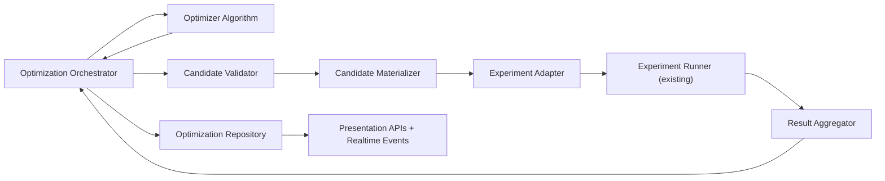
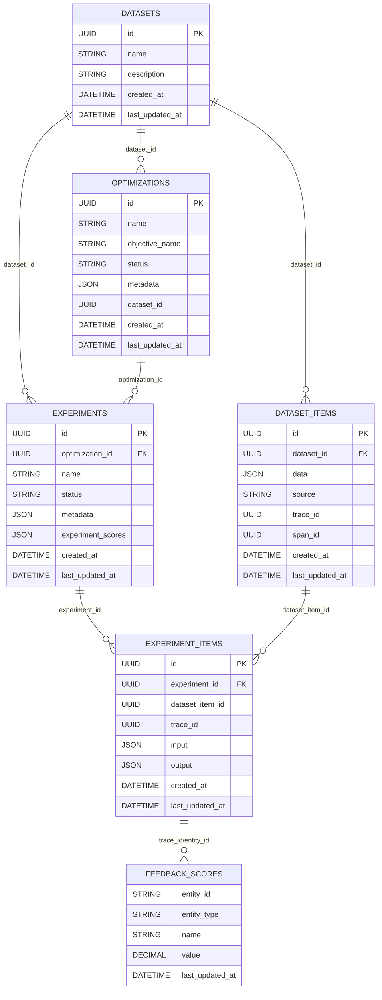
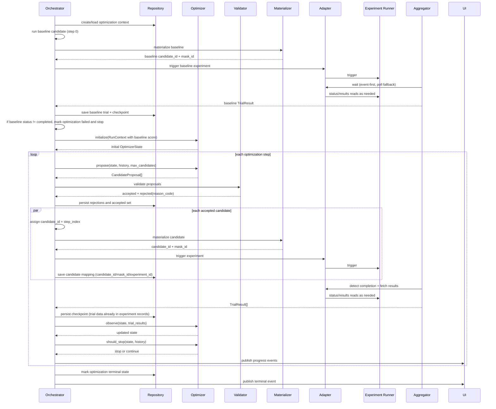

## Optimization Framework Design

### 1. Overview

This document defines an optimizer-agnostic framework for running agent optimization on top of Opik experiments and evaluation suites.

The framework is responsible for:

1. Receiving full candidate configurations from an optimizer algorithm.
2. Validating candidates with framework guardrails.
3. Creating isolated execution overlays (`mask_id`) per accepted candidate.
4. Triggering experiments through existing experiment execution capability.
5. Detecting completion and aggregating experiment outputs into normalized trial results.
6. Feeding trial results back to the optimizer algorithm.
7. Persisting optimization state and exposing progress to the frontend.

Principle: optimizer algorithms decide **what to test next**; the framework decides **how to run, persist, and report**.

---

### 2. Goals

1. Support GEPA and other optimizers through one shared interface.
2. Reuse existing Opik optimization/experiment persistence so results are visible in Opik UI.
3. Keep optimizer code independent from experiment transport/execution details.
4. Provide explicit lineage so UI can show candidate evolution.
5. Keep contracts clear and implementable by backend, optimizer, and frontend teams.

---

### 3. Terminology

1. **Optimization**: One end-to-end optimization session; identified by `optimization_id`.
2. **Candidate**: One full configuration proposed for evaluation.
3. **Trial**: One candidate evaluation record, backed by one experiment.
4. **Evaluation Suite**: Dataset + evaluators + policy used by experiment engine.
5. **Mask (`mask_id`)**: Request-scoped configuration overlay for isolated candidate execution.
6. **Optimization Graph**: Parent-child relations between candidates used to render optimization evolution.
7. **Experiment Runner**: Existing experiment execution capability (push/pull behavior belongs there).
8. **Result Aggregator**: Framework component that detects completion and builds normalized trial results.
9. **Canonical Config Hash**: Deterministic hash of a normalized full candidate configuration used for deduplication.

---

### 4. High-Level Architecture



Ownership:

1. **Orchestrator** is the active controller.
2. **Experiment Adapter** is the integration boundary between framework and experiment runner APIs.
3. **Result Aggregator** decides when trial results are ready and publishes normalized results to orchestrator.
4. **Optimizer Algorithm** never polls experiments and never serves frontend payloads.

How completion is detected:

1. Preferred: completion events from experiment runner.
2. Fallback: status polling through adapter.
3. In both cases, aggregator builds final `TrialResult` and hands it to orchestrator.

---

### 5. ERD (Persistence Model)

Framework implementation uses existing Opik persistence models.



DB location:

1. `optimizations`: Opik analytics DB.
2. `experiments`: Opik analytics DB.
3. `experiment_items`: Opik analytics DB.
4. `datasets`: Opik analytics DB.
5. `dataset_items`: Opik analytics DB.
6. `feedback_scores`: Opik analytics DB.

Storage mapping:

1. Optimization checkpoint state -> `optimizations.metadata.framework_checkpoint`.
2. Run-level errors/status details -> `optimizations.metadata.framework_error`.
3. Candidate-trial attribution -> `experiments.metadata` fields:
   - `candidate_id`
   - `mask_id`
   - `step_index`
   - `parent_candidate_ids`
   - `candidate_config_hash`
4. Trial-level terminal errors -> `experiments.metadata.trial_error`.
5. Objective/trial metric values shown in optimization views are derived from `feedback_scores` linked through experiment item traces.

Notes:

1. `experiments.optimization_id` is the canonical relational link used today.
2. No new DB tables are required for this framework implementation.

---

### 6. Main Components: Roles and Responsibilities

### 6.1 Optimization Orchestrator

Responsibilities:

1. Create/load optimization context.
2. Run baseline evaluation before first optimizer proposal.
3. Call optimizer methods in order: `initialize -> propose -> observe -> should_stop`.
4. Assign `candidate_id` to accepted candidates.
5. Coordinate validation, materialization, execution, aggregation, and persistence.
6. Apply framework stop conditions (cancel, global timeout, fatal internal error).

### 6.2 Optimizer Algorithm

Responsibilities:

1. Generate candidate configurations.
2. Update internal algorithm state based on trial outcomes.
3. Decide algorithmic stopping conditions.

Non-responsibilities:

1. No direct experiment API calls.
2. No completion polling/subscription logic.
3. No frontend data formatting.

### 6.3 Candidate Validator

Responsibilities:

1. Validate candidate shape and value constraints.
2. Validate lineage references.
3. Deduplicate candidates.

Deduplication rule:

1. Normalize candidate configuration deterministically (stable key ordering + normalized numeric/string forms).
2. Hash normalized configuration (`candidate_config_hash`).
3. Reject duplicates already accepted/evaluated in the same optimization.

Validator output:

1. `accepted_candidates` for execution.
2. `rejected_candidates` with `reason_code`.

What `reason_code` is used for:

1. Explain to user why candidate was not run.
2. Debug optimizer behavior.
3. Feed product analytics on rejection patterns.
4. Clarify this is a pre-experiment rejection. If execution starts and then fails, it is a trial failure, not a rejection.
5. Because no experiment exists yet for rejected candidates, these records are stored as optimization-level validation events.

### 6.4 Candidate Materializer

Responsibilities:

1. Persist accepted candidate metadata.
2. Create candidate `mask_id`.
3. Return execution-ready identity tuple (`candidate_id`, `mask_id`).

### 6.5 Experiment Adapter

Why this exists:

1. Framework calls one stable interface even if experiment runner APIs/protocols change.
2. Tests can mock this boundary to validate orchestrator logic without real remote execution.

Responsibilities:

1. Trigger experiment for one candidate.
2. Provide status and result read methods used by the aggregator.
3. Cancel running experiments.

Clarification:

1. Adapter exposes raw status/results access.
2. Aggregator owns completion logic, retry/backoff for reads, and normalization into `TrialResult`.

### 6.6 Result Aggregator

Responsibilities:

1. Track in-flight experiments for an optimization.
2. Determine terminal completion for each candidate experiment.
3. Retrieve results via adapter.
4. Build normalized trial outputs.
5. Return ready trial batch to orchestrator.

What "aggregation failure" means:

1. Experiment reached terminal state, but result fetch/parse/normalize failed.

### 6.7 Optimization Repository

Pattern:

1. Repository interface with production implementation backed by Opik persistence.
2. Tests inject mocks.

Responsibilities:

1. Persist/load optimizer checkpoint state.
2. Persist candidate-to-experiment mappings.
3. Expose read models for frontend by querying existing experiment data.

### 6.8 Presentation Layer

Responsibilities:

1. Read optimization summary and trial tables.
2. Read lineage graph data (nodes/edges).
3. Consume realtime lifecycle events.

Important:

1. Frontend data is served from framework persistence/read models.
2. Optimizer algorithm is not directly queried by frontend.

---

### 7. Technical Flow



Lineage in this flow:

1. Candidate includes `parent_candidate_ids`.
2. Repository stores lineage per candidate.
3. Frontend reads lineage graph projection from repository.

---

### 8. Interfaces and Types

### 8.1 Optimizer Interface

```python
class Optimizer(Protocol):
    def initialize(self, context: "RunContext") -> "OptimizerState":
        ...

    def propose(
        self,
        state: "OptimizerState",
        history: "TrialHistory",
        max_candidates: int
    ) -> list["CandidateProposal"]:
        ...

    def observe(
        self,
        state: "OptimizerState",
        trial_results: list["TrialResult"]
    ) -> "OptimizerState":
        ...

    def should_stop(
        self,
        state: "OptimizerState",
        history: "TrialHistory"
    ) -> "StopDecision":
        ...
```

Method intent:

1. `initialize`: build algorithm state after baseline is available.
2. `propose`: generate next candidate batch.
3. `observe`: update algorithm state with completed trial outcomes.
4. `should_stop`: algorithm-level stop decision.

GEPA fit:

1. Baseline result is available before `initialize`.
2. GEPA can seed initial population from baseline context in `initialize`.
3. GEPA updates population in `observe` and emits next generation in `propose`.

### 8.2 RunContext

```python
@dataclass(frozen=True)
class RunContext:
    optimization_id: str
    evaluation_suite_id: str
    objective_name: str
    baseline_candidate_id: str
    baseline_score: float
    max_candidates_per_step: int
```

Field usage:

1. `optimization_id`: top-level correlation key for this run.
2. `evaluation_suite_id`: suite used for all trials in this optimization.
3. `objective_name`: primary objective being optimized.
4. `baseline_candidate_id`: lineage root reference.
5. `baseline_score`: baseline objective score used as reference for first proposal.
6. `max_candidates_per_step`: framework batch limit provided to algorithm.

Creation timing:

1. Orchestrator creates `RunContext` only after baseline trial completes successfully.
2. If baseline fails, optimization is marked failed and optimizer is not initialized.

### 8.3 OptimizerState

```python
@dataclass
class OptimizerState:
    generation: int
    best_candidate_id: str | None
    best_score: float | None
    algorithm_data: dict[str, Any]
```

Field usage:

1. `generation`: current optimizer generation/iteration index.
2. `best_candidate_id`: best-known candidate according to optimizer.
3. `best_score`: best-known objective value.
4. `algorithm_data`: algorithm-specific serializable state.

Persistence:

1. Stored in `optimizations.metadata.framework_checkpoint.optimizer_state`.

### 8.4 CandidateProposal

```python
@dataclass
class CandidateProposal:
    configuration: dict[str, Any]
    parent_candidate_ids: list[str]
    rationale: str | None = None
```

Field usage:

1. `configuration`: full execution configuration.
2. `parent_candidate_ids`: lineage edges.
3. `rationale`: optional human-readable explanation.

Notes:

1. `candidate_id` is generated by framework on acceptance.

### 8.5 TrialHistory

```python
@dataclass
class TrialHistory:
    trials: list["TrialResult"]
```

Usage:

1. Contains completed trials only.
2. Used by optimizer to propose and decide stopping.

### 8.6 StopDecision

```python
class StopReason(str, Enum):
    TARGET_REACHED = "target_reached"
    CONVERGENCE = "convergence"
    NO_IMPROVEMENT = "no_improvement"
    ALGORITHM_SPECIFIC = "algorithm_specific"

@dataclass
class StopDecision:
    should_stop: bool
    reason: StopReason | None = None
    message: str | None = None
```

Usage:

1. `should_stop`: algorithm wants to stop.
2. `reason`: machine-readable reason.
3. `message`: optional human-readable reason.

### 8.7 ExperimentAdapter

```python
class ExperimentAdapter(Protocol):
    def trigger(self, request: "ExperimentRequest") -> "TriggeredExperiment":
        ...

    def get_status(self, experiment_id: str) -> "ExperimentStatus":
        ...

    def get_results(self, experiment_id: str) -> "RawExperimentResults":
        ...

    def cancel(self, experiment_id: str) -> None:
        ...
```

Why needed:

1. One integration boundary between framework and experiment runner.
2. Allows event and polling mechanics without leaking runner-specific details into orchestrator.

### 8.8 ExperimentRequest

```python
@dataclass
class ExperimentRequest:
    optimization_id: str
    candidate_id: str
    mask_id: str
    evaluation_suite_id: str
    execution_params: dict[str, Any]
```

Field usage:

1. `optimization_id`: ties experiment to optimization session.
2. `candidate_id`: ties experiment to one candidate.
3. `mask_id`: ensures candidate-isolated config execution.
4. `evaluation_suite_id`: tells experiment runner what suite to execute.
5. `execution_params`: pass-through parameters required by experiment runner.

### 8.9 TrialResult

```python
@dataclass
class TrialSummary:
    total_items: int
    passed_items: int
    failed_items: int
    pass_rate: float
    total_cost: float | None
    avg_latency_ms: float | None
    avg_ttft_ms: float | None

@dataclass
class TrialResult:
    optimization_id: str
    candidate_id: str
    mask_id: str
    experiment_id: str
    status: Literal["completed", "failed", "cancelled", "timeout"]

    objective_score: float | None
    summary: TrialSummary
    error: str | None = None
```

Why this shape:

1. `objective_score` is a single scalar used directly by optimizer.
2. `summary` is a fixed type for consistent UI display.
3. Large detail payloads (`item_results`, `trace_refs`) are not embedded here; frontend fetches details on demand from experiment APIs.

### 8.10 Repository Interface

```python
class OptimizationRepository(Protocol):
    def create_optimization(self, optimization_id: str, context: RunContext) -> None:
        ...

    def save_checkpoint(self, optimization_id: str, state: OptimizerState) -> None:
        ...

    def save_candidate_mapping(
        self,
        optimization_id: str,
        candidate_id: str,
        experiment_id: str,
        mask_id: str,
        step_index: int,
        parent_candidate_ids: list[str],
        candidate_config_hash: str,
    ) -> None:
        ...

    def save_rejection(
        self,
        optimization_id: str,
        proposed_index: int,
        reason_code: str,
    ) -> None:
        ...

    def get_optimization_summary(self, optimization_id: str) -> dict[str, Any]:
        ...

    def list_trials(self, optimization_id: str) -> list[TrialResult]:
        ...

    def get_optimization_graph(self, optimization_id: str) -> dict[str, Any]:
        ...

    def list_validation_rejections(self, optimization_id: str) -> list[dict[str, Any]]:
        ...

    def load_checkpoint(self, optimization_id: str) -> OptimizerState | None:
        ...

    def load_history(self, optimization_id: str) -> TrialHistory:
        ...
```

Storage mapping for repository methods:

1. `save_checkpoint` -> `optimizations.metadata.framework_checkpoint`.
2. `save_candidate_mapping` -> `experiments.metadata` on experiment creation/update.
3. `save_rejection` -> optimization-level validation event log in `optimizations.metadata.validation_rejections`.
4. `get_optimization_summary` -> `optimizations` (+ aggregate trial signals from linked experiments).
5. `list_trials` -> `experiments` linked by `experiments.optimization_id`.
6. `get_optimization_graph` -> candidate lineage fields in `experiments.metadata`.
7. `list_validation_rejections` -> `optimizations.metadata.validation_rejections`.

Scope:

1. Tests inject mocks instead of real repository implementation.

---

### 9. Error Handling (Including Resumption and Recovery)

### 9.1 Failure types and storage

1. Validation failure:
   - stored as rejection record (`reason_code`) in optimization metadata/event log.
2. Experiment execution failure:
   - stored in trial (`status` + `error`) and `experiments.metadata.trial_error`.
3. Aggregation failure (terminal experiment but result read/parse failed):
   - stored in trial error + experiment metadata.
4. Optimizer method exception:
   - stored in `optimizations.metadata.framework_error` and run terminal status.
5. Persistence failure:
   - checkpoint/run write failures stored in `optimizations.metadata.framework_error`.
   - experiment metadata update failures (for trial_error/candidate mapping) stored in `optimizations.metadata.framework_error`.

### 9.2 Retry policy principles

1. Retry transient failures (network timeout, temporary unavailable, throttling) with backoff.
2. Do not retry permanent failures (validation schema error, 4xx contract errors).
3. Persistence retries depend on error class:
   - transient DB/connectivity: retry,
   - deterministic schema/serialization bug: fail fast.

### 9.3 Resumption and recovery flow

Recovery sources:

1. Checkpoint state in optimization metadata.
2. Candidate mappings in experiment metadata (`candidate_id`, `mask_id`, `step_index`, `parent_candidate_ids`).
3. Trial outcomes in experiment records.

Resume sequence:

1. Load checkpoint and completed history.
2. Query mapped experiments where status is not one of `completed`, `failed`, `cancelled`, `timeout`.
3. For each such candidate:
   - if experiment is now terminal: aggregate and persist trial.
   - if experiment still running: continue waiting.
   - if experiment missing: mark trial failed with `error="orphaned_experiment"`.
4. Continue orchestrator loop from next unresolved step.

Idempotency:

1. Never trigger new experiment when candidate record already has an assigned `experiment_id`.
2. Trial persistence upsert key is `(optimization_id, candidate_id)`.
3. Event consumers dedupe using stable event key (for example `optimization_id + candidate_id + event_type + step_index`).

Where duplicate event handling matters:

1. Process crashes after trial persistence but before marking event as delivered.
2. On recovery, `trial_completed` can be emitted again for same candidate.
3. Consumers ignore repeated events with same stable event key.

---

### 10. Performance and Concurrency

Key constraints:

1. Validation and orchestration CPU inside framework.
2. Experiment-runner throughput limits.
3. Remote execution target limits (rate limiting, throttling, queue saturation).

Concurrency strategy:

1. Validate proposals in parallel.
2. Bound concurrent experiment triggers.
3. Aggregate completions asynchronously in batches.
4. Apply backpressure when remote execution is throttled.

Tradeoffs:

1. More concurrency improves throughput but increases throttle/rate-limit risk.
2. Less concurrency improves stability but increases total optimization runtime.
3. Event-first completion reduces status polling load; polling fallback improves reliability.

Duplicate-work avoidance (canonical hash):

1. Normalize full config deterministically.
2. Hash it.
3. If hash already executed in this optimization, skip new experiment and mark candidate rejected as duplicate.

Persistence style:

1. One logical trial record exists per `(optimization_id, candidate_id)`.
2. Trial persistence is idempotent upsert keyed by `(optimization_id, candidate_id)`.
3. Retries update the same trial record until it reaches a terminal state.

---

### 11. Frontend Realtime Communication

This section defines what the backend reports to the UI during optimization execution, when it is reported, and how it is delivered.

### 11.1 UI-facing events

1. `run_status_changed`
   - When emitted: optimization status changes (`initialized/running/completed/failed/cancelled`).
   - UI impact: status badge, start/stop controls, terminal banners.
2. `progress_changed`
   - When emitted: counters change (`proposed`, `running`, `completed`, `failed`, `rejected`).
   - UI impact: progress bar and summary counters.
3. `trial_added_or_updated`
   - When emitted: candidate trial is created/updated with terminal result.
   - UI impact: trials table row and chart points.
4. `best_candidate_changed`
   - When emitted: current best candidate changes.
   - UI impact: best-trial highlight, score cards, best prompt panel.
5. `run_finished`
   - When emitted: run reaches terminal state.
   - UI impact: stop live refresh indicators and lock final state.

Notes:

1. `candidate_validated` can remain internal unless product explicitly adds a rejected-candidates panel.
2. Large payloads are not pushed in events; UI fetches heavy details on demand.

### 11.2 Emission timing rules

1. Emit events only after persistence succeeds.
2. Emit on state transitions, not on every internal method call.
3. If no transition occurs for a long period, emit periodic `progress_changed` heartbeat updates (optional).

### 11.3 Transport

Recommended transport:

1. **SSE stream** for realtime server-to-client updates:
   - `GET /v1/private/optimizations/{optimization_id}/events`
2. **Snapshot endpoints** for initial load and recovery:
   - `GET /v1/private/optimizations/{optimization_id}`
   - `GET /v1/private/optimizations/{optimization_id}/trials`
3. **Polling fallback** if stream disconnects or is unavailable.

Why SSE:

1. This flow is server-to-client only.
2. Simpler operational model than WebSocket for this use case.

### 11.4 Current behavior vs target behavior

1. Current optimization compare page behavior is polling-based (periodic refetch).
2. Target behavior is SSE + snapshot + polling fallback.
3. The same UI can support both by using stream updates when connected and polling when not.
