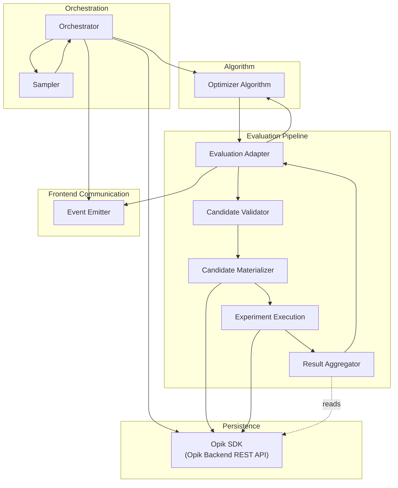
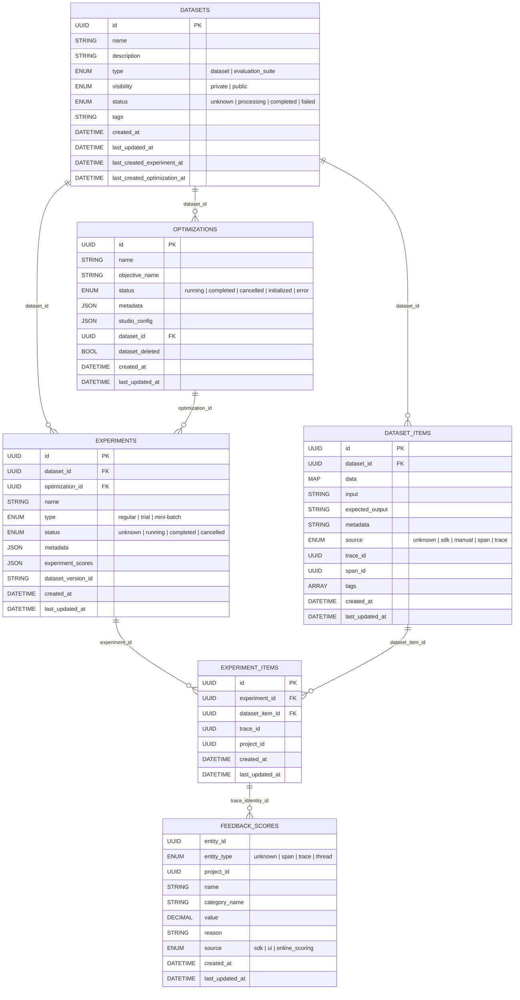
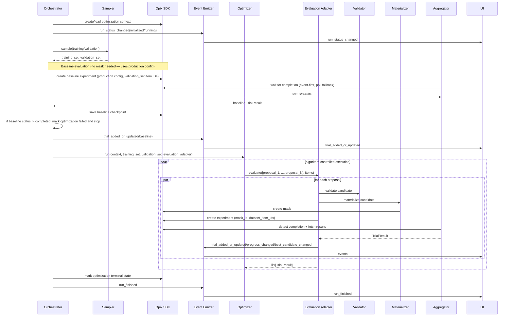

## Optimization Framework Design

### 1. Overview

This document defines an optimizer-agnostic framework for running agent optimization on top of Opik experiments and datasets.

The framework is a **standalone Python service** (`opik-optimizer`) deployed alongside the Opik backend. It is triggered via API (e.g. from the Opik UI) and can run multiple optimizations concurrently. It persists state through the **Opik Python SDK**, which communicates with the Opik backend REST API.

The framework is responsible for:

1. Running a sampler service before optimizer execution to prepare training and validation subsets.
2. Passing concrete item subsets to the optimizer.
3. Evaluating optimizer candidates through a framework-owned `evaluation_adapter`.
4. Validating candidates with framework guardrails.
5. Creating isolated execution overlays (`mask_id`) per accepted candidate.
6. Triggering experiments through existing experiment execution capability.
7. Detecting completion and aggregating experiment outputs into normalized trial results.
8. Persisting optimization state and exposing progress to the frontend.
9. Self-recovering in-progress optimizations after service restarts.

Principle: optimizer algorithms decide **what to test and which items to test**; the framework decides **how to run, persist, and report**.

---

### 2. Goals

1. Support GEPA and other optimizers through one shared interface.
2. Reuse existing Opik optimization/experiment persistence so results are visible in Opik UI.
3. Keep optimizer code independent from experiment transport/execution details.
4. Provide explicit lineage so UI can show candidate evolution.
5. Keep contracts clear and implementable by backend, optimizer, and frontend teams.

---

### 3. Terminology

1. **Optimization**: One end-to-end optimization session; identified by `optimization_id`.
2. **Candidate**: One full configuration proposed for evaluation.
3. **Trial**: One candidate evaluation record, backed by one experiment.
4. **Evaluation Suite**: A dataset used for the optimization process. The full dataset is the evaluation suite; the optimizer algorithm controls which subsets of items are used for each candidate evaluation. The framework passes specific `dataset_item_ids` when creating experiments, so only the selected items are evaluated — no temporary datasets are created.
5. **Mask (`mask_id`)**: Request-scoped configuration overlay for isolated candidate execution. When an agent reads its configuration from Opik via SDK, a mask causes a candidate-specific configuration to be served for that request instead of the production default. This is an existing Opik platform capability; the framework creates masks through the materializer and does not manage the mask resolution mechanism itself.
6. **Optimization Graph**: Parent-child relations between candidates used to render optimization evolution.
7. **Sampler Service**: Framework component that builds training/validation subsets (as `dataset_item_ids` lists) from the evaluation suite before optimizer starts.
8. **Evaluation Adapter**: Optimizer-facing framework boundary used to evaluate candidate configurations on concrete item subsets.
9. **Experiment Execution**: Experiments are created via the Opik Python SDK (similar to the current `evaluate_optimization_trial()` pattern). The SDK accepts `dataset_item_ids` to control which items are included in the experiment, streaming and filtering items client-side. There is no separate experiment runner service; the framework creates experiments directly.
10. **Result Aggregator**: Framework component that detects experiment completion and builds normalized trial results.
11. **Canonical Config Hash**: Deterministic hash of a normalized full candidate configuration used for deduplication.
12. **Event Emitter**: Framework component responsible for emitting lifecycle events to the presentation layer. All components delegate event emission through it.

---

### 4. High-Level Architecture


```mermaid
flowchart TD
    subgraph Orchestration
        O["Orchestrator"]
        S["Sampler"]
        O --> S
        S --> O
    end

    subgraph Algorithm
        A["Optimizer Algorithm"]
    end

    subgraph Evaluation Pipeline
        EA["Evaluation Adapter"]
        V["Candidate Validator"]
        M["Candidate Materializer"]
        EX["Experiment Execution"]
        G["Result Aggregator"]
        EA --> V --> M --> EX --> G --> EA
    end

    subgraph Persistence
        SDK["Opik SDK\n(Opik Backend REST API)"]
    end

    subgraph Frontend Communication
        EV["Event Emitter"]
    end

    O --> A
    A --> EA
    EA --> A
    O --> SDK
    M --> SDK
    EX --> SDK
    G -.->|reads| SDK
    O --> EV
    EA --> EV
```

Ownership:

1. **Orchestrator** is the active controller.
2. **Sampler** prepares train/validation subsets before optimizer execution.
3. **Evaluation Adapter** is the optimizer-facing integration boundary.
4. **Result Aggregator** decides when trial results are ready and publishes normalized results to evaluation adapter.
5. **Optimizer Algorithm** never polls experiments and never serves frontend payloads.
6. **Event Emitter** is the single point for emitting lifecycle events to the frontend. Orchestrator and adapter trigger events through it.

Persistence approach:

1. All persistence goes through the **Opik Python SDK** (REST API calls to Opik backend). No direct database access. No separate repository abstraction — the SDK is the persistence boundary.
2. Who interacts with the SDK:
   - **Orchestrator** (writes): creates/updates optimization records, saves checkpoints to `optimizations.metadata`, marks terminal status.
   - **Materializer** (writes): creates masks (configuration overlays) for candidates.
   - **Experiment Execution** (writes): creates experiment records, experiment items, traces, feedback scores.
   - **Result Aggregator** (reads): detects experiment completion and fetches results. Does not write data — it normalizes results in-memory and hands them back to the evaluation adapter.
3. The frontend reads persisted data through the Opik backend APIs (snapshot endpoints) and receives realtime updates through the event emitter (SSE stream).
4. For testing, the Opik SDK client is mocked directly — no intermediate abstraction layer needed.

How completion is detected:

1. Preferred: completion events from experiment execution.
2. Fallback: status polling through adapter.
3. In both cases, aggregator builds final `TrialResult` and hands it to evaluation adapter.

---

### 5. ERD (Persistence Model)

Framework implementation uses existing Opik persistence models.


```mermaid
erDiagram
    DATASETS ||--o{ OPTIMIZATIONS : "dataset_id"
    DATASETS ||--o{ EXPERIMENTS : "dataset_id"
    DATASETS ||--o{ DATASET_ITEMS : "dataset_id"
    OPTIMIZATIONS ||--o{ EXPERIMENTS : "optimization_id"
    EXPERIMENTS ||--o{ EXPERIMENT_ITEMS : "experiment_id"
    DATASET_ITEMS ||--o{ EXPERIMENT_ITEMS : "dataset_item_id"
    EXPERIMENT_ITEMS ||--o{ FEEDBACK_SCORES : "trace_id/entity_id"

    DATASETS {
        UUID id PK
        STRING name
        STRING description
        ENUM type "dataset | evaluation_suite"
        ENUM visibility "private | public"
        ENUM status "unknown | processing | completed | failed"
        STRING tags
        DATETIME created_at
        DATETIME last_updated_at
        DATETIME last_created_experiment_at
        DATETIME last_created_optimization_at
    }

    OPTIMIZATIONS {
        UUID id PK
        STRING name
        STRING objective_name
        ENUM status "running | completed | cancelled | initialized | error"
        JSON metadata
        JSON studio_config
        UUID dataset_id FK
        BOOL dataset_deleted
        DATETIME created_at
        DATETIME last_updated_at
    }

    EXPERIMENTS {
        UUID id PK
        UUID dataset_id FK
        UUID optimization_id FK
        STRING name
        ENUM type "regular | trial | mini-batch"
        ENUM status "unknown | running | completed | cancelled"
        JSON metadata
        JSON experiment_scores
        STRING dataset_version_id
        DATETIME created_at
        DATETIME last_updated_at
    }

    EXPERIMENT_ITEMS {
        UUID id PK
        UUID experiment_id FK
        UUID dataset_item_id FK
        UUID trace_id
        UUID project_id
        DATETIME created_at
        DATETIME last_updated_at
    }

    DATASET_ITEMS {
        UUID id PK
        UUID dataset_id FK
        MAP data
        STRING input
        STRING expected_output
        STRING metadata
        ENUM source "unknown | sdk | manual | span | trace"
        UUID trace_id
        UUID span_id
        ARRAY tags
        DATETIME created_at
        DATETIME last_updated_at
    }

    FEEDBACK_SCORES {
        UUID entity_id
        ENUM entity_type "unknown | span | trace | thread"
        UUID project_id
        STRING name
        STRING category_name
        DECIMAL value
        STRING reason
        ENUM source "sdk | ui | online_scoring"
        DATETIME created_at
        DATETIME last_updated_at
    }

```

DB location:

1. `optimizations`: Opik analytics DB (ClickHouse).
2. `experiments`: Opik analytics DB (ClickHouse).
3. `experiment_items`: Opik analytics DB (ClickHouse).
4. `datasets`: Opik state DB (MySQL).
5. `dataset_items`: Opik analytics DB (ClickHouse).
6. `feedback_scores`: Opik analytics DB (ClickHouse).

Storage mapping:

`optimizations.metadata` is entirely framework-controlled — no namespacing needed:

1. Optimization checkpoint state -> `optimizations.metadata.checkpoint`.
2. Run-level errors/status details -> `optimizations.metadata.error`.
3. Validation rejections -> `optimizations.metadata.validation_rejections`.
4. Materialization failures -> `optimizations.metadata.materialization_failures`.

`experiments.metadata` is a shared JSON blob (experiments exist independently of optimizations), so all optimization-specific fields are namespaced under an `optimization` key:

5. Candidate-trial attribution -> `experiments.metadata.optimization`:
   - `candidate_id`
   - `mask_id`
   - `step_index`
   - `parent_candidate_ids`
   - `candidate_config_hash`
6. Trial-level terminal errors -> `experiments.metadata.optimization.error`.
7. Objective/trial metric values shown in optimization views are derived from `feedback_scores` linked through experiment item traces.

Notes:

1. `experiments.optimization_id` is the canonical relational link used today.
2. No new DB tables are required for this framework implementation.

---

### 6. Main Components: Roles and Responsibilities

### 6.1 Optimization Orchestrator

Responsibilities:

1. Create/load optimization context.
2. Invoke sampler service before optimizer start.
3. Run baseline evaluation before calling optimizer.
4. Call optimizer once: `run(context, training_set, validation_set, evaluation_adapter)`.
5. Coordinate baseline lifecycle, persistence, and final run status.
6. Apply framework stop conditions (cancel, global timeout, fatal internal error).

### 6.2 Sampler Service

Responsibilities:

1. Build concrete item subsets from the evaluation suite before optimizer starts.
2. Return:
   - `training_set: list[DatasetItem]`
   - `validation_set: list[DatasetItem] | None`
3. Subsets are resolved as lists of `dataset_item_ids` — no temporary datasets are created.
4. Persist sampling metadata (`strategy`, `seed`, sizes) for reproducibility.

### 6.3 Optimizer Algorithm

Responsibilities:

1. Run algorithm loop inside one `run(...)` call.
2. Generate candidate configurations as `CandidateProposal` objects.
3. Decide which concrete items to evaluate per candidate.
4. Call `evaluation_adapter.evaluate(...)` with one or more candidate proposals. The framework runs them in parallel when multiple are provided.
5. Decide algorithmic stopping conditions internally (convergence, no improvement, target reached, etc.) and return from `run()` when done.

Non-responsibilities:

1. No direct experiment API calls.
2. No completion polling/subscription logic.
3. No frontend data formatting.
4. No framework-level stop conditions (max trials, budget, timeout) — those are enforced by the framework.

### 6.4 Candidate Validator

Responsibilities:

1. Validate candidate shape and value constraints.
2. Validate lineage references.
3. Deduplicate candidates.

Deduplication rule:

1. Normalize candidate configuration deterministically (stable key ordering + normalized numeric/string forms).
2. Hash normalized configuration (`candidate_config_hash`).
3. Reject duplicates already accepted/evaluated in the same optimization.

Validator output:

1. `accepted_candidates` for execution.
2. `rejected_candidates` with `reason_code`.

What `reason_code` is used for:

1. Explain to user why candidate was not run.
2. Debug optimizer behavior.
3. Feed product analytics on rejection patterns.
4. Clarify this is a pre-experiment rejection. If execution starts and then fails, it is a trial failure, not a rejection.
5. Because no experiment exists yet for rejected candidates, these records are stored as optimization-level validation events.

### 6.5 Candidate Materializer

Responsibilities:

1. Persist accepted candidate metadata.
2. Create candidate `mask_id`.
3. Return execution-ready identity tuple (`candidate_id`, `mask_id`).

### 6.6 Evaluation Adapter

Why this exists:

1. Optimizer gets one stable interface regardless of runner internals.
2. Framework keeps validator/materializer/runner/aggregator hidden behind one call.
3. Tests can mock this boundary to validate optimizer logic without remote execution.

Responsibilities:

1. Accept one or more `CandidateProposal` objects + concrete item subset (as `dataset_item_ids`).
2. Validate and materialize each candidate (create mask).
3. Create experiments via Opik Python SDK, passing `dataset_item_ids` to evaluate only the selected items.
4. Receive terminal results from aggregator.
5. Return normalized `list[TrialResult]` to optimizer.
6. Trigger lifecycle events through event emitter.

Concurrency:

1. Each candidate gets its own experiment. Within each experiment, dataset items are executed in parallel (the remote agent handles concurrent requests).
2. When multiple proposals are provided, their experiments run concurrently. Returns when all candidates have terminal results.
3. The framework bounds concurrent experiment triggers and applies backpressure when remote execution is throttled.

Multi-run execution (`runs_per_item`):

Evaluation suites can define an `ExecutionPolicy` with `runs_per_item > 1`, meaning each dataset item is executed multiple times per experiment. Each run creates a separate experiment item with its own trace. The platform aggregates scores across runs (mean of successful runs) and applies `pass_threshold` to determine pass/fail per item.

Responsibility breakdown:

1. **Evaluation suite** owns the policy: `runs_per_item` and `pass_threshold` are stored on the dataset.
2. **Framework (evaluation adapter)** passes the execution policy through to experiment creation via the Opik SDK. The framework does not interpret or override the policy.
3. **Opik SDK / platform** handles multi-run execution: creates N experiment items per dataset item, runs them in parallel, stores individual traces.
4. **Result aggregator** reads back experiment results. Scores are already aggregated per dataset item by the platform (mean of successful runs). The aggregator computes `TrialResult.objective_score` from these per-item aggregated scores.
5. **Optimizer algorithm** sees only `TrialResult.objective_score` — a single scalar. It does not know whether items ran once or multiple times.
6. **Optimizer adapter** (e.g. GEPA adapter) is responsible for any optimizer-specific interpretation of multi-run results. Reflection-based optimizers pass `include_item_results=True` to get per-item, per-run data in `TrialResult.item_results`. For example, GEPA's reflection mechanism (`make_reflective_dataset`) needs per-item traces — the adapter iterates the `TrialItemRun` records and decides which to present for reflection (e.g. worst-scoring run, median run, or all runs). This is adapter-level logic — not framework logic.

If a run fails:

1. Failed runs still create experiment items and traces.
2. Failed runs are excluded from score aggregation (platform default).
3. Failed runs count toward `runs_total` but not toward `pass_threshold`.
4. The `TrialResult.objective_score` reflects only successful runs. Optimizer adapters that need different failure handling (e.g. counting failures as zero) can pass `include_item_results=True` to inspect individual `TrialItemRun` entries and recompute as needed.

Clarification:

1. Optimizer calls `evaluation_adapter` only.
2. Aggregator still owns completion logic and normalization.

### 6.7 Result Aggregator

Responsibilities:

1. Track in-flight experiments for an optimization.
2. Determine terminal completion for each candidate experiment.
3. Retrieve results via adapter.
4. Build normalized trial outputs.
5. Return ready trial result(s) to evaluation adapter.

What "aggregation failure" means:

1. Experiment reached terminal state, but result fetch/parse/normalize failed.

### 6.8 Presentation Layer

Responsibilities:

1. Read optimization summary and trial tables.
2. Read lineage graph data (nodes/edges).
3. Consume realtime lifecycle events.

Important:

1. Frontend data is served from framework persistence/read models.
2. Optimizer algorithm is not directly queried by frontend.

### 6.9 Event Emitter

Why this exists:

1. Multiple components (orchestrator, evaluation adapter) need to emit lifecycle events to the presentation layer.
2. Centralizing emission avoids ordering bugs and duplicate events.

Responsibilities:

1. Accept lifecycle events from orchestrator and evaluation adapter.
2. Emit events to the presentation layer (SSE stream).
3. Ensure events are emitted only after persistence succeeds.
4. Deduplicate events using stable event keys.

---

### 7. Technical Flow


```mermaid
sequenceDiagram
participant O as Orchestrator
participant S as Sampler
participant SDK as Opik SDK
participant EV as Event Emitter
participant A as Optimizer
participant EA as Evaluation Adapter
participant V as Validator
participant M as Materializer
participant G as Aggregator
participant U as UI

O->>SDK: create/load optimization context
O->>EV: run_status_changed(initialized/running)
EV->>U: run_status_changed
O->>S: sample(training/validation)
S-->>O: training_set, validation_set

note over O,SDK: Baseline evaluation (no mask needed — uses production config)
O->>SDK: create baseline experiment (production config, validation_set item IDs)
G->>SDK: wait for completion (event-first, poll fallback)
SDK-->>G: status/results
G-->>O: baseline TrialResult
O->>SDK: save baseline checkpoint
O->>O: if baseline status != completed, mark optimization failed and stop
O->>EV: trial_added_or_updated(baseline)
EV->>U: trial_added_or_updated

O->>A: run(context, training_set, validation_set, evaluation_adapter)
loop algorithm-controlled execution
    A->>EA: evaluate([proposal_1, ..., proposal_N], items)
    par for each proposal
      EA->>V: validate candidate
      EA->>M: materialize candidate
      M->>SDK: create mask
      EA->>SDK: create experiment (mask_id, dataset_item_ids)
      G->>SDK: detect completion + fetch results
      G-->>EA: TrialResult
      EA->>EV: trial_added_or_updated/progress_changed/best_candidate_changed
      EV->>U: events
    end
    EA-->>A: list[TrialResult]
end

O->>SDK: mark optimization terminal state
O->>EV: run_finished
EV->>U: run_finished
```

Step index and parent graph in this flow:

1. Optimizer passes `parent_candidate_ids` and `step_index` on each `CandidateProposal`.
2. Framework always generates `candidate_id` during materialization.
3. If `step_index` is omitted, framework assigns monotonic step index by evaluation order.
4. If `parent_candidate_ids` is omitted, framework stores `[]`.
5. Graph fields are persisted in experiment metadata via SDK.
6. Frontend reads optimization graph projection from Opik backend APIs.

---

### 8. Interfaces and Types

### 8.1 Optimizer Interface

```python
class Optimizer(Protocol):
    def run(
        self,
        context: "RunContext",
        training_set: list["DatasetItem"],
        validation_set: list["DatasetItem"] | None,
        evaluation_adapter: "EvaluationAdapter",
    ) -> "OptimizationResult":
        ...
```

Method intent:

1. `run`: execute the full algorithm loop and call `evaluation_adapter` whenever candidate evaluation is needed.
2. The optimizer returns from `run()` when it decides to stop (convergence, no improvement, target reached, etc.) or when a framework stop condition is raised.

GEPA fit:

1. Baseline result is available in `context.baseline_trial` before `run`.
2. Completed trials from any prior run (recovery) are available in `context.completed_trials`.
3. GEPA can keep its native internal loop and evaluate selected minibatches via adapter calls.
4. GEPA can use `evaluate()` to run a generation of competing candidates in parallel.

### 8.2 RunContext

```python
@dataclass(frozen=True)
class RunContext:
    optimization_id: str
    dataset_id: str
    objective_name: str
    baseline_trial: "TrialResult"
    completed_trials: list["TrialResult"]
    max_trials: int | None
    max_cost: float | None
    timeout_seconds: int | None
```

Field usage:

1. `optimization_id`: top-level correlation key for this run.
2. `dataset_id`: dataset used for all trials in this optimization.
3. `objective_name`: primary objective being optimized.
4. `baseline_trial`: baseline trial result including `candidate_id` (lineage root) and `objective_score`.
5. `completed_trials`: empty on fresh start; populated with previously completed trials on recovery. Allows the optimizer to resume from where it left off without re-running completed work.
6. `max_trials`: optional framework stop guardrail.
7. `max_cost`: optional total cost budget for the optimization.
8. `timeout_seconds`: optional wall-clock timeout for the optimization.

Creation timing:

1. Orchestrator creates `RunContext` only after baseline trial completes successfully.
2. If baseline fails, optimization is marked failed and optimizer is not initialized.
3. On recovery, `completed_trials` is populated from persisted experiment records before calling `run()`.

### 8.3 OptimizerState (Optional Checkpoint Payload)

```python
@dataclass
class OptimizerState:
    generation: int
    best_candidate_id: str | None
    best_score: float | None
    algorithm_data: dict[str, Any]
```

Field usage:

1. Optional algorithm checkpoint payload for recovery.
2. Not part of the optimizer method signature contract.

Persistence:

1. Stored in `optimizations.metadata.checkpoint.optimizer_state`.

### 8.4 CandidateProposal

```python
@dataclass
class CandidateProposal:
    configuration: dict[str, Any]
    parent_candidate_ids: list[str]
    step_index: int | None = None
    rationale: str | None = None
```

Field usage:

1. `configuration`: full execution configuration.
2. `parent_candidate_ids`: lineage edges.
3. `step_index`: optional optimizer-provided step/generation index.
4. `rationale`: optional human-readable explanation.

Notes:

1. `candidate_id` is generated by framework on acceptance.

### 8.5 TrialHistory (Optional Helper Type)

```python
@dataclass
class TrialHistory:
    trials: list["TrialResult"]
```

Usage:

1. Contains completed trials only.
2. Used by optimizer to propose and decide stopping.

### 8.6 Stop Conditions

Framework stop conditions are enforced by the orchestrator and the evaluation adapter. When a framework stop condition is met, the adapter raises a `FrameworkStopError` that the optimizer should not catch.

```python
class FrameworkStopError(Exception):
    reason: str
    message: str
```

Framework stop reasons:

1. `max_trials_reached`: trial count equals `RunContext.max_trials`.
2. `budget_exceeded`: cumulative cost exceeds `RunContext.max_cost`.
3. `timeout`: wall-clock time exceeds `RunContext.timeout_seconds`.
4. `cancelled`: external cancellation signal (user cancelled via UI/API).

Optimizer-level stopping is internal to each optimizer algorithm. The optimizer decides when to return from `run()` based on its own logic (convergence, no improvement, target score reached, etc.). The framework does not define or enforce optimizer-level stop conditions.

### 8.7 EvaluationAdapter

```python
class EvaluationAdapter(Protocol):
    def evaluate(
        self,
        proposals: list["CandidateProposal"],
        items: list["DatasetItem"],
        include_item_results: bool = False,
    ) -> list["TrialResult"]:
        ...
```

Why needed:

1. One optimizer-facing integration boundary.
2. Keeps materializer/runner/aggregator internal to framework.

Method intent:

1. `evaluate`: accepts one or more proposals. Each gets its own experiment. When multiple proposals are provided, experiments run concurrently (bounded by framework concurrency limits). Within each experiment, dataset items run in parallel (the remote agent handles concurrent requests). Returns when all candidates have terminal results.
2. Enforces framework stop conditions (`FrameworkStopError`) before triggering experiments.

The `include_item_results` flag:

1. `objective_score` and `summary` are always computed — the aggregator reads per-item scores (lightweight numeric data from `feedback_scores`) to derive them.
2. When `include_item_results=False` (default): `TrialResult.item_results` is `None`. This is sufficient for optimizers that only use `objective_score` for selection (evolutionary, meta-prompt, parameter tuning, few-shot bayesian).
3. When `include_item_results=True`: the aggregator also fetches full per-item content (inputs, outputs, traces, per-run breakdowns) and populates `TrialResult.item_results`. This is expensive — it requires reading dataset items, experiment items, and traces — but necessary for reflection-based optimizers (GEPA, hierarchical reflective) that analyze individual item results to propose improvements.

### 8.8 ExperimentRequest

```python
@dataclass
class ExperimentRequest:
    optimization_id: str
    candidate_id: str
    mask_id: str
    dataset_id: str
    dataset_item_ids: list[str]
    execution_params: dict[str, Any]
```

Field usage:

1. `optimization_id`: ties experiment to optimization session.
2. `candidate_id`: ties experiment to one candidate.
3. `mask_id`: ensures candidate-isolated config execution via Opik's mask resolution.
4. `dataset_id`: the evaluation suite (dataset) to use.
5. `dataset_item_ids`: concrete subset of items chosen by the optimizer for this candidate evaluation. Only these items are streamed and evaluated — the full dataset is not iterated.
6. `execution_params`: pass-through parameters required by experiment execution.

### 8.9 TrialResult

```python
@dataclass
class TrialSummary:
    total_items: int
    passed_items: int
    failed_items: int
    pass_rate: float
    total_cost: float | None
    avg_latency_ms: float | None
    avg_ttft_ms: float | None

@dataclass
class TrialResult:
    optimization_id: str
    candidate_id: str
    mask_id: str
    experiment_id: str
    status: Literal["completed", "failed", "cancelled", "timeout"]

    objective_score: float | None
    summary: TrialSummary
    item_results: list["TrialItemResult"] | None = None
    error: str | None = None
```

Why this shape:

1. `objective_score` is a single scalar derived from per-item scores — used directly by optimizer for selection decisions. Always computed.
2. `summary` is a fixed type for consistent UI display. Always computed.
3. `item_results` is `None` by default. Populated only when `include_item_results=True`. Computing `objective_score` only requires per-item scores (lightweight). Populating `item_results` requires fetching full item content — inputs, outputs, traces, per-run breakdowns — which is expensive. The flag avoids this cost for optimizers that don't need it.

### 8.10 TrialItemResult

```python
@dataclass
class TrialItemRun:
    trial_id: int
    trace_id: str
    score: float | None
    reason: str | None = None
    passed: bool
    error: str | None = None

@dataclass
class TrialItemResult:
    dataset_item_id: str
    input: dict[str, Any]
    expected_output: dict[str, Any] | None
    aggregated_score: float | None
    passed: bool
    runs: list[TrialItemRun]
```

Field usage:

1. `dataset_item_id`: links back to the evaluation suite item.
2. `input` / `expected_output`: the item's data, for building reflection datasets.
3. `aggregated_score`: platform-aggregated score across all runs for this item.
4. `passed`: whether the item passed the evaluation suite's `pass_threshold`.
5. `runs`: individual run results. Each run has its own `trace_id`, `score`, and pass/fail status. When `runs_per_item=1`, this list has one entry.

Usage by optimizer adapters:

1. Reflection-based optimizers (GEPA, hierarchical reflective) pass `include_item_results=True` to get per-item content.
2. GEPA adapter iterates `TrialResult.item_results` to build `make_reflective_dataset()` inputs — needs per-item inputs, outputs, and scores.
3. Hierarchical reflective optimizer iterates `item_results` for root cause analysis — needs per-item inputs, outputs, scores, and failure reasons.
4. When `runs_per_item > 1`, the adapter chooses which run(s) to present for reflection (e.g. worst-scoring run to learn from failures, or all runs for full visibility).
5. Score-only optimizers (evolutionary, meta-prompt, parameter, few-shot bayesian) leave `include_item_results=False` — they only use `objective_score` and pay no fetch cost.

### 8.11 OptimizationResult

```python
@dataclass
class OptimizationResult:
    optimization_id: str
    dataset_id: str
    objective_name: str
    status: Literal["completed", "failed", "cancelled"]

    best_candidate_id: str
    best_configuration: dict[str, Any]
    best_score: float

    baseline_candidate_id: str
    baseline_configuration: dict[str, Any]
    baseline_score: float

    trials: list[TrialResult]
    total_trials: int
    total_cost: float | None

    error: str | None = None
```

Field usage:

1. `best_*`: the winning candidate, its full configuration, and objective score.
2. `baseline_*`: the initial production configuration and its score, for comparison.
3. `trials`: all completed trial results for inspection.
4. `total_cost`: cumulative cost across all trials (if tracked).
5. `status`: terminal status of the optimization run.
6. `error`: populated when `status` is `failed`.

Notes:

1. Returned by `Optimizer.run()`.
2. The orchestrator wraps this with additional metadata (timing, sampling info) before persisting.
3. UI fetches detailed per-item results on demand via experiment APIs; `OptimizationResult` stays lightweight.

### 8.12 SDK Persistence Mapping

All framework-level state is persisted through the Opik Python SDK — no intermediate repository abstraction. The orchestrator and pipeline components call SDK methods directly.

Storage mapping:

| What | Where | Who | Access |
|------|-------|-----|--------|
| Optimization record (status, config) | `optimizations` | Orchestrator | write |
| Checkpoint state | `optimizations.metadata.checkpoint` | Orchestrator | write |
| Validation rejections | `optimizations.metadata.validation_rejections` | Validator (via orchestrator) | write |
| Materialization failures | `optimizations.metadata.materialization_failures` | Materializer (via orchestrator) | write |
| Framework errors | `optimizations.metadata.error` | Orchestrator | write |
| Candidate-to-experiment mapping | `experiments.metadata.optimization` (candidate_id, mask_id, step_index, parent_candidate_ids, config_hash) | Materializer | write |
| Optimization graph (lineage) | `experiments.metadata.optimization` (step_index, parent_candidate_ids) | Materializer | write |
| Trial-level errors | `experiments.metadata.optimization.error` | Aggregator (via adapter) | write |
| Experiment data (items, traces, scores) | `experiments`, `experiment_items`, `feedback_scores` | Experiment Execution | write |
| Trial results (completion + scores) | `experiments` linked by `experiments.optimization_id` | Result Aggregator | read |

Testing approach:

1. Tests mock the Opik SDK client directly (e.g. `opik.Client`) rather than injecting a separate repository implementation.

---

### 9. Error Handling (Including Resumption and Recovery)

### 9.1 Failure types and storage

1. Sampler failure (dataset not found, empty dataset, SDK read error):
   - optimization marked failed before optimizer is called. Stored in `optimizations.metadata.error`.
2. Validation failure:
   - stored as rejection record (`reason_code`) in `optimizations.metadata.validation_rejections`.
3. Materialization failure (mask creation or candidate persistence via SDK fails):
   - no experiment exists yet. Stored in `optimizations.metadata.materialization_failures`.
4. Experiment execution failure:
   - stored in trial (`status` + `error`) and `experiments.metadata.optimization.error`.
5. Aggregation failure (terminal experiment but result read/parse failed):
   - stored in `experiments.metadata.optimization.error`.
6. Optimizer method exception:
   - stored in `optimizations.metadata.error` and run terminal status.
7. Persistence failure:
   - checkpoint/run write failures stored in `optimizations.metadata.error`.
   - experiment metadata update failures stored in `optimizations.metadata.error`.

### 9.2 Retry policy principles

1. Retry transient failures (network timeout, temporary unavailable, throttling) with backoff.
2. Do not retry permanent failures (validation schema error, 4xx contract errors).
3. Persistence retries depend on error class:
   - transient DB/connectivity: retry,
   - deterministic schema/serialization bug: fail fast.

### 9.3 Self-recovery flow

The framework performs self-recovery automatically. Because optimizations are offline processes whose results are polled by the UI, the framework can detect and resume interrupted runs without external intervention.

Recovery trigger:

1. On service startup, the framework queries for optimizations in `running` or `initialized` status.
2. For each, the recovery sequence runs before any new optimizer work begins.

Recovery sources:

1. Checkpoint state in optimization metadata.
2. Candidate mappings in `experiments.metadata.optimization` (`candidate_id`, `mask_id`, `step_index`, `parent_candidate_ids`).
3. Trial outcomes in experiment records.

Resume sequence:

1. Load checkpoint and completed trial history from persisted experiments.
2. Query mapped experiments where status is not one of `completed`, `failed`, `cancelled`, `timeout`.
3. For each such candidate:
   - if experiment is now terminal: aggregate and persist trial result.
   - if experiment still running: continue waiting.
   - if experiment missing: mark trial failed with `error="orphaned_experiment"`.
4. Build `RunContext` with `completed_trials` populated from all recovered trial results.
5. Call `optimizer.run(context, ...)` — the optimizer sees the pre-existing history and continues from where it left off.

How the optimizer handles recovery:

1. The optimizer receives `context.completed_trials` which contains all previously completed trials.
2. The optimizer uses this to skip already-evaluated candidates and resume its algorithm loop.
3. The framework does not attempt to restore optimizer-internal state (generations, populations, etc.) — the optimizer is responsible for reconstructing its algorithm state from the completed trial history.

Idempotency:

1. Never trigger new experiment when candidate record already has an assigned `experiment_id`.
2. Trial persistence upsert key is `(optimization_id, candidate_id)`.
3. Event consumers dedupe using stable event key (for example `optimization_id + candidate_id + event_type + step_index`).

Where duplicate event handling matters:

1. Process crashes after trial persistence but before marking event as delivered.
2. On recovery, `trial_completed` can be emitted again for same candidate.
3. Consumers ignore repeated events with same stable event key.

---

### 10. Performance and Concurrency

Key constraints:

1. Validation and orchestration CPU inside framework.
2. Experiment execution throughput limits (Opik SDK + backend).
3. Remote agent limits (rate limiting, throttling, queue saturation).

Concurrency strategy:

1. Validate proposals in parallel.
2. Bound concurrent experiment executions.
3. Aggregate completions asynchronously in batches.
4. Apply backpressure when remote agents are throttled.

Tradeoffs:

1. More concurrency improves throughput but increases throttle/rate-limit risk.
2. Less concurrency improves stability but increases total optimization runtime.
3. Event-first completion reduces status polling load; polling fallback improves reliability.

Duplicate-work avoidance (canonical hash):

1. Normalize full config deterministically.
2. Hash it.
3. If hash already executed in this optimization, skip new experiment and mark candidate rejected as duplicate.

Persistence style:

1. One logical trial record exists per `(optimization_id, candidate_id)`.
2. Trial persistence is idempotent upsert keyed by `(optimization_id, candidate_id)`.
3. Retries update the same trial record until it reaches a terminal state.

---

### 11. Deployment and Runtime Model

### 11.1 Service architecture

1. The optimizer framework is a **standalone Python service** (`opik-optimizer`).
2. It is deployed alongside the Opik backend as a separate service.
3. It exposes an HTTP API for triggering and managing optimizations.
4. It communicates with the Opik backend exclusively through the **Opik Python SDK** (REST API calls).
5. Initially placed in the monorepo under `apps/opik-optimizer`; may be extracted to a separate repository later.

### 11.2 Lifecycle

1. Optimization is triggered via API call (e.g. from a UI button click).
2. The service can run **multiple optimizations concurrently**, each managed by its own orchestrator instance.
3. On service startup, the framework performs **self-recovery**: it queries for optimizations in `running`/`initialized` status and resumes them automatically (see section 9.3).
4. The service serves SSE streams for realtime UI updates and snapshot endpoints for initial page loads.

### 11.3 Concurrency model

1. Each optimization runs in its own async task / thread.
2. Within an optimization, the evaluation adapter manages experiment concurrency (see section 6.6).
3. The service applies global concurrency limits to prevent overloading experiment execution and remote agents.

---

### 12. Frontend Realtime Communication

This section defines what the framework reports to the UI during optimization execution, when it is reported, and how it is delivered.

### 12.1 UI-facing events

1. `run_status_changed`
   - When emitted: optimization status changes (`initialized/running/completed/failed/cancelled`).
   - UI impact: status badge, start/stop controls, terminal banners.
2. `progress_changed`
   - When emitted: counters change (`proposed`, `running`, `completed`, `failed`, `rejected`).
   - UI impact: progress bar and summary counters.
3. `trial_added_or_updated`
   - When emitted: candidate trial is created/updated with terminal result.
   - UI impact: trials table row and chart points.
4. `best_candidate_changed`
   - When emitted: current best candidate changes.
   - UI impact: best-trial highlight, score cards, best prompt panel.
5. `run_finished`
   - When emitted: run reaches terminal state.
   - UI impact: stop live refresh indicators and lock final state.

Notes:

1. `candidate_validated` can remain internal unless product explicitly adds a rejected-candidates panel.
2. Large payloads are not pushed in events; UI fetches heavy details on demand.

### 12.2 Emission timing rules

1. Emit events only after persistence succeeds.
2. Emit on state transitions, not on every internal method call.
3. If no transition occurs for a long period, emit periodic `progress_changed` heartbeat updates (optional).

### 12.3 Transport

Recommended transport:

1. **SSE stream** for realtime server-to-client updates:
   - `GET /v1/private/optimizations/{optimization_id}/events`
2. **Snapshot endpoints** for initial load and recovery:
   - `GET /v1/private/optimizations/{optimization_id}`
   - `GET /v1/private/optimizations/{optimization_id}/trials`
3. **Polling fallback** if stream disconnects or is unavailable.

Why SSE:

1. This flow is server-to-client only.
2. Simpler operational model than WebSocket for this use case.

### 12.4 Current behavior vs target behavior

1. Current optimization compare page behavior is polling-based (periodic refetch).
2. Target behavior is SSE + snapshot + polling fallback.
3. The same UI can support both by using stream updates when connected and polling when not.
